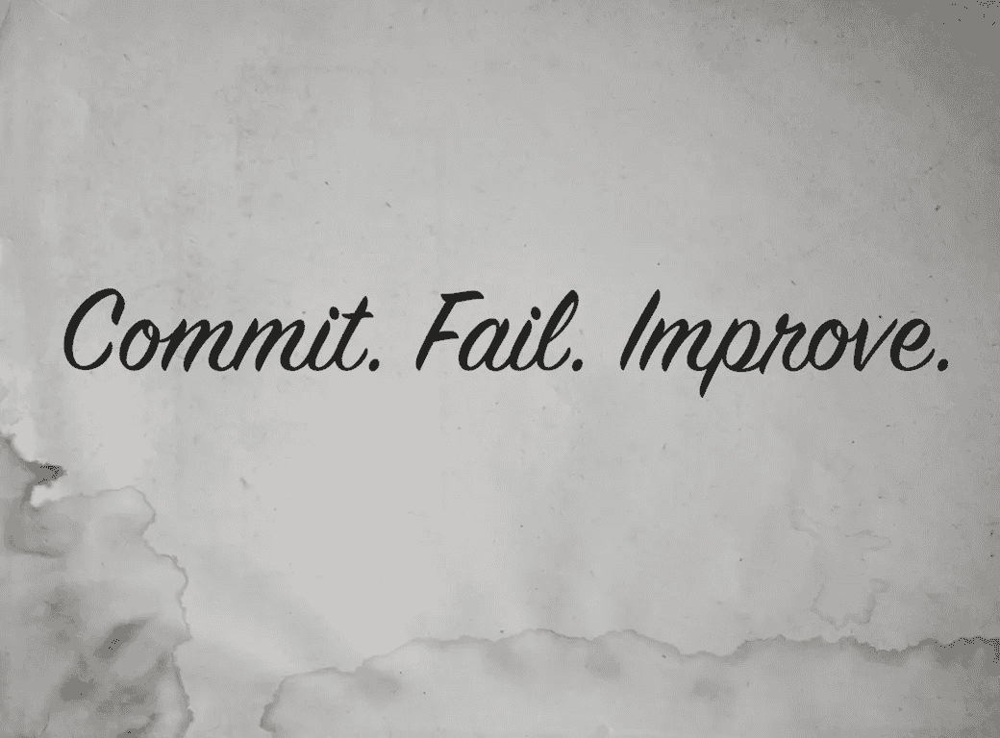
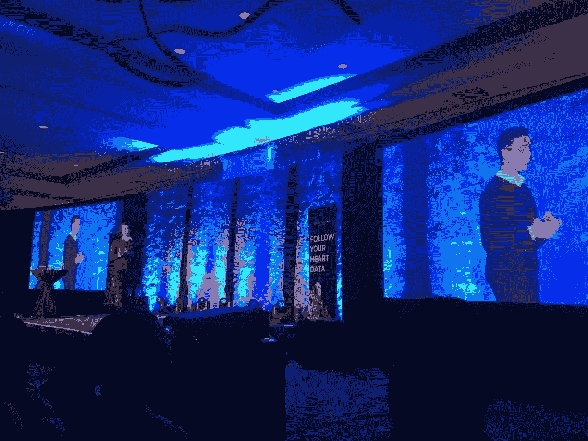

# 提交。失败。提高。

> 原文：<https://towardsdatascience.com/commit-fail-improve-5c915c33dd86?source=collection_archive---------8----------------------->

这是我今年在加州圣地亚哥举行的数据科学围棋大会上，在 400 多人面前演讲的书面形式。

你如何将你的热情转化为事业？

我的答案是:通过不计后果的承诺。

去年，我参加了我的第一次数据科学会议。会议期间，我在笔记本上做了笔记，每个人都收到了一份礼包。在所有这些笔记中，有一个特别的笔记在一年内彻底改变了我的生活。

2017 年 11 月。加州圣地亚哥。我刚刚从德国飞过来参观第一届[数据科学 GO](https://www.datasciencego.com/) 会议，由基里尔·叶列缅科和他的超级数据科学团队组织。在在线教育平台“Udemy”上成功教授超过 600，000 名学生数据科学知识后，他们希望召集有抱负的数据科学家参加一个拥挤的会议。

由于这也是我第一次参加会议，我不太知道会发生什么。但是我思想开放，什么都愿意做。当时，我的目标是进入数据科学领域，我对自己说:如果我能遇到一个人，一个唯一能在这个旅程中激励我的人，那就值了。

第一天，第二次谈话。这是[本·泰勒](https://www.linkedin.com/in/bentaylordata/)的演讲(如果你不知道本，他是 Quora 上人工智能的头号作家。这应该暗示了他讲话的质量。).他在谈论如何成为一名摇滚明星数据科学家，他的观点之一是关于不计后果的承诺。

> "如果你想进入数据科学领域，不要犹豫不决."

本认为，在这个领域，任何人都可以从零到六位数的年薪。但是这需要极大的热情和承诺。这肯定会很难。但是他建议:如果你刚刚从零开始，并且想进入这个领域，那么今天就开始参加聚会吧。今天去参加一个，然后承诺 3 个月后参加下一个。一定要提出一个让每个人都印象深刻的话题，比如胶囊网络或连体网络。
通常，Ben 对这一建议的第一个回答是，顺便说一下，这也是我当时作为数据科学新手的第一个想法:

“但我不是专家”——我不知道那个题目！”——“如果我让自己难堪了怎么办？”

正如你所看到的，*逻辑阻碍了*。而且理由很充分！你不是专家。你可能是数据科学的初学者，所以这看起来完全不合逻辑。但是本说:

> “如果你承诺在 3 个月后的一次聚会上发言，3 个月后你就会成为那个主题的专家。”

尽管我有疑虑，但我很好奇。想想看:
*我们参加多少次会议，得到多少启发？
在我们的生活中，有多少次我们会遇到鼓舞人心的人，并被激励去改变一些事情？*

起初，我们非常活跃。但问题是，一旦我们开始以理性的方式思考改变某件事是否有意义，我们就会拖延。
更糟糕的是，几天后，我们在会议后达到顶峰的动力又降了下来。
什么都没变。
*逻辑挡路。因此，我们找到了行不通的原因，并回到了老的做事方式。但是我们有办法防止这种情况吗？*

这就是鲁莽承诺这个概念出现的地方:
先承诺。不考虑是否可能。

> “如果你承诺在三个月后的一次聚会上展示自己，你将在三个月后成为一名专家”。

致力于你为自己设定的目标，一旦你在脑海中形成了这个目标是什么的形象，你的大脑就会激发你的创造力，让你想出一些东西。也就是说，你的大脑会告诉你如何到达那里，哪些资源可能有帮助，以及如何开始。

当我从会议回来时，我发现自己处于那种兴奋的状态。我在周末遇到的所有人和得到的所有意见都让我深受鼓舞。我以前也经历过这种问题:我有动力去改变生活中的某些事情，但却一直推着它，直到我失去了灵感。所以我向自己保证，这次不会了。我飞了半个世界不是为了这个。受本演讲的启发，我想参加一个聚会来谈论某个话题，这样我就可以成为这方面的专家。回家的同一天晚上，我带着笔记本电脑去汉堡查看是否有任何与人工智能相关的聚会，这是我目前居住的城市。但是什么都没有。

那时，我仍然兴奋不已，我决定干脆创建自己的聚会。为了确保我能信守承诺，我把第一次约会定在了 12 月中旬。由于我在那年 11 月中旬回来，我有一个月的时间。

做出这样的承诺感觉很棒，因为我终于做了一些事情，让自己免于陷入失去最初灵感的陷阱。但是，说实话，我真的没有考虑过后果:
仅仅两天后，我创建的小组已经有了 100 多名成员，一周后，有 250 多人加入了这个小组。慢慢地，一些疑问开始浮现，我想这是否是一个合理的决定。因为那时，我**从未**组织过活动。我甚至还没去过聚会。事实上，当本告诉我这件事的时候，我甚至不知道 Meetup 是什么！

但是我已经设定了目标。关于外部承诺的事情是这样的:他们让你负责。日历上有这件事，人们期待着我做些什么。我已经告诉了我的一些朋友，所以它必须发生。他们说:

> "如果你想占领这个岛，那就烧了船"

设定这些外部承诺是我破釜沉舟的方式。所以我想了想第一场比赛我可能需要什么。我的清单包括:
-演讲者
-场地
-餐饮
-赞助商
，当然，还要确保人们到场！我必须保证不仅仅是我和另一个人进行一对一的交流。

一个月后的一个周五晚上:
在花了很大力气与人交谈并试图让一切运转起来之后，这是第一次活动的日子。我非常兴奋。它将在我大学的一个演讲室举行。这个房间可以容纳大约 150 人，我点了餐饮服务，以确保每个人都玩得开心。这是我们大学里比较好的房间之一，有非常舒适的椅子。我告诉了我所有的朋友，总共有 120 个回复。

不幸的是，事情并不总是按计划进行。好消息是:我们得到了所有的赞助。
坏消息:在报名参加活动的 120 人中，只有三分之一的人真正到场。我们两个演讲者中的一个根本没有准备，在演讲中东拉西扯。最重要的是，我们吃了太多的食物，因为我估计至少有 100 个人。40 人到场。嗯，至少每个人都可以带些第二天的午餐回家。
玩笑归玩笑。想象一下，我坐在那里。人们似乎很沮丧，他们一直看着我。我很沮丧。有些人提前离开了活动，这是最糟糕的感觉，因为你知道你可能已经毁了他们的夜晚。
我们的赞助商在那里，他们肯定不兴奋。
我呢？ *我失败了；没有把一切都计划好。*

我从 Ben 在 Data Science GO 上的演讲中学到的一点是:
首先提交。但是最重要的是，我知道你必须愿意失败。所以首先要承诺，但要做好在通往目标的路上失败的准备。但是现在最重要的部分来了:

我仍然给自己设定了一个目标:在汉堡创建一个人工智能社区，以便能够随时与志同道合的人交流。几个月后，我敢于再次尝试。我采纳了负面反馈，从中吸取了教训，并修正了我们的路线。这次我们在不同的地方，没有食物，我事先检查了两个扬声器。最后，有 100 人到场，一切都按计划进行，我们收到了很好的反馈。我们的一位演讲者来自柏林，所以活动结束后，我们与他合作，在那里开设了第二个 Meetup 小组。

在这一点上，我想强调的是，如果我一开始没有做出承诺，我永远不会这么做。我会**永远不会**组织活动。我甚至从未想过组织一次活动。
*先提交*。
做好*失败*的准备。
但要准备好*改进*。
因为今天，我们是德国发展最快的聚会。
2000 名会员，人数还在增加。
我们在德国两个最大的城市[汉堡](https://www.meetup.com/meetupai-Hamburg/)和[柏林](https://www.meetup.com/meetupai-Berlin/)经营最大的聚会。
事后我明白了，失败很酷，只要你从反馈和正确的过程中学习。

> “没有所谓的失败，只有暂时的失败。”

永远坚持尝试，永远进步。提交。失败。提高。

大约在参加会议的六个月前，我刚刚开始学习深度学习和人工智能的在线课程。通过这些课程，我有机会看到许多实际应用和使用案例，并看到了巨大的潜力。我现在工作的公司是德国最大的电子商务服务提供商之一，为最大的零售商建立网上商店。客观地说，我们的一个客户在德国相当于亚马逊在美国的地位。这就是为什么我知道会有很多数据要处理，因此会有一个应用人工智能的巨大机会。当我查找并发现许多使用案例时，我正在考虑让一个研究小组研究其中的一些应用程序，以使我们的产品和流程更加高效。

唯一的问题是，我不知道如何向我们的执行团队提出整个事情，因为从逻辑的角度来看，这没有意义。想象一下，在你的公司里，某个自下而上的人会过来告诉你如何运行你未来的数据战略。
再次，*逻辑挡住了*的路。整个努力似乎遥不可及，因此我一直在拖延。我一直把它往后推。
但是我从数据科学围棋大会回来之后，我就下定决心了。
回到工作的第一天，我做出了一个承诺，我给我们的一位董事发了一封电子邮件，说了这样的话:
“我想向你推销这个想法。下周有空吗？”

那时我几乎一无所有。我没有计划。我没有统计数据。只是我想推销的东西的一个模糊的想法。
所以这可能不是最合理的决定……

一周后，我演讲的那天:
这是我第一次向一位高管演讲，我非常紧张。让我告诉你，这不是一个好的演示。
现在回过头来看，它实际上相当糟糕。但是这个想法本身就足以说服我的概念总监，所以我继续努力。
我保持*改进*。几周后，我想出了一个结构化的计划。我安排了一次会议，向我们整个执行团队推销这个计划。
这次会议的结果是，我获得了启动人工智能研究实验室的批准。
我们制作的产品现已集成到我们的在线商店软件中。当我开始学习人工智能时，我的梦想是有一天应用它来解决实际问题。
因为我做了一个**承诺**，这个梦想变成了现实。
*先提交*。从某处开始。然后利用你能得到的任何反馈来改进和不断修正你的路线。提交.失败.改进。

我在这里写的东西最棒的一点是，这些概念没有一个是我或本的观点。它深深植根于我们大脑的工作方式。我们给它一个目标，它就想出了如何实现的方法。把它想象成一枚自导鱼雷。目标是已知的，目的是达到它。鱼雷通过前进、犯错误和不断修正错误来完成它的目标。它以之字形运动向目标前进。仔细想想，当我们试图完成任何目标时，这正是我们大脑的工作方式。想一些简单的事情:比如从地上捡起一支笔。我们所做的只是选择目标，我们的大脑会自动找到到达目标的方法。不涉及也不需要有意识的思考。
我们不认为:“现在我必须用我的肩部肌肉来抬高我的手臂，然后我必须用我的二头肌来伸展我的手臂。”因为实际上我们甚至不知道涉及哪些肌肉。我们所做的就是设定目标，让我们的大脑想出实现目标的方法。就像本说的那样:如果你承诺在三个月后的一次聚会上展示自己，你将在三个月后成为一名专家。把它想象成一辆自行车:只要朝着某个方向前进，自行车很容易保持平衡。当你坐着不动，无处可去，试图保持平衡时，麻烦就出现了。
看，你走得快还是慢都没关系。只要你一直在前进，平衡会更容易，你会更接近你的目标。
*你需要给你的大脑一个目标。*
提交。失败。提高。*

事实上，我已经写了一篇关于汽车的文章，有这样一个故事:

19 世纪初，工程师们发现了如何用蒸汽机来驱动车轮，于是蒸汽机车诞生了。最初它只是用来运输货物和资源，人们很快发现它也是一种很好的运输工具。
然而，由于当时的科学水平，早期的采用者建议火车不要以超过 30 英里的时速运行，因为车上的人体会爆炸。

是的，你没看错。
人们真的相信如果他们的速度超过 30 英里每小时，他们的身体会爆炸。
幸运的是，一些“寻求刺激的人”无论如何都决定开到 31 英里，而我们现在开着时速超过 280 英里的车。

> “我们能做多少往往只取决于我们尝试了多少。”

想象一下被堵在高速公路上。
以每小时 30 英里的速度向前爬行。如果不是因为那个疯子，我们的速度会是最快的。
首先承诺，在真正可能的事情上突破界限。

总的来说，我认为大多数人看到的问题是，他们可能会想:
在这种情绪状态下做出承诺难道不危险吗？未经深思熟虑就做出承诺不是很危险吗？如果我失败了怎么办？
我完全能理解这种观点，但请这样想:
如果你发现自己真的想改变什么，如果你对目前的状况不满意:
没关系。你必须做出改变才能前进。你必须站出来做些不同的事情。即使有风险。

> 最大的风险是不要冒险。

正如马克·扎克伯格所说:“在这个快速变化的世界里，唯一肯定会失败的策略就是不冒险。”

现在。如果你想承诺什么，我请你闭上眼睛。
我希望你考虑任何目标。想想你想改变的事情，你渴望完成的事情。不一定是和职业相关的事情。它必须是你真正热爱的事情。
想想目标是什么？时间框架是什么？这是你想在下周、几个月后或明年实现的事情吗？细节很重要。你在哪里？你和谁在一起？考虑一下环境。现在生动地想象如果你成功了会发生什么。试着在那一刻描绘出自己的样子。那让你感觉如何？你感到兴奋吗？好吧，现在你正处于做出承诺的最佳状态。写下你的想法并付诸行动！你可以随时把你的目标发给我，我很乐意和你聊聊。

因为这正是我去年在大会上所做的。在本文的开头，我谈到了去年我参加的一个会议的笔记本中的一个笔记，它改变了我的生活。
事后看来，那张纸条引发了我所写的一切。
那张纸条启发我创建了一个聚会。
那张纸条促使我去找公司的高管，为一个人工智能研究实验室做宣传。
如前所述，我在会议期间做了一些笔记。在本·泰勒演讲的时候，我在第三页的背面草草写了些东西。我对自己做出了承诺。

我想通过这篇文章表达的是，一切皆有可能。这听起来肯定让你疲惫不堪，但我确信你可以实现你下定决心要做的任何事情。因为一旦你为自己设定了目标，你就会清楚地知道自己在朝着什么方向努力。在这个信任点上，当你做出承诺并相信找到方法的可能性时，机会很快就会向你敞开。这可能需要一天、一周甚至一个月。但是在某些时候，你的大脑会给你一些想法，你可以用它们来开始。
有时候，你认为需要多长时间就需要多长时间。

> “可能的程度往往受到我们尝试的程度的限制”

当我写下那张纸条的时候，我想这是绝对不合逻辑和不可能的。
为什么他们会允许一个 21 岁的孩子在这个会议上发言？我能贡献什么呢？我怎样才能获得必要的经验来确保这是一次成功的演讲？我能谈些什么呢？

在去年数据科学围棋大会的第一天结束时，也就是我写下那张纸条的那一天，我忘记了所有这些问题，去找了会议的组织者基里尔·叶列缅科。对他来说，这是漫长的一天，他看起来非常疲惫，但我当场告诉他，我想在明年的会议上发言。这是我的承诺。我非常认真。那时候我没有任何答案。但是我知道我会找到他们的。他回头看着我，只是说:“嗯，首先你得成功”。

*对于任何感兴趣的人，我强烈推荐阅读以下深入这一概念的书籍:
[心理控制论，麦克斯韦·马尔茨](https://www.amazon.com.au/Psycho-Cybernetics-Maxwell-Maltz/dp/0399176136)
[思考致富，拿破仑·希尔](https://www.amazon.com.au/Think-Grow-Rich-Napoleon-Hill/dp/0091900212/ref=sr_1_1?s=books&ie=UTF8&qid=1539863869&sr=1-1&keywords=think+and+grow+rich)
[思考的魔力，大卫·施瓦茨](https://www.amazon.com.au/Magic-Thinking-Big-David-Schwartz-ebook/dp/B01B2DJK6S/ref=sr_1_1?s=books&ie=UTF8&qid=1539863841&sr=1-1&keywords=magic+of+thinking+big)