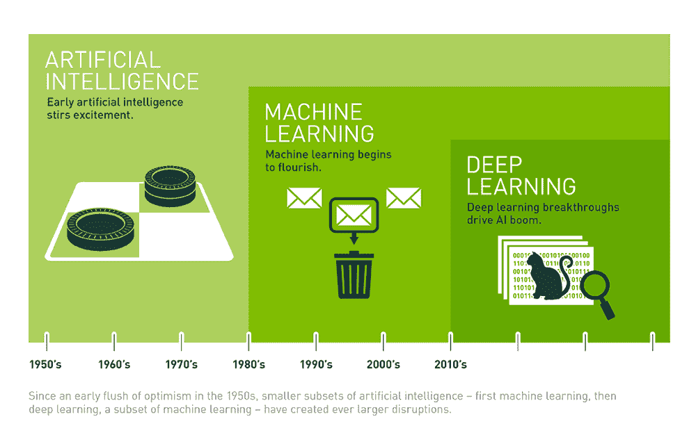

# 最大似然算法的常见应用

> 原文：<https://towardsdatascience.com/common-applications-of-ml-algorithms-e16f21c85773?source=collection_archive---------14----------------------->

Photo by [Andrew Umansky](https://unsplash.com/photos/l5truYNKmm8?utm_source=unsplash&utm_medium=referral&utm_content=creditCopyText) on [Unsplash](https://unsplash.com/search/photos/cats?utm_source=unsplash&utm_medium=referral&utm_content=creditCopyText)

**放射科医生的机器学习介绍— 10 部分系列**

**第四部**

*作者:* [*达尼洛*](https://www.linkedin.com/in/danilo-pena-01010/)*[*泰·瓦雄*](https://www.linkedin.com/in/tyvachon/)*

**编辑:* [*迈克尔博士*](https://www.linkedin.com/in/michael-doxey-md-73508916a/)*

*[*第一部分*](/introduction-to-our-radiology-ai-series-51d0e54cd3b9) *|* [*第二部分*](/how-radiology-and-ai-will-come-together-36e48bb56870) *|* [*第三部分*](/article-3-machine-learning-and-artificial-intelligence-introduction-c0e558974a11)*

*机器学习的使用比你想象的更加普遍。从确定一个电话或电子邮件是否是垃圾邮件，到识别你朋友脸上的方框并实际确定他们是谁，或者有针对性的广告营销，公司很快利用他们的数据来增加收入，吸引和关注他们的网页。*

*这些时刻是一个更大的技术叙事的一部分，它正在迅速颠覆企业的经营方式。**放射学也不例外。***

*本文将介绍机器学习的一些现实应用。但在此之前，我们先来看看下面这张来自 Invidia 的图片。*

**

*如你所见，深度学习是机器学习的子集，机器学习是人工智能的子集。子领域的这种自然发展可以被视为一个领域*建立在另一个领域*之上，围绕图像识别所做的一切都可以追溯到人工智能的早期。理解这种层次结构很重要，因为许多人(包括本系列中的我们)会交替使用这些词，而事实上，它们之间的关系更加微妙。*

***图像识别**是人工智能算法的主要进展之一。脸书可以检测你的脸，你朋友的脸，甚至可能是你的狗，然后分配适当的姓名标签！*

*由于使用了称为卷积神经网络的学习算法子集，图像识别或分析图像中的对象已经快速发展。在本文中，我们不会深入探讨这意味着什么，但请记住，这是一种找到组成对象的细节的方法。*

*例如，如果你想检测一张脸，算法首先需要学习如何检测边缘。一旦边缘检测变得很好，你也许可以检测角度或圆弧。然后，您可以检测椭圆形或球形等形状。*

*如果你愿意，这种建立你的脸类型的学习是在这些卷积神经网络(也称为 CNN)的引擎盖下发生的。这些网络是深度学习算法的子集。因此，当您或您的组织开始将这些功能添加到工作流中时，开发人员很有可能将 CNN 用于成像用例！这些用例可以包括从人脸检测到对象检测甚至图像分割的任何内容。*

***语音识别**是深度学习非常好玩有趣的应用。语音是与技术互动的自然步骤之一，因为我们说话的速度比打字的速度快，这是自然的交流方式。*

*随着 Siri、Alexa、Google Home 和其他产品的出现，世界各地的许多公司都在使用机器学习和深度学习来获取大量的语音数据，以梳理声音的细微差别。*

*请记住，问题总是需要一个基本的事实。在这一点上，语音是一个非常容易的问题，因为人们可以被雇佣来听几个小时的声音片段，转录它们，并将这些知识输入到算法中。从那里，算法将学习声音的细微差别，声音的变化，并将这些不同的特征联系起来，从概率上确定哪个单词最有可能。*

***推荐系统**是机器学习的第三组用例。这些应用程序已经成为许多公司的面包和黄油。当我们谈论推荐系统时，我们指的是你的脸书页面上的定向广告，亚马逊上的推荐购买产品，甚至是网飞上的推荐电影或节目。*

*这些系统由机器学习算法提供支持，这些算法可以检测人类行为的细微差别——无论是购买食物还是观看《办公室》的最后一季。此外，这些系统不仅被证明是有效的，而且现在是花费在广告和营销上的大量资金的支柱。无论你点击什么广告，或者你看一个节目花了多长时间，都只是运行这些公司推荐系统的大算法的一小部分。*

*在这篇文章中，我们*只触及了机器学习和人工智能众多应用的表面*。人工交易实现自动化只是时间问题。然而，在我们概述的所有精彩的优点之外，在取得更多进展之前，还需要找出一些障碍。这些特定于放射学的障碍将在后面的章节中讨论。*

*现在，让我们深入一些常见的机器学习主题，让您快速了解。这包括特征提取、标记数据和验证集！第 5 条对此进行了解释。*