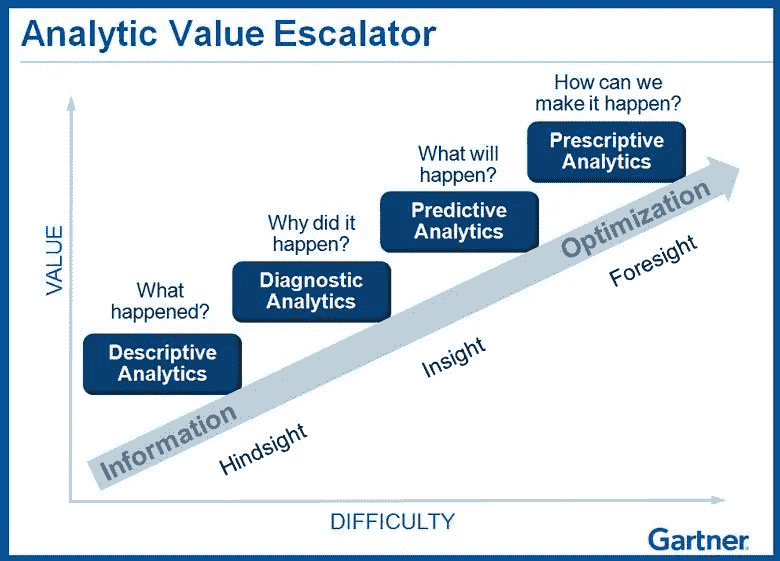
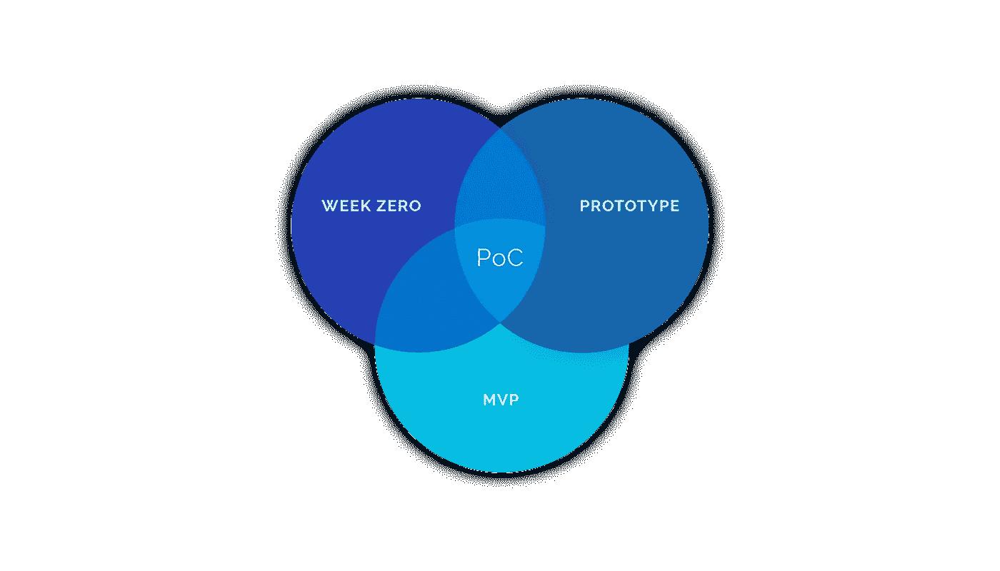
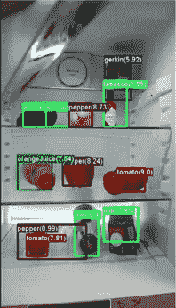

# 常见的数据科学陷阱以及如何避免它们

> 原文：<https://towardsdatascience.com/common-data-science-pitfalls-and-how-to-avoid-them-7d509b1d3916?source=collection_archive---------10----------------------->

在学习期间，我有机会参与了几个机器学习研究项目。这些项目从研究概率模型到自然语言处理中更实际的场景。我所做的工作中的一个常见元素是定义明确的问题的可用性和大量干净的数据集。

过去一年，我一直在微软担任数据科学家，解决企业客户的问题。我从跨行业工作中获得的经验以多种方式测试了我的技能，无论是从数据科学的角度还是从解决问题的角度。很大一部分时间通常花在定义问题、创建数据集和清理数据上，而大型数据集几乎总是难以获得。

Examples of dataset sizes used in different research domains. ([source](https://medium.com/nanonets/nanonets-how-to-use-deep-learning-when-you-have-limited-data-f68c0b512cab))

在这篇博文中，我分享了一些经验教训和你在“野外”从事数据科学项目时可能遇到的陷阱。许多这样的陷阱几乎总是存在，为了解决它们，经常需要“创造性”。

# 陷阱

## 描述性、预测性和规范性分析

有几种不同的方法可以利用数据来改进业务流程。你通常从客户那里得到的任务是“解决业务问题 X”。一个具体的例子是“提高营销活动的盈利能力”。

一个常见的陷阱是没有以“正确”的顺序处理问题。如果你想改进一个过程，你需要正确地理解它，甚至在考虑它的自动化部分之前。客户通常对自己的数据了解有限，并且没有数据科学方面的经验。因此，从数据科学的角度向他们清楚地解释不同的选项非常重要。

The value of data analytics : from descriptive to prescriptive analytics ([source](https://www.pinterest.com/pin/569635052846891050/))

通常，您通过清理和分析数据来开始项目。术语“描述性和诊断性”分析用于当你的目标是建立数据的摘要，并试图理解数据中的不同变量之间的关系。您构建可视化并使用(无监督的)机器学习技术来聚类数据点或查找相关变量。基于流程的结果，您可以构建一个报告或仪表板，列出并调查一组对业务问题有用的 KPI。通过营销活动，您可以将销售和营销数据关联起来，以便了解营销活动成功的原因。结论(例如，更低的价格导致更多的销售)可能不总是“火箭科学”，但它们允许客户使用他们的数据来验证他们的假设。此外，它还允许他们发现异常行为以及他们是否拥有正确的数据类型。

预测性和规范性分析是关于预测未来，并根据这些预测采取行动。通过预测分析，您可以获得历史数据，并建立一个机器学习模型来预测未来的数据点(在一定的误差范围内)。在市场营销中，新颖的活动创意通常通过使用预测模型估计预期销售额来验证。通过完成前面的描述和诊断阶段，您应该对性能有一个清晰的概念。如果数据质量不够好，不足以建立一个稳健的模型，这可以标记给客户，您可以使用他们提供的数据来支持您的索赔。

使用说明性分析，目标是基于预测采取行动，并优化流程的某些方面。例如，您可以构建一个优化引擎，生成“最佳未来活动”列表，而不是验证活动创意。建立这个系统需要大量高质量的数据。请注意，数据科学就是少做多做，所以从小处着手，大处着手！

## 概念验证与试运行

客户通常喜欢使用概念证明来研究“数据科学”的可能性。通常，这意味着他们提供数据的子集，并且他们想要确定一些初步的结果。尽管客户通常理解 PoC 不会带来良好的性能，但这仍然是一个常见的要求。然而，PoC 的缺点是数据的子集通常不能代表完整的数据集和问题。您可能会从 PoC 中获得非常好的性能，但是您可能无法在整个数据集上复制这种性能。客户通过例如仅查看一小段时间来选择数据集，这可能会严重偏离 PoC 模型。

[(source](https://bitsapphire.com/proof-of-concept/))

如果客户想要试验，更好的选择是与试点合作。在试点项目中，您使用完整的数据集，并运行数据科学管道的初始迭代(数据清理、建模等)。使用完整的数据集可以降低项目中的许多风险。模型性能仍然不是最佳的，因为你只有有限的时间，但至少你应该能够得到一个有代表性的图片。

## 代表性数据集

虽然这个陷阱与上一个相似，但并不相同。尤其是当您处理非结构化数据(例如图像、文本数据等)时，客户可能已经在您开始项目之前收集了数据。数据集的一个关键但经常被忽视的元素是它是否代表了用例。如果需要收集数据集，应该以最终使用模型的相同方式进行。

例如，如果您想使用计算机视觉进行库存管理，那么拥有商店或冰箱中物体的图像是很重要的，因为模型将在这些地方使用。目录类型的图像不会产生健壮的模型，因为它们不代表用例。该模型必须学习鲁棒的特征，以便检测环境中的对象。

It is hard to imagine the fridge of the end-users will be this clean!

The image on the left is not very representative of the use case on the right!

## 高性能和过度配合

数据科学的黄金法则是，当你在问题开始时获得了极好的性能(> 90%)时，要保持怀疑。项目开始时的良好表现可能是“漏”变量或“漏”数据集的指标。漏变量是与目标变量高度相关的变量，在推理时不太可能得到。如果目标是预测销售额，您就不能使用其他产品的销售额作为特征，因为这些数据是不可用的。
当数据集仅反映某个(时间)时间段时，就会出现“泄漏”数据集。需要解决的问题通常要简单得多，而且模型很可能适合数据中的噪声，而不是实际信号。

The easiest thing to do in machine learning is overfitting! ([source](https://en.wikipedia.org/wiki/Overfitting))

一个高性能的模型是伟大的，但前提是它在一个全新的随机数据集上表现同样好！

## 将相关性解释为因果关系

我非常喜欢这篇关于[统计谬误](https://www.geckoboard.com/learn/data-literacy/statistical-fallacies/)的博文。将相关性解释为因果关系只是经常犯的错误之一，深入理解它们背后的统计数据是关键。

## 模型和数据的可解释性

如果客户使用模型作为行动的基础，他们将总是喜欢可解释和可理解的解决方案。在[这篇博文](http://Regardless of the end goal of your data science solutions, an end-user will always prefer solutions that are interpretable and understandable. Moreover, as a data scientist you will always benefit from the interpretability of your model to validate and improve your work. In this blog post I attempt to explain the importance of interpretability in machine learning and discuss some simple actions and frameworks that you can experiment with yourself.)中，我深入探讨了为什么模型可解释性是关键的原因。我还更深入地介绍了您可以使用的不同技术。

## 结论

我只提到了 6 个潜在的数据科学陷阱，但我确信，在过去的一年里，我可能犯了更多的错误。如果你有任何数据科学项目的经验，并想分享你经常遇到的问题，我很乐意在评论中阅读它们。如果你想收到我博客上的更新，请在 [Medium](https://medium.com/@lars.hulstaert) 或 [Twitter](https://twitter.com/LarsHulstaert) 上关注我！