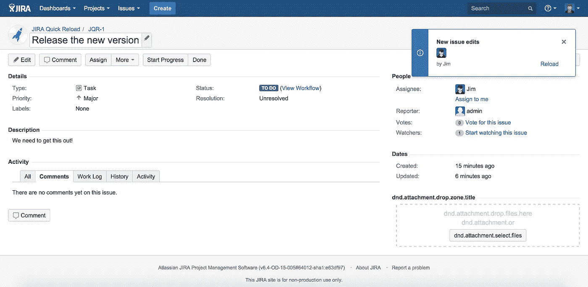
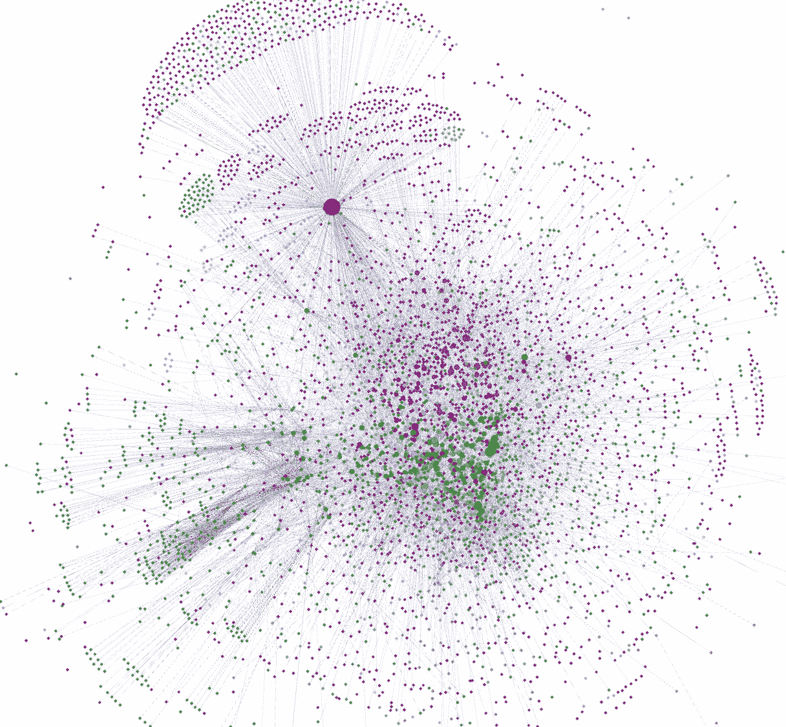
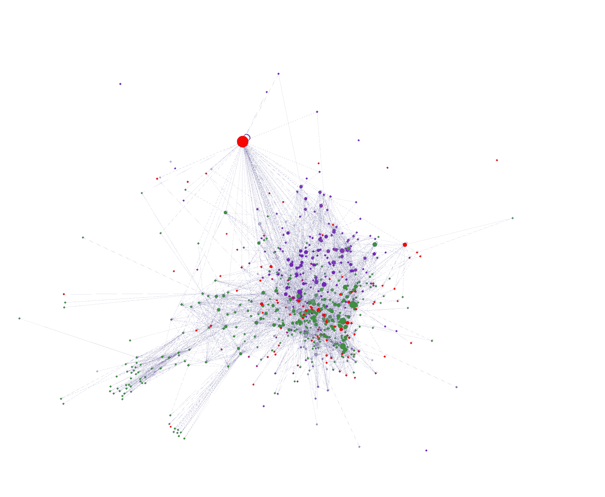

# 用 python 读取和可视化吉拉的数据

> 原文：<https://towardsdatascience.com/communication-story-from-an-issue-tracking-software-efbbf29736ff?source=collection_archive---------6----------------------->


Photo by [Nong Vang](https://unsplash.com/photos/9pw4TKvT3po?utm_source=unsplash&utm_medium=referral&utm_content=creditCopyText) on [Unsplash](https://unsplash.com/search/photos/story?utm_source=unsplash&utm_medium=referral&utm_content=creditCopyText)

吉拉是一个广泛应用于 bug/问题跟踪和敏捷项目管理的软件。该工具的实体之一是一个问题，它可以代表一个 bug、一个任务、一个订单或其他东西(这取决于一个组织使用该应用程序的方式):



Picture from [marketplace-cdn.atlassian](https://marketplace-cdn.atlassian.com/files/images/1b643789-f610-44bb-83fc-0335c5f3fa9e.png)

在问题中有许多通信信息，例如，作者、受托人、描述、评论、状态。从发现模式、潜在问题、改进业务流程和提高使用吉拉的效率或简单地“鸟瞰”吉拉的通信流程来看，这可能是有趣的。

本文涵盖以下内容:

*   使用 [jira-python 库](https://jira.readthedocs.io/en/master/)从吉拉读取信息。
*   使用 python 的 [networkx 库](https://networkx.github.io/)和图形可视化工具 [Gephi](https://gephi.org/) 可视化数据。

# 以“大数据”方式从吉拉读取数据

不，我们不会考虑大数据工具。然而，我们事先不知道吉拉有多少数据(也许有人真的遇到大量数据)，一个块一个块地处理数据是个好习惯。

[吉拉-python 库](https://jira.readthedocs.io/en/master/)允许我们轻松地与吉拉 API 进行交流。安装此库后，我们导入以下对象和异常，并创建导入对象的实例:

其中:

*   URL——吉拉的服务器地址，
*   用户名和密码—代表与吉拉进行通信的用户的用户名和密码。使用所谓的技术用户是合理的，它并不代表一个真实的人，只是为了系统与系统之间的通信而创建的。

创建实例`jira`后，我们可以使用它的`issue`(读取单个问题)或`search_issues`(提取多个问题)方法读取数据。例如，让我们查找属于项目“项目 1”和“项目 2”且在过去 365 天内创建的问题:

其中 jql — [吉拉查询语言](https://www.atlassian.com/blog/jira-software/jql-the-most-flexible-way-to-search-jira-14)查找问题对应查询中给定的条件。`jira_search`具有类型`jira.client.ResultList` —匹配 JQL 的发布资源列表，例如:

```
[<JIRA Issue: key=’Key1–12000', id=’102007'>,<JIRA Issue: key=’Key2–12001', id=’102008'>,…]
```

迭代这个结果列表，可以提取问题的字段。作为上面代码中的一个例子，我们读取第一个问题的状态名。

结果列表吉拉服务器返回的问题资源的最大数量受服务器中配置的结果数量的限制。通常，我们不知道会从吉拉的服务器上读到多少期。此外，我们希望通过一次读取大量数据来避免吉拉的服务器过载。因此，这是一种迭代读取数据的好方法，逐块读取。在这种情况下，我们可以避免提到的问题，不去想吉拉的许多问题。

“While”循环可用于迭代读取数据。在给出示例之前，假设我们想要读取属于项目“项目 1”和“项目 2”的未知数量的问题，并且这些问题是在过去 365 天内创建的。我们将读取某些字段:问题的类型、创建日期和时间、解决日期和时间、报告者、受让人、状态。假设我们希望将所有读取数据保存到“csv”文件中。

下面是读取和保存数据的代码:

在上面的代码中，我们每次迭代一次读取 100 个问题，在读取必要的字段后，将这些数据写入“csv”文件。为了读取问题的特定部分，我们在`search_issues`方法中定义了参数:

*   startAt —返回的第一个问题的索引，
*   maxResults 返回的最大问题数。

通过使用`search_issues`方法，我们不仅可以读取字段，还可以读取例如 changelog。为此，必须传递参数`expand='changelog'`。Changelog 在状态或受托人历史方面很有意思。假设，我们想知道给定问题的受理人历史记录(谁进行了更改、以前的受理人、新的受理人、更改日期和时间):

好了，让我们进入下一步——可视化数据。正确可视化的数据可以指出有趣的特征。

# 可视化数据

为了让阅读数据来讲述一个故事，我们需要可视化，或者更准确地说，我们将建立一个有向图来表示报告者和受托人之间的联系。为此，我们再次逐块读取之前创建的“csv”文件，以节省计算资源:

为了构建这个图，我们使用了 [networkx 库](https://networkx.github.io/)。在上面代码的第 25 行，我们定义了节点、边和权重(代表节点之间的连接频率)。可选地(第 32–46 行)，我为节点创建了颜色属性，显示属于部门单位。代码的最后一行将我们的图形保存为‘graph ml’格式([其他格式](https://networkx.github.io/documentation/stable/reference/readwrite/index.html))。

下一步非常有趣和吸引人——图形可视化。我更喜欢用 [Gephi](https://gephi.org/) 。因此，在将保存的图形加载到该工具中并进行一些调整后，我们会生成如下结果:



在这个图表中我们可以看到什么特征？其中一些:

*   节点的大小—越大，传入或/和传出的边越多，
*   边的大小(就宽度而言)——越大，这种连接越频繁。

也许代表大节点和大边缘的员工需要一些东西来提高他们的工作效率。然而，所有这些案件都需要进一步调查。

还有一点:在前一批代码中有一个日期变量(第 27–30 行)。此变量是节点出现在吉拉数据中的日期。因此，使用它，我们可以把我们的图表表示为动态的:



# 结论

上述内容有助于构建进一步的步骤:计算统计数据(被分配人创建了多少评论，员工在沟通上花费了多少时间等等)。再深入一点，我们可以，例如，对描述/评论进行语义或形态分析。你想要的目标没有限制！