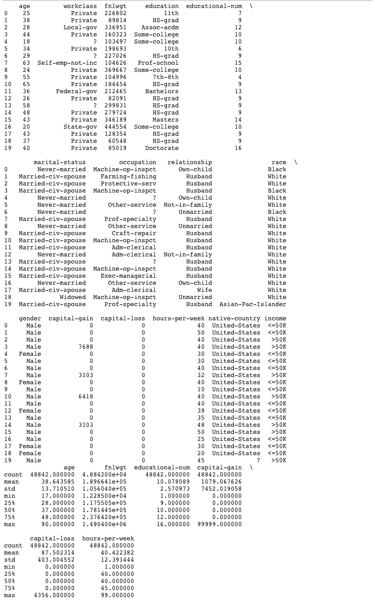
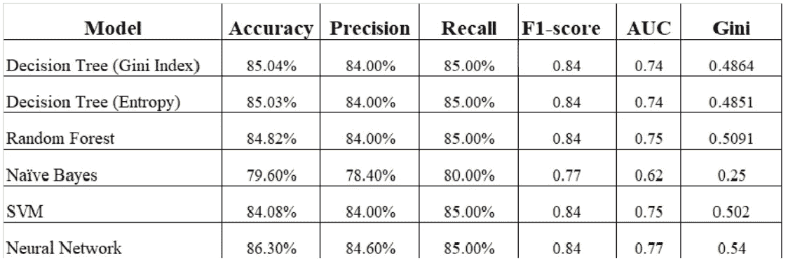
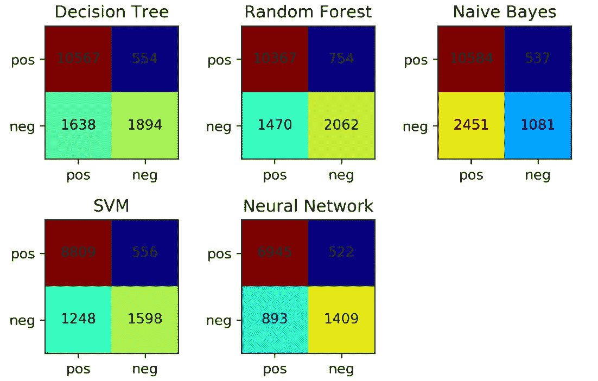
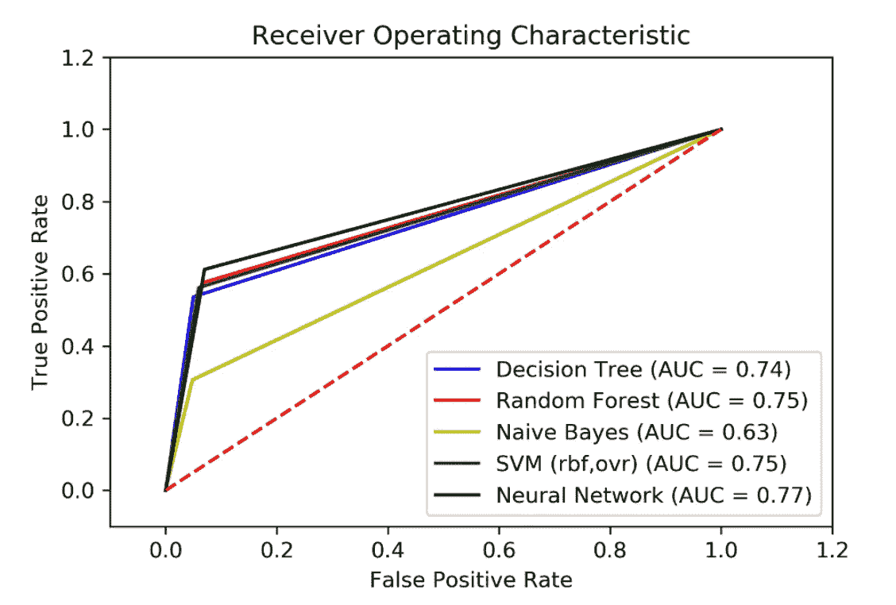

# 从人口普查数据预测个人收入范围的分类器比较研究

> 原文：<https://towardsdatascience.com/comparative-study-of-classifiers-in-predicting-the-income-range-of-a-person-from-a-census-data-96ce60ee5a10?source=collection_archive---------11----------------------->

## 不同机器学习分类器的实现指南

我们作为一个社会，已经彻底改变了我们已知的专业领域。**机器学习**和**人工智能**就是从原始数据中提取知识的领域之一。这种知识可用于建立具有高精度和准确度的动态模型，使得模型本身可用于预测或分类先前未知的数据。从人口普查数据中提供知识的一个最重要的方面是通过调查以前的记录来预测每个人的收入和健康等数据。

机器学习不是魔法，只有当需要解决的问题尽可能准确地从现实世界中表达出来时，它才会起作用。机器学习最重要和最关键的任务之一是清理和准备应该馈送给分类器用于训练模型的数据。我将讨论在预处理每个分类器的数据、训练模型和在这个分析领域的性能评估中使用的不同技术。

有许多分类器可用于根据历史数据和现有数据对数据进行分类。在这里，我倾向于对不同的常用机器学习分类器进行比较研究，如决策树、朴素贝叶斯、随机森林和支持向量机以及神经网络。本次研究选择的数据集是 [**UCI 成人数据集**](https://archive.ics.uci.edu/ml/datasets/adult) **。**

> 数据集链接—[https://archive.ics.uci.edu/ml/datasets/adult](https://archive.ics.uci.edu/ml/datasets/adult)

选择最佳的机器学习算法来解决数据的分类和预测问题是机器学习中最重要的部分，它也依赖于数据集。在这里，我比较了这些分类器的不同评估措施，如混淆矩阵，ROC 曲线和绘图的结果。

**这一想法旨在提供一个现有研究的基准，这些研究是在此类分类器的比较研究中完成的，旨在根据人口普查数据预测一个人的收入范围。**

UCI 知识库成人数据集是一个对所有人开放的数据集。它由 14 个属性和一个类别标签组成，说明个人的年收入是低于还是高于 50K。这些属性的范围从人的年龄、工人阶级标签到关系状态和人所属的种族。关于所有属性的信息可以在[这里](https://archive.ics.uci.edu/ml/datasets/adult)找到。

Description of the dataset.

**注意** —数据非常原始，并且缺少值。

# 预处理数据集

有各种方法可以通过移除冗余值和处理缺失值来改善所获得的数据集。在这个数据集中，我们有 14 个属性，每个属性都对结果有贡献，因此我们不删除任何属性。三个属性 work-class、occupation 和 native-country 有缺失值出现，这些值将被列中出现次数最多的实例替换。

为了将数据拟合到预测模型中，我们需要将分类值转换为数值。在此之前，我们将评估是否有必要对分类列进行任何转换。离散化是使分类数据更加整洁和有意义的常用方法。我对婚姻状况一栏进行了离散化处理，将它们缩小到只包含已婚或未婚的值。稍后，我在剩余的数据列中应用标签编码器。

# 分类器的实现

在根据数据的输入方式对每个分类器的数据进行预处理之后，我们对数据进行切片，将标签和属性分开。现在，我们将数据集分成两半，一部分用于训练，一部分用于测试。这是使用 sklearn 的 train_test_split()函数实现的。

同样，对于其他分类器:

在神经网络的情况下，以前我们使用标签编码将分类数据转换为数值，但对于某些属性，它会产生一个问题，即赋予相等值更高的重要性。因此，为了纠正这一点，我们使用熊猫图书馆的虚拟变量技术。这将从 14 列创建 88 列作为神经网络的输入。

现在让我们看看结果。

# 实现的分类器比较

使用 tensorflow 实现的分类器有**决策树**、**朴素贝叶斯**、**支持向量机**、**随机森林**和**神经网络**。

我们检查成人数据集的每个分类器的结果，并绘制结果和发现。比较方法对于这种预测方法至关重要，以便为进一步的研究和应用设计结果。

## 分数(分类报告)

下表中包含了所有的分类器和不同的得分，如**准确率**、**精度**、**召回率**、**F1-得分**和**基尼系数**。 **F1 分数**这是一种非常常用的测试准确度的衡量标准。计算分数体现了测试的精确性和召回性。**精度**是真阳性的数量除以真阳性和假阳性的总和。同样， **recall** 是真阳性的个数除以真阳性和假阴性的总和，也就是实际属于阳性类的元素总数。**基尼系数**用于直接从 AUC 值得出的分类问题。只不过是 ROC 曲线和对角线的面积之比&上面三角形的面积。

结果如下:

Scores of different models

## 混淆矩阵

混淆矩阵是一个简单的 NxN 矩阵，其中 N 是类别标签的数量。提供了正确和错误识别的阳性和阴性病例部分的值，因此也获得了准确性。下面是所有五个分类器的混淆矩阵。

结果如下:

Confusion Matrix

## 受试者工作特征曲线

接收器工作特性曲线是灵敏度和(1-特异性)之间的曲线。(1-特异性)也称为假阳性率，灵敏度也称为真阳性率。这里我们还计算了 ROC 曲线下的面积(AUC)。它描述了测试如何将被测试的组分成两个类别标签。面积越大越好。

得到了下面的曲线图:

ROC curve

# 观察

结果表明，支持向量机和随机森林方法能够很好地准确预测数据，准确率分别为 84.08%和 84.83%。另一方面，神经网络显示出显著的效果，本质上是一种新颖和非正统的。神经网络模型的 AUC 曲线为 0.77，准确率达到显著的 86.30%。

上述获得的结果可用作在从人口普查数据预测数值领域进行的其他比较研究的标准参考点。这种比较研究可以进一步用作改进现有分类器和技术的基础，从而产生用于准确预测个人收入水平的更好技术。

当今数据科学领域研究的目标是构建从数据中提取知识的系统和算法。这项研究可以补充现有方法的能力并减少任何错误，从而在从历史人口普查数据中进行数据挖掘的领域中做出贡献。

> **如需进一步参考所有代码和结果，请访问我的 GitHub 知识库—**[**https://GitHub . com/ritvikkhanna 09/Census-classifier-comparison**](https://github.com/ritvikkhanna09/Census-classifier-comparison)