# Tensorflow 中实现稀疏编码的不同方法比较

> 原文：<https://towardsdatascience.com/comparing-different-methods-of-achieving-sparse-coding-in-tensorflow-manual-back-prop-in-tf-d47053da4d8e?source=collection_archive---------16----------------------->

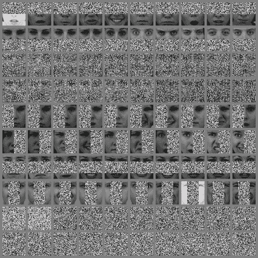

GIF from this [website](https://giphy.com/gifs/deep-learning-jLrmkvDAn21fW)

在韩国度假期间，我一直在研究更多关于稀疏编码和实现它的不同方法，今天我想比较其中的一些。下面是我将要比较的所有案例。(以防我将案例 d 和案例 e 的两篇论文联系起来。)

*案例 a:纯自动编码器
案例 b:具有 L2 正则化的自动编码器
案例 c:稀疏自动编码器来自* [*安德鲁·吴的课程*](https://web.stanford.edu/class/cs294a/sparseAutoencoder_2011new.pdf) *案例 d:* [*简单、高效的稀疏编码神经算法*](https://arxiv.org/pdf/1503.00778.pdf) *案例 e:*[*k-稀疏自动编码器*](https://arxiv.org/pdf/1312.5663.pdf)

> **请注意，这个帖子是为了我未来的自己，也是为了存档已经取得的成果。**

Paper from this [website](https://arxiv.org/pdf/1503.00778.pdf)

Paper from this [website](https://arxiv.org/pdf/1312.5663.pdf)

**简介、数据集和总体思路**

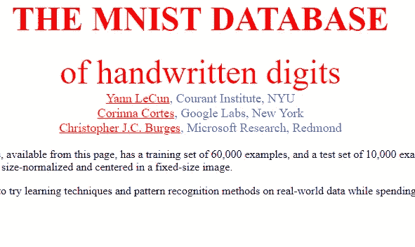

Image from this [website](http://yann.lecun.com/exdb/mnist/)

我已经假设读者对神经网络和自动编码器有一些了解，所以我不会深入细节。此外，我只打算介绍使用自动编码器进行稀疏编码的方法。请记住，hyper 参数的设置是相同的，但这并不能保证它对每种情况都是最佳的！最后，我将使用的所有数据都来自 [MNIST 数据集。](http://yann.lecun.com/exdb/mnist/)

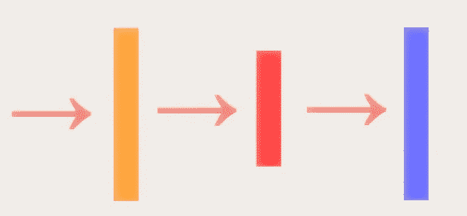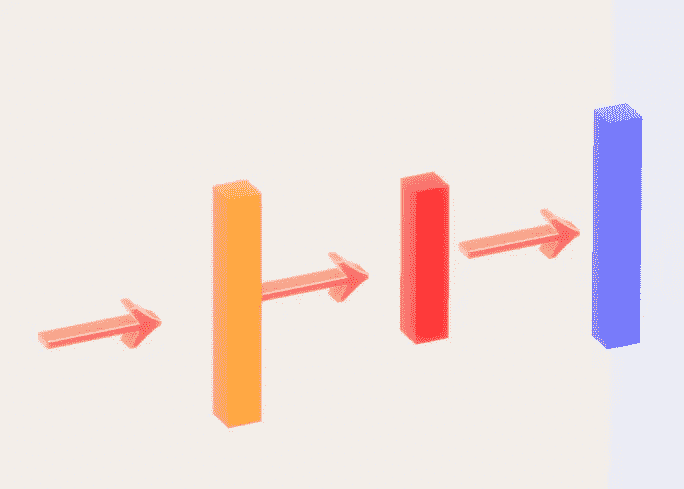

**橙色框** →矢量形式的原始数据
**红色框** →压缩数据
**蓝色框** →重构数据

自动编码器的一般思想非常简单，在压缩后重建原始数据。在今天的帖子中，我们的目标是学习到的权重(橙色框和红色框之间的权重)，因为这些权重代表了我们正在捕捉的数据类型(或特征)。

**案例 a 的结果:纯自动编码器**

Progression of learned weights for 500 epoch

从上面的过程中，我们可以注意到一些事情，学习的权重(或特征)并不特定于某些数字。这是因为由于网络可以使用学习字典中的所有原子来重构原始数据，因此不需要学习给定数据的专门过滤器。

**左图** →原始数据
**右图** →重建数据

重建的数据有点模糊，但是，一般来说，它包含了正确的数字形状。

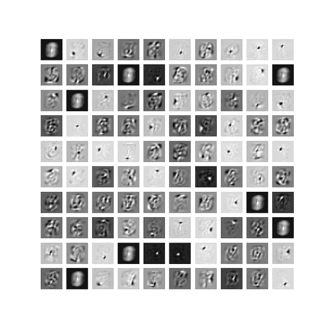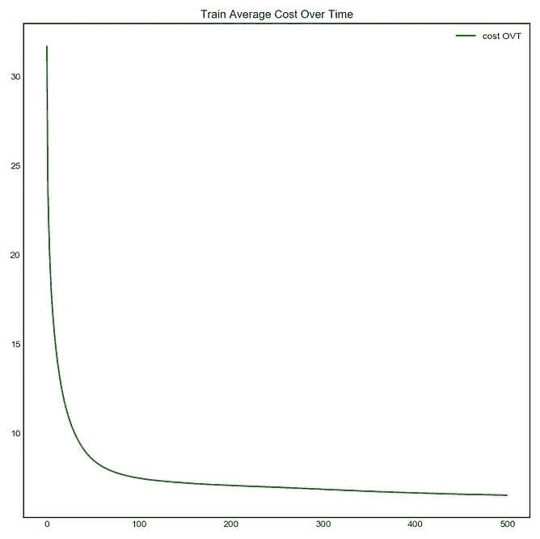

**左图** →对比度归一化的学习权重
**中图** →对比度归一化的学习权重
**右图** →训练期间的时间成本

当我们再次查看学习到的权重时，我们可以再次观察到过滤器并不特定于某些数字。

**情况 b 的结果:采用 L2 正则化的自动编码器**

Progression of learned weights for 500 epoch

当我们将 L2 正则化添加到原始自动编码器时，我们看不到学习到的权重之间的极端差异。这是自然的，因为在重构原始数据时，网络仍然可以完全访问字典中的所有原子。

**左图** →原始数据
**右图** →重建数据

同样，类似于纯自动编码器，重建的数据是模糊的，但它仍然保留了一般的形状。

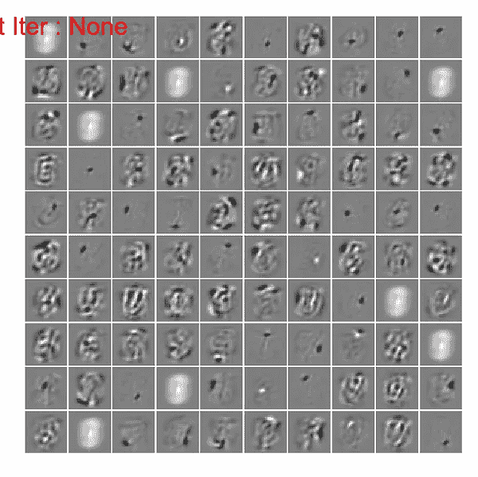

**左图** →对比度归一化的学习权重
**中图** →对比度归一化的学习权重
**右图** →训练期间的时间成本

我们仍然看不到特定于某些数字的过滤器。

**案例 c 的结果:来自** [**Andrew NG 的课程**](https://web.stanford.edu/class/cs294a/sparseAutoencoder_2011new.pdf) 的稀疏自动编码器

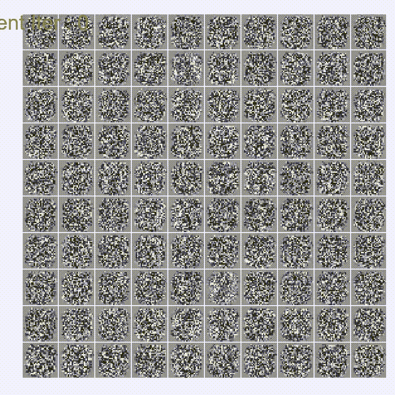

Progression of learned weights for 500 epoch

当我们在隐藏层中引入稀疏性的概念时，并不是字典中的所有原子都可以使用。我们可以清楚地观察到，学习到的过滤器正变得更加特定于某些数字，并且在最终时期之后，过滤器代表数字的手动敲击。

**左图** →原始数据
**右图** →重建数据

我个人认为，重建的数据比其他两个(上图)更模糊，但它们是清晰可辨的。

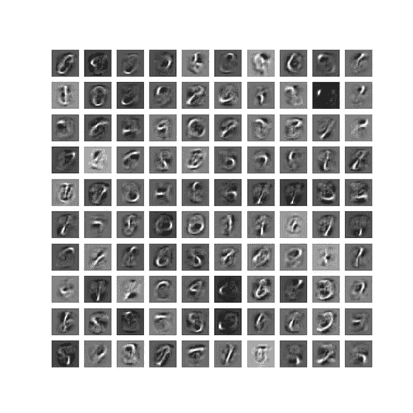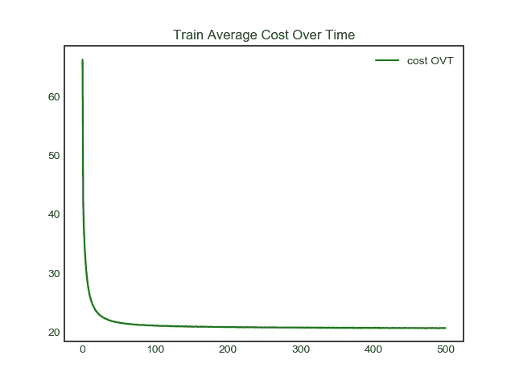

**左图** →对比度归一化的学习权重
**中图** →对比度归一化的学习权重
**右图** →训练期间的时间成本

当我们将学习到的权重可视化时，我们可以看到网络正试图从给定的数据中提取不同的笔画。

**案例 d 的结果:** [**简单、高效、用于稀疏编码的神经算法**](https://arxiv.org/pdf/1503.00778.pdf)

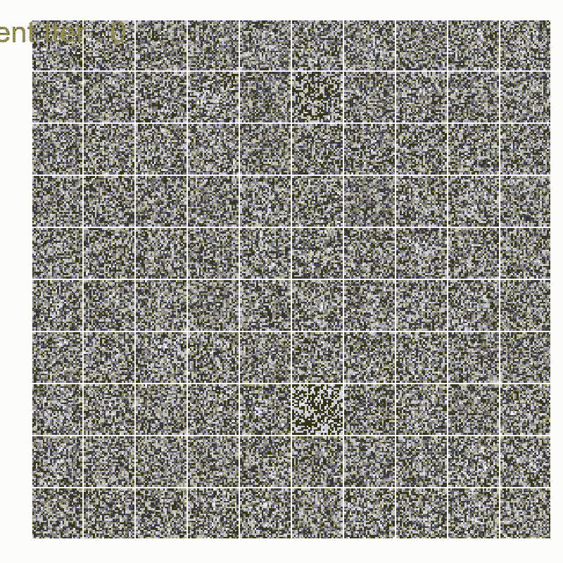

Progression of learned weights for 500 epoch

如果没有要优化的重建损失函数，我们可以观察到收敛需要更长的时间。然而，我们可以观察到，如果字典中的某个原子被使用，它会产生一个类似的过滤，就像我们有稀疏的概念时一样。(案例 c)。

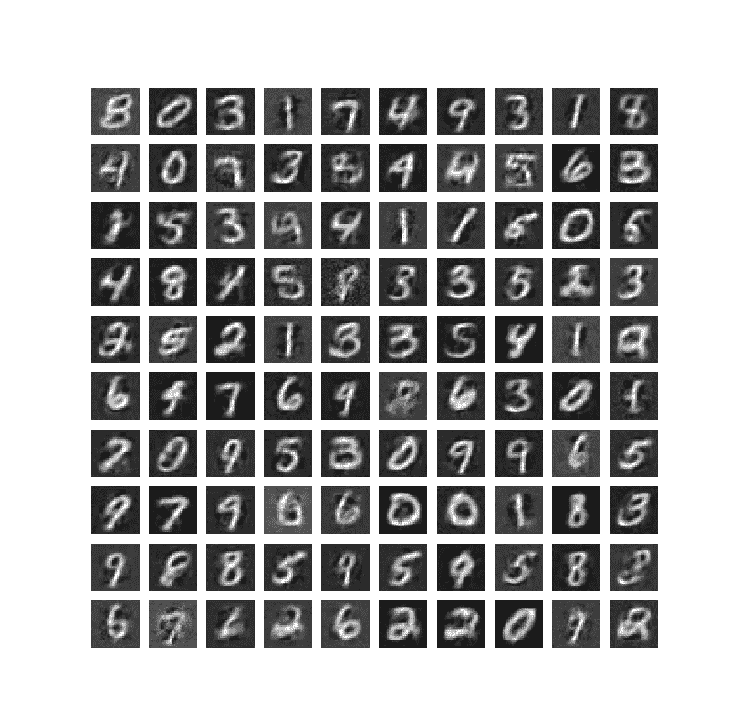

**左图** →原始数据
**右图** →重建数据

这种方法的一个缺点是没有重建损失，虽然它产生更干净的滤波器，但它不能像其他方法一样重建原始数据。

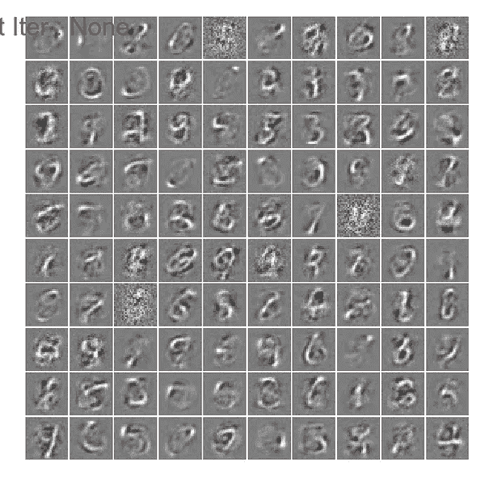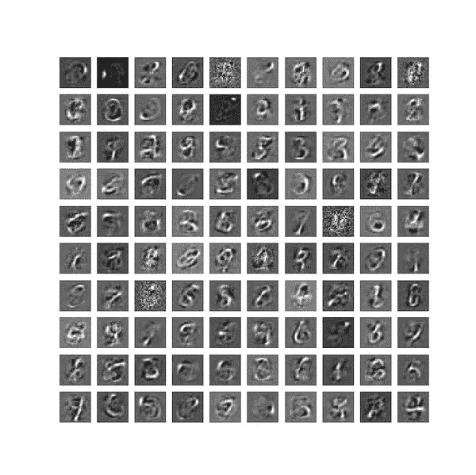

**左图** →对比度归一化的学习权重
**中图** →对比度归一化的学习权重
**右图** →训练期间的时间成本

当我们可视化学习到的权重时，我们可以看到这种方法的优点，即它产生更干净的滤波器。

**情况 e 的结果:**[**k-稀疏自动编码器**](https://arxiv.org/pdf/1312.5663.pdf)

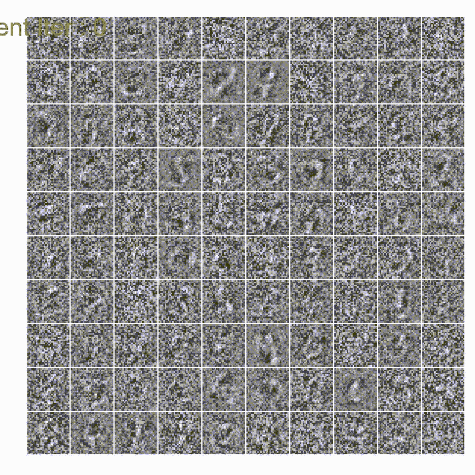

Progression of learned weights for 500 epoch

对于给定的数据，前 K 个稀疏自动编码器收敛到最佳点要快得多。并且我们可以观察到，在捕捉手写笔画类型特征的同时，所学习的权重是干净的。

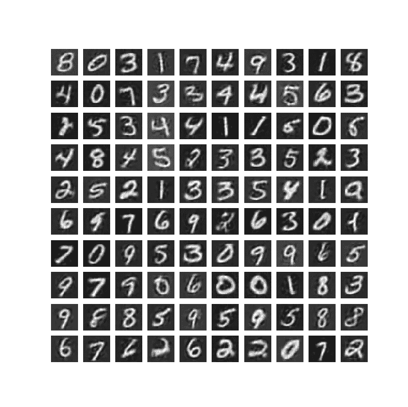

**左图** →原始数据
右图 →重建数据

由于重建误差的存在，当与情况 d 相比时，重建的数据更清晰，然而，我们可以清楚地观察到它在这里和那里缺乏对比度的事实。

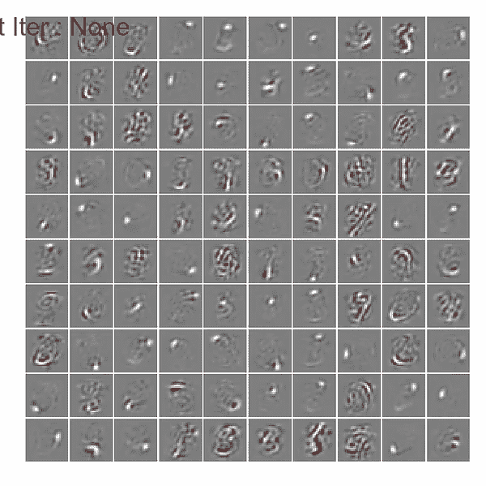

**左图** →对比度归一化的学习权重
**中图** →对比度归一化的学习权重
**右图** →训练期间的时间成本

同样，学习过的过滤器在捕捉手笔画类型特征时更干净。

**交互代码**

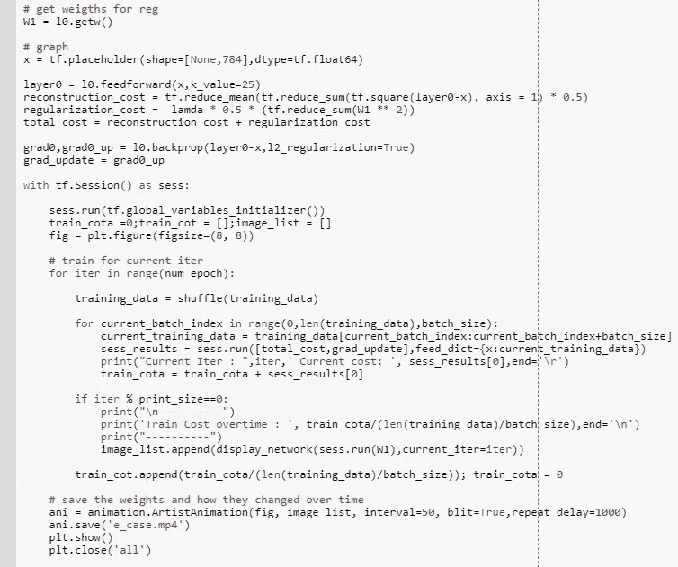

对于谷歌 Colab，你需要一个谷歌帐户来查看代码，而且你不能在谷歌 Colab 中运行只读脚本，所以在你的操场上做一个副本。最后，我永远不会请求允许访问你在 Google Drive 上的文件，仅供参考。编码快乐！

要访问案例 [a 的代码，请点击此处。](https://colab.research.google.com/drive/15vST8Gma0uyQa1DOwO5weUWQ-I55FQoG)
要获取案例 [b 的代码，请点击此处。](https://colab.research.google.com/drive/1m2IfnKFdXN5KMOvDMfFSj4vc94kcch73)
要访问案例 [c 的代码，请点击此处。](https://colab.research.google.com/drive/1-OHYBSYxsQ0dYRvq5wzzBhzlQRs2p169)
要获取案例 [d 的代码，请点击此处。](https://colab.research.google.com/drive/1HtXdq6hcX2rbywjl8I1BnLmelXy7P2sZ)
要获取案例 [e 的代码，请点击此处。](https://colab.research.google.com/drive/1J6cTgJnUXi64ndOx7X_1eoiStGzpt4fU)

**最后的话**

这让我如此满意的原因是因为我没有使用任何自动微分。

如果发现任何错误，请发电子邮件到 jae.duk.seo@gmail.com 给我，如果你想看我所有写作的列表，请在这里查看我的网站。

同时，在我的推特上关注我[这里](https://twitter.com/JaeDukSeo)，访问[我的网站](https://jaedukseo.me/)，或者我的 [Youtube 频道](https://www.youtube.com/c/JaeDukSeo)了解更多内容。我还实现了[广残网，请点击这里查看博文 pos](https://medium.com/@SeoJaeDuk/wide-residual-networks-with-interactive-code-5e190f8f25ec) t。

**参考**

1.  FNNDSC/med2image。(2018).GitHub。检索于 2018 年 8 月 4 日，来自[https://github.com/FNNDSC/med2image](https://github.com/FNNDSC/med2image)
2.  张量，T. (2018)。张量中的前 n 个值。堆栈溢出。2018 年 8 月 4 日检索，来自[https://stack overflow . com/questions/40808772/tensor flow-top-n-values-in-tensor](https://stackoverflow.com/questions/40808772/tensorflow-top-n-values-in-tensor)
3.  t . way(2018)。使用 top_k 和 any way 的 tesorflow 排序。堆栈溢出。检索于 2018 年 8 月 4 日，来自[https://stack overflow . com/questions/46045867/tesorflow-sort-using-top-k-and-any-way](https://stackoverflow.com/questions/46045867/tesorflow-sort-using-top-k-and-any-way)
4.  tf.nn.top_k |张量流。(2018).张量流。检索于 2018 年 8 月 4 日，来自[https://www.tensorflow.org/api_docs/python/tf/nn/top_k](https://www.tensorflow.org/api_docs/python/tf/nn/top_k)
5.  tf.greater | TensorFlow。(2018).张量流。检索于 2018 年 8 月 4 日，来自 https://www.tensorflow.org/api_docs/python/tf/greater
6.  x？，H. (2018)。如何在 OS X 上将 Python 的默认版本设置为 3.3？。堆栈溢出。2018 年 8 月 5 日检索，来自[https://stack overflow . com/questions/18425379/how-to-set-python-default-version-to-3-3-on-OS-x](https://stackoverflow.com/questions/18425379/how-to-set-pythons-default-version-to-3-3-on-os-x)
7.  张量，T. (2018)。张量中的前 n 个值。堆栈溢出。检索于 2018 年 8 月 12 日，来自[https://stack overflow . com/questions/40808772/tensor flow-top-n-values-in-tensor](https://stackoverflow.com/questions/40808772/tensorflow-top-n-values-in-tensor)
8.  (2018).Web.stanford.edu。检索于 2018 年 8 月 13 日，来自[https://web . Stanford . edu/class/cs 294 a/sparseautoencer _ 2011 new . pdf](https://web.stanford.edu/class/cs294a/sparseAutoencoder_2011new.pdf)
9.  (2018).Arxiv.org。检索于 2018 年 8 月 13 日，来自[https://arxiv.org/pdf/1503.00778.pdf](https://arxiv.org/pdf/1503.00778.pdf)
10.  (2018).Arxiv.org。检索于 2018 年 8 月 13 日，来自[https://arxiv.org/pdf/1312.5663.pdf](https://arxiv.org/pdf/1312.5663.pdf)
11.  MNIST 手写数字数据库，Yann LeCun，Corinna Cortes 和 Chris Burges。(2018).Yann.lecun.com。检索于 2018 年 8 月 13 日，来自[http://yann.lecun.com/exdb/mnist/](http://yann.lecun.com/exdb/mnist/)