# 在营销用例中比较多臂 Bandit 算法

> 原文：<https://towardsdatascience.com/comparing-multi-armed-bandit-algorithms-on-marketing-use-cases-8de62a851831?source=collection_archive---------2----------------------->

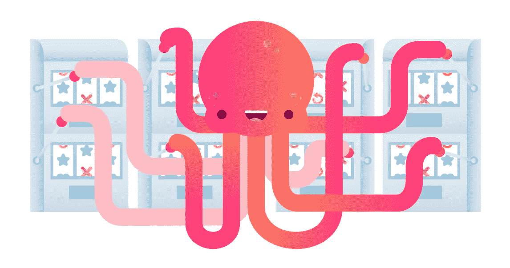

A/B 测试是许多电子商务公司营销过程中的标准步骤。通过精心设计的 A/B 测试，营销人员可以获得关于在哪里以及如何最大化其营销努力并推动成功活动的见解。然而，实际上，与更先进的机器学习方法相比，标准的 A/B 测试会把钱留在桌子上。

在这篇文章中，我们将讨论 A/B 测试的当前状态，定义一些用于优化 A/B 测试的常见机器学习算法(Multi-Armed Bandits ),最后描述这些算法在一些典型营销用例中的性能。

A/B 测试:它是如何工作的？

在一个标准的 A/B 测试实验中，我们想要测量一个活动的变体比另一个更有效*的可能性，同时控制我们测量错误的可能性——要么我们认为有一个赢家，而实际上没有，要么我们错过了检测获胜的变体。为了进行准确的测量，A/B 测试必须考虑两个关键值:统计功效和统计显著性。*

从形式上来说，[统计功效](https://en.wikipedia.org/wiki/Power_(statistics))是当一个效应存在时(当一个变量优于另一个变量时)，实验将实际检测到该效应的概率，统计显著性衡量我们对所测量的效应实际存在的信心程度。然而，从*置信区间*的角度来考虑这两个想法会更直观。

在给定的实验中，我们测量每个变量的平均转化率，但我们知道平均值只是“真实”转化率的估计值。根据我们所拥有的观察值的数量，我们可能对估计值有或多或少的信心，并且我们可以使用一个区间来表示这种信心，在该区间内可能会找到真实值*。例如，如果我们在 95%的置信度下说一个转换率是 0.032 +/- 0.002，那么我们有 95%的置信度认为实际转换率在 0.030 和 0.034 之间。实际上，我们会寻找不重叠的置信区间，这样真实转换率不同的概率就大于 95%。*

*但是，等待间隔分开可能需要很长时间。在实际情况中，对于 0.03 的典型点击率，为了检测 10%的点击转换提升(0.03*0.1 = 0.003)，对于统计功效和显著性的标准水平，我们将需要总共 106，000 个接触的最小样本量(每个变体 53，000 个接触)。根据流量，积累这么多数据可能需要几天到几个月的时间，如果我们有更多的变体，更低的转化率，或更低的效果大小，收集周期可能会更长。*

***多兵种强盗算法:探索+利用***

*在机器学习中，“探索与利用的权衡”适用于希望获得新知识并同时最大化其回报的学习算法——这被称为[强化学习](https://en.wikipedia.org/wiki/Reinforcement_learning)问题。在这种情况下，后悔被定义为你可能会想到的:由于执行学习算法而不是从一开始就表现最佳，导致奖励减少。为探索而优化的算法往往会招致更多的遗憾。*

*A/B 测试是一种纯粹的****探索性**方法。由于在 A/B 测试实验中，接触是以相等的概率随机分配给每个变量的，因此可实现的总回报等于所有变量的平均回报，并且必须低于获胜变量的平均回报。如上例所示，典型的 A/B 测试往往需要数十万次接触才能达到适当的统计功效。使用固定规模的随机分配算法来进行这种类型的实验可能会导致整体支出的大量损失——A/B 测试可能会有非常高的*遗憾*。***

***[Multi-armed bandit (MAB)](https://en.wikipedia.org/wiki/Multi-armed_bandit) 算法可以被认为是 A/B 测试的替代方案，可以在学习过程中平衡开发和探索。MAB 的解决方案利用现有的实验结果，为表现良好的变体分配更多的联系，而为表现不佳的变体分配较少的流量。理论上，多臂 bandit 算法应该产生更高的总体回报(并减少遗憾)，同时仍然允许人们收集用户如何与活动的不同变化进行交互的数据。***

***有几种 MAB 算法，每一种都在不同程度上倾向于开发而不是探索。三个最流行的是ε贪婪，汤普森抽样，和置信上限 1 (UCB-1)。在这篇博客中，我们将分别讨论这些 MAB 算法，然后比较它们之间的行为以及不同实验条件下的 A/B 测试设置。***

*****算法细节*****

***(在本节中，我们将使用一种更简单的模拟设置来演示算法行为，这种模拟设置将在下面详细解释:低差双变量模拟。)***

****ε贪心:****

***Epsilon Greedy，顾名思义，是三种 MAB 算法中最贪婪的。在ε贪婪实验中，常数ε(值在 0 和 1 之间)由用户在实验开始前选择。当将联系人分配到活动的不同变量时，随机选择的变量被选择ε次。其余的 1-ε时间，选择已知收益最高的变量。ε越大，该算法越有利于探索。对于我们所有的例子，ε设置为 0.1。***

***模拟结果如图 1 所示。较细的轨迹来自 10 次随机选择的模拟，较粗的线是 1000 次模拟的平均结果。左图显示了两个变量之间的联系分配，右图显示了模拟期间每个变量的实际转换率。***

***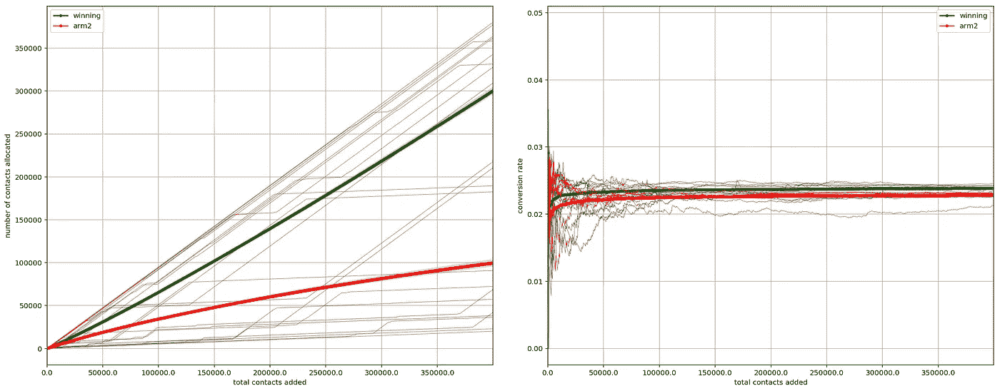***

*****Fig 1.** Example results from a 2-variant Epsilon Greedy simulation (winning variant conversion rate: 0.024, losing variant conversion rate: 0.023). Left, contact allocation to each variant; Right, average conversion rate for each variant.***

***有趣的是，虽然平均而言，该算法为获胜的变体分配了更多的联系人，但对于单个模拟来说，分配结果可能会与平均行为相差很大。由于两个变体之间的微小差异，以及我们最初分配的少量联系，失败的变体在实验开始时确实偶尔显示出较高的转化率。由于该算法是如此“贪婪”，最初“失败”的变体没有被充分探索以使该算法收集足够的数据来学习实验期间任一变体的真实转化率。这也体现在单个模拟的转换率图的噪声中，即使在 40，000 个数据点(分配的接触)后，也没有完全收敛到真实平均值。***

****汤普森采样****

***相比之下，汤普森抽样是一种更有原则的方法，它可以在边际情况下产生更平衡的结果。对于每一个变体，我们使用观察到的结果建立一个真实成功率的概率分布(出于计算的原因，最常见的是一个[贝塔分布](https://en.wikipedia.org/wiki/Beta_distribution))。对于每个新联系人，我们从对应于每个变体的 beta 分布中采样一个可能的成功率，并将该联系人分配给具有最大采样成功率的变体。我们观察到的数据点越多，我们对真实的成功率就越有信心，因此，随着我们收集到更多的数据，抽样成功率将越来越有可能接近真实的成功率。***

***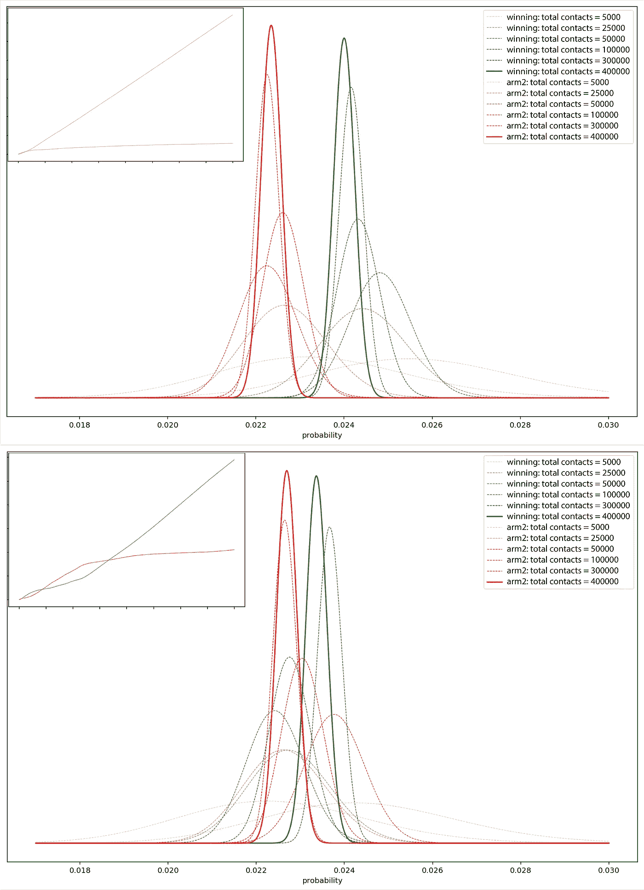***

*****Fig 2**. Probability density distribution of beta distributions for two individual simulations at different stages of the experiment. Inset figures: contact allocation trajectories for each variant.***

***默认情况下，每个 beta 分布的参数(𝛂和𝛃)被初始化为 1 和 1，导致所有变体的 beta 分布相同，表示没有偏差(因为我们没有证据表明哪个变体可能是赢家)。随着我们收集更多的数据，分布会随着最新的结果更新(𝛂= n 被转换，𝛃 = n 未被转换)，概率密度将开始围绕平均收益聚集。数据点数越多，概率密度函数越窄(见图 2)。如果对每个变体应该如何表现有很强的先验信念，我们可以在实验开始前改变𝛂和𝛃来代表这个先验分布。***

***下图(图 3)是我们对 Thompson 采样的 2 变量模拟的平均结果。与 Epsilon Greedy(图 1)类似，在实验的早期阶段，Thompson 采样的单个模拟与平均行为相差甚远。然而，在实验的后期，个体模拟的行为变得更加一致，与平均结果更加相似。***

***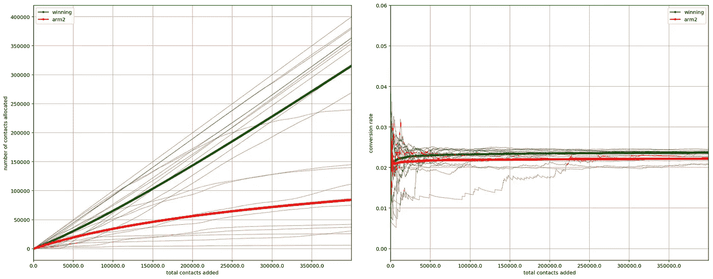***

*****Fig 3.** Example results from a 2-variant Thompson Sampling simulation (winning variant conv rate: 0.024, losing variant conv rate: 0.023). Left, contact allocation to each variant; Right, avg conversion rate for each variant.***

***为了更直观地了解这一行为，我们在实验的不同阶段绘制了两个随机选择的模拟的平均概率密度分布(pdf )(图 2)以及每个模拟的接触分配(插图)。在这两种情况下，从实验开始的 pdf 开始广泛和高度重叠，并且随着附加数据点，最终在实验结束时变得相当好地分离。正如预期的那样，我们可以通过查看两臂的 PDF 有多少重叠，以及哪一个具有更高的平均转化率(PDF 的峰值)，来跟踪接触在实验的每个阶段是如何分配的。***

***UCB 一号:***

***对于活动的每个变体，我们将确定一个置信上限(UCB ),它代表我们对该变体的可能收益的最高猜测。该算法会将联系人分配给具有最高 UCB 的变量。***

***每个变量的 UCB 是根据变量的平均收益以及分配给变量的联系数计算的，公式如下:***

******

***如等式所示，变量的 UCB 分数随着进入该变量的联系人数量的增加而降低，因此，即使特定变量在平均回报中胜出，UCB 也可能低于回报稍低的不太好探索的变量。因此，该算法能够在探索不熟悉的选项和利用获胜的变体之间找到平衡。***

***下面(图 4)再次是使用 UCB-1 的双变量模拟(0.024 对 0.023 转换率)的结果。UCB-1 的表现非常类似于比例分配(图 3)，并且比ε贪婪(图 1)保守得多。在实验的初始阶段(前 30，000 个数据点)，算法基本上是纯探索，在两臂之间分配几乎相等数量的接触。像比例分配，UCB-1 的结果从个人模拟是非常稳定的，并类似于平均结果。这再次展示了这样一个事实，即该算法能够在单个实验中平衡探索和利用，优化联系分配以发现真正的获胜变体，然后利用它。***

***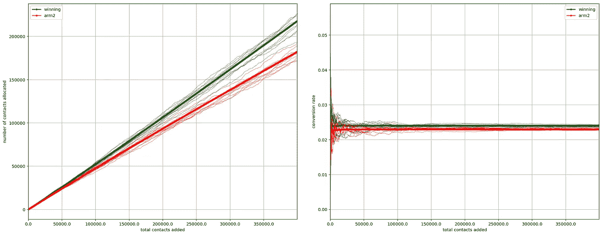***

*****Fig 4.** Example results from a 2-variant UCB-1 simulation (winning variant conv rate: 0.024, losing variant conv rate: 0.023). Left, contact allocation to each variant; Right, avg conversion rate for each variant.***

*****模拟设置*****

***既然我们对每种算法的行为有了一个概念，我们可以将它们的行为与原始的 A/B 测试设置进行比较。我们通过设置以下 5 个模拟来做到这一点。***

***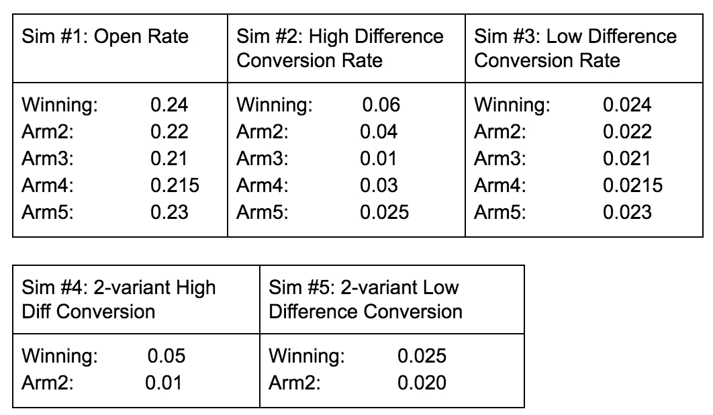***

*****Table 1.** Conversion rates used in simulations***

***前 3 个模拟都包含 5 个变量，每个变量都具有下面列出的固定转换率。为了衡量这些算法在现实情况下的表现，我们在每个模拟中设置了变量的真实转化率，以匹配典型电子邮件营销活动用例中的真实转化率。此外，我们运行了 2 个额外的双变量版本的转换率模拟。表 1 列出了模拟中使用的所有转换率。***

***对于所有模拟，我们进行初始分配步骤，将 200 个联系人平均分配给所有 5 个变量(因为没有先前的结果)。之后，对于每个分配步骤，我们向实验中添加额外的 200 个联系人，根据特定的 MAB 算法进行分配。对于双变量模拟、开放率模拟和高差异转换模拟，我们分别运行了总共 400 步，重复 1000 次。对于低差分转换模拟，我们做了 1000 步和 2000 次重复，以更好地评估算法的行为。在所有情况下，我们对支付的定义都是二进制转换，我们比较的变量是转换率。如果我们使用收入等其他支出定义，结果不会有显著变化。对于所有ε贪婪模拟，ε设置为 0.10。***

***对于每个分配步骤，我们跟踪联系分配、总体表现和统计显著性(2 个变量的 2 比例 z 检验的 p 值，以及 3 个以上变量的卡方偶然检验)。***

*****模拟结果:*****

*   ****联系人分配:****

***对于支出差异较小的模拟(图 5、图 6)，UCB-1 最保守地分配联系(最类似于平均分配)，因为变量性能的差异非常小。与 UCB-1 相比，Thompson Sampling 和 Epsilon Greedy 更加贪婪，为获胜的变体分配了两倍的联系数量。对于低转换 5 变量模拟，在实验的前三分之一，Thompson 采样比 Epsilon Greedy 稍保守，但最终赶上了。***

***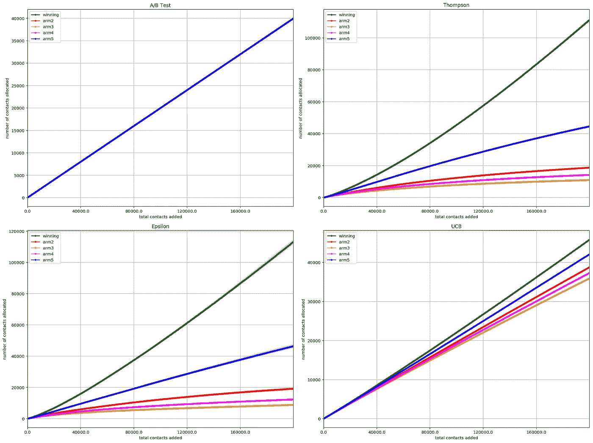***

*****Fig 5.** Average contact allocation from Low-Difference Conversion Rate Simulation***

***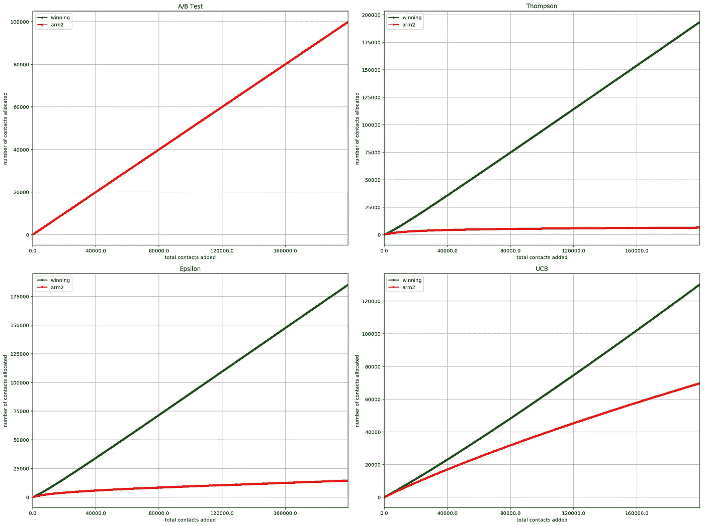***

*****Fig 6\.** Average contact allocation from 2-variant Low-Difference Simulation***

***对于正常打开率(图 7)和高差异(图 8、9)转换率模拟，UCB-1 算法仍然是最保守的算法，而汤普森采样算法是最贪婪的算法。有趣的是，汤普森取样在这些模拟中比在低差模拟中表现得更贪婪。这展示了 Thompson Sampling 在勘探和开发之间进行平衡的能力，在变量之间具有清晰、易于检测的支出差异的情况下，有利于后者。在三个例子中的一个例子中，在模拟结束时，Thompson Sampling 分配给获胜变体的联系是 UCB-1 的近两倍。***

******

*****Fig 7\.** Average contact allocation from open rate simulation***

***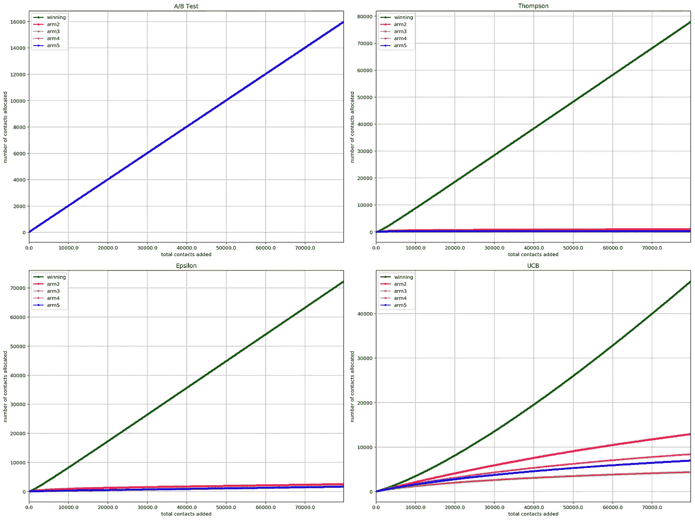***

*****Fig 8.** Average contact allocations from high-difference conversion rate simulations***

******

*****Fig 9\.** Average contact allocations from high-difference two-variant simulations***

*   ****总支出:****

***正如预期的那样，在所有模拟中，所有三种算法都获得了比 A/B 测试设置更高的总体支出，贪婪的算法表现出更好的性能。由于我们预定义的ε为 0.1，Epsilon Greedy 在最困难的情况下(低转换 5 变量)表现优于其他算法。在所有其他四种情况下，Epsilon Greedy 在实验的早期阶段获得了更高的支出，但 Thompson Sampling 始终超过 Epsilon Greedy，随着收集的数据点越来越多(如分配结果所示)，并获得了更高的最终总支出。这再一次展示了在实验的早期阶段，面对不确定性，Thompson 采样如何支持探索，而在实验的后期阶段，仍然能够切换到支持开发。***

***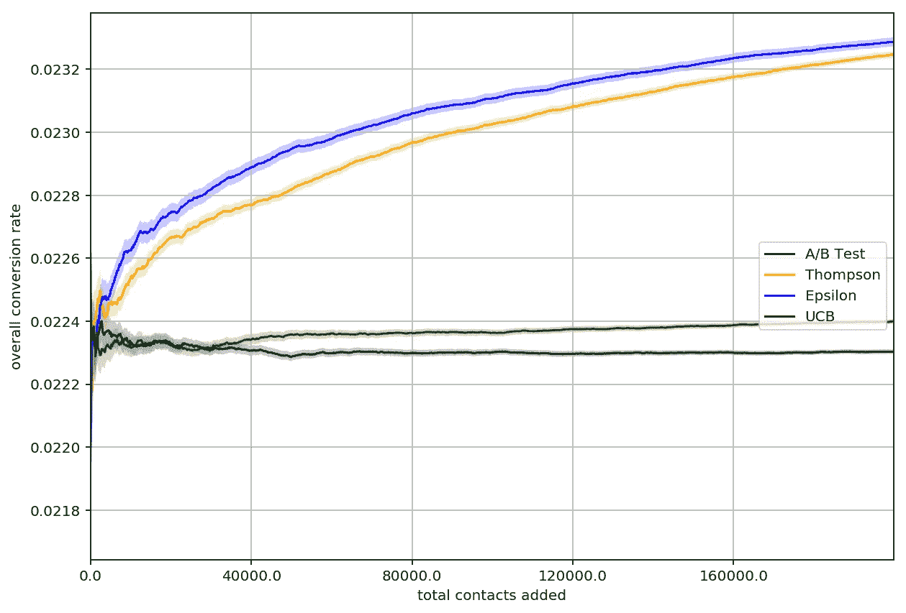***

*****Fig 10\.** Overall payout of low-difference conversion rate simulations***

***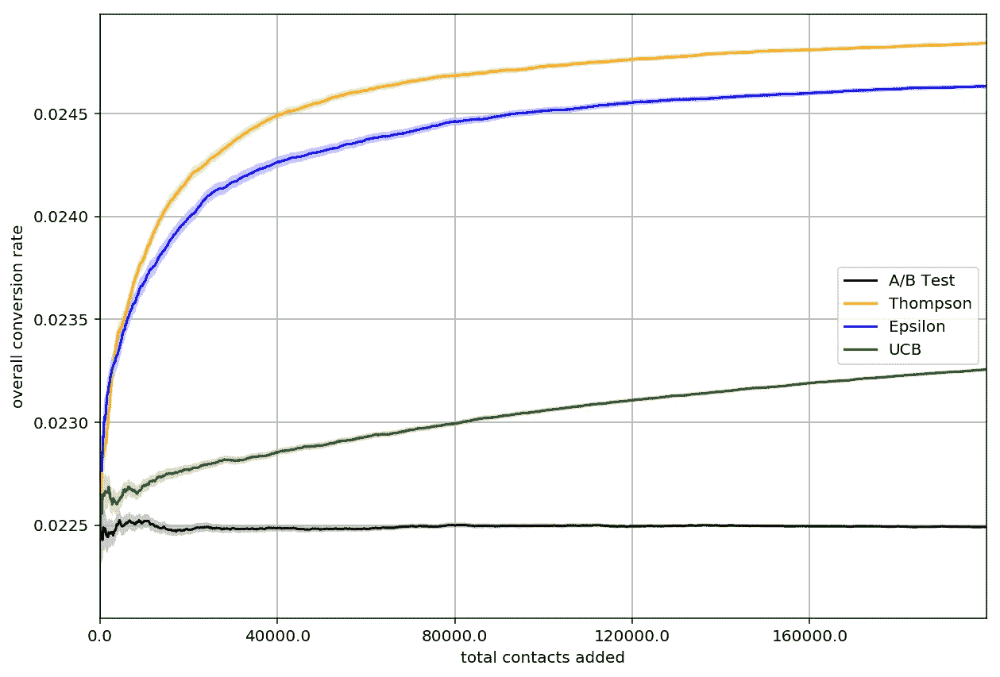***

*****Fig 11.** Overall payout rate for two-variant low-difference simulations***

***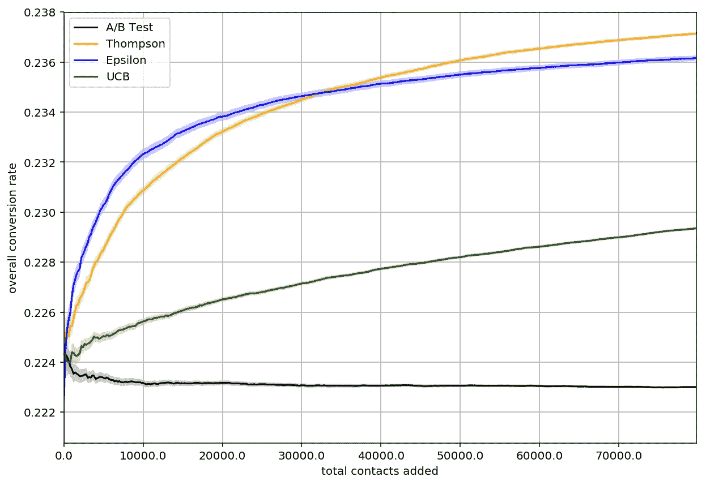***

*****Fig 12.** Overall payout for open-rate simulation***

***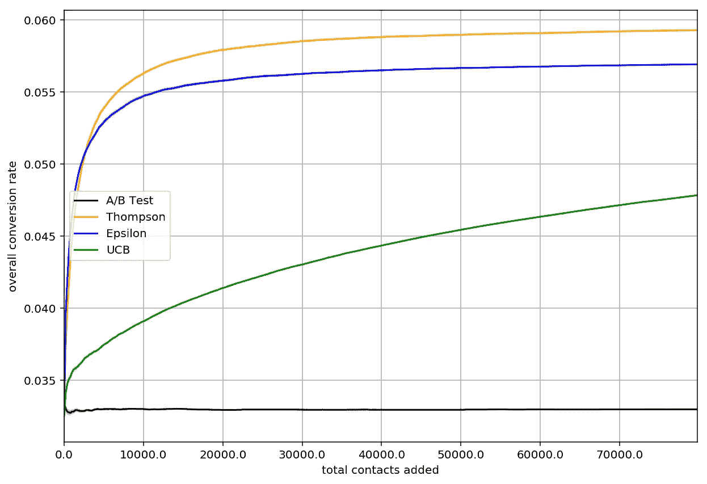***

*****Fig 13.** Overall payout for high-difference conversion rate simulation***

***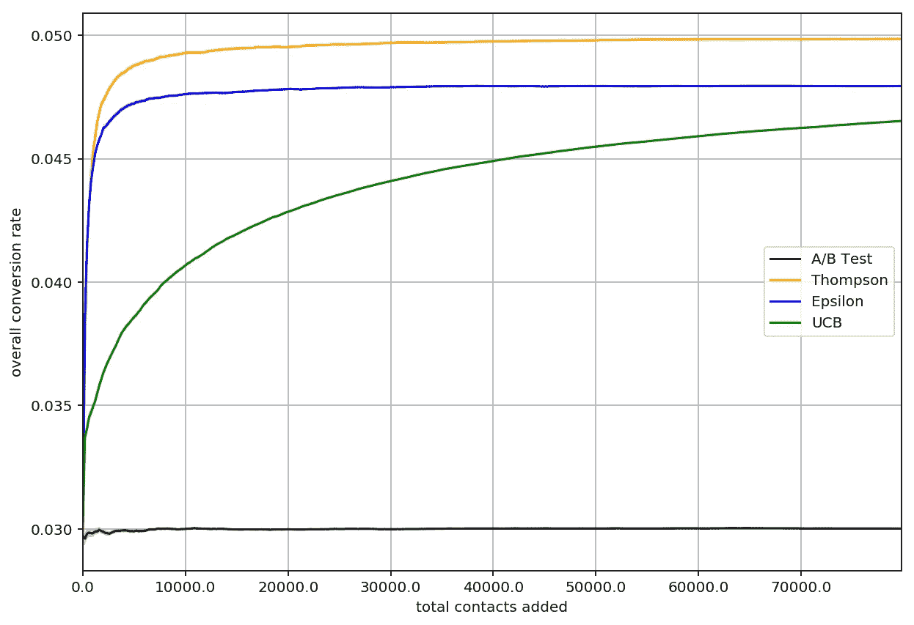***

*****Fig 14.** Overall payout for high-difference two-variant simulation***

*   ****统计显著性:****

***对于所有的模拟，UCB-1 能够达到统计显著性(p <0.05) around the same time (total number of contacts added) as the A/B test set up, despite allocating more contacts to the winning variants and therefore having many fewer data points for the losing variants. Thompson Sampling, interestingly, showed faster reduction of p-value in the early phases of the experiment, but slows down, and eventually falls behind UCB-1 and A/B test simulations when p-values are between 0.1 and 0.05\. This is likely due to the fact that Thompson sampling gets increasingly greedier as the beta distributions become more separated (which typically results in lower p-value). Epsilon greedy, however, did suffer in all cases from not having enough data in losing variants, and did not reach statistical significance until twice the number of data points had been observed. For the low-difference conversion rate simulations (Fig 15), the Epsilon Greedy algorithm could not reach statistical significance even by the end of the experiment.***

******

*****Fig 15.** Statistical significance for low-difference conversion simulations***

***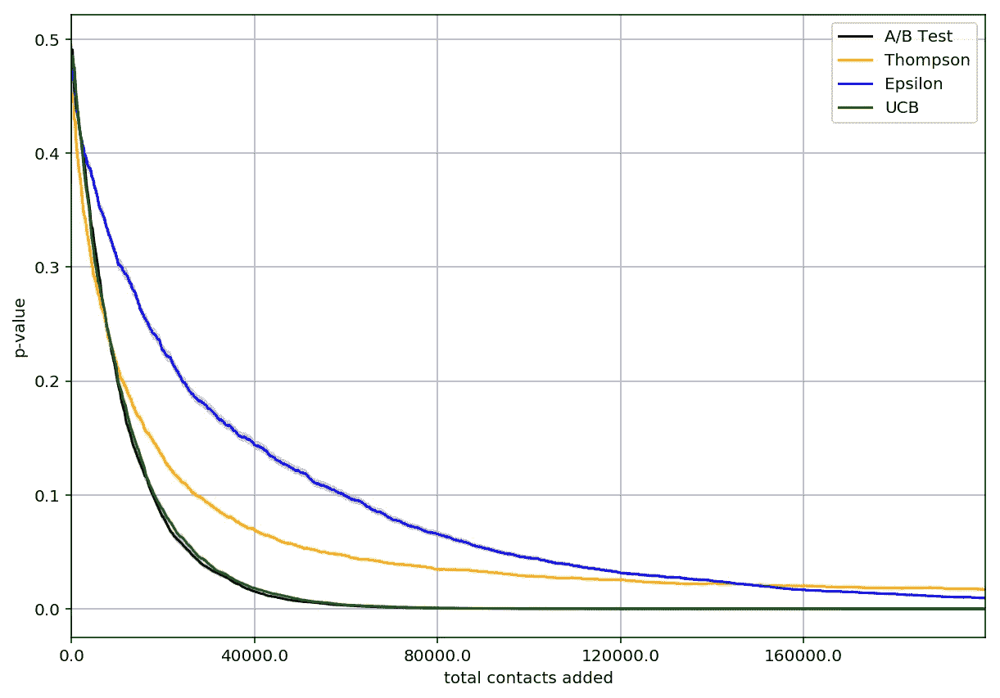***

*****Fig 16\.** Statistical significance for low-difference 2-variant simulations***

***For simulations with high difference, all algorithms reached statistical significance within the duration of the experiments. Similar to the results above, UCB-1 and A/B test reached p <0.05 with the same amount of data, with Thompson Sampling trailing slightly behind, and Epsilon Greedy took the most data points to reach statistical significance.***

***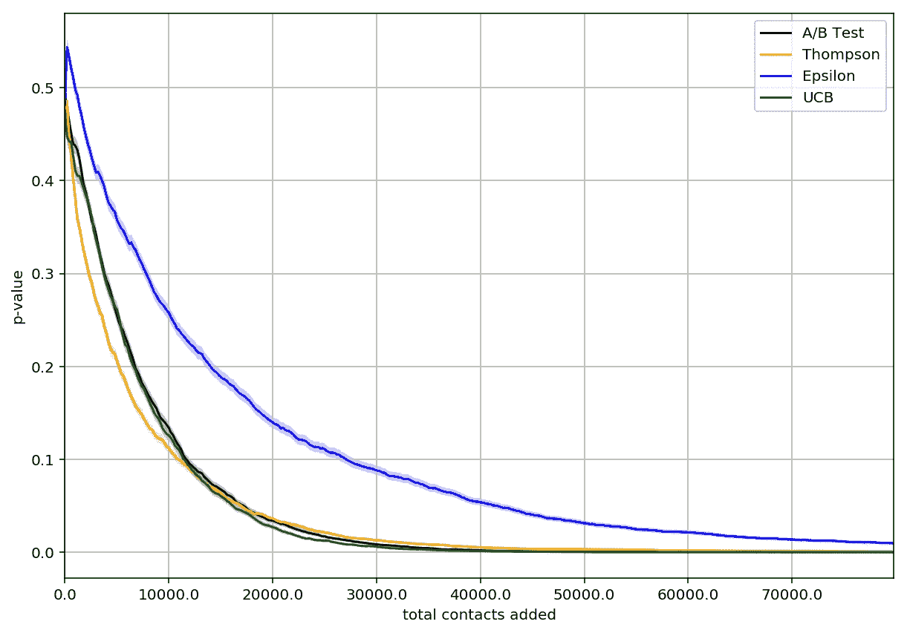***

*****Fig 17\.** Statistical significance for open rate simulations***

***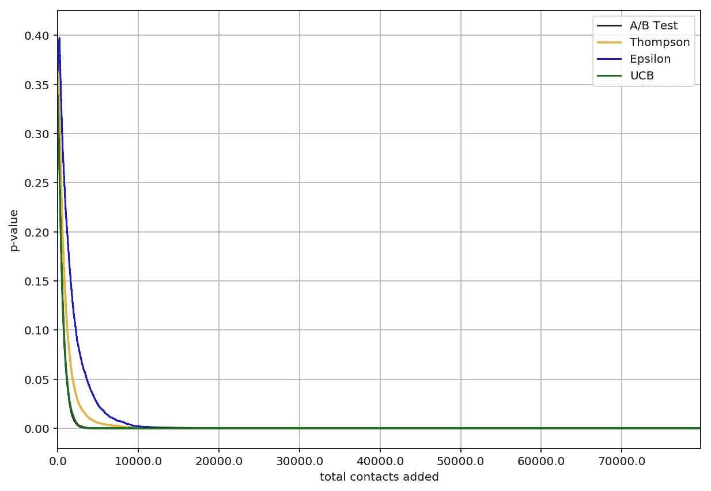***

*****Fig 18\.** Statistical significance for high-difference conversion simulations***

******

*****Fig 19.** Statistical significance for high-difference 2-variant simulations***

*****)*****

***根据这些模拟的结果，我们证明了当需要一个随机控制的实验时，MAB 算法将总是提供一个比 A/B 测试更有利可图的选择。算法的具体选择取决于用户想要优先考虑利润还是数据收集，以及实验的估计大小和持续时间。***

***在极少数情况下，已知被测试的变量之间的支出差异相当大，所有算法将能够在几个数据点内显示变量之间的统计显著差异。在这种情况下，Thompson 采样或贪婪的 Epsilon 贪婪算法成为最大化支出的压倒性赢家。***

***Thompson Sampling 和 UCB-1 都能够优化所有情况下的总支出，同时不牺牲对所有变量的探索，并检测它们之间的统计差异。UCB-1 将产生更类似于 A/B 测试的分配，而汤普森则更适合于最大化长期总体回报。与 Thompson 采样相比，UCB-1 在每个单独的实验中表现得更一致，Thompson 采样由于算法中的随机采样步骤而经历更多的噪声。与 Thompson 采样和 Epsilon Greedy(ε= 0.1)相比，UCB-1 在变体性能方面有很小的差异，这是我们过去看到的典型 A/B 测试结果。当ε设置过低时，Greedy 可以在最佳情况下捕获最大值，但算法的行为也会变得相当不稳定，容易被观察到的转换中的噪声淹没。***

***总之，鉴于其一致性和对数据中噪声的高容忍度，UCB-1 是 MAB 算法在低基础转换率、小效应规模情况下的正确选择。在基线转换率较高或预期效应大小较高的情况下，Thompson 采样可能是更好的选择，此时算法会更稳定。***