# 印度软件开发商与美国、英国、德国和整个世界的比较

> 原文：<https://towardsdatascience.com/comparison-of-software-developers-in-india-with-us-uk-germany-and-the-entire-world-8d2a1ba3218a?source=collection_archive---------5----------------------->

## 我分析了“堆栈溢出调查”( Stack Overflow survey )( T1 ),发现在薪水、年轻人、对新工具的兴趣、对人工智能的看法、道德等方面形成了鲜明的对比..

Photo by [arihant daga](https://unsplash.com/photos/a9KHeyRyFJU?utm_source=unsplash&utm_medium=referral&utm_content=creditCopyText) on [Unsplash](https://unsplash.com/?utm_source=unsplash&utm_medium=referral&utm_content=creditCopyText)

历史上，印度开发人员的工资只是发达国家同行的一小部分。关于这些国家的开发者如何感受到威胁(或者说 T2 没有受到威胁)因为廉价外包给像印度这样的国家而失去潜在的工作机会，已经有很多报道了。

当我看到印度在 2018 年的[堆栈溢出调查中拥有第二大响应者数量，并且该调查有一个关于响应者工资的问题时，我决定亲自看看印度开发人员实际上有多便宜。](https://www.kaggle.com/stackoverflow/stack-overflow-2018-developer-survey)

于是，我画了一些 [KDE 图](https://en.wikipedia.org/wiki/Kernel_density_estimation)对比印度开发者的年薪和全世界开发者的年薪:

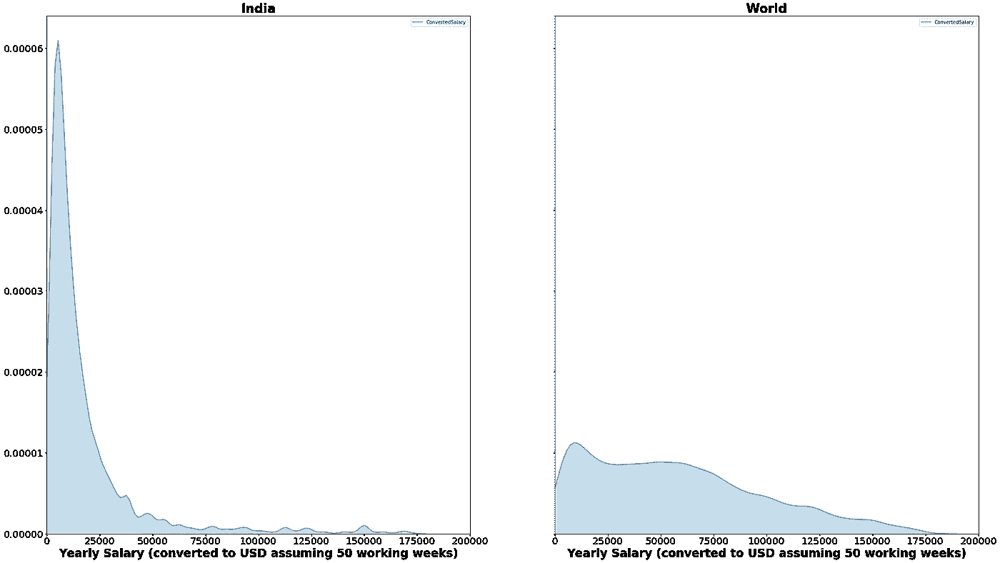

[KDE Plots](https://en.wikipedia.org/wiki/Kernel_density_estimation) for annual salary of developers in India (left) and annual salary of developers all over the world (right)

然后，我为调查中其他三个回复最多的国家，即美国、德国和英国，绘制了类似的图表:

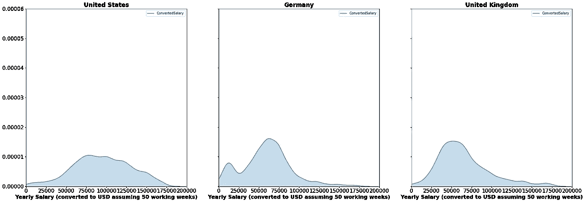

KDE plots for annual salary of developers in United States, Germany and United Kingdom

看到印度开发商的 KDE 地块价格在 0 美元附近大幅上涨了吗？那是我决定彻底钻研这项调查的时候。我想探索是什么让印度开发者如此与众不同。

本次调查*(按降序排列)*收到最多回复的前 5 个国家是:

*   美国
*   印度
*   德国
*   联合王国
*   加拿大

因此，我为调查中的每个问题列出了所有回应者的总体统计数据，然后我将其与仅来自印度的回应者的相应统计数据进行了比较。为了使对比更加明显，我还展示了其他 3 个回复最多的国家——美国、英国和德国。

## 以下是我的发现:

*   大多数来自印度的开发人员的工资比其他发达国家的同行低几个数量级。
*   在编写代码时，没有多少印度人考虑伦理问题。
*   与整个世界或其他前三大响应国家相比，印度拥有 CS 相关领域大学专业的开发人员比例更高。
*   与其他群体相比，印度的开发人员要年轻得多。他们很有竞争力，也很有野心。
*   移动开发在印度有着独特的吸引力。
*   大多数印度人对所有新的假设工具感兴趣。
*   印度开发人员对人工智能的看法与世界其他地区有很大不同——我们更担心工作的自动化，对人工智能做出重要决策感到兴奋，更担心一种奇异类型的情况，而不是世界，并且不太担心算法与人类决策中“公平”定义的演变。
*   许多印度人对开源软件贡献良多，但不认为他们从这样做中学到了什么。

进一步阅读这篇文章，看看可视化和了解更多关于这些结果或检查[我对 Kaggle 的完整报告](https://www.kaggle.com/nityeshaga/how-indian-developers-differ) ( *，如果你喜欢的话请投票支持*)。

我最近才开始接触数据科学，我不确定我在分析中采用的方法是否是最好的(甚至是正确的)。所以，我真的很感激一些关于我做得对/错的反馈/批评😄。

# 关于薪水的更多信息:

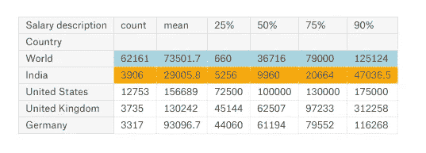

Salary stats — count, mean and the 25th, 50th, 75th and 90th percentiles — for various groups

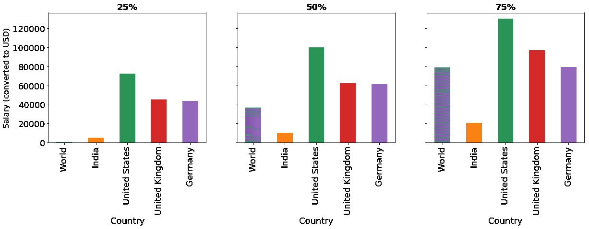

The quartiles for various groups

*   印度开发人员的平均年薪几乎是全球所有开发人员平均年薪的 2.5 倍，几乎是美国平均薪资的 5 倍，几乎是英国平均薪资的 4 倍，几乎是德国平均薪资的 3 倍。
*   超过 50%的印度开发人员年薪不到 1 万美元。
*   全球所有开发人员的年薪中值大约是印度的 3.5 倍。美国的这一比例是英国的 10 倍，德国的 6 倍。

*【****注意*** *我在上面的情节中只包括了有工作的响应者。我还没算过零工资的。]*

> 那么，印度开发人员的工资如此之低是因为他们在 CS 相关领域的教育程度低于其他国家的同行吗？

# 教育:

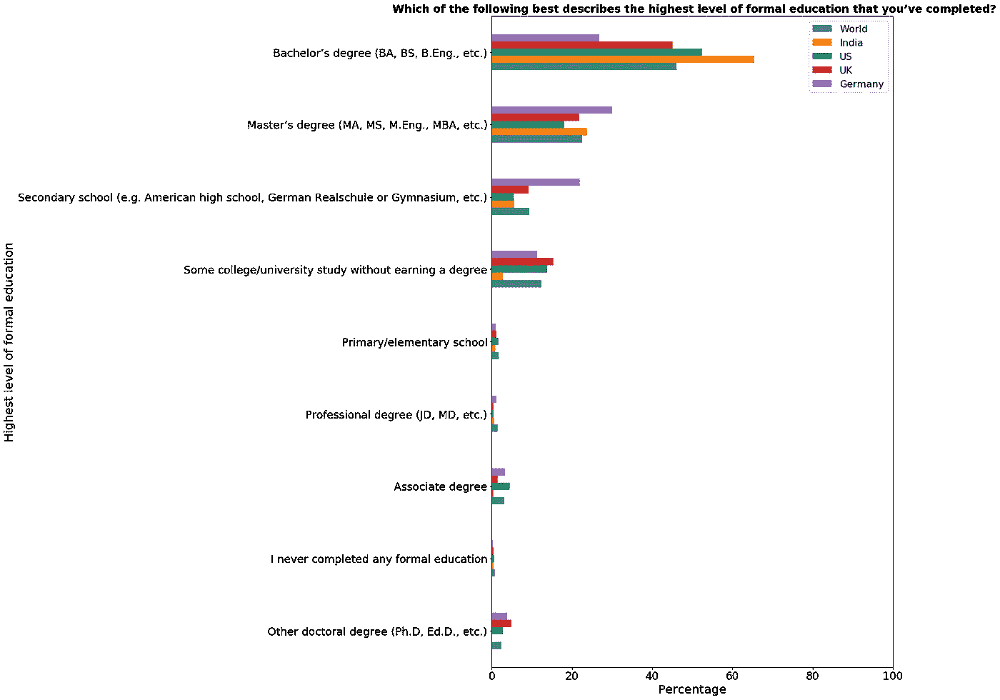

Highest level of education of the responders

*   事实上，印度拥有学士学位的受访者比例高于其他国家。
*   与除德国之外的其他群体相比，拥有硕士学位的应答者比例也较高。
*   印度拥有博士学位(如哲学博士)的应答者比例要小得多。

让我们看看他们主修什么..

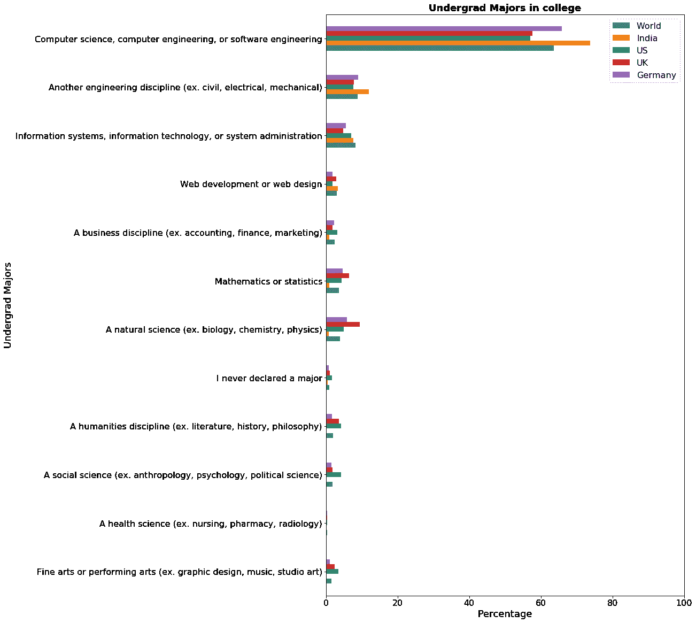

Undergrad majors of responders

*   与其他国家和整个世界相比，印度计算机科学专业学生的比例更高。

> 嗯，我们可以肯定的是，并不是缺少一个正式的计算机科学学位让印度的开发人员找不到高薪工作。

*那什么是？*

也许更大比例的印度开发者并不是出于兴趣而编码，而仅仅是为了挣工资。这可能导致他们产生没有多大价值的次等代码。我们来看看是不是这样..

Does the responder code as a hobby?

> 没有。印度开发者和其他开发者群体一样对编码感兴趣。

但即便如此，很大一部分廉价外包工作是由来自印度的开发者完成的，这是一个现实。那么，为什么如此大比例的印度开发者被挡在高薪职位之外呢？

我认为，生活条件、教育质量和国家经济结构的综合因素阻碍了印度程序员甚至与美国、英国和德国等更发达国家的程序员竞争的能力。

除此之外，你还能如何解释尽管计算机专业学生的比例很高，但工资却很低？

# 年龄和经历

Age of responders

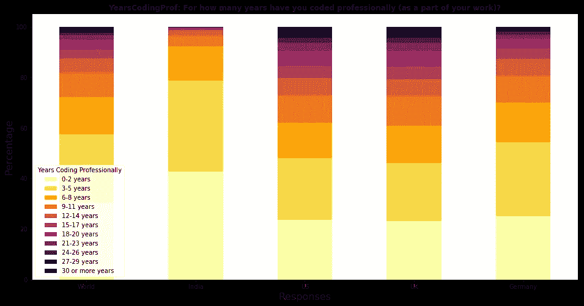

Number of years the responder has been coding professionally

*   约 93%的印度受访者年龄在 18-34 岁之间，而全世界的这一数字为 73%,其他 3 个回复最多的国家甚至更少。
*   如果我们计算拥有 0-5 年专业编程能力的开发人员的百分比，印度超过 78%,而美国约为 48%,英国约为 46%,德国约为 55%,全世界合起来约为 57%。

> **很明显，印度的开发人员非常年轻。**

*我认为，印度和这里考虑的其他群体之间在开发人员年龄和经验上的巨大差异背后的一个主要原因是，作为一个发展中国家，印度接触计算技术的时间比其他国家晚得多。这导致印度在 20 世纪甚至 21 世纪初产生了非常少的程序员。*

这可能导致印度人主要贡献于公司的年轻劳动力，主要从事初级工作，这些工作的报酬可能低于更有经验的职位。这也可能是印度开发人员平均工资低的一个因素。

*这也意味着印度初级开发人员的就业市场异常拥挤，这可能解释了为什么印度开发人员在本质上特别有竞争力..*

## 竞争性

Does the responder feel like he/she is competing with his/her peers

*   超过 50%的印度开发者认为他们正在与同行竞争，另外 25%的开发者对此持中立态度。

# 伦理学

该调查有几个与编码道德相关的问题。

## 不道德准则的责任:

Who do the responders believe is responsible for unethical code

*   虽然所有其他组中几乎 60%的开发人员认为高层管理人员应对不道德的代码负责，但在印度只有 40%的开发人员这样认为。
*   与其他群体的开发人员相比，大部分印度开发人员会认为提出不道德代码想法的人或编写代码的开发人员负有责任。

## 写不道德的代码？

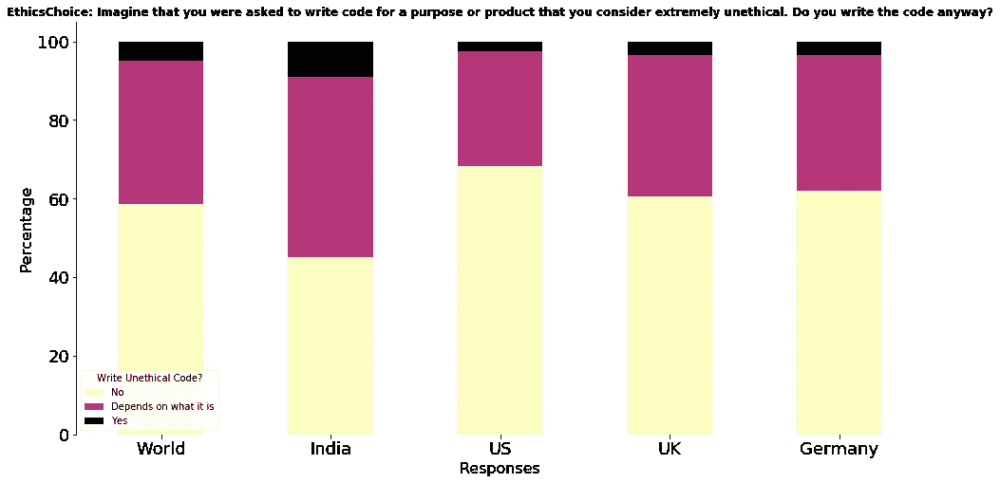

Would the responder write code that he/she considers extremely unethical

*   大多数印度开发者准备写他们自己认为不道德的代码。

## 考虑你的代码的道德含义？

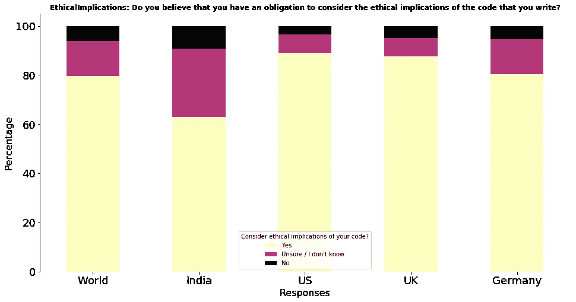

Does the responder believe that he/she has an obligation to consider the ethical implication of the code that he/she writes

*   只有大约 63%的印度回答者认为他们有义务考虑他们编写的代码的道德含义。

> 当你从事低薪工作时，考虑道德问题可能有点困难。
> 
> 想象一下，身处一个失业率高、工资低、就业市场竞争激烈的国家。然后，想象一下，你被要求在你现有的工作中编写一份不道德的代码，或者冒着让你的老板不高兴的风险，并且失去下一次晋升的机会，而你的同事同意这么做，或者甚至冒着丢掉工作的风险！
> 
> 所以我相信，如果一个开发人员同意编写不道德的代码，并不一定意味着他/她是一个不道德的人。有时候，这就像是在偷面包和让家人挨饿之间做出选择一样进退两难。正确的选择并不总是非黑即白。

# 移动应用开发的流行程度:

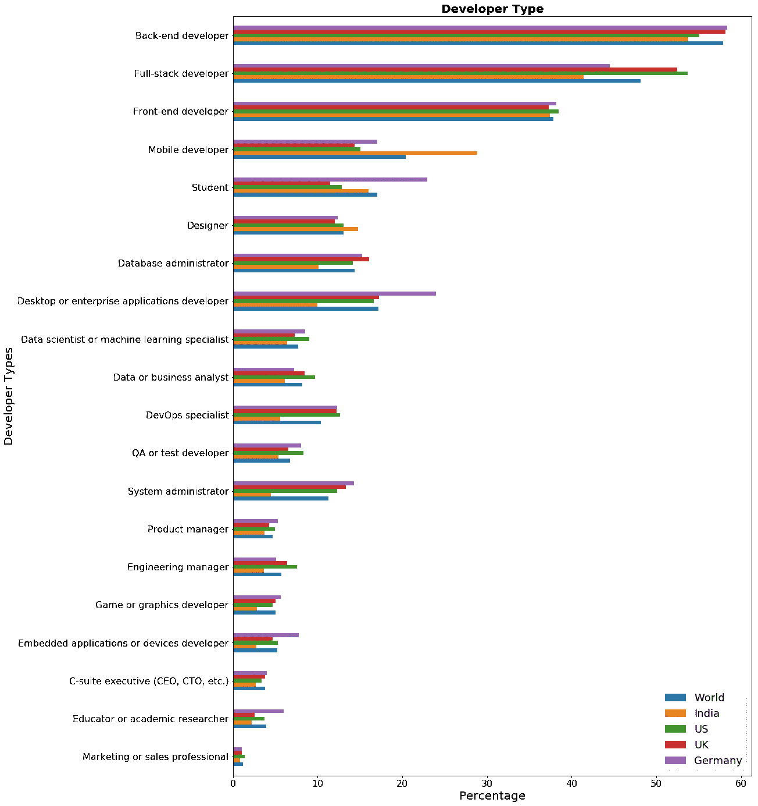

Developer types of the responders

*   我们可以看到，代表印度的橙色条在“移动开发者”类别中非常突出。

事实上，印度拥有全世界最多的移动开发者:

Top 50 countries with the maximum number of mobile developers

大多数印度人可能已经完全跳过了个人电脑革命，转而将智能手机作为他们的第一个个人计算设备。因此，智能手机和移动应用令人兴奋不已。我认为这是我们在印度看到的对移动应用程序开发的兴趣背后的主要原因。

我们还可以看到移动开发的流行对印度开发者选择开发平台的影响..

# 平台

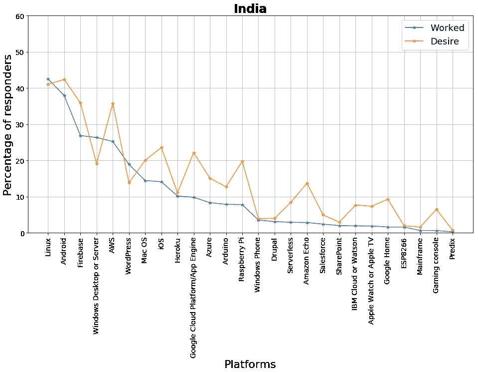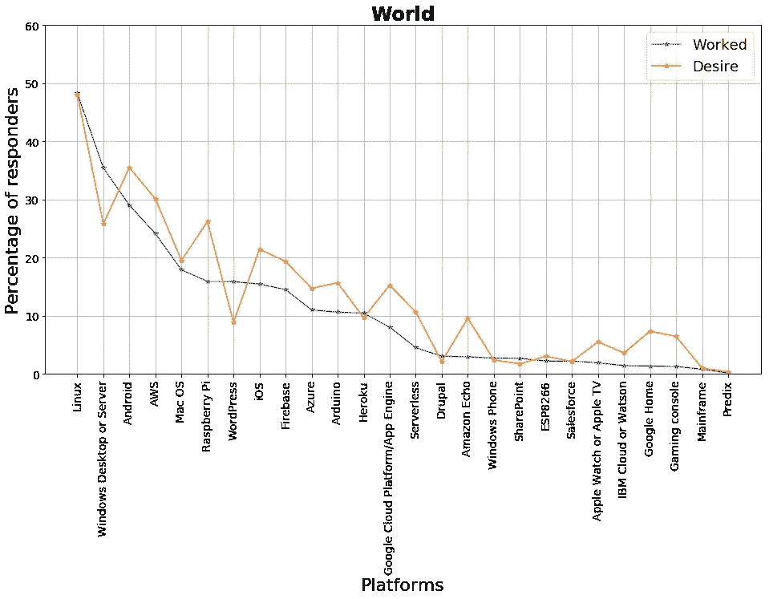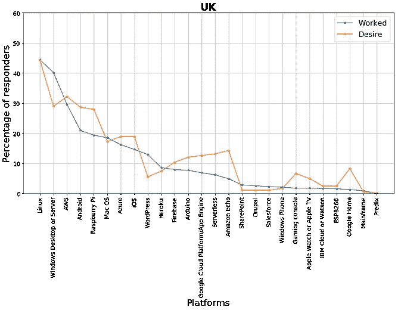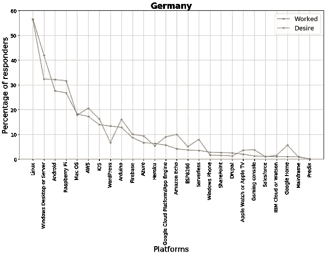

Platform popularity based on the percentage of responders who have worked with it (blue line) and those who desire to work on it next year (orange line); Click on each image in the collage to view an enlarged version

*   ***安卓*和 *Firebase* 是印度最受欢迎的三大平台之一。在印度开发者中，这两个平台的受欢迎程度已经超过了 Windows 桌面或服务器。**
*   而且，对它们的兴趣仍在增长，因为更大比例的开发人员希望明年开发它们！
*   注意 *Firebase* 在上面看到的除印度之外的任何其他组中甚至都没有接近前 3。

# 关于人工智能的看法

该调查有几个与先进的人工智能技术相关的问题。其中两个是:

*   *你认为日益先进的 AI 技术最危险的一面是什么？*
*   *你认为日益先进的 AI 技术最令人兴奋的地方是什么？*

他们两人有相同的选择，即。

*   *做出重要决策的算法*
*   *超越人类智能的人工智能(《奇点》)*
*   *算法与人类决策中“公平”定义的演变*
*   *提高工作的自动化程度*

因此，我为上述每个选项绘制了单独的图表，试图了解大多数响应者是将其视为危险，还是将其视为兴奋的理由:

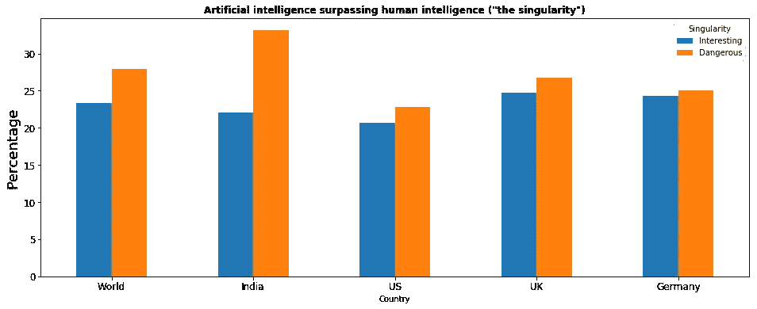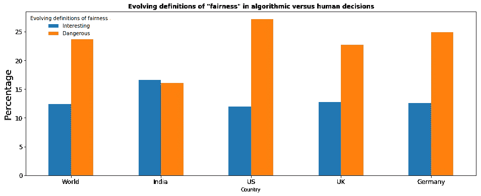

Opinions about AI; click on each image in the collage to enlarge it

*   人工智能可能带来的工作自动化对我们印度人来说并不那么有趣。我们更有可能把它放进危险的“桶”里。这与世界其他地区以及其他 3 个回复最多的国家不同，那里有更大比例的人口对此感兴趣。
*   印度人对人工智能为他们做重要决定的未来比其他 3 个国家或整个世界都更放心。
*   印度人比其他群体更担心“奇点”式的情况。
*   印度人不像其他群体那样担心算法与人类决策中不断演变的“公平”定义。

# 对假设工具的兴趣

Stack Overflow 想知道开发人员社区对哪些新的假想工具感兴趣。它要求受访者从 1 到 5 对四种假设工具进行评级，其中 1 表示“非常感兴趣”，5 表示“完全不感兴趣”。

> 我发现，与世界各地的开发人员或其他前 3 名响应国家的开发人员相比，印度开发人员对 Stack Overflow 团队提出的任何新的假设工具更感兴趣。

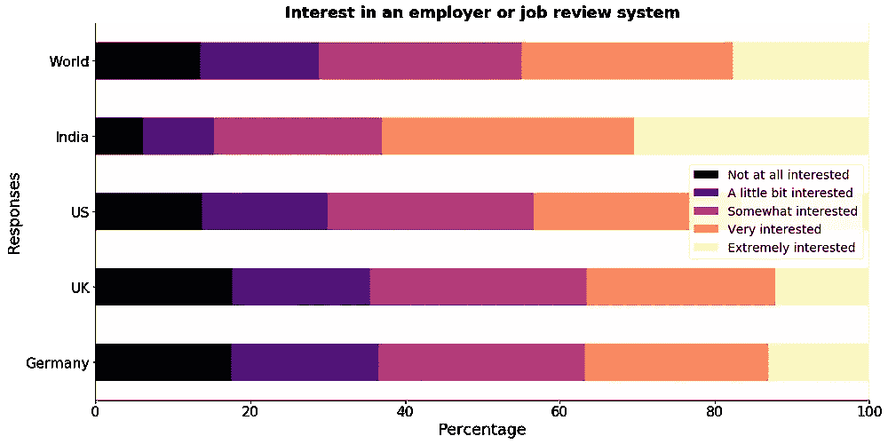

Levels of interest of the responders in new hypothetical tools; click on each image in the collage to enlarge in

我想，也许这种对所有新的假设工具的兴趣是我们之前看到的印度开发者社区年轻时代的结果。因此，我根据他们多年的编码经验对所有的开发人员进行了分组，并计算了每个经验组中属于不同兴趣水平的开发人员的百分比。

以下是代表这些百分比的热图:

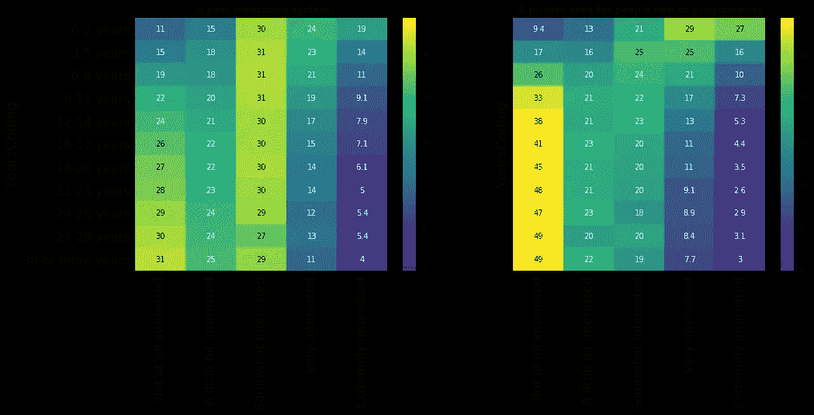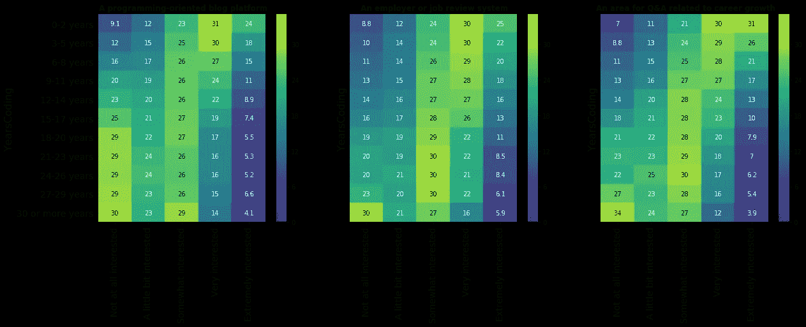

> 很明显，一个人编码的年数和他/她对新的假设工具的兴趣之间有很强的相关性。 **年轻的开发人员往往比年长的开发人员对新的假设工具更感兴趣。**
> 
> **这种反差对于工具——**`**"A private area for people new to programming"**`**(*第一排，第二图*)来说最为醒目。很明显，刚接触编程的年轻开发人员想要一个新手的私人空间。**

*也许吧，其原因是现有的栈溢出可以将***和***为* [*新人*](https://meta.stackexchange.com/questions/9953/could-we-please-be-a-bit-nicer-to-new-users) *。然而，老开发人员对这个工具非常不感兴趣。***

***也许是它的* [*知识的诅咒*](https://en.wikipedia.org/wiki/Curse_of_knowledge) *。或者可能更有经验的开发人员认为现有的工具已经足够好了，因为他们已经在现有的工具上创造了事业。或者，不知何故，他们在该领域的经验对这种工具的成功持悲观态度。***

**无论是什么原因，很明显，如果 Stack Overflow 团队决定继续开发上述任何产品，年轻人更有可能欢迎它，印度可能是一个特别好的国家，可以尝试推出。**

# **开源贡献的奇特之处在于:**

****

**Does the responder contribute to open-source software**

*   **在这项分析中考虑的所有群体中，印度拥有最大比例的开源贡献者。**

**现在，有趣的部分来了..**

**调查中还有另一个问题——**

> **“您使用过或参加过以下哪种非学历教育？请选择所有适用的选项。”**

**这个问题的选项之一是— ***“促成了开源项目”*** *。***

***我认为为开源软件做贡献不仅能帮助社区，还能帮助贡献者的个人成长。因此，做出贡献的人也会在非学位教育下注明。***

**但事实证明并非如此..**

****

*   **虽然大约 50%的印度受访者对开源软件做出了贡献，但只有大约 30%的受访者认为他们从这样做中学到了一些东西。这与考虑在内的整个世界和其他国家形成对比，在这些国家，这两个比率几乎相同。**

**我不知道这是怎么回事。也许这意味着许多为开源项目做贡献的印度人并不经常这样做。让我知道你的想法。**

# **结论**

**在这个分析中，我们看到了印度的软件开发人员与其他国家的软件开发人员不同的各个方面。**

**印度在计算领域起步较晚，正如我们在上面看到的老年开发人员比例较低所证明的那样，但软件开发在当代已经变得非常流行。在印度近代史的大部分时间里，从事信息技术和软件开发已经成为摆脱贫困最可靠的手段。**

**我们也看到这里的开发者意识到了上一次重大科技革命的潜力——移动应用。这让我对我们正在快速赶上充满希望。也许，我们甚至会在定义下一次重大技术革命中发挥关键作用(人工智能中的*，也许是*)。**

**你应该看看我对 Kaggle 的完整分析，了解更多关于印度开发者在自学方法、IDE 使用、编程方法、各种语言和框架的流行程度、广告拦截器的使用、操作系统、堆栈溢出使用等方面的差异。 ***另外，如果你觉得有趣的话，请投上一票或者评论一下*** 。**

**我最近才开始接触数据科学，我不确定我在分析中采用的方法是否是最好的(甚至是正确的)。所以，我真的很感激一些关于我做得对/错的反馈/批评😄。**

# **其他值得探索的想法**

**Jason Goodman 建议，在构建数据科学项目时，[选择你感兴趣的东西](https://medium.com/@jasonkgoodman/advice-on-building-data-portfolio-projects-c5f96d8a0627#fec8)。如果它是你感兴趣的东西，它会更有趣，你更有可能从中找到有趣的角度。**

**我试图通过分析堆栈溢出调查数据来找出来自我的国家的开发人员与其他人的不同之处，从而将这一理念带回家。**

**做这个冗长的分析也让我对其他一些问题感到好奇。所以，我在这里公布了我想问这个数据集的所有问题—**

*   ****人们通过参与开源项目来学习吗？** 我料定人确实如此。但事实证明，并不是所有人都这样(就像我们在这个分析中看到的 20%的印度人)。所以，深入研究这个会很有趣。**
*   ****关于 AI 的观点有哪些不同？在这个内核中，我们看到了印度人对推进人工智能技术的各个方面有着不同的看法。根据年龄、开发人员工作、教育、框架、语言、薪水等在其他组中进行比较会很有趣。****
*   **学生们是怎么想的？
    本次调查的每 5 名回答者中就有 1 名是全日制学生，这意味着我们有大约 20，000 名学生的调查数据。我认为这提供了一个独特的机会来探索下一代软件开发人员中流行的东西(我自己也包括:D)。**
*   ****Vim 用户和非 Vim 用户有什么不同？** 这只是因为我用了 Vim。我爱维姆。制作类似于[这种优秀的 R vs. Python 分析](https://www.kaggle.com/nanomathias/predicting-r-vs-python)会很有趣。**
*   ****一个薪资预测器** Stack Overflow 最近推出了一个[薪资计算器](https://stackoverflow.com/jobs/salary)使用的正是这个数据集。尝试构建一个类似的东西可能会很有趣。**

*****令人兴奋的是，通过分析这个数据集，有可能得出所有这些问题的满意解决方案！*****

**我计划自己探索其中的一些话题。但是如果你觉得上面的问题有意思的话，你可以随意进行你自己的分析。另外，如果你觉得这个分析很有趣，你可以为你自己的国家做一个类似的分析。**

**如果你(/如果你)决定公开你的作品，你可以在评论中给我加标签，或者在 Twitter 上给我发推文，或者在 LinkedIn 上给我发短信，那就太棒了。**

**一定要看看我在 Kaggle 上的完整分析——“印度开发者如何与众不同”。如果你觉得我的分析有趣，如果你能投票支持这个内核，我会非常感激。**

**我正在数据科学和机器学习领域寻找机会。你可以在 [LinkedIn](https://www.linkedin.com/in/nityeshaga/) 或者 [Twitter](https://twitter.com/nityeshaga) 联系我。你可以在`nityeshagarwal[at]gmail[dot]com`给我发邮件。**

**还有，你可以[在 Twitter 上关注我](https://twitter.com/nityeshaga)；我不会给你发垃圾邮件；-)**