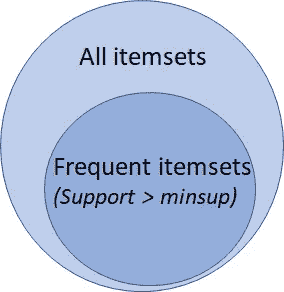
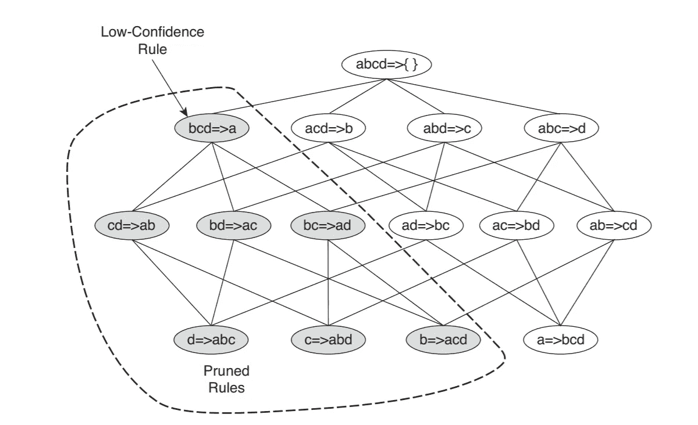
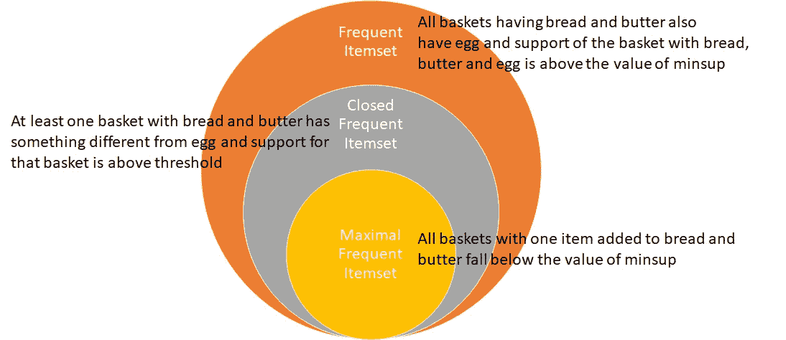

# 关联规则完全指南(2/2)

> 原文：<https://towardsdatascience.com/complete-guide-to-association-rules-2-2-c92072b56c84?source=collection_archive---------4----------------------->

## 帮助您更快、更智能购物的算法

在这篇博客中，我将讨论从交易列表中高效提取关联规则的算法。本博客的第 1 部分涵盖了构成关联规则挖掘基础的术语和概念。这整个概念背后的动机和一些基本术语的含义在那里得到了解释。以下是上一部分中一些术语的简要定义。

1.  关联规则:例如。{X → Y}是在有 X 的篮子上寻找 Y 的表示
2.  项目集:例如。{X，Y}是构成关联规则的所有项目的列表的表示
3.  Support:包含该项集的事务部分
4.  置信度:给定{X},出现{Y}的概率存在
5.  lift:*置信度*与{Y}发生的基线概率之比

现在我们已经熟悉了这些术语，让我们继续从交易列表中提取规则。这个过程的第一步是获得在我们的事务集中至少出现一次的所有项目的列表。

> 挑战在于从大量的关联规则中挖掘出重要的规则，这些关联规则可以从项目列表中导出。

请记住，规则生成是一个两步过程。第一个是生成一个项目集，如{面包，鸡蛋，牛奶}，第二个是从每个项目集生成一个规则，如{面包→鸡蛋，牛奶}，{面包，鸡蛋→牛奶}等。下面将讨论这两个步骤。

## 1.从项目列表生成项目集

产生关联规则的第一步是获得所有的*频繁*项目集，在这些项目集上可以执行二进制划分以获得前件和后件。例如，如果所有交易组合起来有 6 个项目{面包、黄油、鸡蛋、牛奶、笔记本、牙刷}，项目集将看起来像{面包}、{黄油}、{面包、笔记本}、{牛奶、牙刷}、{牛奶、鸡蛋、蔬菜}等。项目集的大小可以从一个项目到我们拥有的项目总数不等。现在，我们只从中寻找*频繁*项集，而不是全部，以便检查生成的总项集的数量。

频繁项集是那些在事务中至少出现最小次数的项集。从技术上讲，这些项目集的*支持*值(包含该项目集的事务部分)高于最小阈值 *minsup* 。

因此，如果{Bread，Notebook}在 100 个事务中只出现 2 次，并且(2/100) = 0.02 低于 minsup 的值，则它可能不是频繁项集。

寻找频繁项目集的强力方法是形成所有可能的项目集，并检查每个项目集的支持值。 ***先验原则*** 有助于使这种搜索高效 ***。*** 它表明

> 频繁项目集的所有子集也必须是频繁的。

这相当于说包含项目{面包，鸡蛋} 的交易数大于或等于包含{面包，鸡蛋，蔬菜} *的交易数。*如果后一种情况发生在 30 笔交易中，前一种情况在所有 30 笔交易中都发生，并且可能会在更多的交易中发生。所以如果{面包，鸡蛋，蔬菜}的支持值即(30/100) = 0.3 高于 minsup，那么我们可以确定{面包，鸡蛋}的支持值即(> 30/100) = > 0.3 也高于 minsup。这被称为支持度的**反单调性质，其中如果我们从一个项目集中删除一个项目，生成的新项目集的支持度值要么相同，要么增加。**

> *先验原则*是支持度反单调性质的结果。

Apriori 原则允许我们删除不满足支持度最小阈值条件的项目集的所有超集。例如，如果{Milk，Notebook}不满足我们的 minsup 阈值，则添加了任何项的项集也不会超过该阈值。

产生的方法论被称为 ***apriori 算法。*** 涉及的步骤有:

Ref: [https://annalyzin.files.wordpress.com/2016/04/association-rules-apriori-tutorial-explanation.gif](https://annalyzin.files.wordpress.com/2016/04/association-rules-apriori-tutorial-explanation.gif)

生成只有一个项目的所有频繁项目集(支持≥ minsup)。接下来，生成长度为 2 的项集，作为上述项集的所有可能组合。然后，删除那些支持值低于最小支持值的。

现在，将长度为 3 的项集生成为长度为 2 的项集的所有可能组合(修剪后保留下来),并对支持值执行相同的检查。

我们像这样不断增加项目集的长度，并在每一步检查阈值。

从图中可以看出，修剪非频繁项集可以将需要考虑的项集数量减少一半以上！随着项目数量的增加，计算能力降低的比例变得越来越显著。

这个比例还取决于我们选取的最小支持阈值(minsup ),它完全是对当前问题的主观判断，可以基于过去的经验。

## 2.从频繁项目集生成所有可能的规则

一旦产生了频繁项集，从中找出规则相对来说就不那么费力了。规则是通过对每个项目集进行二进制划分形成的。如果{面包，鸡蛋，牛奶，黄油}是频繁项目集，候选规则将如下所示:

(鸡蛋，牛奶，黄油→面包)，(面包，牛奶，黄油→鸡蛋)，(面包，鸡蛋→牛奶，黄油)，(鸡蛋，牛奶→面包，黄油)，(黄油→面包，鸡蛋，牛奶)

从所有可能的候选规则列表中，我们的目标是识别出低于最低置信水平 *(minconf)的规则。*和支持度的反单调性质一样，从同一个项目集 *生成的规则* ***的*置信度也遵循一个反单调性质*。它相对于结果项中的元素数是反单调的。***

这意味着(A，B，C→ D) ≥ (B，C → A，D) ≥ (C → A，B，D)的置信度。提醒一下，对{X → Y}的信心=支持{X，Y }/支持{X}

正如我们所知，从相同项目集生成的所有规则的支持度保持不变，差异仅发生在置信度的分母计算中。随着 X 中项目数量的减少，支持度{X}增加(根据支持度的反单调性质),因此置信度值减少。

对上述内容的直观解释如下。考虑 F1 和 F2:

F1 =既有(黄油)又有(鸡蛋、牛奶、面包)的交易比例

将会有很多有黄油的交易，而鸡蛋、牛奶和面包这三者将只能在其中的一小部分中找到位置。

F2 =有(牛奶、黄油、面包)也有(鸡蛋)的交易的比例

牛奶、黄油和面包三者都有(相比之下只有黄油)的交易将会很少，而且很有可能会有鸡蛋。

所以会观察到 F1 < F2\. Using this property of confidence, pruning is done in a similar way as was done while looking for frequent itemsets. It is illustrated in the figure below.

Ref: [https://www-users.cs.umn.edu/~kumar001/dmbook/ch6.pdf](https://www-users.cs.umn.edu/~kumar001/dmbook/ch6.pdf)

We start with a frequent itemset {a,b,c,d} and start forming rules with just one consequent. Remove the rules failing to satisfy the minconf condition. Now, start forming rules using a combination of consequents from the remaining ones. Keep repeating until only one item is left on antecedent. This process has to be done for all frequent itemsets.

Here again, minimum confidence threshold that we pick up is completely subjective to the problem at hand.

With these two steps, we have identified a set of association rules which satisfy both the minimum support and minimum confidence condition. The number of such rules obtained will vary with the values of *minsup* 和 *minconf* 。现在，可以搜索这样生成的规则子集，以获得 lift 的最高值，从而做出业务决策。R 中有一些构建良好的库，通过将 minsup 和 minconf 作为参数放入事务中来获取关联规则。它们还提供了可视化的能力。本文[这里](https://www.analyticsvidhya.com/blog/2017/08/mining-frequent-items-using-apriori-algorithm/)用代码一步一步的讨论整个过程。

在结束之前，我将引入两个术语，最大频繁项集和闭频繁项集，它们是所有频繁项集的紧凑表示。

**最大频繁项集:** *它是一个其直接超集都不频繁的频繁项集*。这就像一个频繁项集 X，其中不能添加任何项 y，因此{X，y}仍然高于 minsup 阈值。

Different cases for itemset {Bread, Butter}

**闭频繁项集** : *它是一个不存在与项集*具有相同支持度的超集的频繁项集。考虑一个项目集 X，如果 X 的所有出现都伴随着 Y 的出现，那么 X 不是闭集。*(例如参考下图)*

> 最大频繁项目集是有价值的，因为它们是频繁项目集的最紧凑的表示形式。

所有的频繁项集都可以导出为最大频繁项集的子集。然而，关于子集支持的信息丢失了。如果该值是必需的，则闭频繁项集是表示所有频繁项集的另一种方式。

> 封闭项集有助于删除一些冗余项集，同时不会丢失有关支持值的信息。

从封闭项集计算非封闭项集的支持值是另一种算法，其细节不在本文讨论范围之内。

我试图通过这篇博客涵盖所有与关联规则挖掘相关的重要术语和概念，并在必要时详细介绍。以下是该过程中引入几个术语一行摘要——

1.  关联规则挖掘:(1)项目集生成，(2)规则生成
2.  先验原则:频繁项目集的所有子集也必须是频繁的
3.  Apriori 算法:剪枝以有效获取所有频繁项集
4.  最大频繁项目集:没有一个直接超集是频繁的
5.  封闭频繁项集:没有一个直接超集具有相同的支持值

我希望你喜欢读这篇文章，并且比以前有更清晰的思路。如果您有兴趣阅读更多详细信息，请参考[该](https://www-users.cs.umn.edu/~kumar001/dmbook/ch6.pdf)资源。通过评论让我知道你的想法/问题。

如果你还没有阅读第一篇博客[中的介绍，请在这里](/association-rules-2-aa9a77241654)阅读！