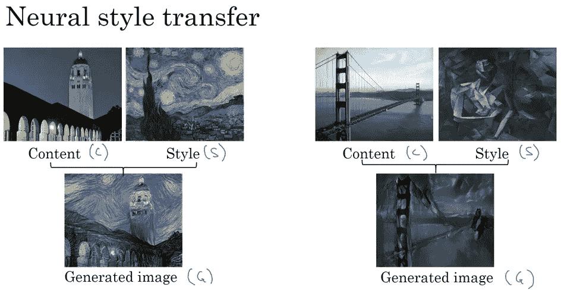

# 吴恩达的计算机视觉——11 个教训

> 原文：<https://towardsdatascience.com/computer-vision-by-andrew-ng-11-lessons-learned-7d05c18a6999?source=collection_archive---------0----------------------->

我最近在 Coursera 上完成了吴恩达的计算机视觉课程。Ng 在解释优化任何计算机视觉任务所需的许多复杂想法方面做得非常出色。本课程中我最喜欢的部分是神经风格转换部分(见第 11 课)，它允许你创作结合了克劳德·莫奈风格和你喜欢的任何图像内容的艺术品。这是一个你能做什么的例子:


在这篇文章中，我将讨论我在课程中学到的 11 个关键教训。注意，这是 deeplearning.ai 发布的深度学习专业化中的第四门课程，如果你想了解前 3 门课程，我建议你看看这个博客[。](/deep-learning-specialization-by-andrew-ng-21-lessons-learned-15ffaaef627c)

## 第一课:为什么计算机视觉正在腾飞？

大数据和算法的发展将导致智能系统的测试误差收敛到贝叶斯最优误差。这将导致 AI 在所有领域超越人类水平的表现，包括自然感知任务。TensorFlow 的开源软件允许您使用迁移学习非常快速地实现任何对象的对象检测系统。使用迁移学习，你只需要 100-500 个例子，这个系统就能相对良好地工作。手动标记 100 个例子并不是太多的工作，所以你很快就会有一个最小的可行产品。

## 第二课:卷积如何工作？

Ng 解释了如何实现卷积运算符，并展示了它如何检测图像中的边缘。他还解释了其他滤波器，如 Sobel 滤波器，它将更多的权重放在边缘的中心像素上。Ng 接着解释说，滤波器的权重不应该手动设计，而应该使用爬山算法(如梯度下降)来学习。

## 第三课:为什么是卷积？

Ng 给出了卷积在图像识别任务中如此有效的几个哲学原因。他概述了两个具体原因。第一种称为参数共享。它的思想是，在图像的一部分有用的特征检测器可能在图像的另一部分也有用。例如，边缘检测器可能在图像的许多部分都有用。参数的共享允许参数的数量较小，并且还允许稳健的平移不变性。平移不变性是这样一个概念，一只猫移动和旋转后仍然是一只猫的图片。

他概述的第二个观点被称为连接稀疏。这意味着每个输出层只是少量输入(特别是滤波器大小的平方)的函数。这大大减少了网络中的参数数量，并允许更快的训练。

## 第三课:为什么填充？

填充通常用于保持输入大小(即输入和输出的维度相同)。它还用于使靠近图像边缘的帧与靠近中心的帧对输出的贡献一样大。

## 第 4 课:为什么是最大池？

通过实证研究，最大池已被证明是非常有效的 CNN 的。通过对图像进行下采样，我们减少了参数的数量，这使得特征对于尺度或方向变化是不变的。

## 第 5 课:经典网络架构

Ng 展示了 3 种经典网络架构，包括 LeNet-5、AlexNet 和 VGG-16。他提出的主要观点是，有效的网络通常具有通道尺寸增加、宽度和高度减小的层。

## 第六课:ResNets 为什么有效？

对于平面网络，由于梯度的消失和爆炸，训练误差不会随着层数的增加而单调减小。这些网络具有前馈跳过连接，这允许您在不降低性能的情况下训练非常大的网络。


## 第七课:使用迁移学习！

在 GPU 上从头开始训练大型网络(如 inception)可能需要数周时间。您应该从预训练的网络中下载权重，并只重新训练最后一个 softmax 层(或最后几层)。这将大大减少培训时间。这样做的原因是早期的图层往往与所有图像中的概念相关联，例如边缘和曲线。

## 第八课:如何赢得计算机视觉竞赛

Ng 解释说，你应该独立地训练几个网络，并平均它们的输出，以获得更好的性能。诸如随机裁剪图像、围绕水平和垂直轴翻转图像等数据增强技术也可能有助于提高性能。最后，您应该使用一个开源的实现和预训练的模型来开始，然后为您的特定应用程序微调参数。

## 第 9 课:如何实现对象检测

Ng 首先解释了图像中地标检测的概念。基本上，这些地标成为你的训练输出例子的一部分。通过一些巧妙的卷积操作，你可以得到一个输出体积，告诉你物体在某个区域的概率以及物体的位置。他还解释了如何使用并集上的交集公式来评估对象检测算法的有效性。最后，Ng 将所有这些要素放在一起解释了著名的 YOLO 算法。

## 第十课:如何实现人脸识别

面部识别是一次性学习问题，因为你可能只有一个示例图像来识别人。解决方案是学习给出两幅图像之间差异程度的相似性函数。因此，如果图像是同一个人的，您希望该函数输出一个小数字，反之亦然。

Ng 给出的第一个解决方案被称为“连体网络”。这个想法是将两个人分别输入到同一个网络中，然后比较他们的输出。如果输出是相似的，那么这些人可能是相同的。训练网络，使得如果两个输入图像是同一个人，则它们的编码之间的距离相对较小。

他给出的第二个解决方案使用了三重态损失法。这个想法是，你有一个三个一组的图像(锚(A)，积极(P)和消极(N))，你训练网络，使 A 和 P 之间的输出距离比 A 和 N 之间的距离小得多。


## 第十一课:如何使用神经风格转移来创作艺术品

Ng 解释了如何生成内容和风格相结合的图像。参见下面的例子。



神经类型转移的关键是理解卷积网络中每一层所学内容的视觉表示。原来，早期的图层学习简单的特征，如边缘，而后期的特征学习复杂的对象，如人脸，脚和汽车。

为了构建神经风格转移图像，您只需定义一个成本函数，它是内容和风格相似性的凸组合。特别地，成本函数将是:

```
J(G) = alpha * J_content(C,G) + beta * J_style(S,G)
```

其中 G 是生成的图像，C 是内容图像，S 是样式图像。学习算法简单地使用梯度下降来最小化关于生成的图像 g 的成本函数

步骤如下:

1.  随机生成 G。
2.  用梯度下降法使 J(G)最小，即写出 G := G-dG(J(G))。
3.  重复步骤 2。

## 结论

通过完成本课程，你将对大量的计算机视觉文献有一个直观的了解。家庭作业也给了你实践这些想法的机会。完成本课程后，你不会成为计算机视觉方面的专家，但本课程可能会启动你在计算机视觉方面的潜在想法/职业。

如果你有任何有趣的计算机视觉应用想分享，请在下面的评论中告诉我。我很乐意讨论新项目的潜在合作。

这就是所有人——如果你已经做到了这一步，请在下面评论并在 [LinkedIn](https://www.linkedin.com/in/ryanshrott/) 上添加我。

我的 Github 是这里的。