# 医学图像的计算机视觉特征提取 101 第 3 部分:高斯差分和高斯拉普拉斯算子

> 原文：<https://towardsdatascience.com/computer-vision-feature-extraction-101-on-medical-images-part-3-difference-of-gaussian-and-b3cbe5c37415?source=collection_archive---------2----------------------->

Gif from this [website](https://giphy.com/gifs/3d-tech-computer-vision-149IkRic68poYw/download)

这是我试图回忆我在计算机视觉中学到的东西的另一个帖子。由于这是期末考试季节，我真的不想做一些疯狂的事情，因此狗和日志过滤器。

如果你[想看第一部分](/computer-vision-feature-extraction-101-on-medical-images-part-1-edge-detection-sharpening-42ab8ef0a7cd)，请点击这里；如果你[想看第二部分](/computer-vision-feature-extraction-101-on-medical-images-part-2-identity-translation-scaling-90d160bcd41e)，请点击这里。

此外，这是我们将要使用的公开可用数据的列表。
1。 [*乳腺癌细胞来自 UCSB 生物分割基准数据集*](https://bioimage.ucsb.edu/research/bio-segmentation)
2。 [*细胞 2D 来自 UCSB 生物分割基准数据集*](https://bioimage.ucsb.edu/research/bio-segmentation)
3。 [*驱动:用于血管提取的数字视网膜图像*](http://www.isi.uu.nl/Research/Databases/DRIVE/download.php)
4。 [*超声波神经分割从 kaggle 数据集*](https://www.kaggle.com/c/ultrasound-nerve-segmentation)
5。 [*脑部核磁共振来自 pixabay*](https://pixabay.com/en/mri-magnetic-x-ray-skull-head-782459/)
6。 [*脑 MRI 来自 pixabay*](https://pixabay.com/en/mri-magnetic-x-ray-skull-head-782457/)
7。 [*来自 pixabay 的自然图像*](https://pixabay.com/en/sunset-lighthouse-dawn-dusk-sun-3120484/)

请注意，这个帖子是给未来的自己回过头来看资料的。

**2D 卷积**

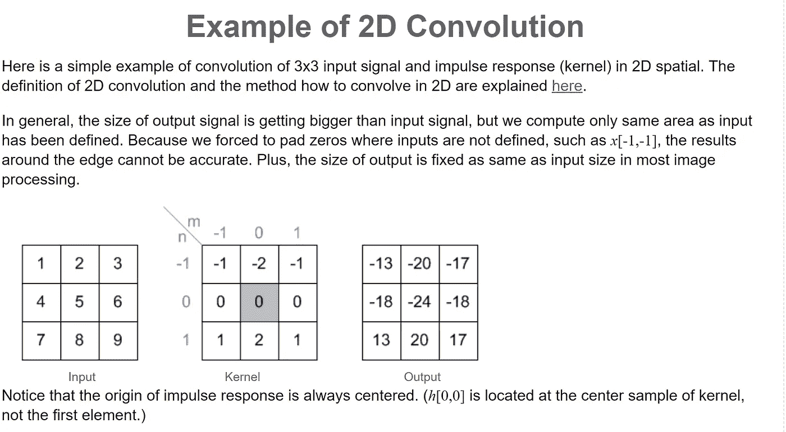

Image from this [website](http://www.songho.ca/dsp/convolution/convolution2d_example.html)

**卷积是对两个*)**【f 和 g】进行一个* [*的数学运算*](https://en.wikipedia.org/wiki/Operation_(mathematics)) *产生第三个函数，也就是通常被视为原始函数之一的修改版，赋予* [*的积分逐点将两个函数的*](https://en.wikipedia.org/wiki/Pointwise) *相乘作为其中一个函数的量***

**2D 卷积运算是计算机视觉的核心，因为这是我们在这篇文章中要用到的主要运算，所以请确保你理解这个概念。如果您需要帮助，请[单击此处查看](http://www.songho.ca/dsp/convolution/convolution2d_example.html)由 [Song Ho Ahn](mailto:song.ahn@gmail.com) 提供的 2D 卷积运算的分步示例。**

****原始图像****

************************

****左上** → [*来自 UCSB 的乳腺癌细胞生物分割基准*](https://bioimage.ucsb.edu/research/bio-segmentation)
**中上** → [*来自 UCSB 的细胞 2D 生物分割基准数据集*](https://bioimage.ucsb.edu/research/bio-segmentation)
**右上** → [*驱动:用于血管提取的数字视网膜图像*](http://www.isi.uu.nl/Research/Databases/DRIVE/download.php)
**左下** → [*来自 kaggle 数据集的超声神经分割【图*](https://www.kaggle.com/c/ultrasound-nerve-segmentation)**

**在我们对这些图像做任何事情之前，让我们实际上看看每个图像看起来像什么，最后下面是我们的[自然图像](http://Natural Image from pixabay)看起来像什么。**

****

****高斯差分****

**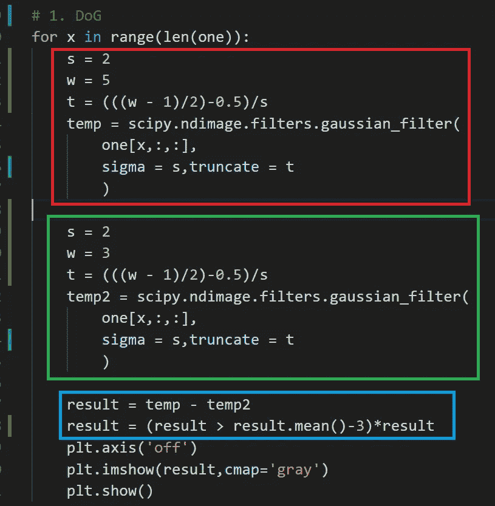**

****红框** →与原高斯图像进行卷积运算 1
**绿框** →与原高斯图像进行卷积运算 2
**蓝框** →将上述两部分图像相减，并设定阈值。**

> ****请注意**我们实际上需要找到过零事件，而不是设置硬阈值。但是为了简单起见，我使用了一个阈值。**

**顾名思义，高斯差分非常简单。只需用不同的高斯核对图像进行卷积，在上面的例子中，我们选择使用两个不同窗口大小的不同高斯滤波器。然后彼此相减，并设置一个阈值来过滤掉强度较弱的像素。**

****

**Image from this [website](http://fourier.eng.hmc.edu/e161/lectures/gradient/node9.html).**

****红框** →与高斯原图像的卷积运算 1
**绿框** →与高斯原图像的卷积运算 2
**蓝框** →减去以上两部分图像**

**除了阈值，上面的图片很好地解释了一步一步的教程。**

**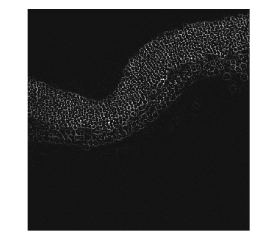********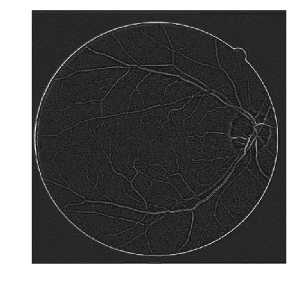********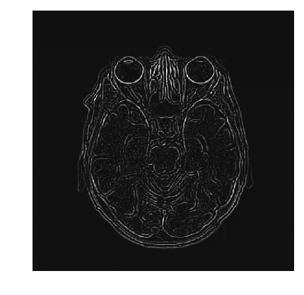****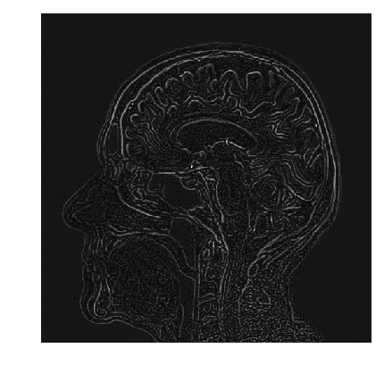****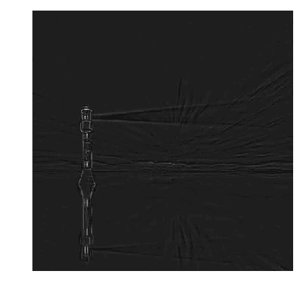**

****高斯 v2 的差值****

**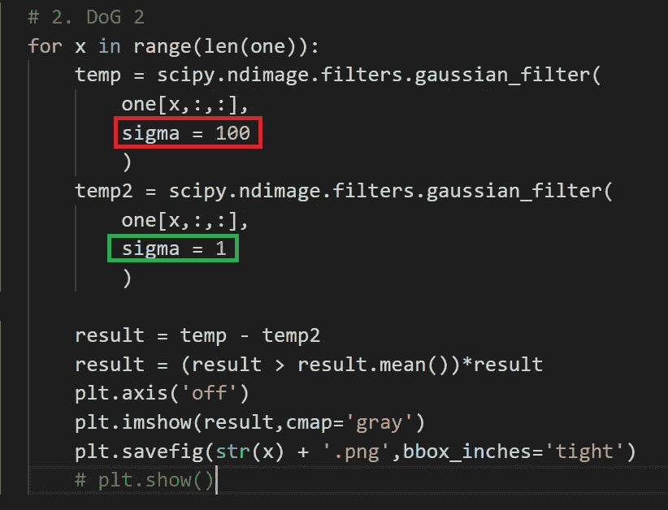**

****红框** →选择 sigma 值为 100 的高斯核
绿框 →选择 sigma 值为 1 的高斯核**

**如上所述，为高斯核选择完全不同的 sigma 值会产生可怕的结果。(我只是想试试这些好玩的。)**

******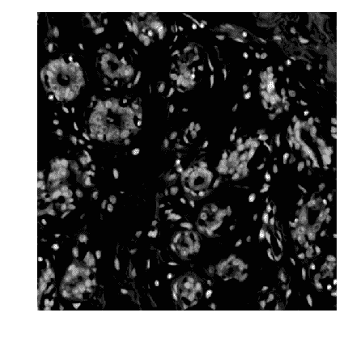********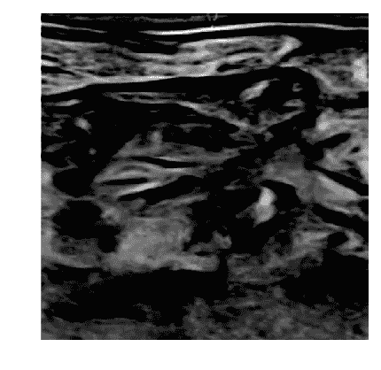****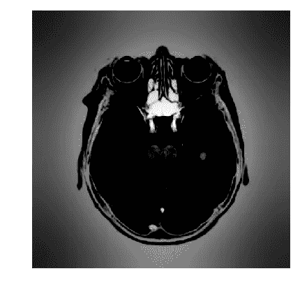****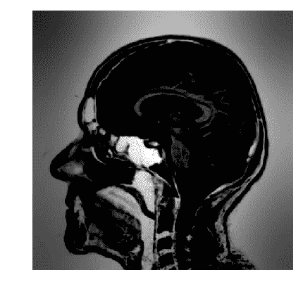****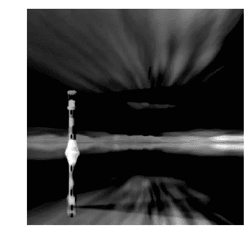**

****高斯拉普拉斯算子(带平滑)****

****

****红框** →使用高斯滤波器平滑图像
**绿框** →创建拉普拉斯滤波器进行卷积运算。**

***图像的拉普拉斯算子突出了快速强度变化的区域，因此经常用于边缘检测(参见* [*零交叉边缘检测器*](https://homepages.inf.ed.ac.uk/rbf/HIPR2/zeros.htm) *)。拉普拉斯算子通常被应用于首先用近似* [*高斯平滑滤波器*](https://homepages.inf.ed.ac.uk/rbf/HIPR2/gsmooth.htm) *平滑的图像，以降低其对噪声的敏感性。*——[引自本网](https://homepages.inf.ed.ac.uk/rbf/HIPR2/log.htm)**

**从上面的陈述中，我们已经可以知道，在做任何事情之前，我们需要首先平滑图像。让我们假设我们已经平滑了图像，看看我们下一步应该做什么。**

****

**Image from this [website](https://homepages.inf.ed.ac.uk/rbf/HIPR2/log.htm)**

**现在我们知道，我们只需要使用其中一个内核来执行卷积，我将使用左边的内核。**

**************************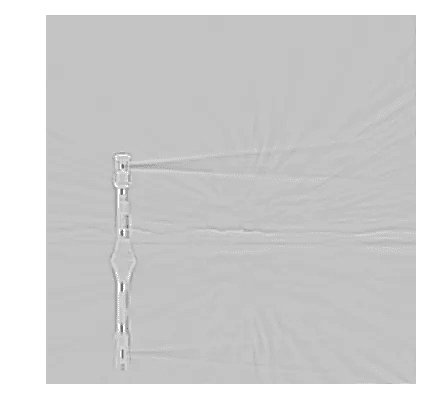**

****高斯的拉普拉斯算子(无平滑)****

**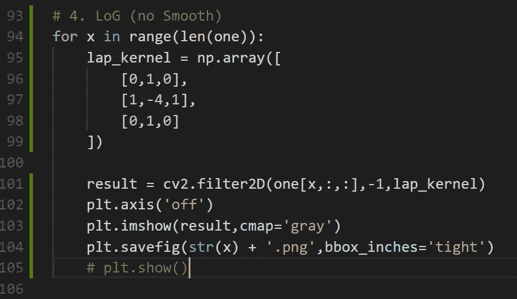**

**现在我听说高斯的拉普拉斯对噪声敏感，我们在做任何事情之前平滑图像。为了好玩，让我们只应用拉普拉斯过滤器，而不平滑图像。对我来说，图像看起来更清晰，但它似乎在这里和那里有奇怪的人造物。**

**************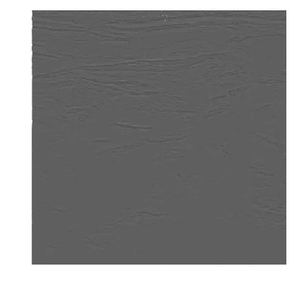************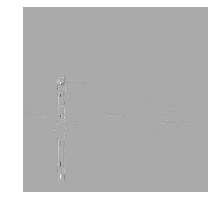**

****交互代码****

**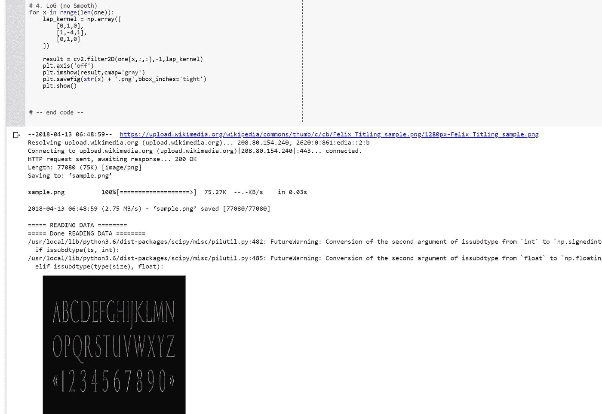**

**对于谷歌 Colab，你需要一个谷歌帐户来查看代码，而且你不能在谷歌 Colab 中运行只读脚本，所以在你的操场上做一个副本。最后，我永远不会请求允许访问你在 Google Drive 上的文件，仅供参考。编码快乐！**

**请注意，我不想滥用任何数据政策。所以对于谷歌 Colab，我找到了下面的图片，它被标记为重复使用。要访问在线代码，请点击此处。**

**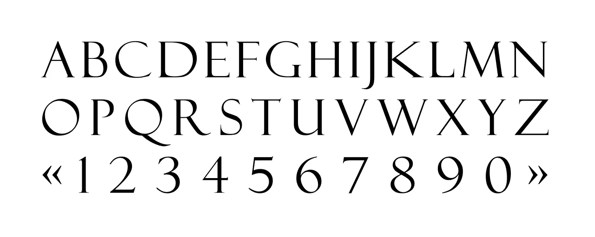**

**Image from this [website](https://upload.wikimedia.org/wikipedia/commons/thumb/c/cb/Felix_Titling_sample.png/1280px-Felix_Titling_sample.png)**

****最后的话****

**想到在深度学习之前，研究人员只是通过卷积和复杂的数学运算来创建高级功能(如 HOG、SIFT ),真是令人着迷。**

**如果发现任何错误，请发电子邮件到 jae.duk.seo@gmail.com 给我，如果你想看我所有写作的列表，请点击这里查看我的网站。**

**同时，在我的推特[这里](https://twitter.com/JaeDukSeo)关注我，并访问[我的网站](https://jaedukseo.me/)，或我的 [Youtube 频道](https://www.youtube.com/c/JaeDukSeo)了解更多内容。如果你感兴趣，我还在这里做了解耦神经网络[的比较。](https://becominghuman.ai/only-numpy-implementing-and-comparing-combination-of-google-brains-decoupled-neural-interfaces-6712e758c1af)**

****参考****

1.  **scipy，G. (2018)。scipy 中的高斯滤波器。Stackoverflow.com。检索于 2018 年 4 月 13 日，来自[https://stack overflow . com/questions/25216382/Gaussian-filter-in-scipy](https://stackoverflow.com/questions/25216382/gaussian-filter-in-scipy)**
2.  **斑点检测。(2018).En.wikipedia.org。检索于 2018 年 4 月 13 日，来自[https://en . Wikipedia . org/wiki/Blob _ detection # The _ Laplacian _ of _ Gaussian](https://en.wikipedia.org/wiki/Blob_detection#The_Laplacian_of_Gaussian)**
3.  **生物分割|生物图像信息学中心|加州大学圣巴巴拉分校。(2018).Bioimage.ucsb.edu。检索于 2018 年 4 月 9 日，来自[https://bioimage.ucsb.edu/research/bio-segmentation](https://bioimage.ucsb.edu/research/bio-segmentation)**
4.  **驱动:下载。(2018).isi . uu . nl . 2018 年 4 月 9 日检索，来自[http://www.isi.uu.nl/Research/Databases/DRIVE/download.php](http://www.isi.uu.nl/Research/Databases/DRIVE/download.php)**
5.  **超声波神经分割| Kaggle。(2018).Kaggle.com。检索于 2018 年 4 月 9 日，来自[https://www.kaggle.com/c/ultrasound-nerve-segmentation](https://www.kaggle.com/c/ultrasound-nerve-segmentation)**
6.  **Pixabay 上的免费图像——核磁共振成像，磁性，x 光，头骨，头部。(2018).Pixabay.com。检索于 2018 年 4 月 9 日，来自[https://pix abay . com/en/MRI-magnetic-x-ray-skull-head-782457/](https://pixabay.com/en/mri-magnetic-x-ray-skull-head-782457/)**
7.  **Pixabay 上的免费图像——日落、灯塔、黎明、黄昏、太阳。(2018).Pixabay.com。检索于 2018 年 4 月 9 日，来自[https://pix abay . com/en/sunset-light house-dawn-dusk-sun-3120484/](https://pixabay.com/en/sunset-lighthouse-dawn-dusk-sun-3120484/)**
8.  **Pixabay 上的免费图像——核磁共振成像，磁性，x 光，头骨，头部。(2018).Pixabay.com。检索于 2018 年 4 月 9 日，来自[https://pix abay . com/en/MRI-magnetic-x-ray-skull-head-782459/](https://pixabay.com/en/mri-magnetic-x-ray-skull-head-782459/)**
9.  **空间过滤器-拉普拉斯算子/高斯拉普拉斯算子。(2018).Homepages.inf.ed.ac.uk 检索 2018 年 4 月 13 日，来自 https://homepages.inf.ed.ac.uk/rbf/HIPR2/log.htm**
10.  **(2018).Cse.psu.edu。检索于 2018 年 4 月 13 日，来自 http://www.cse.psu.edu/~rtc12/CSE486/lecture11_6pp.pdf**
11.  **安，S. (2018)。2D 卷积的例子。Songho.ca 于 2018 年 4 月 13 日检索，来自[http://www . song ho . ca/DSP/convolution/convolution 2d _ example . html](http://www.songho.ca/dsp/convolution/convolution2d_example.html)**