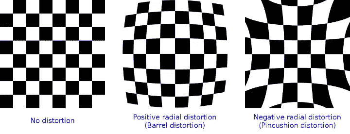
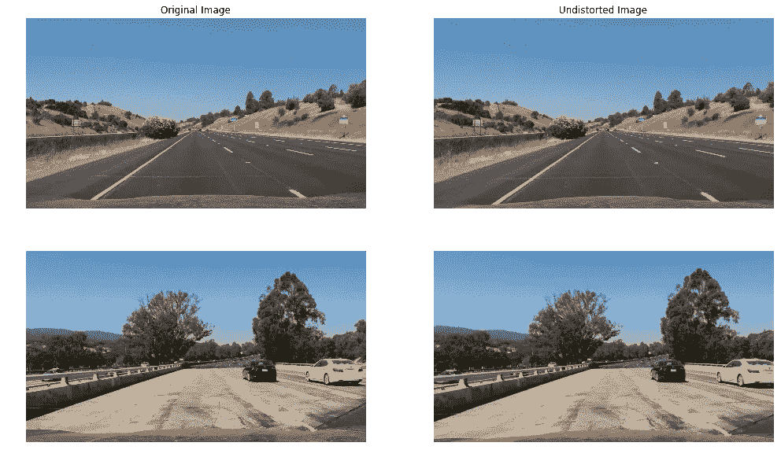
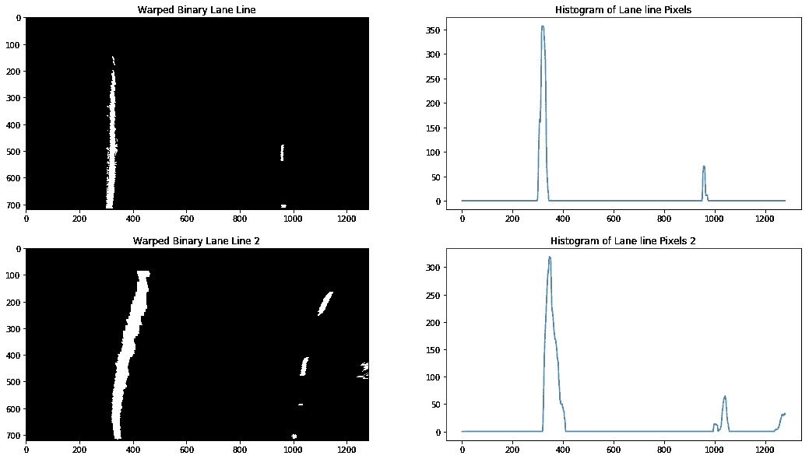
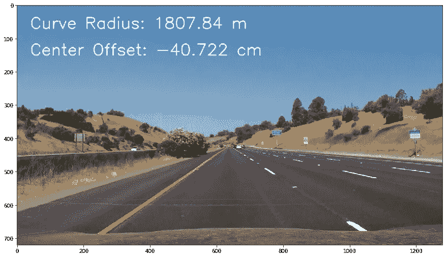

# 用于车道识别的计算机视觉

> 原文：<https://towardsdatascience.com/computer-vision-for-lane-finding-24ea77f25209?source=collection_archive---------2----------------------->

先进的计算机视觉技术，从安装在汽车上的摄像机中识别车道线。

这个项目的代码可以在: [Github](https://github.com/Moataz-E/computer-vision-lane-finding) 上找到。
这篇文章也可以在我的网站[这里](http://www.moatazelmasry.com/projects/computer-vision-lane-finding)找到。

在 [udacity 自动驾驶汽车工程师课程](https://eu.udacity.com/course/self-driving-car-engineer-nanodegree--nd013)的第四个项目中，我应用计算机视觉技术来检测道路上的车道线，这些车道线是使用安装在汽车前部的摄像头拍摄的。在这个项目中，大量使用了[开源计算机视觉库(OpenCV)](https://opencv.org/) 库。

该项目包括以下几个阶段:

1.  相机校准，以消除镜头失真的影响。
2.  检测车道线的图像预处理。
3.  道路透视变换有助于检测。
4.  改造道路上的车道线检测。
5.  车辆位置和车道曲率半径的计算。
6.  生成结果视频。

# 摄像机标定

摄像机的输出是视频，本质上是图像的时间序列。由于摄影镜头的性质，使用针孔相机拍摄的图像容易发生径向失真，从而导致放大倍率不一致，这取决于物体与光轴的距离。

以下是来自 [OpenCV](https://docs.opencv.org/2.4/modules/calib3d/doc/camera_calibration_and_3d_reconstruction.html) 的示例图像，展示了两种主要类型的径向失真:

Figure 1\. Examples of radial distortion. (source: [link](https://docs.opencv.org/2.4/modules/calib3d/doc/camera_calibration_and_3d_reconstruction.html))

为了正确检测图像中的车道线，我们首先需要校正径向失真。

计算机视觉研究人员已经想出了一种方法来纠正这种径向扭曲。要校准的相机用于捕捉棋盘图案的图像，其中图案中的所有白盒和黑盒都具有相同的大小。如果相机失真，捕获的图像将会错误地显示棋盘的尺寸。

为了校正失真的影响，识别棋盘的角，并且使用与预期棋盘测量的偏差来计算失真系数。这些系数随后被用于从使用该相机捕获的任何图像中消除径向失真。

Figure 2\. Checkerboard before and after fixing for distortion.

在上图中，最左边的图像显示了原始失真图像，最右边的图像显示了在失真图像上绘制的角，中间的图像显示了相机校准后得到的未失真图像。

OpenCV 函数[findchesboardcorners](https://docs.opencv.org/2.4/modules/calib3d/doc/camera_calibration_and_3d_reconstruction.html#findchessboardcorners)和 [calibrateCamera](https://docs.opencv.org/2.4/modules/calib3d/doc/camera_calibration_and_3d_reconstruction.html#calibratecamera) 用于实现上述相机校准过程。

现在我们已经校准了我们的摄像机，我在汽车视频的实际镜头上测试了结果。下图显示了相机校准的结果:

Figure 3\. Distortion correct applied for snapshots from the car driving video.

# 图像预处理

有了未失真的图像，我们现在回到检测道路上车道线的主要目标。分离和检测图像中的对象的一种方法是使用颜色变换和梯度来生成过滤后的阈值二进制图像。

对于颜色变换，我试验了三种颜色空间，以便找出哪一种最适合过滤代表道路上车道线的像素。测试了三种颜色空间:

*   [HSL](https://en.wikipedia.org/wiki/HSL_and_HSV) :将颜色表现为三个通道——色相、饱和度和明度。
*   [LAB](https://en.wikipedia.org/wiki/Lab_color_space) :将颜色表示为三个通道——亮度，分量 a 表示绿-红，分量 b 表示蓝-黄。
*   [LUV](https://en.wikipedia.org/wiki/CIELUV) :尝试[感知一致性](https://en.wikipedia.org/wiki/Color_difference#Tolerance)的 XYZ 色彩空间的变换。

经过一些实验，我得出结论:LAB 色彩空间的 **b 通道**和 LUV 色彩空间的 **L 通道**是检测道路上车道线的最佳组合。

还考虑了 Sobel 梯度滤波器。图像梯度测量颜色变化的方向强度。Sobel 是一种梯度滤波器，它使用高斯平滑和微分运算来减少噪声的影响。

Figure 4\. Original undistorted images in the first column, the b/L channel thresholding in the second column, the Sobel gradient filter in the third column, and the two filters combined in the last column.

# 透视变换

我们现在可以区分图像中的车道线，但使用默认的相机视图很难计算出车道的准确角度/方向。在默认的相机视角中，离相机越远的物体看起来越小，车道线看起来越靠近汽车，这不是真实世界的真实表现。

修复这种透视失真的一种方法是转换图像的透视，使我们从上方观看图像，也称为鸟瞰视图。

OpenCV 提供了函数 [getPerspectiveTransform](https://docs.opencv.org/2.4/modules/imgproc/doc/geometric_transformations.html#getperspectivetransform) 和 [warpPerspective](https://docs.opencv.org/2.4/modules/imgproc/doc/geometric_transformations.html#warpperspective) ，可以用来对图像中的一个片段应用透视变换。首先，我们在图像中选择我们想要应用变换的区域。在下图中，我选择了汽车前面的车道线段:

Figure 5\. Source points we want to apply a perspective transform to.

然后，我们选择代表我们想要将线段转换到的目标空间的点，在我们的例子中，任何矩形都足够了。然后，该函数将返回一个 3x3 的变换矩阵，使用 *warpPerspective* 函数，该矩阵可用于将任何线段弯曲成我们选择的视角。

下图显示了成功应用透视变换的两条不同路段的车道线:

Figure 6\. Perspective transform applied to two different sections of the road.

请注意，现在确定车道线的曲率变得更加容易了！

# 车道线检测

我们现在终于准备好完全检测车道线了！首先，我们将在*图像预处理*部分讨论的二进制阈值处理应用于透视变换车道线段。我们现在有一个图像，其中白色像素代表我们试图检测的车道线的一部分。

接下来，我们需要找到一个好的起点来寻找属于左车道线的像素和属于右车道线的像素。一种方法是生成图像中车道线像素的直方图。直方图应该有两个峰值，每个峰值代表一条车道线，其中左峰值代表左车道线，右峰值代表右车道线。下图显示了从两个二进制图像生成的两个直方图示例:

Figure 7\. Binary thresholded images and histogram of pixels in thresholded images.

然后，两个峰值的位置被用作搜索属于每条车道线的像素的起点。我们采用滑动窗口搜索技术，从底部开始，迭代扫描到图像的顶部，将检测到的像素添加到列表中。如果在一个窗口中检测到足够数量的像素，下一个窗口将以它们的平均位置为中心，这样我们就可以跟踪整个图像中像素的路径。

在我们检测到属于每条车道线的像素后，我们通过这些点拟合一个多项式，生成一条平滑的线，作为车道线位置的最佳近似。

下图显示了滑动窗口技术的应用，多项式拟合检测到的车道像素(红色表示左侧车道像素，蓝色表示右侧车道像素):

Figure 8\. Warped images and polynomial fit produced using sliding window technique.

下面是滑动窗口搜索技术的另一个视图，突出显示并填充了搜索区域:

Figure 9\. Sliding window technique compared to the binary image used as input.

# 车辆/车道位置

最后，使用两条检测到的车道线的位置，并假设摄像机位于图像的中心，然后我们计算汽车相对于车道的位置。使用图像的分辨率计算出从像素转换为米的比例测量值。

此外，使用比例测量，我们还可以通过将新的多项式拟合到世界空间来计算车道的曲率，然后计算曲率半径。车道的曲率半径就是这两个半径的平均值。下图显示了两条车道线的曲线半径和中心偏移(图像中检测不可见):

Figure 10\. snapshot fro the video with the lane curvature and car’s centre offset superimposed.

# 结果

随着我们的车道线检测管道的完成，我们现在通过将填充的多边形投影到我们认为车道线边界所在的视频上来可视化我们的检测，如下图所示:

Figure 11\. Projection of our lane line onto the original video.

管道是在汽车行驶的录像上运行的。下面是一段演示管道运行的视频: