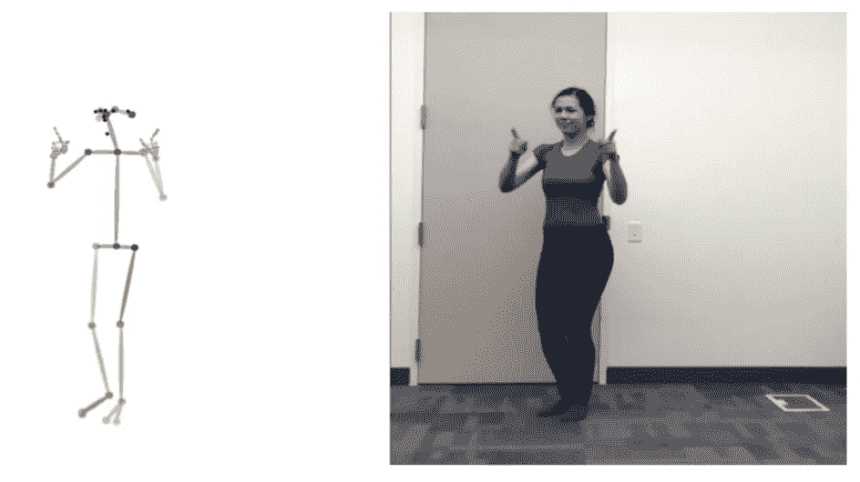
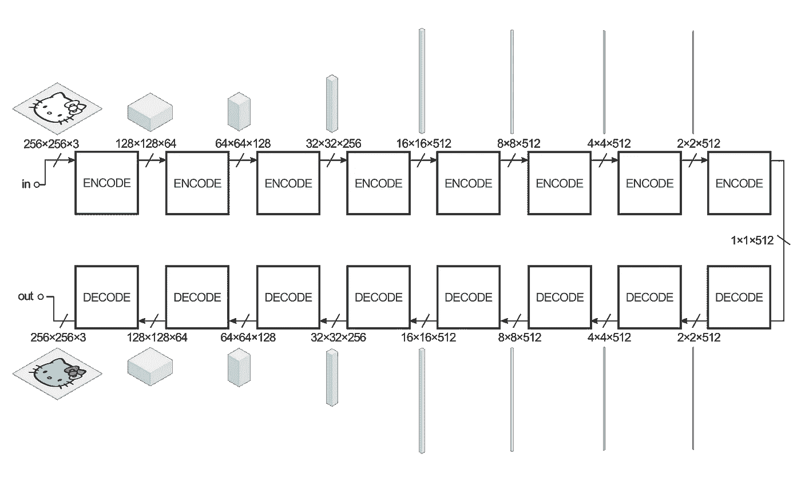
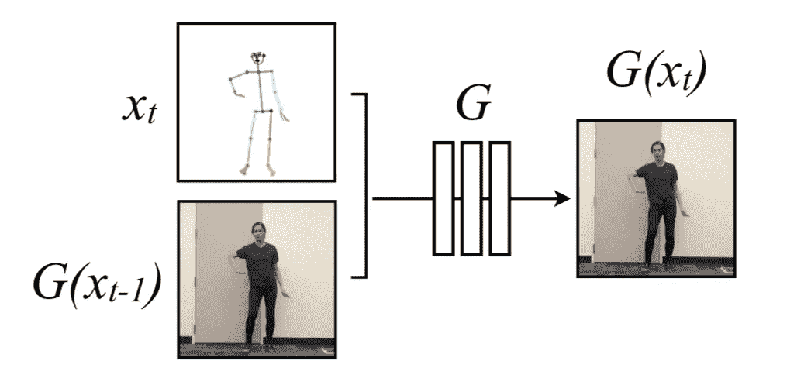
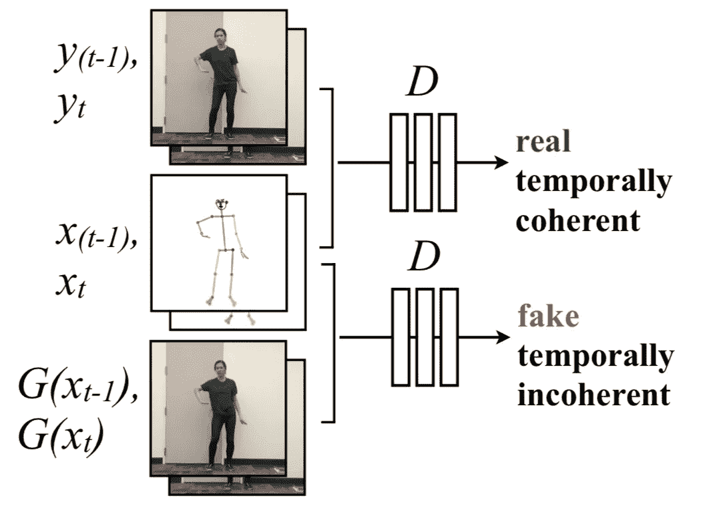
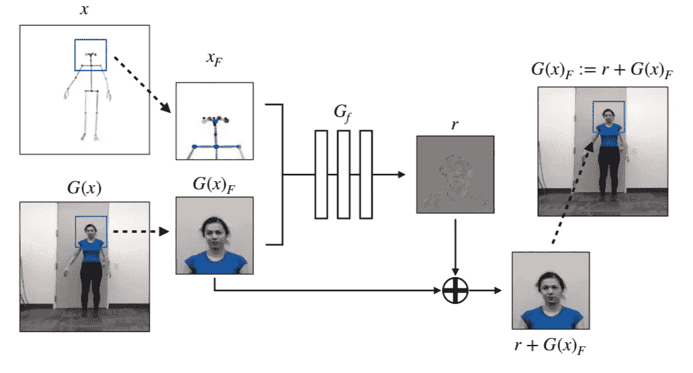

# 电脑可以让你跳舞，看看“现在人人都会跳舞！”

> 原文：<https://towardsdatascience.com/computers-can-make-you-dance-see-how-everybody-can-dance-now-501be0098916?source=collection_archive---------10----------------------->

想象过你像 MJ 一样跳舞吗？“可能在梦里吧！”，可能是你的答案，但现在这确实是可能的，让我们使用生成性对抗网络(GANs)来学习跳舞。GANs 在目前的技术研究领域获得了很大的发展势头，它改变了我们的思维方式，并试图实现不可能的事情。

我们可以利用 GANS 做一些惊人的事情:

*   GAN 具有将枯燥的黑白图像转换成彩色图像的能力。
*   它可以使用虚拟生成的数据来扩充数据集，一个惊人的应用是，它还可以从文本合成图像，反之亦然。
*   这些可以通过在原始图像中添加随机性来创建新的动漫角色。

哇哦。我们生活在另一个维度吗？当然，不！所以，让我们来看一次这个奇妙的网络。

## **甘斯简介**

gan 是由 Ian Goodfellow 等人设计的生成性对抗模型。主要目标是赋予计算机想象力，使其能够使用现有的信息/数据生成新的信息和数据。GANs 由两个参与者(神经网络模型)组成，这就像一个零和锁定游戏。

一个玩家是一个生成器，它试图产生来自某种概率分布的数据。那就是，你试图复制党的门票。另一个玩家是一个鉴别者，作为一个法官。它决定输入是来自生成器还是真实的训练集。那会是党的安全，比较你的假票和有效票，找出你设计的瑕疵。

玩这个游戏有两个主要规则。第一，生成器试图最大化使鉴别器将其输入误认为真实的概率，第二，鉴别器引导生成器产生更真实的图像/用例。

> GANs 是机器学习最近十年最有趣的想法！——扬·勒昆

概略地说，这是它看起来的样子；生成器向训练集图像添加随机性，而鉴别器监控随机性并识别生成的图像是真是假。

Generative Adversarial Model

现在，我们能让人们用 GANs 跳舞吗？加州大学伯克利分校说赞成成立！

CAROLINE CHAN，SHIRY GINOSAR，TINGHUI ZHOU，ALEXEI A. EFROS 发表了一篇惊人的论文，名为:[大家现在跳舞！](https://arxiv.org/pdf/1808.07371.pdf) ( [视频](https://www.google.com/url?sa=t&rct=j&q=&esrc=s&source=web&cd=2&cad=rja&uact=8&ved=2ahUKEwjC2K2GudLdAhUSeysKHYirB28QwqsBMAF6BAgGEAc&url=https%3A%2F%2Fwww.youtube.com%2Fwatch%3Fv%3DPCBTZh41Ris&usg=AOvVaw1jrpiUg-vXdm79TKuGSIhj))让我们从今以后，跳进深渊去了解更多。

简而言之，它是我们将源对象的舞蹈动作(一个会跳舞的对象)转移到静态目标对象(一个我们教跳舞的对象)的地方。这被称为具有时空平滑的每帧图像到图像的转换。听起来很奇怪，对吧？

为了明确这一点，让我们将这一过程分为三个简单的阶段:

*   姿态检测
*   全局姿态标准化
*   从标准化的姿势简笔画到目标对象的映射

**姿态检测**从源视频的每一帧中估计源人物的姿态。为了做到这一点，我们使用了一个预先训练好的姿势检测器[“开放姿势”](https://github.com/CMU-Perceptual-Computing-Lab/openpose)。这将自动检测跳舞者的 x，y 关节坐标。然后将这些点连接起来，形成一个姿势简笔画。下图显示了如何从源图像中识别姿势。

Pose detection

**全局姿态归一化**是为了使源的对象框架与目标的环境更加一致。

**从标准化的姿态简笔画到目标主体的映射**最后，我们将标准化的姿态简笔画映射到目标对象，这使得它们像源对象一样跳舞。整个过程分两个阶段完成——培训和转移。

## **培训阶段**

在训练阶段，所生成的目标人的姿势棒图被传递给生成器 G，生成器 G 的工作是从抽象的姿势棒图像生成图像。

这种对抗训练使用鉴别器 D 和使用预训练 VGGNet 的感知重建损失 **dist** 进行。这有助于优化生成的图像 *G(x)* 以匹配地面真实目标图像 *y* 。与传统 GAN 一样，鉴别器 *D* 试图区分真实图像 y 和伪图像 *G(x)* 。所有这些导致对目标图像的生成器 *G* 的训练。

## 传送阶段

在这个阶段，源物体的姿态*y’*被提取，产生*x’*。但是，由于我们不确定源对象的位置、肢体位置和环境，我们需要确保它与目标人物的位置兼容。因此，为了归一化上述内容，我们使用全局位置归一化**范数**生成 *x* 。我们找到脚踝位置和高度之间的距离，将源对象的位置线性映射到目标对象的位置。然后我们将其传递给之前训练好的 *G* 模型，生成目标人的 *G(x)* 。

到目前为止，一切顺利。我们已经使用 pix2pixHD 框架成功地从源对象的位置生成了漂亮的目标图像，该框架内部使用了条件 GAN(与我们到目前为止讨论的 GAN 相同)。在我们的用例中，经过 GAN 网络的严格训练，pix2pixHD 将从姿势简笔画生成人类图像。

*A generator trying to colour the input image — an application of pix2pixHD.*

但是，我们随后修改了 pix2pixHD 的对抗性训练，以产生连贯的视频帧，并使用时间平滑和面部 GAN 来获得逼真的面部表情。

## **时间平滑**

它用于生成视频帧序列。因此，我们使用两个连续的帧来保持针对静态目标对象修改的视频的连续性，而不是一个单独的帧。

最初，第一输出 *G(xt-1)* 取决于姿态简笔画 *xt-1* 和零图像，比如说 *z* 。下一个输出 *G(xt)* 以其相应的姿态简笔画 *xt* 和先前生成的输出 *G(xt-1)* 为条件。鉴别器现在试图将真正的时间相干序列*(xt 1，xt，yt1，yt)* 与伪序列*(XT 1，XT，G(XT 1)，G(xt))* 区分开来。

*G(xt) is conditioned on xt and G(xt-1)*

*Discriminator tries differentiating the real and fake temporal video sequences. G(x) indicates the images generated using Generator in the pix2pixHD framework and y is the actual input given which is the same as expected output.*

## **脸甘**

脸部特写有助于提高面部表情的真实性。面 GAN 与我们之前讨论过的主 GAN 一起使用。一个发生器， *G(xf)* 被用来专门聚焦在使用 *G* 的人的脸上。然后，这与姿势简笔画 *xf* (从 *x* 生成，焦点在人的面部)一起被提供给生成器 *Gf* ，该生成器输出残差 r。当与 *G(xf)* 组合时，这给我们提供输出 *r + G(xf)* 。然后，鉴别器尝试将真实人脸对 *(xf，yf)* 与虚假人脸对 *(xf，r + G(xf))区分开来。*

*Face GAN*

耶！结束了。综上所述，我们首先训练主 GAN，然后优化权重，之后，应用面 GAN。现在，你也可以跳舞了！

感谢阅读。如果你觉得这个故事有帮助，请点击下面的👏去传播爱。

本文由萨姆希塔·阿拉和维哈尔·鞍马撰写。