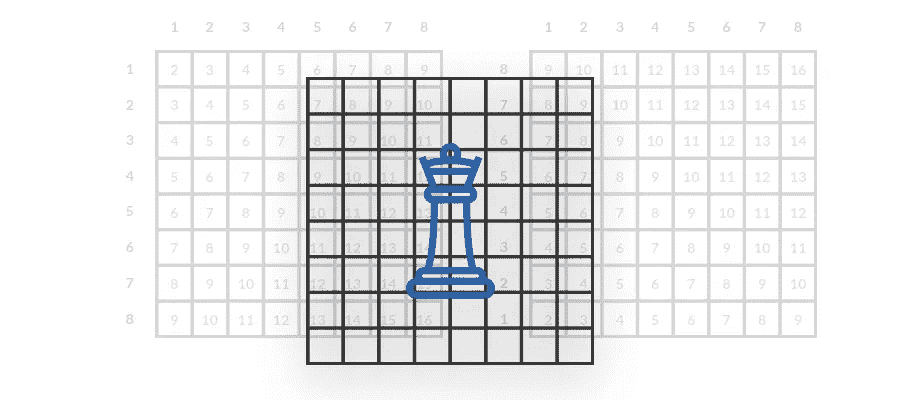
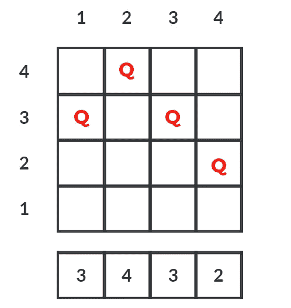
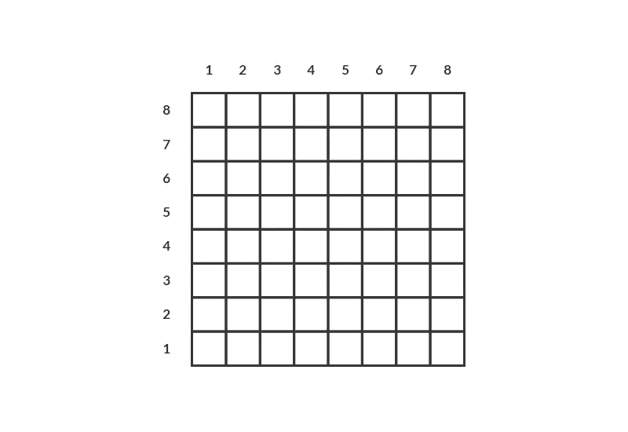
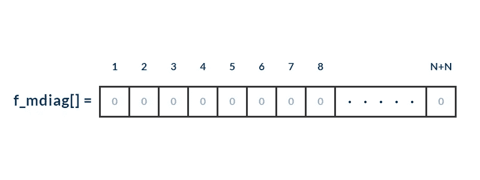
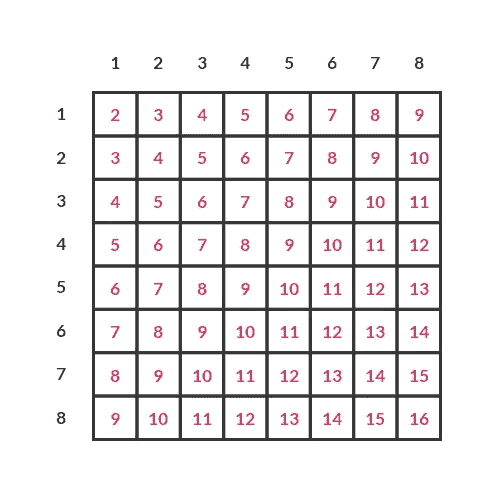
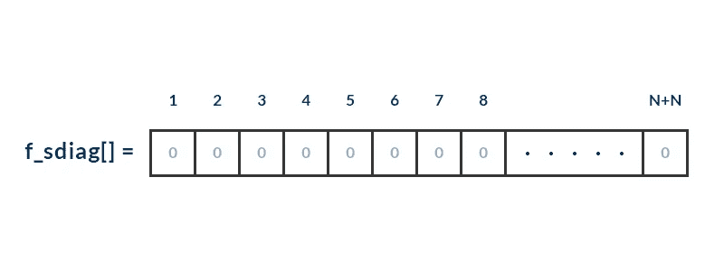

# 在线性时间和空间复杂度下计算 N 皇后板中冲突对的数量

> 原文：<https://towardsdatascience.com/computing-number-of-conflicting-pairs-in-a-n-queen-board-in-linear-time-and-space-complexity-e9554c0e0645?source=collection_archive---------7----------------------->



N 皇后问题是人工智能领域中的一个经典问题，我们试图找到一种棋盘配置，其中在 N × N 棋盘中将有 N 个皇后，而不是互相攻击。

解决这个问题有不同的方法，每种方法都有自己的时间复杂度。在生成状态之后，评估每一个状态中冲突对的数量也是非常耗时的。下面我们将讨论我们如何定义这个问题，以及在计算电路板中的冲突数量时如何实现线性时间复杂度。

需要注意的几件事:

1.  为简单起见，我们将使用索引 1 中的数组(因为，我们从 1 到 N 对行和列进行了编号)。索引 0 未使用。
2.  给出了简单的 C++代码(idea)。如果你理解这种方法，你总是可以用动态内存分配等等来编写更灵活的程序。
3.  在本文末尾可以找到 python 实现的链接。

**问题定义:**我们将板卡配置描述为一维数组。索引将指示列号，并且相应索引中的值将指示该特定列中皇后的行号。

例如，{3，4，3，2}对应于此板配置(下图):



The 2-D board configuration (above) from the 1-D array (below)

为什么要这样定义？因为在每一列中，放置一个以上的女王是没有意义的，他们只会互相攻击，因此无助于解决问题。定义为一维数组可以节省大量空间。

假设我们在 O(1)中生成一个从 1 到 N 的随机值，生成一个电路板配置将花费 O(N)时间。

**冲突检查(天真):**我们可以使用**嵌套循环**来计算冲突的数量，因此对于每个皇后，检查所有接下来的皇后，并计算有多少冲突，并将其添加到结果中。冲突发生在以下情况:

1.  *皇后在同一行(两个皇后的行号相同)。*
2.  *皇后在同一列中(两个皇后的列号相同，在我们的问题定义中，这不会发生)。*
3.  *两个皇后在同一条对角线上(行的绝对差等于列的绝对差)。*

这种方法需要 O(n)。

**实现线性时间复杂度:**我们将在冲突检查中使用 O(N)空间实现线性时间复杂度。

> 引入了三个一维表格(或数组)。一个用于存储每行中皇后的频率。一个用于存储主对角线中皇后的频率，另一个用于次对角线。

检查以下板图像的行和列索引，了解我们的问题定义。



A 8×8 chessboard

现在我们知道有 N 行，所以行频率数组的大小将是 N(或 N+1，因为索引 0 未被使用)。让我们将其声明为 f_row[]，其中最初所有的索引都将包含零(0)。


Array to check frequency of queens in each row

让我们将棋盘配置数组表示为 Queen[]。我们可以这样填充 f_row[]:

```
for (int i = 1; i <= N; i++){
    int val = Queen[i];
    f_row[val]++;
}
```

对于每个行值，我们将 f_row[]中相应的索引增加 1。相当容易！现在我们如何检查冲突？让我们假设，一行的皇后不影响另一行的皇后(如果它们在同一条对角线上，它们会影响，但现在我们不考虑这一点)。因此，如果冲突是互斥的，我们可以分别计算每一行的冲突，然后将它们相加得到总的水平冲突，不需要检查重叠。

让我们考虑这种情况，其中 4 个皇后在同一行，冲突的对由红线连接。


Conflicts where 4 queens are on same row

线或边是无向的，我们不检查向后冲突，即如果女王 A 攻击女王 B，女王 B 也攻击女王 A，但是我们认为这是单个冲突。

> 我们可以观察到，一行中所有冲突的女王实际上形成了一个“完整的图”，因此每个女王都与其他女王相连。边的数量就是冲突的数量。检查完整图中边数的公式，其中有 N 个节点:
> 
> (N * (N-1)) / 2

需要注意的重要一点是，当我们检查对角线时，这个观察也适用。

在我们有 4 个皇后的例子中，该行的总冲突数=(4 *(4–1))/2 = 6。

我们将行频率存储在 f_row[]中。要计算横向冲突的总数，我们可以使用以下方法:

```
for (int i = 1; i <= N; i++){
    int queens = f_row[i];
    result += ((queens * (queens - 1) / 2);
}
```

为了检查对角线冲突，我们必须以不同的方式观察棋盘。首先让我们试试主对角线。请参见下图，其中每个纸板单元格包含其行值和列值的总和。


Every cell contains sum of row number and column number

> 如果你仔细观察，你会发现所有的(主)对角线都有相同的和值。也就是说，如果 A 女王站在数值为 10 的位置上，B 女王也在数值为 10 的某处，冲突就发生了！

就像行一样，我们也将使用频率表。但这次是两倍大。因为我们能拥有的最大和值是最高行和最高列的和，N + N .我们把它表示为 f_mdiag[](这里 mdiag 指的是主对角线)。



frequency table for main diagonals

我们可以这样填充它:

```
for (int i = 1; i <= N; i++){
    int row = Queen[i];
    int sum = row + i; // i is column value
    f_mdiag[sum]++;
}
```

对于次对角线，我们必须翻转列索引(或行，但不能两者都翻转)。现在对每个单元格的行和列值求和，并观察。



Every cell contains sum of row number and column number

同样，我们寻找的对角线，有相同的和值。所以我们需要另一个频率表，和上一个一样大。



frequency table for secondary diagonals

填充可以这样完成:

```
for (int i = 1; i <= N; i++){
    int row = Queen[i];
    int sum = (N - row + 1) + i; // flipping is done by N - row + 1
    f_sdiag[sum]++;
}
```

现在，我们可以遍历这两个数组，并使用(N * (N-1)) / 2 来生成每条对角线上的冲突数，并将它们添加到结果中。大概是这样的(对于 f_mdiag[]):

```
for (int i = 1; i <= (N+N); i++){ // note here, N+N, not N
    int queens = f_mdiag[i];
    result += ((queens * (queens - 1))/2);
}
```

> 实际上，我们计算冲突的方式，所有的设置都是互相排斥的。主对角线冲突不影响次对角线冲突或行冲突的计算，反之亦然，即使同一个 queen 可能一次被视为行成员，一次被视为对角线成员。因此，我们可以在一个循环中更新所有频率(行、主对角线和次对角线)(甚至在生成电路板配置时！)并在另一个循环中计算结果。

例如，检查以下内容:

```
for (int i=1; i<=N; i++){
    Queen[i] = generate_random(1, N); // generating queen position 
    int val = Queen[i];
    f_row[val]++;               // updating frequency of rows
    f_mdiag[val + i]++;         // and main diagonals
    f_sdiag[N - val + 1 + i]++; // and secondary diagonals
}int result = 0;for (int i=1; i<=(N+N); i++){ // this loop runs from 1 to N+N
    int x = 0, y = 0, z = 0;
    if (i <= N) x = f_row[i];  //number of queens in ith row
    y = f_mdiag[i];   //number of queens in ith main diagonal
    z = f_sdiag[i];   //number of queens in ith secondary diagonal result += (x * (x - 1)) / 2; // adding to result
    result += (y * (y - 1)) / 2;
    result += (z * (z - 1)) / 2;
}
```

通过这种方法，时间复杂度为 O(N)。空间复杂度也是 O(N)。

查看 [Python 代码](https://github.com/TanvirSojal/Medium-Article-Codes/blob/master/n_queen_conflict_count.py)了解这种方法。

**希望这对你有帮助！**

让我知道你的想法:)