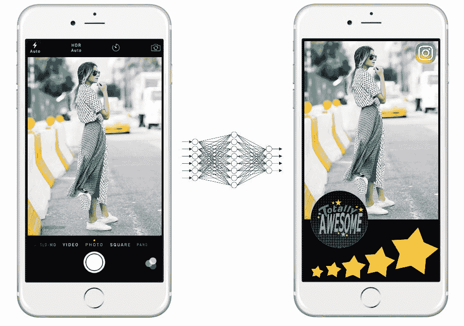
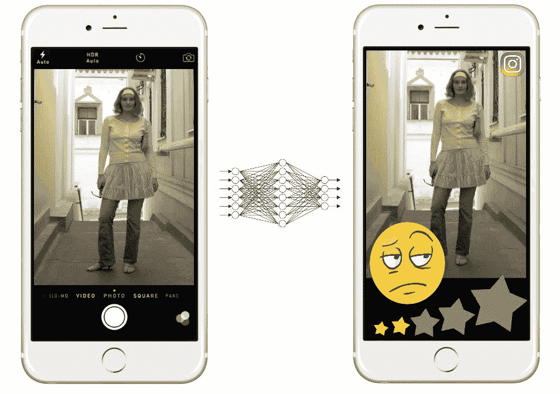

# 本周概念:让人工智能告诉你你的长相有多好

> 原文：<https://towardsdatascience.com/concept-of-the-week-let-artificial-intelligence-tell-you-how-good-is-your-look-7dedd324d1d8?source=collection_archive---------6----------------------->

这是一系列介绍我提出的应用和产品的想法(有些可能很愚蠢)的文章。有时我会提供基本的源代码，有时会有只是描述和简单的模型。无论如何，你可以自由地将这些想法实现到一个完整的产品中，但别忘了告诉我你做到了:)。

我不擅长挑选合适的衣服。每次我自己去购物，我都会买一些看起来很傻的东西，然后再也不穿了。或者只在我需要去当地杂货店时才穿上它们，让它看起来像是“我只是迅速拿了我在壁橱里找到的第一件东西”。当然，有成群的销售人员试图帮助我，但是，由于这种帮助很少是有用的，我想，他们只是试图卖给我更贵和更不受欢迎的东西。

这就是为什么我总是试图让我的妻子给我买衣服。尽管我们有时会争论我去开会时穿这件衬衫是否合适，但几乎 99%的情况下她都是对的——那件补丁衬衫会让我看起来像是一个穿着灰色西装和浅蓝色衬衫、打着闪亮红色领带、在赚着百万美元的华尔街狮子中的古怪学生。

外面的许多人身边都没有像我妻子这样的人。因此，对于这些对时尚一无所知的单身人士，我给出了以下建议。一个后端带有神经网络的移动应用程序，它会告诉你你的新造型是好是坏。可能只有两个类别(好/不好)，或 5 星或 10 星评级，或任何你认为观众会接受的东西。

基本流程是您:

1.  给你自己拍张照片
2.  获得评估

像这样:

我不知道，这个女孩是否真的看起来很棒，因为，就像我说的，我不擅长这个。

如果我给像我这样的人拍照，可能会发生这样的事情:

This is not me, nor my wife. Just random girl from the internet.

如果用户得到 5 英镑，那么所有常见的在 instagram 上分享并获得百万赞的事情都会发生。而且，很可能什么都不会分享，如果她得分更低，因为没有人喜欢在 Instagram 上分享糟糕的图片。

这个应用程序本身很简单。使用 Instagram 帐户登录的屏幕、相机屏幕和结果屏幕。一天之内可以在 iOS 和 Android 上实现。

后端需要建立一个简单的 API 服务器，将数据传递给“大脑”。“大脑”可能是一个[张量流服务](https://www.tensorflow.org/serving/)或任何你熟悉的东西。

我相信类似的东西已经存在了。想法很简单，没有什么是以前没做过的。

不过，还是有一些障碍。

这里可能存在的一个问题是获取训练集。如果您决定实现它，您将需要数千甚至数万个示例来进行神经网络的初始训练。训练数据集的大小在很大程度上取决于您用来对图像进行分级的比例。如果只有好/坏的分类，那么你需要的就更少。如果你认为用户想要更精细的东西，比如 5 级或 10 级评级，那么训练样本的数量应该相应增加。

当然，应该有一些关于模型对图像分类的反馈。一种方法是，模型在一定时间后查看每张照片的赞数与用户数的比率，即分享的照片有多少赞来自总粉丝数。例如，如果用户有 100 个关注者，只有 1 个喜欢 4 星照片，那么算法是错误的，它应该是 1 星。这种方法有一些明显的缺点，但它可能是一个很好的起点。

第二个问题是，要教会神经网络，你需要自己先给照片打分。这意味着这应该是一个具有特殊品味，风格的感觉和最新时尚知识的开发人员。我从未见过如此独特的人类物种。找一个设计师合作可能是对的。这仍然很困难，因为考虑到他或她要评价的图片数量，她或他需要有巨大的耐心。

对于像我这样的人来说，这个应用程序还有最后一个问题。购物时，每当我处于困境时，我通常不会想，“哦，有没有这方面的应用程序？”所以每当我在购物中心时，我应该能够以某种方式被提醒，我的手机上有这个应用程序。这意味着我将需要另一个应用程序，它将完全做到这一点——这可能是下周的概念。

*原贴于*[*【seigolonhcet.com】*](https://seigolonhcet.com/2017/09/08/concept-of-the-week-let-artificial-intelligence-tell-you-how-good-is-your-look/)*。如果你喜欢这篇文章，可以考虑在 Twitter 上关注我，获取更多的技术故事、新闻、评论和评论。*