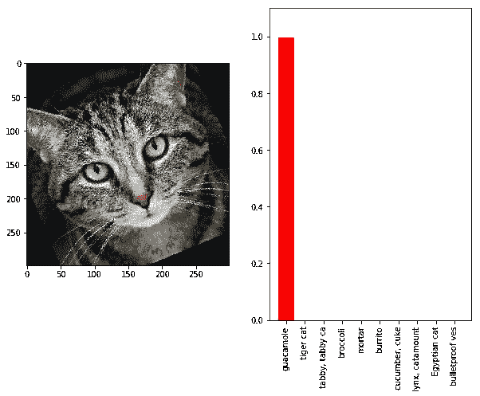

# 人工智能安全中的具体问题

> 原文：<https://towardsdatascience.com/concrete-issues-in-ai-safety-fb7838d7235a?source=collection_archive---------9----------------------->

在过去的一年里，对人工智能的新一轮担忧在全球范围内兴起。其中一些很有根据，需要实际的解决方案，而另一些则更接近科幻小说。超级智能机器不会接管世界，至少在未来几十年不会。然而，不那么智能的计算机可以取代人类的劳动，犯错误和被用来伤害。所以让我们来看看主要的人工智能问题。

首先，要教会一台机器一些技能，你需要训练数据。如果没有仔细的选择，数据集可能会偏向某些类，错过重要的功能，甚至包含错误。在某些情况下，这可能会导致你的自拍在社交网络中被错误标记，这不是一个大问题。但是，这也可能导致对癌症组织的错误诊断，并可能导致死亡。

同时，即使是经过精心训练的系统也可能被对抗性的例子所欺骗:

Hint: this is not really a guacamole

你不能在你的生物组织上使用这种技术来欺骗医学人工智能，但有人可以用它来误导自动驾驶汽车，并造成真正的威胁。另一个问题是教机器“光荣失败”。

## 自检

我们需要他们能够识别不确定性高的情况并直接报告，而不是试图做一些不太明智的事情。这对于强化学习代理尤其重要。几乎所有的人都有一些探索模式，当他们尝试新的行动，以找到更好的方式获得回报。如果不为安全探索进行调整，它可能会导致机器人发生各种事故。

奖励函数的糟糕设计可能会以一种意想不到的形式适得其反。一类问题叫做悬赏黑客。当代理人发现一种扰乱环境以获得更多回报的方法时，它们就出现了。例如，清洁机器人可以故意污染周围的一切，以获得更多的积分，以便稍后进行清洁。或者，代理可以决定停止做任何事情来避免惩罚。这类问题可以通过从人类的偏好和打断中训练 AI 来部分解决。

有些问题并不在于系统本身，而是由使用这些系统的人造成的。对许多人来说，失业是一个现实的问题。另外， [AI 在军工](http://cognitivechaos.com/applications-ai-military/)越来越受关注。

尽管如此，总有一天人工智能会变得比我们聪明得多。也许 30 年后，也许 100 年后。我们应该如何应对？正如吴恩达所说，“担心超级人工智能接管世界就像担心火星上人口过剩一样”。无论如何，没有人真正知道它会在何时何地发展，而且它也不太可能分享我们所有的价值观。

*附加论文:*

*   [合成健壮的对抗实例](https://arxiv.org/abs/1707.07397)
*   [根据人类偏好进行深度强化学习](https://arxiv.org/abs/1706.03741)
*   [安全可中断代理](https://intelligence.org/files/Interruptibility.pdf)
*   [AI 安全的具体问题](https://arxiv.org/pdf/1606.06565.pdf)

*最初发表于* [*认知混乱*](http://cognitivechaos.com/concrete-issues-ai-safety/) *。*