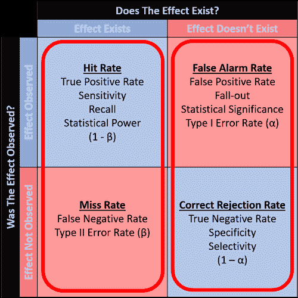
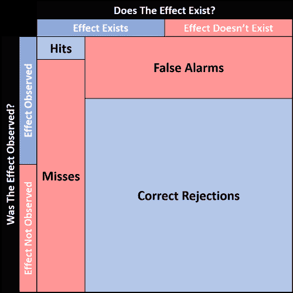
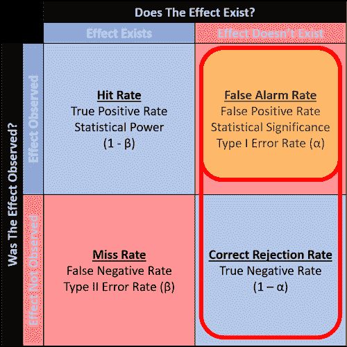
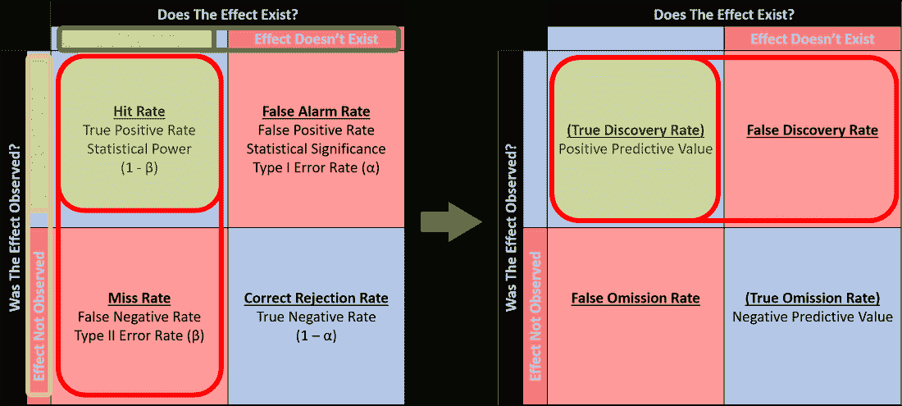

# 被混乱矩阵弄糊涂了

> 原文：<https://towardsdatascience.com/confused-by-the-confusion-matrix-e26d5e1d74eb?source=collection_archive---------9----------------------->

## 命中率，真阳性率，灵敏度，召回率，统计功效有什么区别？

如果你试图回答题目中的问题，你会失望地发现这实际上是一个难题——所列术语基本上没有区别。就像 [ANCOVA](https://learncuriously.wordpress.com/2018/09/22/ancova/) 和 [Moderation](https://learncuriously.wordpress.com/2018/09/29/moderation-and-mediation/) 中提到的问题一样，不同的术语经常被用于同一件事情，尤其是当它们属于不同的领域时。这篇文章将试图通过把这些术语放在一起来消除混淆，并解释如何使用检测效果的上下文来解释混淆矩阵的单元。

Commonly used terms for the cells in a confusion matrix.

上图捕捉了混淆矩阵中每个单元格的常用术语。蓝色单元格是期望的结果，而红色单元格是错误。在这里，我使用是否存在影响和是否观察到影响的上下文，而不是通常用来解释混淆矩阵的各自的“实际类别”和“预测类别”。我相信这是理解每个单元格中的信息的更直观的方式，因为术语“实际类”和“预测类”也经常使人困惑。

“真阳性”、“假阳性”、“真阴性”和“假阴性”可能是混淆矩阵中细胞最流行的标签，但你见过多少次有人停下来试图弄清楚“真阴性”和“假阴性”是什么意思？统计假设检验的“第一类”和“第二类”错误甚至更糟，因为它们的名称甚至没有给出任何关于所犯错误类型的线索。有些人可能甚至没有意识到这些统计术语实际上是混乱矩阵的一部分。

考虑到这些术语是多么的不直观，我更喜欢用[信号检测理论](https://en.wikipedia.org/wiki/Detection_theory)版本的这些标签:“命中”、“虚警”、“正确拒绝”、“未命中”。当我们把它们放到上下文中时，它实际上很有意义:

*   如果我观察到一个效果，当这个效果存在时，它是一个**击中**
*   如果我在效果存在时没有观察到一个效果，那就是一个**错过**
*   如果我在没有影响的情况下观察到一个影响，这是一个**假警报**
*   如果我在没有效果的时候没有观察到效果，那就是**正确拒绝**

这个版本的标签已经包含了什么是对什么是错的内涵，所以立即推断出到底发生了什么变得非常容易。出于这个原因，我将在后面的文章中引用这个版本的标签。在这一点上，重要的是要注意混淆矩阵中的单元格包含每种情况出现的绝对次数，而**而不是**会与它们出现的概率混淆，例如“命中率”或“真阳性率”。接下来，我将解释这些不同的利率是如何计算的。

# 基于效果存在的概率

Rates based on existence of effect.

既然你已经意识到混淆矩阵中的单元格包含了出现的绝对次数，那么你可能想知道其他术语如“命中率”和“真正的阳性率”是如何产生的。这些比率实际上是根据一个效应的存在来计算的**，这个效应只涉及混淆矩阵的一个特定部分，而不是全部(上图中的红色轮廓)。例如，“命中率”的计算方法是，将效果存在时的命中次数除以总出现次数(即总命中次数加上未命中次数)；那么“失误率”就是 1 减去“命中率”。相反,“错误警报率”的计算方法是，将错误警报的数量除以不存在该影响时发生的总数量(即错误警报的总数量加上正确剔除的总数量)；那么“正确拒绝率”就是 1 减去“误报率”。**

这是同一概念的不同术语开始出现的地方。“灵敏度”和“召回率”与“命中率”相同，“特异性”和“选择性”与“正确拒绝率”相同。[“灵敏度”和“特异性”](https://en.wikipedia.org/wiki/Sensitivity_and_specificity)更常用于医学领域，在医学领域，人们对测量诊断测试的性能感兴趣，而“回忆”和“脱落”更常用于机器学习，以测量预测准确性。甚至统计学领域也有自己的行话，尽管它们实际上都指的是同一个东西。

大多数研究人员应该对“统计显著性”很熟悉，它是犯 1 型错误的概率( *α* )。将这与“误报率”联系起来可能并不困难，因为它是当一个效应不存在时观察到该效应的概率。但是一些研究人员可能没有把[【统计能力】](https://en.wikipedia.org/wiki/Power_(statistics))这个概念和“命中率”联系起来。因为“权力”这个词，很容易误导研究者，以为权力大的研究*权力大*就足以下结论。这不是统计能力的含义；简单来说就是在效应存在的情况下，观察到一个效应的概率。当我们将第二类错误( *β* )视为未命中时，这一点变得尤其明显，1 减去未命中率给出了存在效应时命中的概率。

我希望这澄清了不同的利率意味着什么，你现在是舒适的各种条款。在这篇文章的最后，我将使用混淆矩阵来说明频率主义者和贝叶斯假设检验之间的区别。但在此之前，我会解释当基于是否观察到影响来计算概率时会发生什么。

# 基于是否观察到影响的概率

Rates based on whether effect was observed.

一种不太为人所知但却很重要的测量准确度的方法是，当观察到一种效应时，计算该效应存在的概率。类似地，比率的计算只参考了混淆矩阵的特定部分，即上图中的红色轮廓。例如，[“错误发现率”](https://en.wikipedia.org/wiki/False_discovery_rate)的计算方法是将错误警报的数量除以观察到效果时发生的总次数(即命中总数加上错误警报)，而“错误遗漏率”的计算方法是将未观察到效果时未命中的数量除以发生的总次数(即未命中总数加上正确拒绝)。

术语“真实发现率”和“真实遗漏率”被放在括号中，因为它们不是实际术语。更常用的术语是[、【阳性预测值】和【阴性预测值】](https://en.wikipedia.org/wiki/Positive_and_negative_predictive_values)，但我认为使用“真实发现率”更直观，因为它意味着“我所发现的内容中真实的比率”。毕竟，它只是其对应的“错误发现率”的反向，这使得关联更加直接。“真实发现率”的另一个术语是[“精度”](https://en.wikipedia.org/wiki/Precision_and_recall)，这是上面已经介绍过的通常与“回忆”配对的机器学习术语。

知道真实的发现率与知道命中率一样重要，甚至更重要。当该效应的普遍性实际上不是很大时，情况尤其如此。在这种情况下，每当观察到效应时，得到假警报的机会变得非常高。这就是贝叶斯主义者试图解释常客在他们的分析中遗漏了什么的地方，接下来我将使用混淆矩阵来讨论。

# 额外收获:频率主义者与使用混淆矩阵的贝叶斯分析

在我之前关于[贝叶斯分析&复制危机](/bayesian-analysis-the-replication-crisis-a-laypersons-perspective-241f9d4f73db)的文章中，我介绍了贝叶斯分析的基本原则，以及这些原则如何帮助解决复制危机。在撰写这篇文章时，我意识到贝叶斯分析可以在混淆矩阵的帮助下更容易地解释，前提是你已经熟悉它。贝叶斯分析中的术语也是我们已经在混淆矩阵中学到的另一个变体，但是我一会儿会讲到。

首先，让我们考虑一下我提到的场景，其中一种效应的[发生率](https://en.wikipedia.org/wiki/Prevalence)不是很大。到目前为止，我们一直在看被分成四个相等象限的混淆矩阵。然而，实际上，比例通常并不相等。下面构建了一个具有实际比例的更加现实的混淆矩阵:

Confusion matrix with actual proportions.

当我们谈论一种效应的普遍性时，我们本质上是指一种效应首先存在的可能性。这也被称为[基本比率](https://en.wikipedia.org/wiki/Base_rate)，或贝叶斯分析中常用的先验几率/概率(不同的术语再次指代相同的事物)。我们经常假设偶然观察到一个效应是一件五五开的事情。但是从上图可以看出，“命中”和“未命中”所占的面积比“误报”和“正确拒绝”所占的面积要小得多。这表明一种效应的发生率很小，并且随机观察肯定不是 50-50。再加上命中率低，点击所占的面积相对于其他东西就变得很小了。即使正确拒绝的比例最大，对效果的观察也太不可靠了，因为它很有可能是假警报而不是命中。

Cells in a confusion matrix that a Frequentist is most concerned with.

在假设检验的频率主义方法中，传统上最重要的统计数据是 *p* 值。*p*-值是当一个效应不存在时观察到该效应的概率的估计值。因此，*p*-值越小，虚警率(或 I 型错误率)越低，正确拒绝率越高。但是，请注意，这种方法没有考虑命中率(或统计功效)，也没有考虑影响的普遍性。这导致了混淆矩阵中提到的实际比例的问题。

Cells in a confusion matrix that a Bayesian is most concerned with. Prior Probabilities and Likelihood calculations on the left, and the resulting Posterior Probabilities on the right.

在贝叶斯方法中，用当前证据(也称为[可能性](https://en.wikipedia.org/wiki/Likelihood_function))更新[先验概率](https://en.wikipedia.org/wiki/Prior_probability)，以产生[后验概率](https://en.wikipedia.org/wiki/Posterior_probability)。如果这些对你来说听起来很陌生，请参考我之前的文章。但是，即使没有参考我以前的帖子，我也发现这些是在混淆矩阵中指代同一事物的不同术语。参考上图，先验概率实际上是一个效应存在的普遍性或基础率(左边混淆矩阵中的**绿色轮廓**)。可能性稍微复杂一点，但它是通过将命中率(或统计能力，左边混淆矩阵中的**红色轮廓**)除以进行一般观察的概率(左边混淆矩阵中的**黄色轮廓**)来计算的。后验概率是一个真实的发现率(右侧混淆矩阵中的**红色轮廓**)，它不能直接计算，但可以根据从先前已知信息中获得的先验概率和从当前研究中的信息获得的可能性进行估计。然后计算真实发现率(或后验概率)与基本发现率(或先验概率)的比率，以确定[贝叶斯因子](https://en.wikipedia.org/wiki/Bayes_factor)，该因子表明证据是否倾向于零假设或替代假设。

* * * * * * * * * *

使用混淆矩阵来区分两种统计方法的目的，并不是表明贝叶斯方法更好，因为它考虑了更多的信息。我想说明的一点是，当使用不熟悉的术语时，这些概念经常会显得很混乱。但是如果我们意识到有更直观或者我们更熟悉的等价术语，这些概念就会变得更容易理解。我仍然不知道为什么这些术语在不同的领域没有标准化，但是我将继续提倡使用[信号检测理论](https://en.wikipedia.org/wiki/Detection_theory)版本的“击中”、“错误警报”、“正确拒绝”和“错过”，因为它们在概念上更直观。

**如果您觉得本文有用，请访问本系列第二部分的链接:**

 [## 困惑于困惑矩阵第 2 部分

### “准确性”只是衡量准确性的众多标准之一…

towardsdatascience.com](/confused-by-the-confusion-matrix-part-2-4a8160156cbd) 

*原文发布于:*[*https://learn curily . WordPress . com/2018/10/21/confused-by-the-fuzzy-matrix*](https://learncuriously.wordpress.com/2018/10/21/confused-by-the-confusion-matrix/)