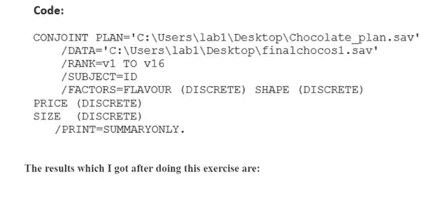
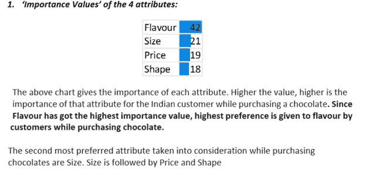
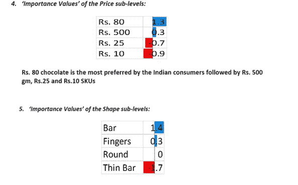

# 联合分析:101

> 原文：<https://towardsdatascience.com/conjoint-analysis-101-7bf5dfe1cdb2?source=collection_archive---------6----------------------->

顾客喜欢什么类型的巧克力？

> 你有没有想过顾客喜欢什么类型的巧克力？
> 
> 哪种口味最受顾客欢迎？
> 
> 当顾客购买巧克力时，他们会在意价格吗？

答案不仅在于消费者心理，也在于分析。

消费者心理学是研究消费者行为和消费者购买产品背后的认知过程的一个分支。消费者心理学的一个重要领域是理解消费者在购买特定产品时寻找什么。消费者如何评价不同的属性(功能、益处和特征等)。)同时购买一个产品？

营销人员使用联合分析方法来分析这些问题。

## **什么是联合分析？**

联合分析是一种技术，用于了解消费者在做出购买决策时对产品各种属性的偏好或相对重要性。

几年前，我做过一个联合分析的项目，利用印度消费者的数据来了解消费者更喜欢哪种巧克力。

在这篇博客中，我们将看到如何使用联合分析来回答以下问题:

> a.印度消费者喜欢什么类型的巧克力？
> 
> b.哪种口味(牛奶，黑巧克力等。)印度顾客更喜欢吗？
> 
> c.印度顾客喜欢哪种形状的巧克力？
> 
> d.哪个 SKU(库存单位)— 50 克、100 克等。-印度顾客喜欢吗？
> 
> e.他们愿意花多少钱买一块巧克力？

在购买巧克力时，我们可以说有 4 个重要的属性需要考虑——味道、形状、大小和价格。这 4 个属性中的每一个都有 4 个子级别，分别如下所示:

联合分析有助于为每个属性(味道、价格、形状和大小)和每个次级分配效用值。获得最高效用值的属性和子级别最受客户青睐。

在这种情况下，将形成 4*4*4*4，即给定属性及其子级别的 256 种组合。比方说，我们从这些组合中挑选出 16 种更有实际意义的组合。例如，一个 300 克的巧克力将不会被任何品牌仅仅以卢比出售。10.

**让我们按照这些步骤来执行分析:**

1.我们将要求顾客根据他们的喜好对 16 种巧克力进行排序。给定的 16 个品种中最受欢迎的巧克力将被评为等级 1，最不受欢迎的巧克力将被评为等级 16。

2.在 SPSS 中为联合分析创建两个文件。一个文件应该有所有 16 种可能的巧克力组合，另一个文件应该有所有 100 名受访者的数据，其中 16 种组合从 1 到 16 排列。

3.然后将数据导入 SPSS。您还可以使用 R 或 SAS 进行联合分析

4.然后运行联合分析，等待给出有趣见解的结果。

很棒，对吧？我们可以使用联合分析来了解其他产品的各种属性的重要性。

如果你喜欢我的文章，给它几个掌声！

你可以联系我

网址:【https://www.ridhimakumar.com T3

领英:【https://www.linkedin.com/in/ridhima-kumar7/ 

**版权所有 2018**[**www.ridhimakumar.com**](http://www.ridhimakumar.com)**版权所有。**