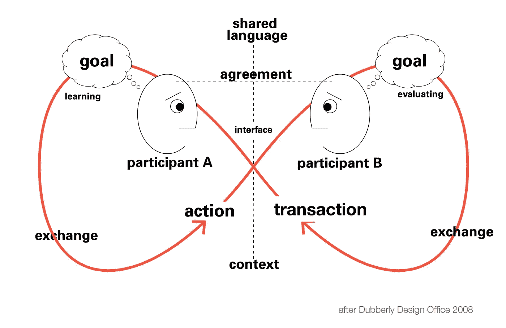

# 对话式人工智能:模仿机器

> 原文：<https://towardsdatascience.com/conversational-ai-the-imitation-machine-764ddf6dfeec?source=collection_archive---------27----------------------->

# **1。简介**

**1.1。背景**

对话式人工智能的发展已经进行了 60 多年，很大程度上是由自然语言处理(NLP)领域的研究推动的。在 20 世纪 80 年代，从手写规则到统计方法的转变使 NLP 在处理真实数据时更加有效和灵活(Nadkarni，P.M. et al. 2011，p. 545)。从那以后，这种趋势越来越受欢迎，特别是受到深度学习技术的广泛应用的推动。近年来，自然语言处理在分类、匹配、翻译和结构化预测方面取得了显著成功(李，H. 2017，第 2 页)，这些任务通过统计模型更容易完成。然而，自然主义的多回合对话仍然具有挑战性，一些人认为，在我们开发出能够“理解自然语言”的人工通用智能之前，这一问题仍将无法解决(Bailey，K. 2017)。

**1.2。目标**

为了研究设计对话式人工智能的有效系统架构，本摘要仔细考虑了自动生成理论和对话理论中描述的方法。基于这些理论和其他多学科研究的交叉，它认为会话构建需要对世界的系统表征，尤其是那些基于情境理解的表征。此外，对话式人工智能的充分性不应从其常识性认知能力来衡量，而是从它模仿人类之间交流的程度来衡量。这一论断直接引用了 G.Pask (1976，第 7-8 页)对智力的定义:“智力是一种属性，当且仅当参与者之间的对话表现出理解时，外部观察者才将其归因于参与者之间的对话。”从这个角度来看，如果一个对话式的人工智能在一次成功的交流中表现出情境理解，那么它可以说是展示了智能。

本摘要中展示的方法旨在为处理自然主义多回合对话提供一个新的方向，并扩展当代自然语言处理技术的优势。它建议将对话式人工智能设计为一个自我引用的系统(Maturana，H.R. & Varela，F.J. 1980，第 xiii 页)，该系统参与“一个理解、保留和学习的过程”(Pask，G. 1972，第 212 页)。如果利用深度学习方法，这是非常容易实现的。摘要还对 a .图灵(1950 年，第 433 页)提出的“模仿游戏”表示认可，他认为这是对“机器能思考吗？”这一问题的有利替代

**1.3。相关研究**

提出的论点显示了与其他一些已有理论的联系:认为语言的意义是由它的使用来定义的“语言游戏”概念(维特根斯坦，l .等人，1968 年)，把语言视为一种表演媒介的“言语行为”哲学(奥斯汀，J.L .等人，1975 年；Searle，J.R. 1969)、功利性语言学习范式(Gauthier，J. & Mordatch，I. 2016)、互动式语言学习方法(Lidor，N. & Wang，S.I. 2016)。然而，与“语言游戏”和“言语行为”不同，该摘要认为对话式人工智能不应基于纯语言的世界，而与功利主义范式和交互方法的不同之处在于强调知识系统应基于情境语境。

# 2.机器会思考吗？

**2.1。心灵的计算理论**

自从数字计算机诞生以来，关于机器认知能力就有过无数次争论(图灵，1950 年；纽厄尔和西蒙，1976 年；塞尔，J.R .，1980)。对人类思维的研究往往是回答眼前问题的理论基础。

在对感知现实的研究中，H. von Foerster (1973，第 38 页)提出了一个观点，即人类的认知只不过是不断完善我们对世界的描述的递归计算。通过计算，他的意思是“反映，思考(放置)一致的事物(com-)”。当 J.A .福多尔综合了心理学和语言学的观点并提出思维语言假说时，一个更正式的心理计算理论出现了(福多尔，J.A. 1976)。它认为认知过程是一个表征系统，由通过语言结构运作的概念符号组成。这证实了系统表征的必要性，它为更复杂的认知活动提供了基础。

**2.2。物理符号系统和 GOFAI**

大约在同一时间，计算机科学的进步产生了一个类似的假设，该假设定义了一个物理符号系统(Newell，A. & Simon，H. 1976，第 116 页)。它由“一组称为符号的实体组成，这些实体是物理模式，可以作为另一种称为表达式(或符号结构)的实体的组件出现”。纽维尔和西蒙认为，这个符号系统与通用计算机非常相似，它拥有“通用智能行动的必要和充分手段”。J. Haugeland (1985，第 86-123 页)是第一个将这些意识形态引入人工智能领域的人，他提出了“老式人工智能”(GOFAI)这个术语。他承认思想是符号系统，就像语言一样，并进一步承认“推理是计算”。豪格兰德宣称，原则上，在计算机上模拟这种形式的智能是可能的，因为计算机只是一台符号操纵机器。

**2.3。GOFAI 的批判**

GOFAI 的一个强有力的反对者是 H. Dreyfus (1992，第三十三页)，他批评了物理符号系统的“长期规划和具有上下文无关特征的可再识别对象的内部表示”。这提供了一些有价值的见解，因为在后来的几年里，机器学习的成就使“长期规划”的基于程序的方法变得不那么有效，而“上下文无关的特征”创造了一个常识性的知识表示问题，即使在今天也无法解决。另一方面，当考虑到 NLP 的领域时，对“内部代表”的批评可能不值得谨慎。语言基本上由词汇和组合装置组成(Wilson，R.A. & Keil，F.C. 1999，p. xciv)。为了理解每个词条的意义，我们必须研究语义学，这将在下一节详细阐述。

# 3.情境理解

**3.1。情境**

Dreyfus 认为常识知识表示的最大问题之一是“知道哪些事实在任何给定的情况下都是相关的”(Dreyfus，H.L. 2007，第 1138 页)。作为对 GOFAI 的一种反应，情境化出现在 20 世纪 80 年代，将智能人类行为描述为“参与的、社会和物质体现的活动，产生于特定(自然)环境的具体细节中”(Wilson，R.A. & Keil，F.C. 1999，第 769 页)。这是一个令人耳目一新的观点，它强调了认知活动的语境依赖性，这种认知活动是不断变化和发展的。为了在 NLP 的方案中定位这种观点，人们必须找到一种既支持代表系统又令人愉快的媒介。

**3.2。图式、框架和多重表征**

F.C. Bartlett (1967，第 201 页)首先正式提出了“图式”的概念。它是一种在当前情况下发展起来的内在表现形式，“对过去的反应或过去的经历的积极组织”，并作为建议我们未来思想和行为的参考点。这种哲学最终会在明斯基的作品中找到它的道路，他是 GOFAI 的狂热支持者，并激发了他对“框架”结构的建议。与之前出现的物理符号不同，“一个框架是一种表示刻板印象的数据结构”(Minsky，M. 1975)，但与物理符号相似，它在一个全局方案中处理常识知识的组织。直到 15 年后，明斯基才意识到有必要“对常识知识的每个片段使用几种不同的表示”(明斯基，M. 2000，第 69 页)。这实际上符合 Bartlett 关于图式的原始观点(1967，第 302 页)，即对于任何个人来说，受“特殊感觉区别”或“群体生活导致的社会条件”的影响，可能存在各种图式结构的重叠。图式，或框架，对自然语言处理有着重要的意义，因为它是一种有效的工具来封装任何特殊情况下的语义内容。然后，将这些数据网络分配给一个对话式人工智能来使用就变得似乎可行了。

**3.3。自生论和对话论**

两个主要的理论可以很好地指导图式的构建，它们是自生成理论和会话理论。H.R. Maturana 和 F.J. Varela (1980 年，第 xiv 页)提出的术语“自生系统”将生命系统定义为“通过其组成部分生产的基本循环形成的单元”。他们认为，在每一个生命系统中，都有一个持续的反馈回路，不断地修改和指定自己的稳态组织。考虑到这一点，他们声称“知识作为一种经验是个人和私人的东西，不能转移，而且人们认为可以转移的客观知识必须总是由听者创造”(Maturana，H.R. & Varela，F.J. 1980，第 5 页)。这与对话理论中的观点产生了共鸣，即对话中的参与者可以被识别为“信仰系统”或“稳定概念的集群”(Pask，G. 1980，第 1004 页)。因此，当设计对话式人工智能时，构建系统化的表示作为人工智能操作的范围是有益的。这些是从不同的情境中建立起来的图式，为对话提供基础。

**3.4。可能性**

利用深度学习技术，已经可以构建捕捉“细粒度语义和句法规则”的图式，并将单词向量映射到潜在空间中(Pennington，j .等人，2014)。当发现减去包含类似人类偏见的语义时，深度学习的潜力得到了进一步证实(Caliskan，A. et al. 2017)。不难想象对话式人工智能获得情境理解的直接可能性，这提出了一个必要的伦理问题，即什么样的图式模型适合于形成系统的表示。

# 4.模仿机器

**4.1。机器智能再探**

a .图灵发明的模仿游戏(1950 年，第 433 页)是一种询问游戏，其中机器扮演被询问的参与者。它并不直接涉及机器是否智能，而是通过“试图提供人类自然给出的答案”来展示其智能行为。这与 G. Pask 的结论(1976，第 8 页)相关，即机器智能是“一个外部观察者引证的属性”。这两种意识形态都将为对话式人工智能的构建提供重要的指导。一个有希望的策略是基于自然的人类对话来塑造系统架构。NLP 任务经常采用的序列到序列模型是不够的，因为对话是一个比刺激-反应模型复杂得多的过程。

**4.2。对话结构**

G.帕斯克写了很多关于对话理论的文章。他认为对话是不断进化的个体参与者在对话领域达成共识的一种努力。用他自己的话说:“对话是有机封闭(别名自治)系统之间的信息传递。这是一种解决冲突的机制，它也在支持对话的自主个体之间产生区别”(Pask，G. 1980，第 1006 页)。如图 1 所示，对话中的两个参与者，每个人都有不同的目标来指导他们的行动，可能会通过一系列的交流最终达成一致。然而，潘加罗的图表没有捕捉到的是，在达成共识的整个过程中，参与者部分地改变了他们的系统组织，以适应彼此。在自生成理论中，这一系列事件被命名为“结构耦合”:“如果两个结构上可塑的复合材料单元相互作用，从而作为它们各自结构变化路径的选择器，就会发生相互的结构耦合”(Maturana，H.R. 1978，第 42 页)。结果，一个“合意域”将会出现，在那里分离的有机体变得越来越协调，它们的图式获得更广泛的相似性。对话过程中的信息传递表现为“由于概念共享，否则异步参与者在达成协议时变得局部同步”(Pask，G. 1980，第 999 页)。

*Figure 1\. Conversation Theory (Pangaro, P. 2009)*

**4.3。团结一致**

这种对话模式提出了一个有趣的挑战。对话式人工智能必须既采用类似人类的图式结构，又保持足够的组织差异，以利于对话。G. Pask 很快指出，尽管“团结”是对话的基本要素，但太多的团结会阻碍交流的发生:“如果没有需要解决的冲突，就没有必要进行对话，因为只有二重身”(Pask，G. 1980，第 1006 页)。出于这个原因，一个成功的对话式人工智能应该被设计成以与人类平等的身份参与对话。它将带来一种自主感，同时表达可能与人类参与者不同的独特观点。通过交谈，两个参与者将继续成长和学习，直到他们在给定的环境中发展成为理解的一对。

# 5.结论

在过去，受限的机器智能和不足的人机交互常常将机器置于自主性较低的角色，如助理、设备或仆人(Dautenhahn，k .等人，2005 年)。由于技术的最新发展，现在可以想象一个更加鼓舞人心的未来，对话式人工智能可以获得广泛的知识，并扩展其预测趋势的准确性。有了这样的进步，当我们设计一种新的机器在人类的栖息地和我们一起工作时，它肯定需要思维的改变。

对话式人工智能的更新系统架构应该使用重叠的系统表示来提供广泛的对话。它会从它的各种图式中提取，在每一个时刻产生适当的反应。它应该保持地方自治，保持“组织上的封闭”和“信息上的开放”(Pask，G. 1980，第 1003 页)。随着对话的继续，它将变得与人类参与者相互依赖，两者将同时经历其系统组织的进展，直到达成共识的领域。对话式人工智能会进化得更适合人类的需求，但它有时会以其独特的洞察力让人类感到惊讶。

这篇摘要中提出的模型已经部分可实现，因为神经网络现在可以利用深度学习技术保留示意性结构。这一领域的未来研究应集中在结构耦合过程，并旨在阐明本地组织结构的可识别状态。实现这一点无疑将有助于模仿机器进一步探索智能。

# **参考文献**

奥斯汀，法学博士等人，1975 年。如何用文字做事第 2 版？/由 J.O. Urmson 和 Marina Sbisà编辑。牛津:克拉伦登。

k .贝利 2017。对话式人工智能和未来之路。[在线] TechCrunch。可在:[https://TechCrunch . com/2017/02/25/conversation-ai-and-the-road-ahead/](https://techcrunch.com/2017/02/25/conversational-ai-and-the-road-ahead/)【2017 年 12 月 18 日访问】。

巴特利特，1967 年。《记忆:实验和社会心理学研究》，剑桥:剑桥大学出版社。

Caliskan，a .，Bryson，J.J. & Narayanan，A. 2017。从语料库中自动获得的语义包含类人偏见。科学(纽约，纽约)，356(6334)，第 183-186 页。

Dautenhahn，s . Woods，c . kaou ri，Walters，M.L .，Koay，K.L. & Werry，2005 年。“什么是机器人伴侣——朋友、助手或管家？，“2005 年 IEEE/RSJ 智能机器人和系统国际会议”，第 1192–1197 页。

德雷福斯，1992 年。计算机还不能做什么:人工理性批判，剑桥，麻省。；伦敦:麻省理工学院出版社。

德雷福斯，H.L. 2007。海德堡人工智能失败的原因以及如何修复它需要使它更海德堡化。人工智能，171(18)，第 1137-1160 页。

福多尔大学法学学士，1976 年。思想的语言，哈索克斯:收割机出版社。

Gauthier，j .和 Mordatch，2016 年。情境和目标驱动的语言学习模式。arXiv:1610.03585 [cs。CL】。

Haugeland，J. 1985。人工智能:非常理念，剑桥，麻省。；伦敦:麻省理工学院出版社。

李，H. 2017。自然语言处理的深度学习:优势和挑战，国家科学评论，nwx110。

N. & Wang，S.I. 2016。交互式语言学习，研究博客，斯坦福自然语言处理小组[在线]。可从:[https://NLP . Stanford . edu/blog/interactive-language-learning/](https://nlp.stanford.edu/blog/interactive-language-learning/)【2017 年 11 月 22 日访问】

马图拉纳，人力资源，1978。认知。论文最初发表于:Hejl，Peter M. Wolfram K. Kö，和 Gerhard Roth(编辑。)法兰克福汇报:彼得·朗，第 29-49 页。

马图拉纳，H.R .和瓦雷拉，F.J. 1980。自生和认知:生命的实现。

明斯基，男，1975 年。一种表示知识的框架。计算机视觉心理学。)，麦格劳-希尔。

明斯基，M. 2000。基于常识的界面。《美国计算机学会通讯》，第 43 卷第 8 期，第 66-73 页。

Nadkarni，P.M .，Ohno-Machado，l .和 Chapman，W.W. 2011。自然语言处理:导论。美国医学信息学协会杂志，18(5)，第 544–551 页。

纽厄尔和西蒙，1976 年。作为实证研究的计算机科学:符号与搜索。美国计算机学会通讯，19(3)，第 113-126 页。

潘加罗，第 2009 页。“为对话而设计”[PowerPoint 演示]。广告:2009 年旧金山科技奖。可在:【http://www.pangaro.com/abstracts/adtech-2009.html 【2017 年 11 月 18 日进入】

帕斯克，G. 1972。认知和个体的新观点。国际人机研究杂志，4(3)，第 211-216 页。

g .帕斯克，1976 年。《人工智能:前言和理论》。在:尼古拉斯·尼葛洛庞帝编辑。软架构机器。麻省理工学院出版社，第 6-31 页。

帕斯克，G. 1980。《团结的限度》，会议记录，应邀在 IFIP、东京和墨尔本世界大会上发表主旨演讲，S. Lavington 编辑。阿姆斯特丹、纽约、牛津:北荷兰酒吧。第 999-1012 页。

Pennington，r .和 Manning，C.D. 2014。GloVe:单词表示的全局向量。自然语言处理的经验方法，第 1532-1543 页。

塞尔，J.R. 1969。《言语行为:语言哲学论文》，伦敦:剑桥大学出版社

塞尔博士，1980 年。思想、大脑和程序。行为与脑科学，3 卷 3 期，第 417-424 页。

图灵，上午 1950。计算机器和智能。心灵，59(236)，第 433-460 页。

冯·福斯特，1973 年。构建一个现实。In: Preiser W. F. E .)环境设计研究，第 2 卷。道登，哈钦森&罗斯，宾夕法尼亚州斯特劳斯堡:35-46。

威尔逊，R.A .和凯尔，F.C. 1999 年。麻省理工学院认知科学百科全书，剑桥，麻省。；伦敦:麻省理工学院出版社。

维特根斯坦等人，1968 年。哲学研究第 3 版。牛津:巴兹尔·布莱克威尔。