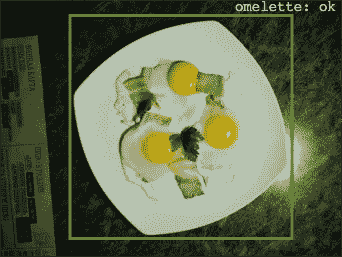
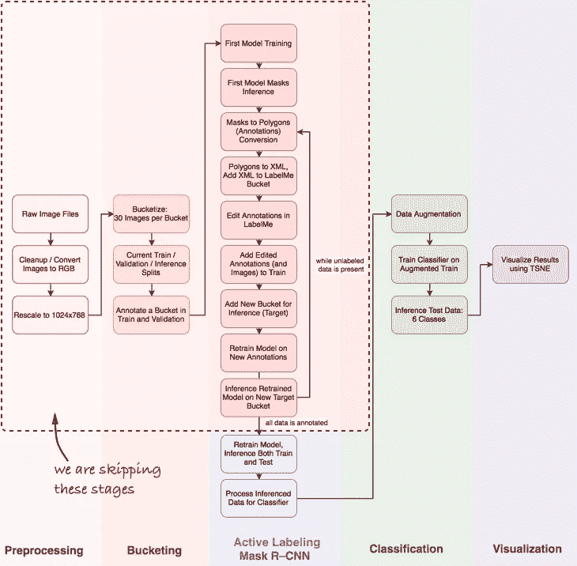
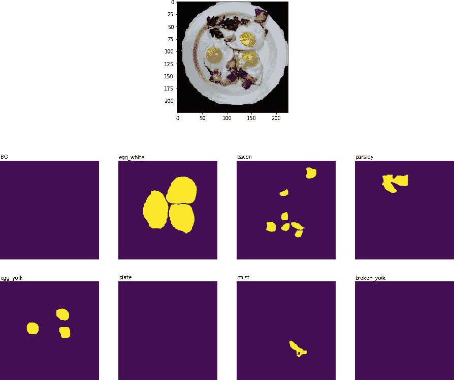
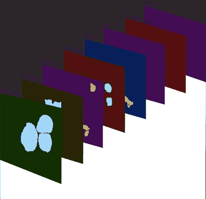
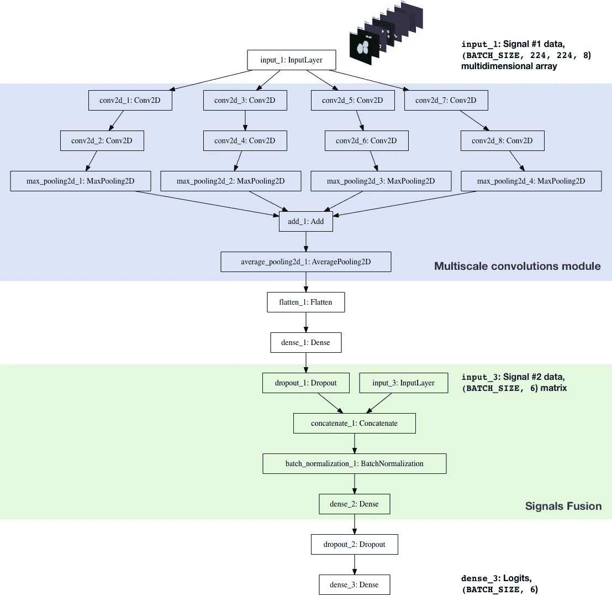

# ConvNets 系列。使用 Mask R-CNN 的实际项目原型

> 原文：<https://towardsdatascience.com/convnets-series-actual-project-prototyping-with-mask-r-cnn-dbcd0b4ab519?source=collection_archive---------5----------------------->

# 介绍

这个 ConvNets 系列从德国交通标志的玩具数据集进展到我被要求解决的一个更实际的现实生活问题:**“有没有可能实现一种深度学习魔法，仅使用照片作为单一输入，来区分*好的*质量的菜肴和*差的*质量的菜肴？”**。简而言之，企业希望这样:

When a business looks at ML through pink glasses, they imagine this

这是一个不适定问题的例子:由于 done 的定义非常模糊(更不用说实现了)，所以无法确定解决方案是否存在，以及该解决方案是否唯一且稳定。虽然这篇文章不是关于有效的沟通或项目管理，但有一点是必要的:**你永远不应该参与范围很小的项目。处理这种不确定性的一个行之有效的方法是首先建立一个定义良好的原型，然后再构建剩下的任务。这就是我们采取的策略。**

# 问题定义

在我的原型中，我专注于菜单中的单个项目——煎蛋卷——并构建了一个可扩展的数据管道，输出煎蛋卷的感知“质量”。可以概括为这样:

*   **问题类型:**多类分类，质量的 6 个离散类:`[good, broken_yolk, overroasted, two_eggs, four_eggs, misplaced_pieces]`。
*   **数据集:** 351 张手动采集的各种煎蛋的 DSLR 相机照片。Train/val/test: 139/32/180 洗牌照片。
*   **标签:**给每张照片分配一个主观质量等级。
*   **度量:**分类交叉熵。
*   **必要的领域知识:**一个“好”的煎蛋的定义是三个鸡蛋，蛋黄未破裂，一些培根，没有烧焦的碎片，中间有一片欧芹。此外，它的组成应该是视觉上正确的，例如，不应该有分散的碎片。
*   **done 的定义:**原型开发两周之后测试集上的最佳可能交叉熵。
*   **结果可视化:**测试集低维数据表示的 t-SNE。

Input images as they are captured with camera

主要目标是*使用神经网络分类器获得并组合提取的信号*，并让分类器做出关于测试集中项目的类别概率的 softmax 预测。这样的目标将使这个原型可行，并可用于以后的使用。以下是我们提取并发现有用的信号:

*   关键成分面膜(Mask R-CNN): *信号#1。*
*   按每种成分分组的关键成分计数(基本上是不同成分计数的矩阵):*信号#2。*
*   背景被删除的煎蛋卷板的 RGB 作物。为了简单起见，我决定暂时不将它们添加到模型中。这可能是最明显的信号:只需使用一些奇特的损失函数在这些图像上训练一个 ConvNet 分类器，并在低维嵌入中采用从选定的典范图像到当前图像的 L2 距离。不幸的是，我没有机会测试这个假设，因为我只限于训练集中的 139 个样本。

# 50K 管道概述

我省略了几个重要的阶段，如数据发现和探索性分析、基线解决方案和主动标记(这是我自己对受[多边形-RNN 演示视频](https://www.youtube.com/watch?v=S1UUR4FlJ84)启发的半监督实例注释的花哨名称)以及 Mask R-CNN 的管道(在后面的帖子中会有更多相关内容)。为了拥抱整个管道，这里是它的 50K 英尺视图:

We are mostly interested in the Mask R-CNN and classification stages of the pipeline

对于这篇文章的其余部分，我将重点关注三个阶段:[1]屏蔽 R-CNN 的成分屏蔽推理，[2]基于 Keras 的 ConvNet 分类器，[3]t-SNE 的结果可视化。

# 阶段 1:屏蔽 R-CNN 和屏蔽推理

口罩 R-CNN (MRCNN)最近得到了大量的报道和炒作。从最初的[脸书的论文](https://arxiv.org/abs/1703.06870)开始，到 Kaggle 上的[数据科学碗 2018](https://www.kaggle.com/c/data-science-bowl-2018) ，Mask R-CNN 证明了自己是实例分割(对象感知分割)的强大架构。我使用的基于 Keras 的 [Matterport 的 MRCNN 的实现](https://github.com/matterport/Mask_RCNN)绝对是一种享受。代码结构良好，文档清晰，开箱即用，尽管比我预期的要慢。

MRCNN 中的一段话:

> MRCNN 由两个明确的部分组成:主干网络***和网络头部***从而继承了更快的 R-CNN 架构。基于特征金字塔网络(FPN)或 ResNet101 的卷积骨干网络作为整个图像的特征提取器。在此之上是区域建议网络(RPN ),它对头部的多尺度 RoI(感兴趣区域)进行采样。网络头进行边界框识别和应用于每个 RoI 的掩模预测。在两者之间，RoIAlign 图层将 RPN 提取的多尺度要素与输入精确对齐。******

************

******MRCNN framework as presented in the original paper******

********对于实际应用，尤其是原型制作，预训练的 ConvNet 至关重要。**在许多现实生活场景中，数据科学家的标注数据集非常有限，甚至没有任何标注。相比之下，*conv net 需要大的标记数据集来收敛*(例如，ImageNet 数据集包含 1.2M 的标记图像)。这就是[迁移学习](http://cs231n.github.io/transfer-learning/)帮助的地方:一种策略是冻结卷积层的权重，只重新训练分类器。为了避免模型过度拟合，Conv 图层权重冻结对于小数据集非常重要。******

******以下是我在一个时期的训练后得到的样本:******

************

******The result of instance segmentation: all key ingredients are detected******

******下一步(*处理分类器*的推断数据，在我的 50K 管道视图中)是裁剪包含盘子的图像部分，并从该裁剪中提取每种成分的 2D 二进制掩码:******

************

******Cropped image with the target dish and its key ingredients as binary masks******

******这些二进制掩码然后被组合成一个 8 通道图像(正如我为 MRCNN 定义的 8 个掩码类)——这就是我的*信号#1* :******

************

******Signal #1: 8-channel image composed of binary masks. Colors are just for better visualization******

******对于*信号#2* ，我从 MRCNN 推断中计算了每种成分的数量，并将其打包到每种作物的特征向量中。******

# ******阶段 2:基于 Keras 的 ConvNet 分类器******

******CNN 分类器是使用 Keras 从头开始实现的。我心中的目标是融合几个信号(*信号#1* 和*信号#2* ，以及在未来添加更多数据)，并让网络对菜肴的质量等级做出预测。以下架构是实验性的，离理想状态还很远:******

************

******关于分类器架构的几点观察和评论:******

*   ********多尺度卷积模块**:最初我为卷积层选择了一个 5x5 的内核，但是这个决定只给了我一个满意的分数。用几种不同核的卷积层`AveragePooling2D`得到了更好的结果:3x3，5x5，7x7，11x11。在每一层之前增加了额外的 1x1 卷积层，以减少维数。这个组件有点类似于 [Inception 模块](https://www.cv-foundation.org/openaccess/content_cvpr_2015/papers/Szegedy_Going_Deeper_With_2015_CVPR_paper.pdf)，尽管我克制自己不去构建一个深度网络。******
*   ********更大的内核:**我使用了更大的内核大小，因为更大的尺度特征可以很容易地从输入图像中提取出来(输入图像本身可以被视为具有 8 个过滤器的激活层——每个成分的二进制掩码基本上是一个过滤器)。******
*   ********信号融合:**我的简单实现只使用了一层非线性来合并两个特征集:处理过的二进制掩码(信号#1)和成分计数(信号#2)。尽管很幼稚，添加信号#2 为分数提供了一个很好的提升(交叉熵从`0.8`提高到`[0.7, 0.72]`)******
*   ********逻辑:**根据张量流，这是应用`tf.nn.softmax_cross_entropy_with_logits`计算批次损失的层。******

# ******阶段 3:t-SNE 的结果可视化******

******对于测试集结果可视化，我使用了 t-SNE，一种用于数据可视化的流形学习技术。t-SNE 使用非常显著的非凸损失函数来最小化低维嵌入数据点和原始高维数据的联合概率之间的 KL 散度。你绝对应该读一下[的原始论文](https://lvdmaaten.github.io/publications/papers/JMLR_2008.pdf)，它信息量极大，写得很好。******

******为了可视化测试集分类结果，我推断了测试集图像，提取了分类器的 logits 层，并对该数据集应用了 t-SNE。虽然我应该用不同的困惑值来玩，但结果看起来还是不错的。动画 GIF:******

************

******t-SNE of the test set predictions by the classifier******

******虽然不完美，但这种方法确实有效。尽管如此，仍有许多需要改进的地方:******

*   ********更多数据。** ConvNets 需要大量数据，而我只有 139 个样本用于训练。像数据增强这样的技巧工作得很好(我使用了一个 [D4，或二面角，对称群](https://en.wikipedia.org/wiki/Dihedral_group)增强，产生了 2K+增强图像)，但更多的真实数据对于良好的性能至关重要。******
*   ********合适的损失函数。**为了简单起见，我使用了开箱即用的分类交叉熵损失。我会切换到一个更合适的损失函数，一个更好地利用类内方差的函数。一开始一个好的选择可能是三重损失(详见 [FaceNet 论文](https://arxiv.org/pdf/1703.07737.pdf))。******
*   ********更好的整体分类器架构。**当前的分类器基本上是一个原型，其目标是解释输入的二进制掩码并将多个特征集组合成一个推理管道。******
*   ********更好的标注。我在手动图像标记(6 个质量等级)上相当马虎:分类器在十几个测试集图像上胜过了我自己！********

********超越与自省。**在实践中，企业没有数据、没有注释、没有清晰明确的技术任务需要完成的情况非常普遍(我们应该停止否认这一事实)。这是一件好事(否则，他们为什么需要你？):您的工作是拥有工具、足够多的多 GPU 硬件、业务和技术专业知识的组合、预训练的模型以及为业务带来价值所需的一切。******

******从小处着手:可以用乐高积木搭建的工作原型可以提高进一步对话的效率——作为一名数据科学家，你的工作就是向企业推荐这种方法。******