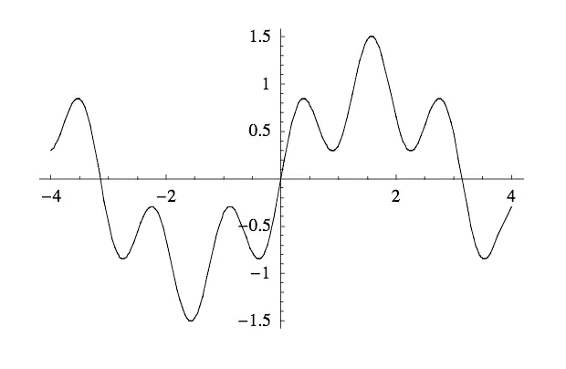
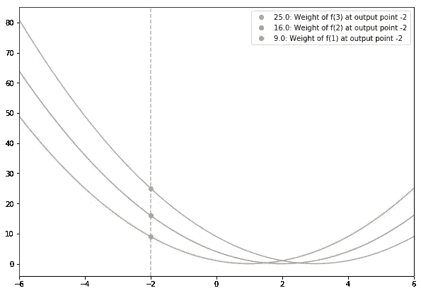
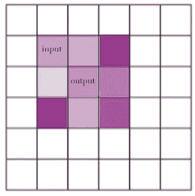
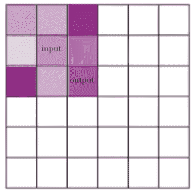

# 卷积:探索一个熟悉的算子的深层根源

> 原文：<https://towardsdatascience.com/convolution-a-journey-through-a-familiar-operators-deeper-roots-2e3311f23379?source=collection_archive---------8----------------------->

在现代机器学习的世界中，卷积算子占据着奇怪的位置:它对任何一个读过 2012 年以来的神经网络论文的人来说都非常熟悉，同时也是一个对其更深层次的数学基础往往知之甚少的对象。在音频处理环境中，您可能会听到它被描述为信号平滑器。在卷积网络中，它聚集来自附近像素的信息，也被描述为模式匹配过滤器，根据特定的局部像素模式更强烈地激活。从表面上看，卷积的所有这些不同的概念方面是如何植根于一个共享的数学现实的，这并不明显。

将所有这些解释拼凑成一个共享的理解网络的过程让人想起最终*真的看着*你每天经过的建筑上的一幅壁画，却发现它有着你以前从未见过的深刻内涵。从表面上看，这一理论的大部分可能与从业者的工作无关，但我认为，对我们日常使用的网络回旋的知识谱系有一个更坚实的理解，可以让我们从信心的基础上参与这个主题的文学，而不是困惑。

# 最好的起点

我们的故事不是从卷积进入应用科学领域开始的，而是从它下面的简单数学定义开始的。我知道，对于那些熟悉基于滤波器的卷积的人来说，这种框架可能是新的和陌生的，但请坚持下去，我将尽最大努力最终将所有的点连接起来。

在上式中，f 和 g 都是作用于相同输入域的函数。在概率的背景下，你可以把它们框定为密度函数；在音频处理中，它们可能是波形；但是，从根本上说，我们可以把它看作是一些通用函数。当你将两个函数卷积在一起时，卷积本身就是一个函数，因为我们可以计算卷积在特定点 t 的值，就像我们可以计算一个函数一样。

为了遍历这里发生的情况，为了计算 f 和 g 在 t 点的卷积，我们对负无穷和正无穷之间的所有τ值进行积分，并且在每一点，将 f(x)在τ位置的值乘以 g(x)在 t—τ的值，即计算卷积的点与积分中给定点的τ之间的差。

乍一看，这个计算似乎是任意的:很容易机械地理解正在计算的内容，但是很难凭直觉理解为什么这是一个有用的操作。为了更清楚地说明它的用途，我将从几个不同但相互关联的角度来研究这个操作。

# **卷积作为函数平滑**

我发现考虑卷积的一个有用的方法是类比核密度估计。在 KDE，你选择某个核函数——也许是高斯函数——并以数据集中的每一点为中心，将该核函数的副本相加。在许多数据点密集地彼此靠近的情况下，这些函数副本将会增加；最终，这个过程会产生一个概率密度函数的经验近似值。为了这个类比的目的，重要的事情是内核在数据点周围充当平滑器的方式。如果我们只是使用一个简单的直方图，并在每个观察数据点的位置直接添加一个质量单位，我们的结果将会非常不连贯和不连续，特别是在小样本量的情况下。通过使用将质量分散到附近点的核，我们表达了对光滑函数的偏好，利用了自然界中许多潜在函数都是光滑的直觉。

在卷积中，我们不是平滑由数据点的经验分布创建的函数，而是采用更一般的方法，这允许我们平滑任何函数 f(x)。但是我们使用类似的方法:我们取某个核函数 g(x ),在积分中的每一点放置一个 g(x)的副本，放大——也就是说，乘以——f(x)在该点的值。

上图显示了这种效果的可视化效果，摘自[对卷积](http://bmia.bmt.tue.nl/Education/Courses/FEV/book/pdf/90%20Appendix%20B%20-%20The%20concept%20of%20convolution.pdf)的出色总结。

上面的图显示了原始 f(x)，即我们想要平滑的噪声信号。左下方显示了“内核加权”过程，在这里，高斯函数被放置在每个点的中心，并通过该点的 f(x)值按比例放大。*【题外话:这在技术上显示了一个有限卷积，其中你对一组有限的缩放核求和，每个核以沿着函数的一组有限的采样点中的一个为中心，但直觉转移到更难可视化的无限情况，在这种情况下，你对函数进行真正的积分，而不仅仅是对采样点求和】*。最后，右下方的图显示了当你对所有这些比例核求和时得到的结果:( f*g)(x)的卷积图。

# **卷积作为局部化信息的聚合**

一个完全不同的视角——使我们更接近于在神经网络中使用卷积的方式——是卷积作为一种信息聚合，但从特定点的角度进行聚合:卷积被评估的点。(为了简洁起见，我将这个点称为“输出点”，积分所经过的点称为“输入点”)输出点想要汇总关于函数的整个域中 f(x)的值的信息，但是它想要根据一些特定的规则来这样做。也许它只关心 f 在距离它一个单位的点上的值，而不需要知道那个窗口之外的点。也许它更关心空间中离自己更近的点，但它关心的程度会平稳衰减，而不是像第一个例子那样，在某个固定窗口之外下降到零。或者，也许它最在乎的是离它很远的点。所有这些不同种类的聚合都可以归入卷积的框架中，它们通过函数 g(x)来表示。

从数学的角度来看，卷积可以被看作是计算 f(x)的值的加权和，并且这样做的方式是每个 x 的贡献由其与输出点 t 之间的距离来确定。更准确地说，权重是通过询问“如果有一个以每个点 x 为中心的 g(x)的副本，如果我们在输出点 t 对其求值，该复制函数的值会是多少”来确定的。

为了形象化这一点，看看下面的图。在这个例子中，我们使用 g(x) = x，想象我们如何计算 x = -2 的加权和的权重。

橙色曲线是 g(x)，但以 x=1 为中心，它在 x=-2 的值是 9。绿色和紫色曲线分别表示以 x=2 和 x=3 为中心的 g(x)。如果我们假设 f 是一个只在 1、2 和 3 取非零值的函数，我们可以计算(f * g)(-1)如下: **9*f(1) + 16*f(2) + 25*f(3)**

看上面这张图，有了 g(x)的多个重叠副本，信息聚合框架和 KDE 框架之间的联系很容易。当我们把注意力集中在一个特定的输入点上时，每个点的 g(x)的副本都在回答“来自这个点的 f(x)信息将如何被传播出去”这个问题。当我们聚焦一个特定的输出点时，我们在问“在这个输出点上，其他点对 f(x)的聚合的贡献有多强”。前一部分的多拷贝图上的每条垂直线对应于给定 x 处的卷积，读取该线与每个 g(x)拷贝的交点，得到 f(x)在 x 处的权重，该拷贝位于 x 的中心。

# 以一个混乱点为中心

将卷积视为信息聚合器让我们更接近它们在神经网络中扮演的角色，在神经网络中，它们在某个点周围的局部区域中总结下层的行为。然而，仍然存在两个有意义的差距。

第一个事实是，乍一看，图像卷积滤波器似乎与本文迄今为止使用的示例在结构上非常不同，因为滤波器是 2D 和离散的，而示例是 1D 和连续的。但是，在实践中，这些差异更多的是装饰性的，而不是根本性的:简单的情况是，在图像上，f(x)和 g(x)是在 2D 空间(x_1，x_2)上定义和索引的，并且该空间被分块到函数值不变的离散仓中。

关于从传统卷积到网络卷积的跳跃，实际上困难和不直观的是，当我们看到局部聚集在神经网络上下文中发生时，我们通常将它描述为通过以聚集点为中心的加权核**发生，**根据该核从周围环境中提取信息。网络中的卷积滤波器由输出点(以及输出点本身)周围所有输入点的权重组成。

You’ve probably seen this image before, or something very like this

然而，正如你可能还记得的，在这篇文章前面的讨论中，传统的数学卷积实际上并不把它的 g(x)权重核放在输出点的中心。在卷积公式中，g(x)的副本位于每个输入点的中心，并且该副本在给定输出处的值决定了该输入点的权重。因此，令人困惑的是，我们在网络卷积中所知的**滤波器核与卷积公式中的 g(x)不是一回事。**如果我们想使用卷积公式应用网络过滤器，我们必须翻转它(在 1D 的情况下)或对角翻转它(在 2D 的情况下)。反过来，如果我们想从卷积积分中提取一个 g(x)并将其用作输出中心滤波器，那么该滤波器就是 g(-x)。

在内核对称的情况下，这并不重要，但在典型的卷积滤波器中，对称并非如此:“在中心的右侧，向下一个”的权重不同于“在中心的左侧，向上一个”的权重，因此，如果您简单地使用以输出为中心的滤波器，并尝试在以输入点为中心的适当卷积框架中使用它，您将获得不同的权重。您可以在上面的可视化中更清楚地看到这一点，其中我们使用以输出为中心的 g(x)内核版本来为每个输入生成权重，然后使用以输入为中心的版本，并且可以看到，您不能在一个过程中使用相同的内核，而在另一个过程中使用相同的内核来获得相同的结果。这个事实——你不能直接把以输出为中心的核作为 g(x)插入卷积方程——是我对卷积最大的持续困惑，因为它似乎在做几乎相同的事情，而且因为如此多的解释使用对称核，所以区别并不突出。

# 卷积作为模式匹配器

如果你已经做到了这一步，你现在有希望更好地理解我们所知道和喜爱的滚动重量过滤器是如何连接到一个看起来模糊的积分的——尽管不是直接插入——的。最后一个难题是理解权重过滤器如何作为模式匹配器工作，这是卷积过滤器通常被描述的方式。为什么一个点周围的 f(x)值越像过滤器权重(此处 f(x)是像素值或来自较低网络层的值)，该点的卷积值就越高？

简单的答案是，离散卷积相当于在滤波器权重和滤波器下的值之间取点积，从几何角度来说，点积衡量向量相似性。以输出为中心的卷积的工作原理是取一个权重向量和一个输入值向量，然后将对齐的条目相乘并求和:这就是计算点积。当然，您可以通过增加一个或两个向量的大小来增加点积的值，但是对于固定的大小，当向量指向相同的方向时，或者在我们的情况下，当像素值中的强度模式与权重过滤器中的高权重和低权重匹配时，点积的最大值就会达到。

# 剩余问题

即使我到了一个我可以舒服地发表博客的地方，我还是经常会有一些我直觉上不太理解的问题，而这篇文章也不例外。对我来说，这里最突出的问题是卷积算子和傅里叶变换之间的联系。傅里叶变换的众多名声之一是它对角化了卷积算子:也就是说，如果你把你的基转移到傅里叶变换的指数集，卷积两个函数就相当于在这个基上乘以它们。虽然我可以大声说出这些事实，但我还真不明白为什么它们是真的。