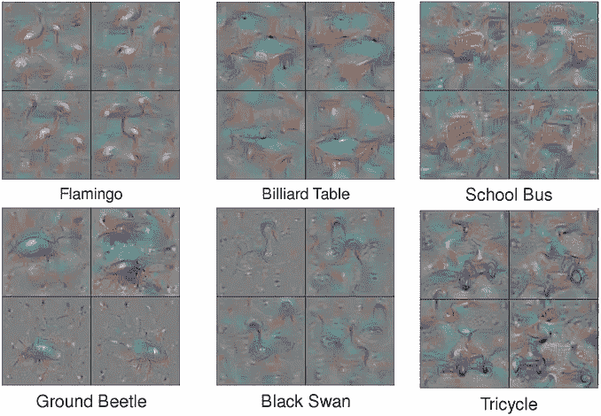
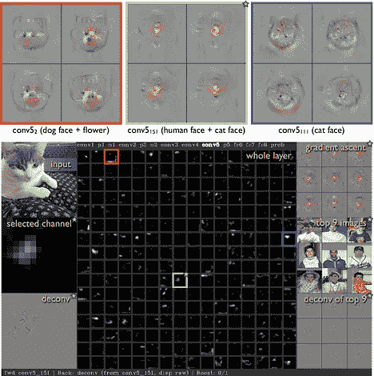
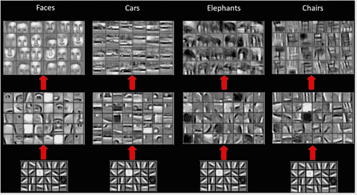
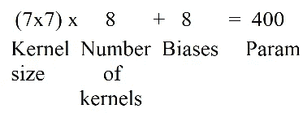
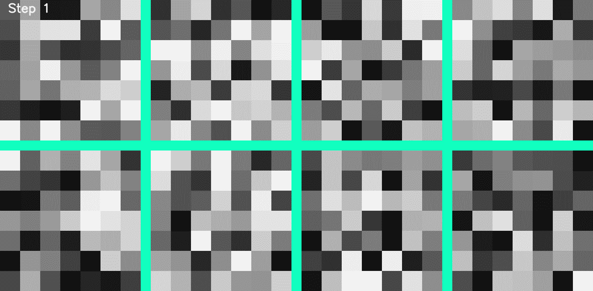
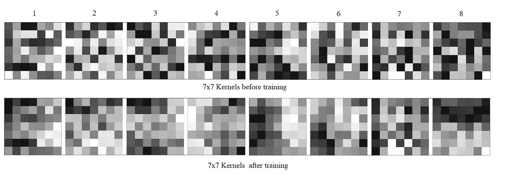
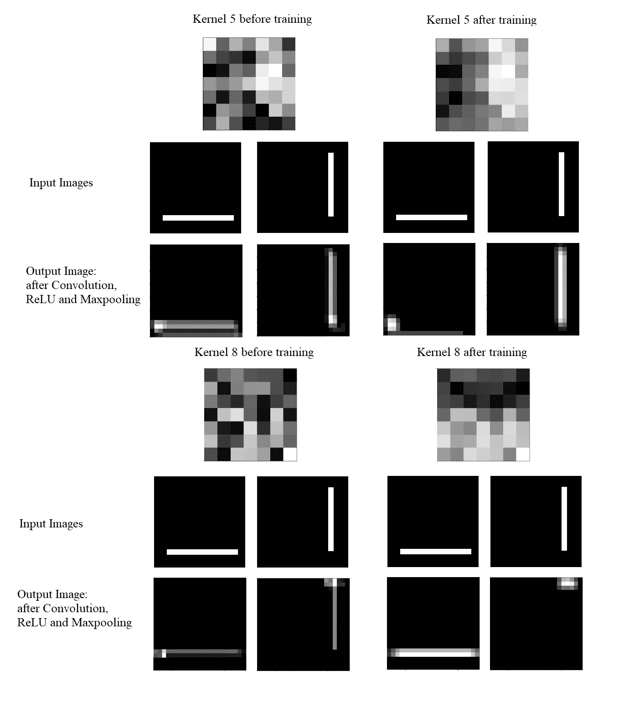

# 用简单图像解密卷积神经网络

> 原文：<https://towardsdatascience.com/convolution-neural-network-decryption-e323fd18c33?source=collection_archive---------12----------------------->

本文试图通过简单图像的可视化来解释卷积神经网络。使用非常基本的对象，如垂直线和水平线。避免了来自 ImageNet 数据集的复杂图像，因为可视化不容易解释。

当我在 2017 年开始为一个计算机视觉项目进行深度学习时，我遇到的第一个教程是像许多其他人一样使用卷积神经网络的猫/狗分类和 MNIST 例子。尽管这些例子让我们大致了解了 CNN 的工作方式及其令人难以置信的效率，但要真正理解其内部工作方式却很困难。我看到有很多关于使用不同的框架从头开始构建 CNN 的文章，也有关于各种数据集构建分类器的文章。毫无疑问，现在任何人都可以使用许多著名的框架在 30 分钟内建立一个非常好的图像分类模型。

我不打算进入梯度下降和反向传播的数学，因为已经有足够的资源可用。我们中的许多人确实理解数学，但仍然觉得我们错过了一些东西。自从深度神经网络出现以来，许多人都有同样的感觉，并一直试图找出理解黑盒真正学习什么以及如何更好地调整它们的方法。

许多人创造了许多可视化技术来了解 CNN 所学的内容，我相信你们中的许多人会遇到许多奇怪的彩色图像，这些图像会给我们带来很少的概念，甚至更糟，让我们觉得我们根本不了解任何东西，就像下面的这些:

我觉得这主要是因为我们实验的所有例子都是高层次的图像。对于没有计算机视觉经验的人来说，猫/狗、ImageNet 甚至 MNIST 数据集都是太复杂的问题。

所以，在这里我将用一个非常简单的水平线和垂直线的数据集来解释 CNN。我在每个类中生成了大约 600 张大小为 50x50 的图像，如下所示，我们将使用 CNN 对它们进行分类:

现在想象一下，给你一个任务，让你从头开始编写一个算法来对图像进行分类。对于任何有计算机视觉背景的人来说，这都是一个非常简单的任务，因为我们需要做的只是实现一个基本的边缘检测算法。现在有一些算法已经用于边缘检测很多年了。

我将在这里演示 Prewitt 操作符，但也可以尝试其他算法。Prewitt 算子用于图像的边缘检测。它检测两种类型的边缘:

*   水平边缘
*   垂直边缘

通过使用图像的相应像素强度之间的差异来计算边缘。从数学上来说，操作者使用两个 3×3 的核来计算导数的近似值，这两个核与原始图像进行卷积(参见 GIF 以获得基本概念),一个用于水平变化，另一个用于垂直变化。

其中*表示 1 维卷积运算。Gx 和 Gy 将分别找到垂直边和水平边。它只是像一阶导数一样工作，并计算边缘区域中像素强度的差异。由于中间列为零，它不包括图像的原始值，而是计算该边缘周围的左右(或上下)像素值的差。这增加了边缘强度，并且与原始图像相比，它变得增强了。

现在让我们回到 CNN，这里我们有多层卷积，最大池，ReLU，Dropout 等等。在许多层中，卷积层是具有可训练参数的层之一，这些参数是内核。在数据科学社区中，内核也被称为权重。

我在一个相当简单的 CNN 模型上训练了我的数据集，如下所示:

我使用 7x7 内核进行卷积。从上述模型可以看出，我在第一层中使用了 8 个内核，因此有 400 个可训练参数，计算如下:

我已经保存了每个时期所有层的权重，并可视化了训练的进度。内核值的范围在 0 到 1 之间，可视化是使用 matplotlib 的颜色映射创建的，因此颜色映射不会准确地再现实际值，但它会给我们一个关于值的分布的好主意。下面是每个训练期后内核的 GIF 图。

Kernel visualization during training

7x7 内核如下图所示，当时它们被**随机初始化**，然后在数据集上训练相同的内核**。**

比较训练前后的内核，我们将不能非常清楚地理解每个内核已经学习了什么。这可以通过在图像上卷积内核并通过 ReLU 和 Maxpooling 层传递图像来更好地理解。为了更容易理解，我选择了两个内核，它们对于水平和垂直边缘都被很好地激活了。

当在输入图像上卷积时，训练前的核 5 和 8 具有非常模糊的输出，并且没有清晰的激活。但是在训练之后，内核 5 很好地激活了垂直线，而不是水平线。更具体地说，它从左向右搜索边缘。如果你仔细观察内核 5，你会发现内核的左边更接近于 0，右边更接近于 1。在内核 8 中可以看到类似的模式，水平线被激活。

因此，从上面的图像中，我们可以了解到，通过反向传播，该模型已经学会了通过理解数据集来自己提出类似 Prewitt 算子核的东西。这里唯一的区别是有很多内核，每个内核都学到了一些东西(除了少数死内核)。

现在，如果我们进入下一层，与边缘检测相比，内核开始学习更高级别的特征，例如低级和高级模式识别。但问题是，因为即使在小模型中也存在大量可训练参数，所以很难将更高级的特征可视化。我这里不包括可视化，因为将会有大量的数据，并且很难理解。我将在另一篇文章中写它。

下面，我将我的模型可视化，在一个输入的水平线图像上，从头到尾，只是为了给出一个图像在下一层如何进展的概念:

我希望这篇文章能帮助你更好地理解 CNN。请在下面分享您的反馈或疑问。