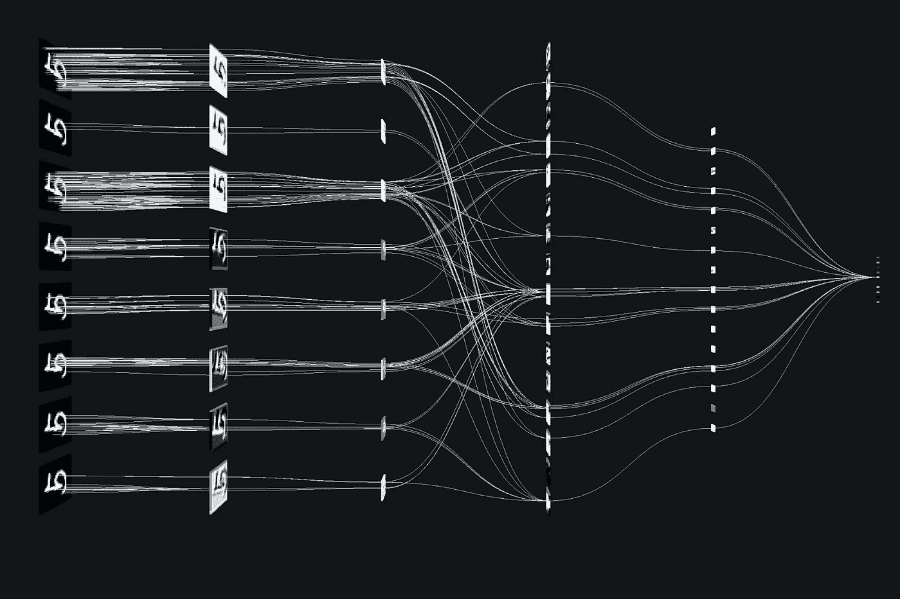
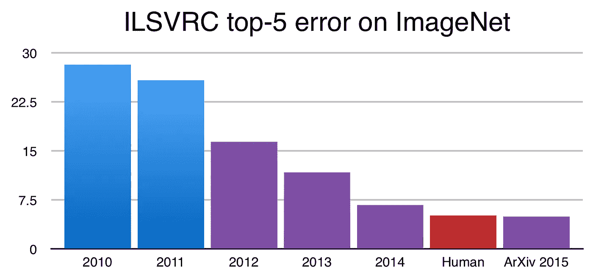
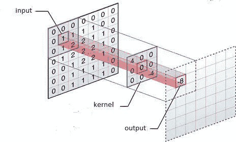
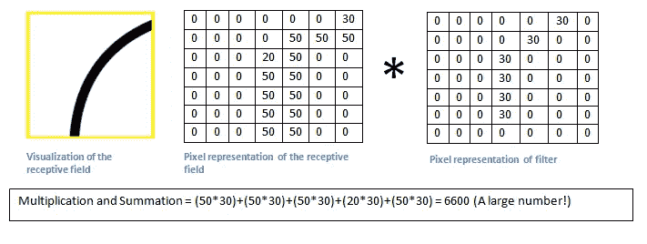
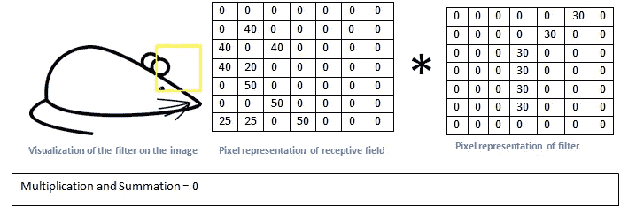
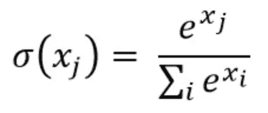
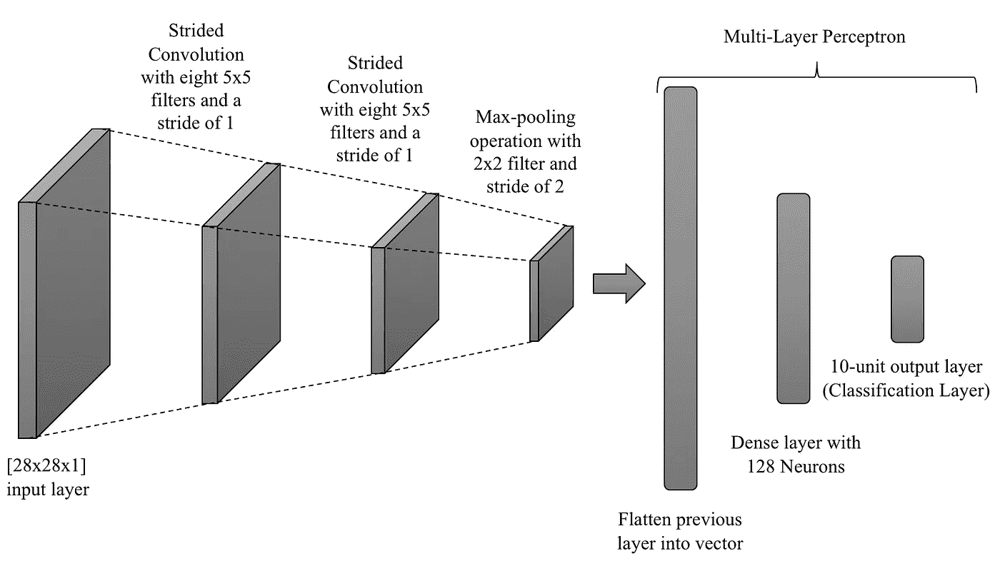
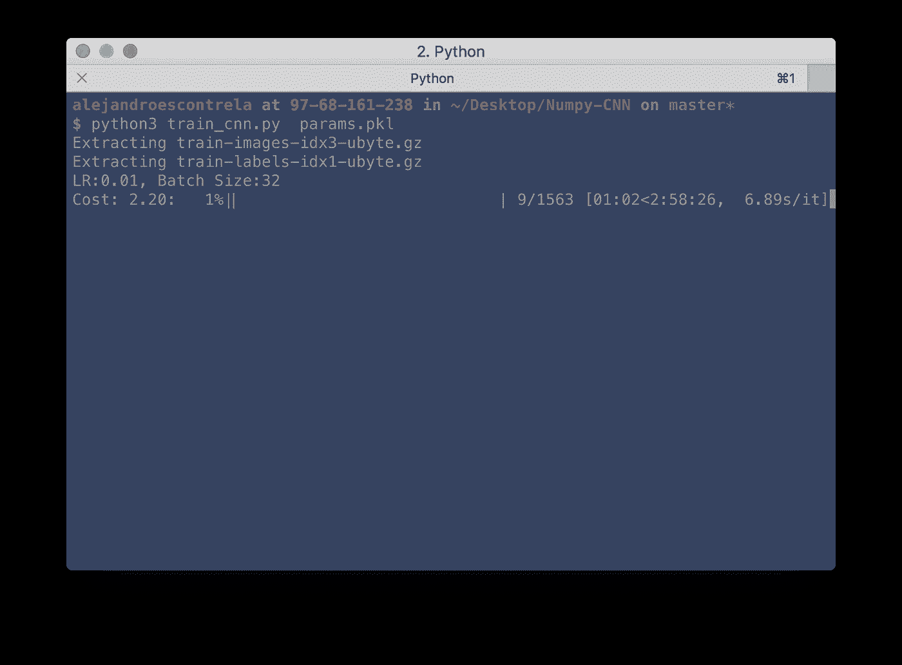
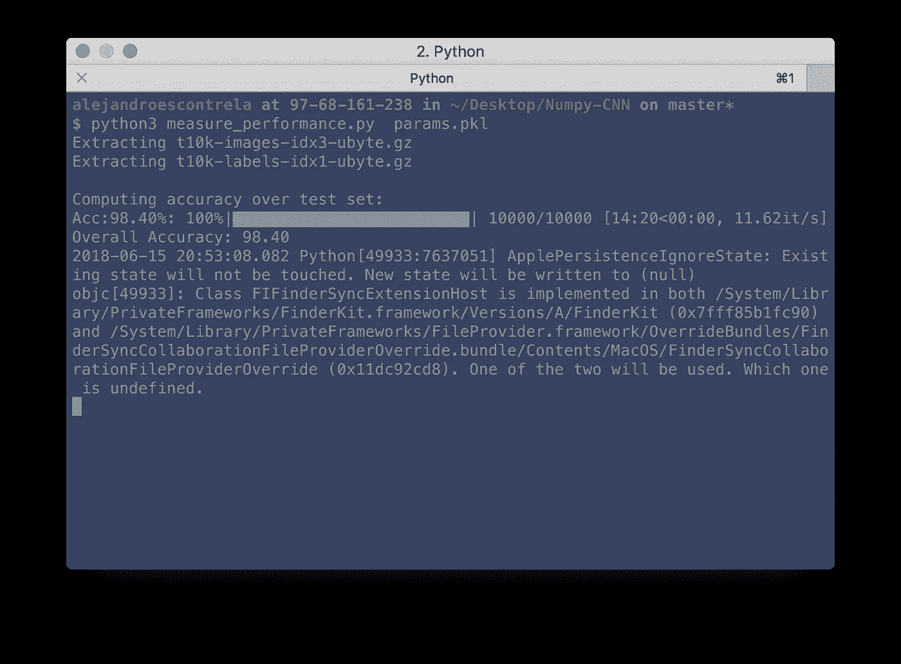
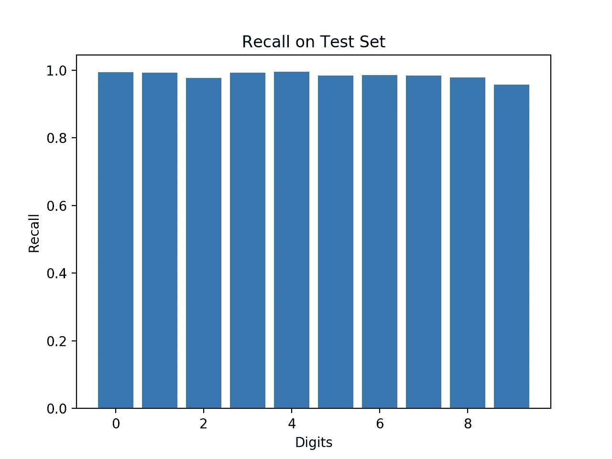

# 卷积神经网络

> 原文：<https://towardsdatascience.com/convolutional-neural-networks-from-the-ground-up-c67bb41454e1?source=collection_archive---------2----------------------->



Visualization of a convolutional neural network. [image source](https://www.kdnuggets.com/2018/02/8-neural-network-architectures-machine-learning-researchers-need-learn.html)

## 著名的卷积神经网络的 NumPy 实现:迄今为止最有影响力的神经网络架构之一。

当 Yann LeCun 发表了他关于一种新的神经网络体系结构[1]卷积神经网络(CNN)的研究成果时，他的工作很大程度上没有引起人们的注意。在 2012 年 ImageNet 计算机视觉竞赛期间，多伦多大学的一组研究人员花了 14 年时间将 CNN 带入公众视野。他们的参赛作品以首席建筑师 Alex Krizhevsky 的名字命名为 AlexNet，在对来自数千个类别的数百万张图像进行分类时，误差仅为 15.8%。快进到 2018 年，当前最先进的卷积神经网络实现了超过人类水平性能的精度[3]。



ImageNet top-5 error 2010–2015\. [source](https://devblogs.nvidia.com/mocha-jl-deep-learning-julia/)

在这些有希望的结果的激励下，我开始了解 CNN 的功能，以及它们是如何表现得如此出色的。正如理查德·费曼指出的那样，*“我不能构建的，我不理解”*，因此为了全面了解人工智能的这一进步，我在 NumPy 中从头开始构建了一个卷积神经网络。完成这个项目后，我觉得卷积神经网络看起来有多复杂，和它们实际上有多复杂之间有一个脱节。希望你从零开始建立自己的网络后，也能分享这种感觉。

这个项目的代码可以在[这里](https://github.com/Alescontrela/Numpy-CNN)找到。

# 挑战

CNN 以其识别图像中存在的模式的能力而闻名，所以这篇文章中描述的网络的任务是图像分类。衡量计算机视觉算法表现如何的最常见基准之一是在 [MNIST 手写数字数据库](http://yann.lecun.com/exdb/mnist/)上训练它:一个 7 万个手写数字及其相应标签的集合。目标是训练 CNN 在标记手写数字(范围从 0 到 9)时尽可能准确。经过大约五个小时的训练和训练集上的两次循环，这里介绍的网络能够在测试数据上达到 98%的准确率，这意味着它可以正确地猜出几乎每个显示给它的手写数字。


Example of digits from the MNIST dataset. [image source](https://codeburst.io/use-tensorflow-dnnclassifier-estimator-to-classify-mnist-dataset-a7222bf9f940?gi=4a1246898237)

让我们来看一下构成网络的各个组件，以及它们如何链接在一起以根据输入数据形成预测。解释完每个组件后，我们将对其功能进行编码。在这篇文章的最后一部分，我们将使用 NumPy(这里的代码[是](https://github.com/Alescontrela/Numpy-CNN))对网络的每一部分进行编程和训练。值得注意的是，本节假设至少具备线性代数和微积分的工作知识，并且熟悉 Python 编程语言。如果你对这些领域不熟悉或者需要调整，请查看[这份出版物](https://arxiv.org/pdf/1802.01528.pdf)以了解机器学习领域的线性代数，以及[这份资源](https://www.codecademy.com/learn/learn-python)以开始用 Python 编程。事不宜迟，我们开始吧。

# 卷积神经网络如何学习

## 回旋

CNN 利用**过滤器**(也称为内核)，来检测图像中存在哪些特征，比如边缘。过滤器只是一个称为权重的值矩阵，用于检测特定的特征。过滤器在图像的每个部分上移动，以检查它想要检测的特征是否存在。为了提供表示特定特征存在的置信度的值，滤波器执行**卷积运算**，这是两个矩阵之间的逐元素积和。



[image source](http://technodocbox.com/3D_Graphics/70716176-Deep-neural-networks-applications-in-handwriting-recognition.html)

当特征出现在图像的一部分中时，滤波器和图像的该部分之间的卷积运算产生具有高值的实数。如果该特征不存在，则结果值较低。

在下面的示例中，负责检查右侧曲线的滤镜会经过图像的一部分。由于图像的该部分包含过滤器正在寻找的相同曲线，卷积运算的结果是一个大的数字(6600)。



[image source](https://adeshpande3.github.io/A-Beginner%27s-Guide-To-Understanding-Convolutional-Neural-Networks/)

但是，当相同的滤波器通过图像的一部分时，具有相当不同的一组边缘，卷积的输出很小，这意味着没有强烈的右手曲线。



[image source](https://adeshpande3.github.io/A-Beginner%27s-Guide-To-Understanding-Convolutional-Neural-Networks/)

在整个图像上传递该滤波器的结果是输出矩阵，该矩阵存储该滤波器在图像的各个部分上的卷积。滤波器的通道数必须与输入图像的通道数相同，这样才能进行逐元素乘法。例如，如果输入图像包含三个通道(例如 RGB)，则滤镜也必须包含三个通道。

2D 图像上滤波器的卷积；


[Introduction to Convolutional Neural Networks](https://rubikscode.net/2018/02/26/introduction-to-convolutional-neural-networks/) by rubikscode

此外，使用**步距**值，滤波器可以以不同的间隔在输入图像上滑动。步幅值由过滤器在每一步应该移动的量决定。步进卷积的输出维度可通过以下公式计算:


其中`n_in`表示输入图像的尺寸，`f`表示窗口大小，`s`表示步幅。

为了使卷积神经网络能够学习检测输入数据中存在的特征的滤波器的值，滤波器必须通过非线性映射。滤波器和输入图像之间的卷积运算的输出与偏置项相加，并通过**非线性激活函数**。激活函数的目的是将非线性引入我们的网络。由于我们的输入数据是非线性的(对形成手写签名的像素进行线性建模是不可行的)，我们的模型需要考虑这一点。为此，我们使用整流线性单元(ReLU)激活功能:


[image source](https://medium.com/@kanchansarkar/relu-not-a-differentiable-function-why-used-in-gradient-based-optimization-7fef3a4cecec)

可以看到，ReLU 函数相当简单；小于或等于零的值变为零，所有正值保持不变。

通常，网络每层使用多个过滤器。在这种情况下，输入图像上每个滤波器卷积的输出沿最后一个轴连接，形成最终的 3D 输出。

**代码**

使用 NumPy，我们可以很容易地对卷积运算进行编程。卷积函数利用 for 循环对图像上的所有滤波器进行卷积。在 for 循环的每次迭代中，使用两个 while 循环在图像上传递过滤器。在每一步，滤波器与输入图像的一部分按元素相乘(`*`)。然后，使用 NumPy 的 [sum](https://www.google.com/search?q=numpy+sum&rlz=1C5CHFA_enUS741US741&oq=numpy+sum&aqs=chrome..69i57j0l5.1102j0j4&sourceid=chrome&ie=UTF-8) 方法对这种逐元素乘法的结果求和以获得单个值，然后加上偏置项。

convolution operation

使用标准正态分布初始化`filt`输入，并且`bias`被初始化为零向量。

在一个或两个卷积层之后，通常减少由卷积层产生的表示的大小。这种表示尺寸的减小被称为**缩减采样。**

## 向下采样

为了加快训练过程并减少网络消耗的内存量，我们尝试减少输入要素中存在的冗余。有几种方法可以对图像进行缩减采样，但在这篇文章中，我们将看看最常用的一种:**最大池**。

在 max pooling 中，窗口根据设定的步幅(每次移动多少个单位)通过图像。在每一步，窗口内的最大值被汇集到输出矩阵中，因此命名为最大汇集。

在下图中，大小为 f=2 的窗口以 2 的步幅通过一幅图像。f 表示最大池窗口(红框)的尺寸，s 表示窗口在 x 和 y 方向移动的单位数。在每一步，选择窗口内的最大值:


[image source](https://zhuanlan.zhihu.com/p/32442184)

最大池显著减小了制图表达的大小，从而减少了所需的内存量以及稍后在网络中执行的操作数量。最大池化操作的输出大小可以使用以下公式计算:


其中`n_in`表示输入图像的尺寸，`f`表示窗口大小，`s`表示步幅。

max pooling 的另一个好处是，它迫使网络专注于少数几个神经元，而不是所有神经元，这对网络具有正则化效果，使其不太可能过度拟合训练数据，并有望很好地推广。

**代码**

最大池操作归结为一个 for 循环和几个 while 循环。for 循环用于遍历输入图像的每一层，而 while 循环用于在图像的每一部分滑动窗口。在每一步，我们使用 NumPy 的 [max](https://docs.scipy.org/doc/numpy-1.14.0/reference/generated/numpy.maximum.html) 方法来获得最大值:

max pooling operation

在多个卷积层和下采样操作之后，3D 图像表示被转换成特征向量，该特征向量被传递到多层感知器，该感知器仅仅是具有至少三层的神经网络。这被称为**全连接层。**

## 全连接层

在神经网络的全连接操作中，输入表示被展平成特征向量，并通过神经元网络来预测输出概率。下图描述了拼合操作:


[image source](https://rubikscode.net/2018/02/26/introduction-to-convolutional-neural-networks/)

这些行被连接起来形成一个长特征向量。如果存在多个输入图层，其行也会被连接起来形成一个更长的特征向量。

然后，特征向量通过多个密集层。在每个密集层，特征向量乘以层的权重，与其偏差相加，并通过非线性。

下图显示了完全连接的操作和密集图层:


[image source](https://cambridgespark.com/content/tutorials/convolutional-neural-networks-with-keras/index.html)

值得注意的是，[根据 Yann LeCun](https://www.facebook.com/yann.lecun/posts/10152820758292143) 的《脸书邮报》，“不存在完全连接的层”，他是对的。当回想卷积层时，人们意识到全连接层是具有 1x1 输出内核的卷积运算。也就是说，如果我们在 n 乘 n 维的图像上通过 128 个 n 乘 n 滤波器，我们将得到长度为 128 的向量。

**代码**

NumPy 使得对 CNN 的全连接层进行编程变得非常简单。事实上，您可以使用 NumPy 的 [reshape](https://docs.scipy.org/doc/numpy-1.14.0/reference/generated/numpy.reshape.html) 方法在一行代码中完成:

fully connected

在这个代码片段中，我们收集了前一层的尺寸(通道数和高度/宽度)，然后使用它们将前一层展平为完全连接的层。这个完全连接的层由多个**密集的神经元层**处理，最终产生原始预测:

dense layers

## 输出层

CNN 的输出层负责在给定输入图像的情况下产生每个类别(每个数字)的概率。为了获得这些概率，我们初始化最终的密集层，使其包含与类别数量相同的神经元。然后，该密集层的输出通过 **Softmax 激活函数**，该函数将所有最终的密集层输出映射到一个向量，该向量的元素总和为 1:



其中 x 表示最终层输出中的每个元素。

**代码**

同样，softmax 函数可以用几行简单的代码编写:

softmax activation function

## 计算损失

为了测量我们的网络从输入图像中预测手写数字的准确性，我们使用了一个**损失函数**。当预测输出数字时，损失函数分配一个实数值来定义模型的准确性。预测多个输出类时常用的损失函数是**分类交叉熵损失函数，**定义如下:


这里，ŷ是 CNN 的预测，y 是期望的输出标签。当对多个示例进行预测时，我们取所有示例的平均损失。

**代码**

分类交叉熵损失函数可以使用两行简单的代码轻松编程，这是上面所示等式的镜像:

categorical cross-entropy loss

这大概就是构成卷积神经网络的所有操作。让我们加入这些行动来构建 CNN。

# 网络

给定相对低数量的类(总共 10 个)和每个训练图像的小尺寸(28×28 像素)。)，选择了一个简单的网络结构来解决数字识别的任务。该网络使用两个连续的卷积层，然后进行最大池操作，以从输入图像中提取特征。在最大池操作之后，表示被展平并通过多层感知器(MLP)来执行分类任务。



Network Architecture

# 为 CNN 编程

现在，我们已经讨论了形成卷积神经网络的基本操作，让我们来创建它。

在跟进时，请随意使用[这个回购](https://github.com/Alescontrela/Numpy-CNN)。

## 步骤 1:获取数据

MNIST 手写数字训练和测试数据可以在[这里](http://yann.lecun.com/exdb/mnist/)获得。这些文件将图像和标签数据存储为张量，因此必须通过它们的字节流读取这些文件。我们定义了两个助手方法来执行提取:

extract train and test data

## 步骤 2:初始化参数

我们首先定义初始化卷积层的滤波器和密集层的权重的方法。为了使训练过程更平滑，我们用平均值 0 和标准偏差 1 初始化每个滤波器。

methods to initialize the network’s parameters

## 步骤 3:定义反向传播操作

为了计算将迫使网络更新其权重并优化其目标的梯度，我们需要定义通过卷积和最大池层反向传播梯度的方法。为了保持这篇帖子(相对)简短，我不会深入这些梯度的推导，但是，如果你想让我写一篇描述通过卷积神经网络反向传播的帖子，请在下面留下评论。

## 步骤 4:构建网络

在精神抽象中，我们现在定义了一种结合卷积神经网络的向前和向后操作的方法。它将网络的参数和超参数作为输入，并输出梯度:

convolutional neural network forward and backward operation

## 步骤 5:训练网络

为了有效地迫使网络参数学习有意义的表示，我们使用了**亚当优化算法**。关于这个算法，我不会讲太多细节，但可以这样想:如果随机梯度下降是一个喝醉的大学生跌跌撞撞地下山，那么亚当就是一个滚下同一座山的保龄球。更好的解释亚当发现[这里](https://machinelearningmastery.com/adam-optimization-algorithm-for-deep-learning/)。

training the network with Adam optimization

这就概括了网络的发展。要在本地训练它，下载[这个 repo](https://github.com/Alescontrela/Numpy-CNN) 并在终端中运行以下命令:

```
$ python3 train_cnn.py '<file_name>.pkl'
```

用您喜欢的任何文件名替换`<file_name>`。终端应显示以下进度条，显示培训进度以及当前培训批次的费用。



a training process with a (very) long way to go

CNN 完成训练后，一个包含网络参数的. pkl 文件被保存到运行脚本的目录中。

在我的 macbook pro 上训练网络大约需要 5 个小时。我在 GitHub repo 中以`params.pkl`的名字包含了经过训练的参数。要使用它们，用`params.pkl`替换`<file_name>`。

要测量网络的准确性，请在终端中运行以下命令:

```
$ python3 measure_performance.py '<file_name>.pkl'
```

此命令将使用定型参数对测试数据集中的所有 10，000 位数字运行预测。完成所有预测后，显示网络精度的值将出现在命令提示符中:



network performance

如果您遇到任何关于依赖关系的问题，可以使用以下命令来安装所需的软件包:

```
$ pip install -r requirements.txt
```

# 结果

在对训练集进行两次运算后，网络在测试集上的准确率平均为 98%，我认为这相当不错。在将训练时间延长 2-3 个时期后，我发现测试集的性能下降了。我推测，在第三到第四次训练循环中，网络开始过度适应训练集，不再泛化。

因为我们传递的是成批的数据，网络必须考虑到每一批数据的可变性，这就是为什么在培训期间成本波动如此之大:


cost vs. number of iterations

此外，我们测量网络的**回忆**，以了解它能够多好地预测每个数字。回忆是对准确性的一种衡量，它可以通过下面的例子来理解:在我们的测试集中所有标记为“7”(或任何其他数字)的数字中，我们的网络正确预测了多少？

下面的条形图显示了每个数字的召回:



这表明我们的网络学习了所有数字的有意义的表示。总的来说，CNN 概括得很好。

# 结论

希望这篇文章能让你对卷积神经网络有更深入的了解，甚至消除它们的复杂性。如果您有任何问题或想了解更多，请在下面留言:)

## 参考

[1]: Lecun，y .等，“基于梯度的学习应用于文档识别”美国电气和电子工程师学会会议录，第 86 卷，第 11 期，1998 年，第 2278-2324 页。，doi:10.1109/5.726791。

[2]: Krizhevsky，Alex 等，“用深度卷积神经网络进行 ImageNet 分类”*《美国计算机学会通讯*》，第 60 卷，2017 年第 6 期，第 84–90 页。，doi:10.1145/3065386。

[3]:何，，等，“深入挖掘整流器:在 ImageNet 分类上超越人类水平的性能” *2015 年 IEEE 计算机视觉国际会议(ICCV)* ，2015，doi:10.1109/iccv.2015.123