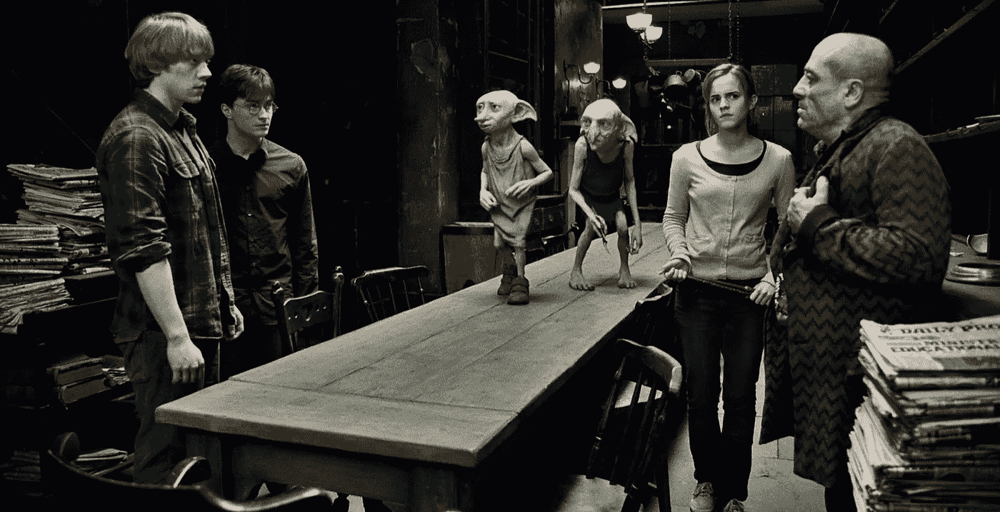
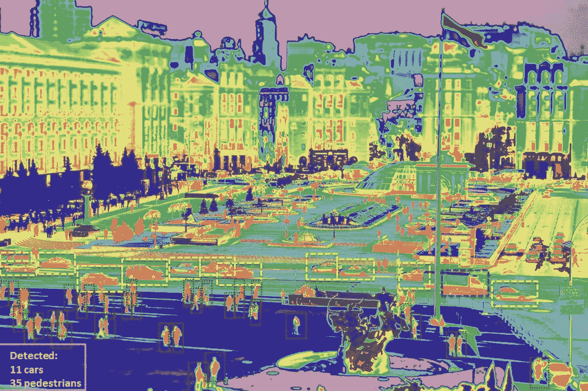
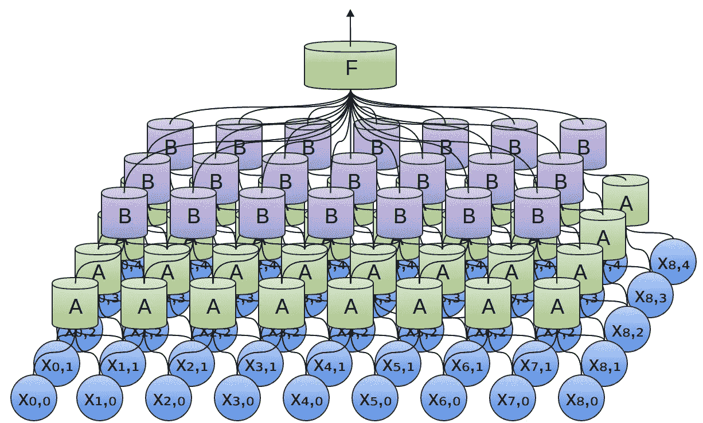
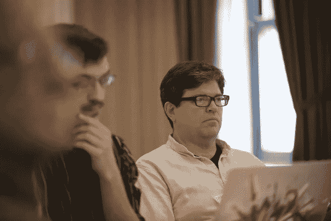
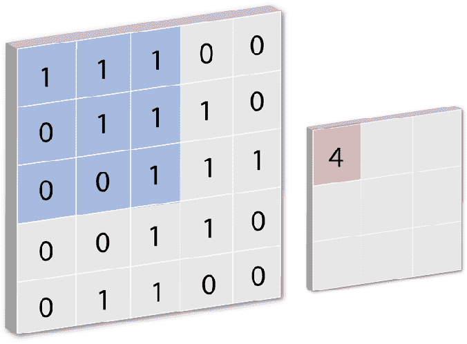
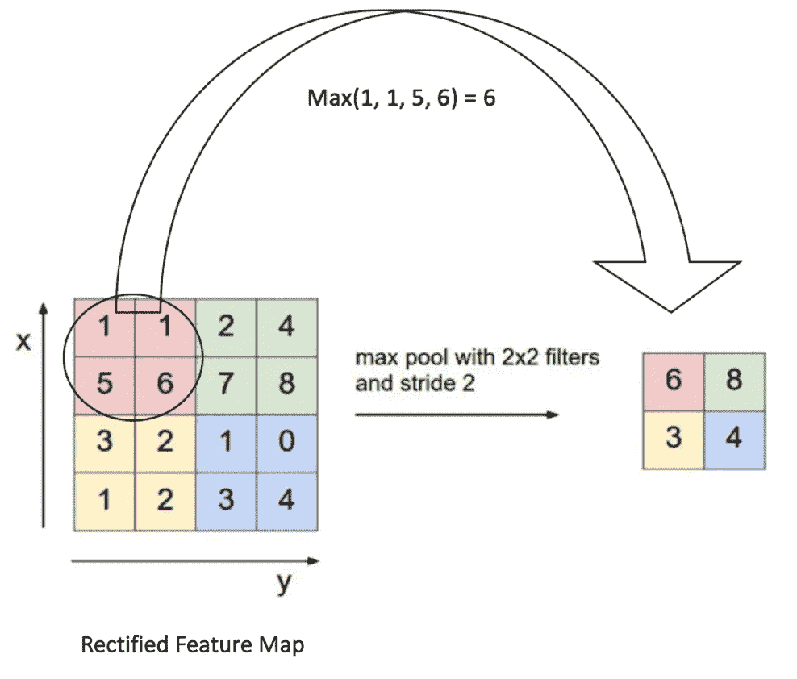
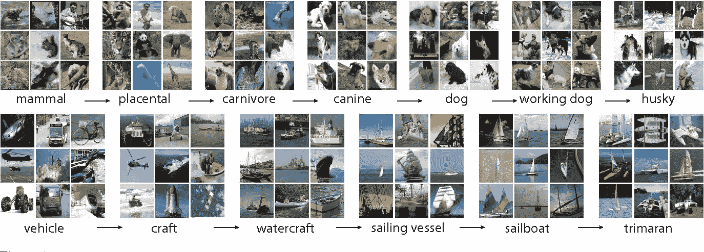
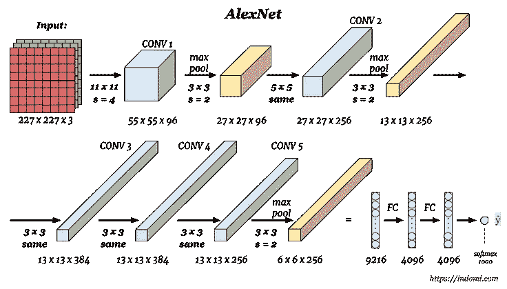
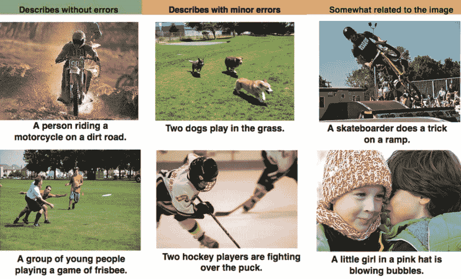

# 卷积神经网络:生物启发模型

> 原文：<https://towardsdatascience.com/convolutional-neural-networks-the-biologically-inspired-model-f2d23a301f71?source=collection_archive---------3----------------------->

你能认出上图中的人吗？如果你是一个科幻迷，你会立刻认出他们是 J.K .罗琳的全球现象哈利波特系列丛书中的哈利、罗恩和赫敏。这张照片是《哈利·波特与死亡圣器》第一部的一个场景——哈利、罗恩和赫敏正在审问小偷蒙顿格斯·弗莱奇，他们不久前被小精灵多比和克利切抓住了。嗯，我知道这一点，因为我已经看过这部电影和这本书很多次了！但是，怎样才能让计算机像你我一样理解这幅图像呢？让我们明确地思考一下，要使它有意义，所有的知识都必须到位:

*   你认出这是一群人的图像，并且明白他们在一个房间里。
*   你认出那里有成堆的报纸和一张带椅子的长木桌，所以位置很可能是厨房或普通客厅。
*   你从构成哈利·波特脸上眼镜的几个像素认出了他。他也有一头黑发，这很有帮助。
*   同样，你认出罗恩·韦斯莱是因为他的红头发，赫敏·格兰杰是因为她的长发。
*   你认出了另一个秃顶、穿着老式服装的男人，这表明他要老得多。
*   你认出了另外两个不是人类的生物(多比和克利切)，即使你不熟悉它们。除了你对正常人长相的了解之外，你还利用了他们的身高、面部结构、身体尺寸。
*   哈利、罗恩和赫敏正在审问那个光头男人。你得出这个结论是因为你知道他们的身体姿势正对着他，你感觉到他们的视力出现了疑问，你还看到赫敏手里拿着一根魔杖(魔杖是哈利波特魔法世界中的魔法武器)。
*   你知道秃头男人感到害怕。鉴于他双手捂胸，你明白他在隐瞒什么。你开始思考这个场景后几秒钟即将展开的事件的含义，并对将会揭露什么秘密感到好奇。
*   这两个生物正看着哈利和罗恩。看起来，他们想说些什么。换句话说，你是在推理那些生物的精神状态。哇，你会读心术！

我可以继续，但这里的要点是，当你看照片时，你在那一秒钟使用了大量的信息。关于场景的 2D 和 3D 结构的信息，视觉元素，如人的身份、他们的行为，甚至他们的想法。你思考场景的动态，并猜测接下来会发生什么。所有这些因素加在一起，你就能理解这个场景。

令人难以置信的是，人类的大脑是如何展开一幅仅由 R、G、B 值组成的图像的。电脑怎么样？我们如何开始编写一个算法，像我上面做的那样对场景进行推理？我们怎样才能得到正确的数据来支持我们的推论呢？

*(Source:* [*https://medium.com/@alonbonder/ces-2018-computer-vision-takes-center-stage-9abca8a2546d*](https://medium.com/@alonbonder/ces-2018-computer-vision-takes-center-stage-9abca8a2546d)*)*

随着时间的推移，机器学习研究人员广泛关注对象检测问题，计算机视觉领域解决了这个问题。有各种各样的东西使识别物体变得困难:图像分割/变形、照明、启示、视点、巨大的尺寸等等。特别是，计算机视觉研究人员通过将许多简单的神经元链接在一起，使用神经网络来解决复杂的对象识别问题。在传统的前馈神经网络中，图像被输入到网络中，神经元处理图像并将它们分类为真和假可能性的输出。听起来很简单，不是吗？

*(Source:* [*https://www.simplicity.be/article/recognizing-handwritten-digits/*](https://www.simplicity.be/article/recognizing-handwritten-digits/)*)*

但是如果图像变形了，就像上面的数字一样，怎么办？前馈神经网络仅在数字位于图像的正中间时工作良好，但是当数字稍微偏离位置时会严重失败。换句话说，网络只知道一种模式。这在现实世界中显然是没有用的，因为真实的数据集总是脏的和未经处理的。因此，在输入图像不完美的情况下，我们需要改进我们的神经网络。

谢天谢地，卷积神经网络来了！

## 卷积过程

那么卷积神经网络到底是什么？据谷歌大脑的研究科学家克里斯·奥拉赫称:

最基本的，卷积神经网络可以被认为是一种使用相同神经元的许多相同副本的神经网络。这使得网络可以拥有大量神经元，并表达计算量大的模型，同时保持需要学习的实际参数(描述神经元行为的值)数量相当少。”

*(Source: A 2D CNN* [— *http://colah.github.io/posts/2014-07-Conv-Nets-Modular/*](http://colah.github.io/posts/2014-07-Conv-Nets-Modular/)*)*

注意这里使用的术语:**同一个神经元的完全相同的副本。**这大致基于人类大脑的工作过程。通过使用相同的大脑记忆点，人类可以发现和识别模式，而不必重新学习概念。例如，无论我们从哪个角度看，我们都能认出上面的数字。前馈神经网络做不到这一点。但是卷积神经网络可以，因为它理解*平移不变性*——它将一个对象识别为一个对象，即使它的外观以某种方式变化。

简单来说，卷积过程是这样工作的:

*   首先，CNN 使用滑动窗口搜索将图像分成重叠的图像块。
*   然后，CNN 将每个图像块输入一个小的神经网络，对每个图像块使用相同的权重。
*   然后，CNN 将每个图块的结果保存到一个新的输出数组中。
*   之后，CNN 对输出数组进行降采样以减小其大小。
*   最后但同样重要的是，在将一幅大图像缩小成一个小数组后，CNN 预测该图像是否匹配。

有一篇由 Adam Geitgey 撰写的精彩教程，详细介绍了卷积过程的工作原理。我绝对建议你去看看。

**历史背景**

CNN 的普及主要归功于 [Yann LeCun](http://yann.lecun.com/) 的努力，他现在是脸书人工智能研究的主任。20 世纪 90 年代初，LeCun 在当时世界上最负盛名的研究实验室之一贝尔实验室工作，并建立了一个用于读取手写数字的支票识别系统。在 1993 年有一个非常酷的视频，LeCun 展示了这个系统是如何工作的。这个系统实际上是一个完整的端到端的图像识别过程。他在 1998 年与 Leon Bottou、Patrick Haffner 和 Yoshua Bengio 合著的论文[介绍了卷积网络以及他们构建的完整的端到端系统。这是一篇相当长的论文，所以我在这里简单总结一下。前半部分描述了卷积网络，展示了它的实现，并提到了与该技术相关的所有内容(我将在下面的 CNN 架构一节中介绍)。第二部分展示了如何将卷积网络与语言模型集成在一起。例如，当你阅读一段英语文本时，你可以在英语语法的基础上建立一个系统来提取该语言中最可能的解释。最重要的是，你可以建立一个 CNN 系统，并训练它同时进行识别和分割，并为语言模型提供正确的输入。](http://yann.lecun.com/exdb/publis/pdf/lecun-01a.pdf)

*(Source:* [*https://www.wired.com/2014/08/deep-learning-yann-lecun/*](https://www.wired.com/2014/08/deep-learning-yann-lecun/)*)*

## CNN 架构

让我们讨论卷积神经网络的架构。我们正在处理一个输入图像。我们执行一系列卷积+池操作，然后是一些完全连接的层。如果我们正在执行多类分类，输出是 softmax。在每个 CNN 中有 4 个基本构件:卷积层、非线性(CNN 层中使用的 ReLU 激活)、池层和全连接层。

*(Source:* [*https://towardsdatascience.com/applied-deep-learning-part-4-convolutional-neural-networks-584bc134c1e2*](/applied-deep-learning-part-4-convolutional-neural-networks-584bc134c1e2)*)*

**1 —卷积层**

这里我们从输入图像中提取特征:

*   我们通过使用输入数据的小方块学习图像特征来保持像素之间的空间关系。这些输入数据的方块也被称为*滤波器*或*内核。*
*   通过在图像上滑动过滤器并计算点积形成的矩阵被称为*特征图*。过滤器数量越多，提取的图像特征就越多，我们的网络就能更好地识别看不见的图像中的模式。
*   我们的特征图的大小由*深度*(使用的过滤器数量)、*步幅*(滑过输入矩阵的像素数量)和*零填充*(在边界周围用 0 填充输入矩阵)控制。

*(Source:* [*https://www.jessicayung.com/explaining-tensorflow-code-for-a-convolutional-neural-network/*](https://www.jessicayung.com/explaining-tensorflow-code-for-a-convolutional-neural-network/)*)*

**2 —非线性:**

对于任何一种强大的神经网络，它都需要包含非线性。LeNet 使用 *Sigmoid 非线性，*采用一个实数值，并将其压缩到 0 到 1 之间的范围内。特别是大负数变成 0，大正数变成 1。然而，sigmoid 非线性有几个主要缺点:(i) Sigmoid 饱和并消除梯度，(ii) Sigmoid 收敛慢，以及(iii) Sigmoid 输出不是以零为中心的。

更强大的非线性操作是 *ReLU，*代表整流线性单元。这是一个元素式操作，用 0 替换特征图中的所有负像素值。我们通过 *ReLU* 激活函数传递卷积层的结果。几乎所有后来开发的基于 CNN 的架构都使用 ReLU，就像我下面讨论的 AlexNet 一样。

**3 —池层**

在这之后，我们执行一个*池*操作来减少每个特征图的维度。这使我们能够减少网络中参数和计算的数量，从而控制过拟合。

CNN 使用 *max-pooling* ，其中它定义了一个空间邻域，并从该窗口内的矫正特征地图中获取最大元素。在池层之后，我们的网络对于输入图像中的小变换、扭曲和平移变得不变。

*(Source:* [*https://ujjwalkarn.me/2016/08/11/intuitive-explanation-convnets/*](https://ujjwalkarn.me/2016/08/11/intuitive-explanation-convnets/)*)*

**4 —全连接层**

在卷积层和池层之后，我们添加几个全连接层来包装 CNN 架构。卷积和池图层的输出表示输入影像的高级特征。FC 层使用这些特征来基于训练数据集将输入图像分类成各种类别。除了分类之外，添加 FC 层也有助于学习这些特征的非线性组合。

从更大的画面来看，CNN 架构完成 2 个主要任务:特征提取(卷积+池层)和分类(全连接层)。一般来说，我们的卷积步骤越多，我们的网络能够学习识别的复杂特征就越多。

## 进一步发展

从那时起，CNN 已经被改造成各种形式，用于自然语言处理、计算机视觉和语音识别的不同环境。我将在这篇文章的后面介绍一些著名的行业应用，但首先让我们讨论一下 CNN 在计算机视觉中的应用。从网上下载的彩色照片中识别真实物体比识别手写数字要复杂得多。存在数百倍的类别、数百倍的像素、三维场景的二维图像、需要分割的杂乱场景以及每个图像中的多个对象。CNN 将如何应对这些挑战？

2012 年，斯坦福大学计算机视觉小组组织了 [ILSVRC-2012 竞赛](http://www.image-net.org/challenges/LSVRC/2012/) (ImageNet 大规模视觉识别挑战赛)——计算机视觉领域最大的挑战之一。它基于 **ImageNet** ，一个拥有大约 120 万张高分辨率训练图像的数据集。呈现的测试图像没有初始注释，并且算法将必须产生指定图像中存在什么对象的标记。从那以后，每年都有来自顶尖大学、创业公司和大公司的团队竞相在数据集上宣称最先进的性能。

*(Source:* [*https://www.semanticscholar.org/paper/ImageNet%3A-A-large-scale-hierarchical-image-database-Deng-Dong/38211dc39e41273c0007889202c69f841e02248a*](https://www.semanticscholar.org/paper/ImageNet%3A-A-large-scale-hierarchical-image-database-Deng-Dong/38211dc39e41273c0007889202c69f841e02248a)*)*

第一次比赛的获胜者， [Alex Krizhevsky (NIPS 2012)](http://www.image-net.org/challenges/LSVRC/2012/supervision.pdf) ，构建了一个由 Yann LeCun 首创的非常深度的卷积神经网络(称为 **AlexNet)** 。与 LeNet 相比，AlexNet 更深入，每层有更多的过滤器，并且还配备了堆叠卷积层。查看下面的 AlexNet 架构，您可以确定它与 LeNet 的主要区别:

*   *处理和可训练层数:* AlexNet 包括 5 个卷积层、3 个最大池层和 3 个全连接层。LeNet 只有 2 个卷积层、2 个最大池层和 3 个全连接层。
*   *ReLU 非线性:* AlexNet 使用 ReLU，而 LeNet 使用 logistic sigmoid。ReLU 有助于减少 AlexNet 的训练时间，因为它比传统的逻辑 sigmoid 函数快几倍。
*   *dropout 的使用:* AlexNet 使用 dropout 层来解决过度拟合训练数据的问题。LeNet 没有使用这样的概念。
*   *多样化的数据集:【LeNet 只被训练识别手写数字，而 AlexNet 被训练处理 ImageNet 数据，这些数据在尺寸、颜色、角度、语义等方面丰富得多。*

AlexNet 成为开创性的“深度”CNN，以 84.6%的准确率赢得了比赛，而第二名的模型(仍然使用 LeNet 中的传统技术，而不是深度架构)，仅实现了 73.8%的准确率。

*(Source:* [*https://indoml.com/2018/03/07/student-notes-convolutional-neural-networks-cnn-introduction/*](https://indoml.com/2018/03/07/student-notes-convolutional-neural-networks-cnn-introduction/)*)*

从那时起，这个比赛已经成为引入最先进的计算机视觉模型的基准舞台。特别是，已经有许多使用深度卷积神经网络作为其主干架构的竞争模型。在 ImageNet 比赛中取得优异成绩的最热门的有:[ZFNet](https://arxiv.org/pdf/1311.2901.pdf)(2013)[Google net](https://arxiv.org/pdf/1409.4842.pdf)(2014)[VGGNet](https://arxiv.org/pdf/1409.1556.pdf)(2014)[ResNet](https://arxiv.org/pdf/1512.03385.pdf)(2015)[dense net](https://arxiv.org/pdf/1608.06993.pdf)(2016)等。这些建筑一年比一年深。

## 应用程序

CNN 架构继续在**计算机视觉**中占据显著地位，架构进步为下面提到的许多应用和任务提供了速度、精度和训练方面的改进:

*   在**目标检测中，** CNN 是最流行的模型背后的主要架构，例如[R-CNN](https://www.cv-foundation.org/openaccess/content_cvpr_2014/papers/Girshick_Rich_Feature_Hierarchies_2014_CVPR_paper.pdf) 、[快速 R-CNN](https://arxiv.org/pdf/1504.08083.pdf) 、[更快 R-CNN](https://arxiv.org/pdf/1506.01497.pdf) 。在这些模型中，网络假设目标区域，然后使用 CNN 对这些区域进行分类。现在，这是许多对象检测模型的主要渠道，部署在自动驾驶汽车、智能视频监控、面部检测等领域。
*   在**目标跟踪中，**细胞神经网络已经广泛应用于视觉跟踪应用中。例如，给定一个在离线的大规模图像库中预先训练的 CNN，[韩国浦项研究所团队开发的这种在线视觉跟踪算法](https://arxiv.org/pdf/1502.06796.pdf)可以学习判别显著图，以在空间和局部上可视化目标。另一个例子是 [DeepTrack](http://www.bmva.org/bmvc/2014/files/paper028.pdf) ，这是一种在跟踪过程中自动重新学习最有用的特征表示的解决方案，以便准确地适应外观变化、姿势和比例变化，同时防止漂移和跟踪失败。
*   在**物体识别中，**来自法国 INRIA 和 MSR 的团队开发了一个[弱监督 CNN 用于物体分类](https://www.cv-foundation.org/openaccess/content_cvpr_2015/papers/Oquab_Is_Object_Localization_2015_CVPR_paper.pdf)，它仅依赖于图像 lvil 标签，但可以从包含多个物体的混乱场景中学习。另一个实例是 [FV-CNN](https://www.cv-foundation.org/openaccess/content_cvpr_2015/papers/Cimpoi_Deep_Filter_Banks_2015_CVPR_paper.pdf) ，这是牛津的人为了解决纹理识别中的杂乱问题而开发的纹理描述符。
*   在**语义分割中，** [深度解析网络](https://arxiv.org/pdf/1509.02634.pdf)是一组来自香港的研究人员开发的基于 CNN 的网络，用于将丰富的信息融入图像分割过程。另一方面，加州大学伯克利分校的研究人员建立了[全卷积网络](https://www.cv-foundation.org/openaccess/content_cvpr_2015/papers/Long_Fully_Convolutional_Networks_2015_CVPR_paper.pdf)，并在语义分割方面超过了最先进水平。最近， [SegNet](https://arxiv.org/pdf/1511.00561.pdf) 是一个深度全卷积神经网络，在语义像素分割的内存和计算时间方面极其高效。
*   在**视频和图像字幕方面，**最重要的发明是加州大学伯克利分校的[长期递归卷积网络](https://arxiv.org/pdf/1411.4389.pdf)，它结合了 CNN 和 RNNs(递归神经网络)来处理大规模视觉理解任务，包括活动识别、图像字幕和视频描述。YouTube 的数据科学团队已经大量部署了该工具，以理解每天上传到该平台的大量视频。

*(Source:* [*https://idealog.co.nz/tech/2014/11/googles-latest-auto-captioning-experiment-and-its-deep-fascination-artificial-intelligence*](https://idealog.co.nz/tech/2014/11/googles-latest-auto-captioning-experiment-and-its-deep-fascination-artificial-intelligence)*)*

CNN 还发现了视觉之外的许多新应用，特别是自然语言处理和语音识别:

*   **自然语言处理**:在**机器翻译**领域，脸书的[人工智能研究团队使用 CNN 以 9 倍于递归神经系统的速度实现了最先进的准确性。在**句子分类**领域，NYU](https://code.facebook.com/posts/1978007565818999/a-novel-approach-to-neural-machine-translation/) [的 Yoon Kim 对基于预训练单词向量训练的 CNN 进行了实验，用于句子级分类任务](http://www.aclweb.org/anthology/D14-1181)，并在 7 项任务中的 4 项上进行了改进。在**问题回答**领域，来自滑铁卢和马里兰[的一些研究人员探索了 CNN 在端到端问题回答](https://arxiv.org/pdf/1707.07804.pdf)中答案选择的有效性。他们发现 CNN 的答案明显优于以前的算法。
*   **语音识别**:对于自动语音识别来说，CNN 是减少频谱变化和对声学特征中的频谱相关性建模的非常有效的模型。将 CNN 与隐马尔可夫模型/高斯混合模型相结合的混合语音识别系统已经在各种基准中取得了最先进的结果。蒙特利尔大学的研究人员提出了一个用于序列标记的[端到端语音框架](https://arxiv.org/pdf/1701.02720.pdf)，通过将分层 CNN 与 CTC(连接主义时间分类)相结合，与现有的基线系统相竞争。微软的团队使用 CNN 来降低语音识别性能的错误率，特别是通过[建立一个具有本地连接、权重共享和池化的 CNN 架构](https://www.microsoft.com/en-us/research/publication/convolutional-neural-networks-for-speech-recognition-2/)。他们的模型能够不受说话者和环境变化的影响。

*(Source:* [*http://www.wildml.com/2015/11/understanding-convolutional-neural-networks-for-nlp/*](http://www.wildml.com/2015/11/understanding-convolutional-neural-networks-for-nlp/)*)*

## 结论

让我们再次回顾哈利·波特图像的例子，看看我如何使用 CNN 来识别它的特征:

*   首先，我在整个原始图像上传递一个滑动窗口，并将每个结果保存为一个单独的小图片块。通过这样做，我将原始图像转换成多个大小相等的小图像块。
*   然后，我将每个图像块输入卷积层，并为同一原始图像中的每个图像块保持相同的神经网络权重。
*   接下来，我将每个图块的结果保存到一个新数组中，其排列方式与原始图像相同。
*   然后，我使用 max-pooling 来减小数组的大小。例如，我可以查看数组的每个 2 x 2 的正方形，并保留最大的数字。
*   经过下采样后，这个小数组被送入全卷积层进行预测，比如它是哈利、罗恩、赫敏、精灵、报纸、椅子等的图像。
*   经过训练，我现在有信心对自己的形象做出预测！

从这篇文章中可以看出，卷积神经网络在塑造深度学习的历史中发挥了重要作用。与大多数其他神经网络相比，受到大脑研究的极大启发，CNN 在深度学习(视觉、语言、语音)的商业应用中表现得非常好。它们已经被许多机器学习从业者用来赢得学术和行业竞赛。对 CNN 架构的研究进展如此之快:使用更少的权重/参数，自动学习和概括输入对象的特征，对图像/文本/语音中的对象位置和失真不变…毫无疑问，CNN 是最受欢迎的神经网络技术，是任何想进入深度学习领域的人必须知道的。

— —

*如果你喜欢这首曲子，我希望你能按下鼓掌按钮*👏*这样别人可能会偶然发现它。你可以在* [*GitHub*](https://github.com/khanhnamle1994) *上找到我自己的代码，在*[*【https://jameskle.com/】*](https://jameskle.com/)*上找到更多我的写作和项目。也可以在* [*推特*](https://twitter.com/@james_aka_yale) *，* [*上关注我直接发邮件给我*](mailto:khanhle.1013@gmail.com) *或者* [*在 LinkedIn*](http://www.linkedin.com/in/khanhnamle94) *上找我。*