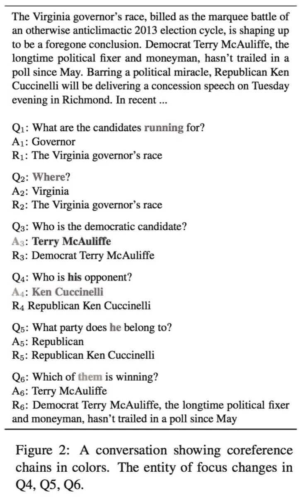
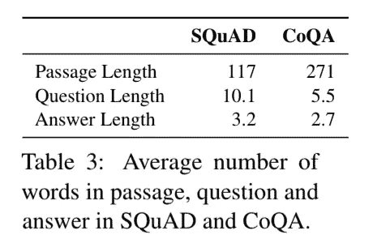
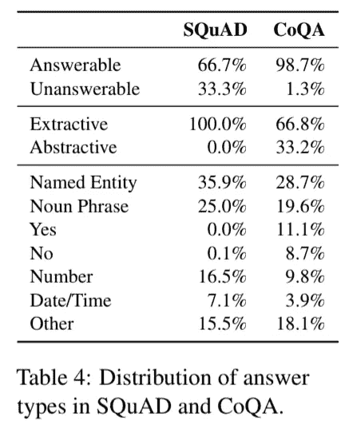
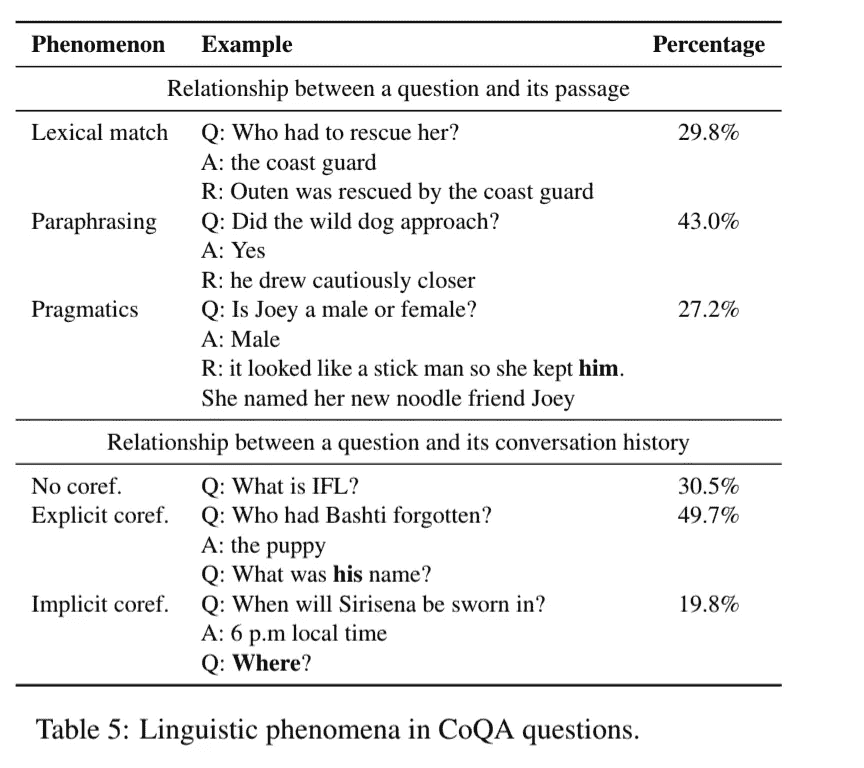
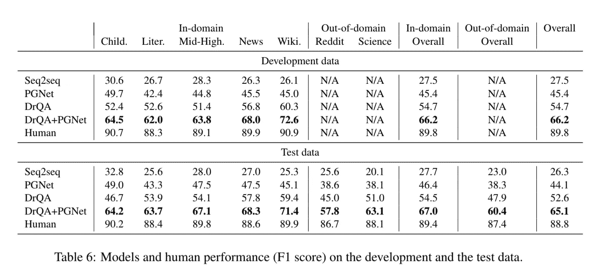

# CoQA:一个会话式问答挑战

> 原文：<https://towardsdatascience.com/coqa-a-conversational-question-answering-challenge-7d9c3aceda3c?source=collection_archive---------10----------------------->

## 我们能教聊天机器人进行推理，并与我们进行对话和信息检索吗？

对于自然语言处理来说，这是非常棒的一周，我真的很兴奋(你也应该如此)！本周，我像往常一样偶然浏览了 Arxiv Sanity Preserver 网站，但我看到的不是一大堆 GAN(这是美国有线电视新闻网)或 CNN(那是美国有线电视新闻网)的报道，而是两个让我非常高兴的数据集。他们是 [CoQA](https://arxiv.org/pdf/1808.07042.pdf) 和 [QuAC](https://arxiv.org/pdf/1808.07036v1.pdf) ，在这篇博客中我们将谈论 CoQA 为什么如此令人兴奋。

如果你对更多的问题回答感兴趣，我也在这里谈论 QuAC！

# 对话式问答挑战

“对话式问答挑战”到底意味着什么？这不仅需要阅读一篇文章来寻找答案，还需要就这些信息进行对话。它需要在对话中使用上下文线索来发现对方在问什么。它要求信息以一种抽象而不是抽象的方式重新表述。

哇哦。

这个数据集不同于我们在问答中见过的任何东西！

# 动机

那么我们为什么需要 CoQA 这样的数据集呢？

很简单，因为我们当前的数据集并没有为我们做这些。人类通过相互交流、提问、理解上下文和对信息进行推理来学习。聊天机器人…嗯，聊天机器人不会这样做。至少现在不是。结果是，虚拟代理缺乏，聊天机器人看起来很愚蠢(大多数时候)。

CoQA 是作为一个数据集创建的，以帮助我们衡量算法参与问答对话的能力。本质上，是为了衡量一台机器的对话能力。

在他们的论文中，CoQA 的创建有三个目标:

*   1.创建以依赖于对话历史记录的问答对为特征的数据集
*   CoQA 是第一个大规模这样做的数据集！
*   在对话中的第一个问题之后，每个问题都依赖于所说内容的历史
*   有 127，000 个问题跨越 8，000 个对话！
*   2.创建一个寻找自然答案的数据集
*   许多问答数据集是提取的，搜索词汇相似的回答，并直接从文本中提取出来
*   CoQA 希望从文章中提取基本原理，但要有一个重新措辞的、抽象的答案
*   3.为了确保问答系统在不同的领域中表现良好
*   CoQA 有一个包含 5 个领域的训练集和一个包含 7 个领域的测试集(2 个从未在训练中出现过！)

虽然人类绩效的 F1 值为 88.8%，但表现最佳的模型的 F1 值仅为 65.1%。这是一个很大的差距，机器必须要做大量的追赶工作！

# 创建 CoQA

像这样的数据集是如何创建的？

在亚马逊土耳其机械公司(Amazon Mechanical Turk)的帮助下，这个市场为需要人类智慧的人提供工作，比如给数据集贴标签。两名 AMT 员工将被配对，一人提问，另一人回答。回答者会被要求在文章中突出给出答案的文本部分，然后用不同于文章中给出的词来回答(从而变得抽象)。

所有这些都是在两个工人的对话中完成的。似乎下面的例子在论文中得到强调:

## 文章的范围是什么

段落来自 7 个域，5 个在训练集中，2 个为测试集保留。它们是:

*   来自[的儿童故事 MCTest](https://uclmr.github.io/ai4exams/data.html#mctest)
*   来自[古腾堡项目](https://www.gutenberg.org/)的文献
*   初高中英语考试从[赛](https://www.cs.cmu.edu/~glai1/data/race/)
*   CNN 的新闻文章
*   来自维基百科的文章
*   来自 [AI2 科学问题](http://data.allenai.org/ai2-science-questions/)的科学文章(仅测试集)
*   [来自写作提示数据集的 Reddit 文章](https://www.reddit.com/r/WritingPrompts/)(仅测试集)

他们还特意收集了问题的多个答案，因为问题被重新措辞，这有助于对话代理有更多的机会获得更好的分数，并实际上找到正确的答案。

# 与其他数据集相比

在这之前我们有什么？

嗯…我们有[班，斯坦福问答数据集](https://rajpurkar.github.io/SQuAD-explorer/)。[1.0 版本](https://arxiv.org/pdf/1606.05250.pdf)在维基百科上使用了 10 万多个问题，要求模型在回答问题时提取文章的正确部分。当决定这还不够时，我们得到了[版本 2.0](https://arxiv.org/pdf/1806.03822.pdf) 。这给 SQuAD 增加了 50，000 多个无法回答的问题，现在要求算法不仅要找到正确的答案，还要推理答案是否存在于文章中。

这个任务还没有解决。

但是它也不能解决提取信息和理解对话中所要求的内容的问题。这就是 CoQA 成立的原因，正如它的第一个目标所概述的那样！

## 更多分析

CoQA 的创建者对小队和 CoQA 进行了分析，发现虽然大约一半的小队问题是“什么”问题，但 CoQA 的问题类型分布更广泛、更均衡。他们给了我们这个很酷的图片来描述:

让 CoQA 更难的是，有时它只有一个词的问题，比如“谁？”或者“哪里？”甚至“为什么？”

这些完全取决于上下文！作为人类，我们甚至不能在不知道他们被问到的背景的情况下开始尝试回答这些问题！

# 语言上的挑战

以防你还没拼起来，CoQA 非常非常难。它充满了被称为[共指](https://en.wikipedia.org/wiki/Coreference)的东西，可以是像代词一样简单的东西，但通常是当两个或更多的表达指同一件事(因此共指！).

这在 NLP(共指解析、代词解析等)中仍然是一个公开的问题。)，所以将这一步合并到问答数据集中肯定会增加一些难度。

CoQA 中大约一半的问题包含显式的共指(像他、它、她、那个这样的一些指示)。近五分之一的问题包含隐含的共同参照。这是当你问一个类似“在哪里？”的问题时我们要求解决一些事情，但这是隐含的。这对机器来说很难。见鬼，有时候对人们来说甚至很难！

# 现在是挑战！

当前的模式如何应对这一挑战？答案是不好。

自己看:

CoQA 会帮助我们回答 ImageNet 对图像识别做了什么吗？只有时间会告诉我们，但事情肯定是令人兴奋的！

所以现在对我们所有人来说是一个挑战(就像我和 QuAC 摆的姿势一样)！我们都可以努力尝试解决这一挑战，将对话代理带入下一个发展阶段。CoQA 有一个[排行榜](https://stanfordnlp.github.io/coqa/)，目前是空的！我们有责任走出去，努力应对这一挑战，努力解决这一问题，推动知识向前发展，也许还能登上排行榜，获得一点名气和一点骄傲；)

我们在那里见！

如果你喜欢这篇文章或者觉得它有任何帮助，为什么不递给我[一两美元](https://www.gofundme.com/hunter-heidenreich-research-fund)来资助我的机器学习教育和研究呢！每一美元都让我离成功更近一步，我永远心存感激。