# 珊瑚城市:Ito 设计实验室概念

> 原文：<https://towardsdatascience.com/coral-cities-an-ito-design-lab-concept-c01a3f4a2722?source=collection_archive---------1----------------------->

European Cities — Visualised as Corals

在过去的六个月里，我一直着迷于让城市网络看起来像活珊瑚的概念。城市形态的变化模式是由其道路网络决定的；一个复杂的，看似有机的联系，让人们穿越他们的城市。就像珊瑚的枝干一样，它们有一种模式和功能，我选择展示这种模式，并对其进行处理，使之变得更加概念化。然而，虽然它们美得令人难以置信，但它们是从行驶时间集水区的各种地理空间分析中得出的，这也使它们具有一定的信息量。

Top 42 places to live (Mercer Livability Index)

# 项目:

## Kantar 信息很美大奖 2018。

在过去的 6 个月里，我已经制作了如此多的珊瑚，我认为现在是时候开始最大的应用了；绘制 40 个最宜居城市的地图，进行分析并制作动画。我觉得这个概念和视觉效果很强，但是城市列表需要有相关性，不要像我早期的一些“概念”项目那样随意。我决定使用与经济学人信息部类似的宜居指数，但通过一家名为 Mercer 的公司，该公司每年发布一次排名([https://mobility exchange . Mercer . com/Insights/quality-of-living-rankings](https://mobilityexchange.mercer.com/Insights/quality-of-living-rankings))。经美世允许使用他们的名单，我们创建了以下内容提交给奖项。

> 是什么造就了一座伟大的城市？是政治稳定吗？低犯罪率？获得教育或医疗保健？我们采用了一个衡量标准，看看人们在城市内移动有多容易。我们计算了你在 30 分钟内可以从每个市中心(开车)走多远。由此产生的“珊瑚结构”以一种新的方式展示了运输数据，揭示了美丽的有机形式。每条线代表一个城市的动脉，代表一条从市中心出发的可能路线。
> 
> 我们将这一技术应用于美世生活质量城市排名中的前 40 个城市。其结果是对我们如何在世界上最大的一些城市走动有了一个独特的视角。

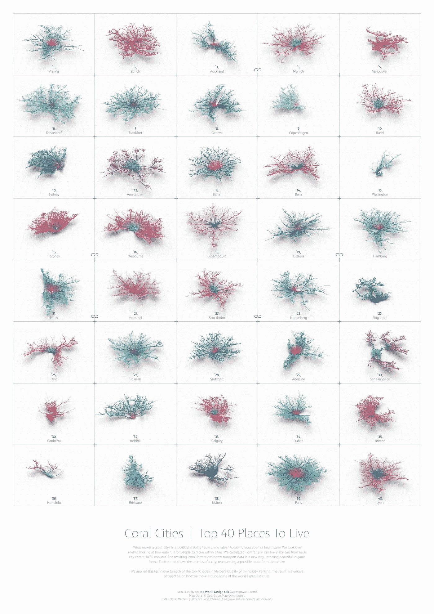

Hi-resolution A0 poster

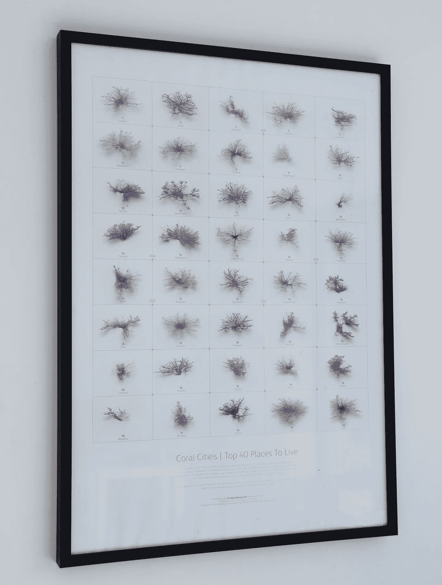

Printed, mounted and framed!

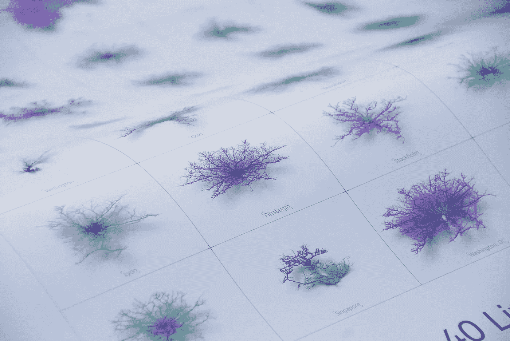

Close-up of detail

4k animated version

A0 海报印在墙上看起来棒极了！4k 动画版本缓慢地迭代通过一个不断增长的城市网格 1，12，20，最后是 40。我确实想把这个扩展到 80 度，但是 40 度之后，珊瑚的细节就消失了，除非你有一个巨大的屏幕。

## **英国珊瑚城市:**

这是我第一次尝试用小倍数的方法来完成这个项目，并分析了英国不同城市的 30 分钟车程集水区。行驶时间分析基于对零交通流量的乐观看法，因此呈现的集水区比您预期的要宽得多。

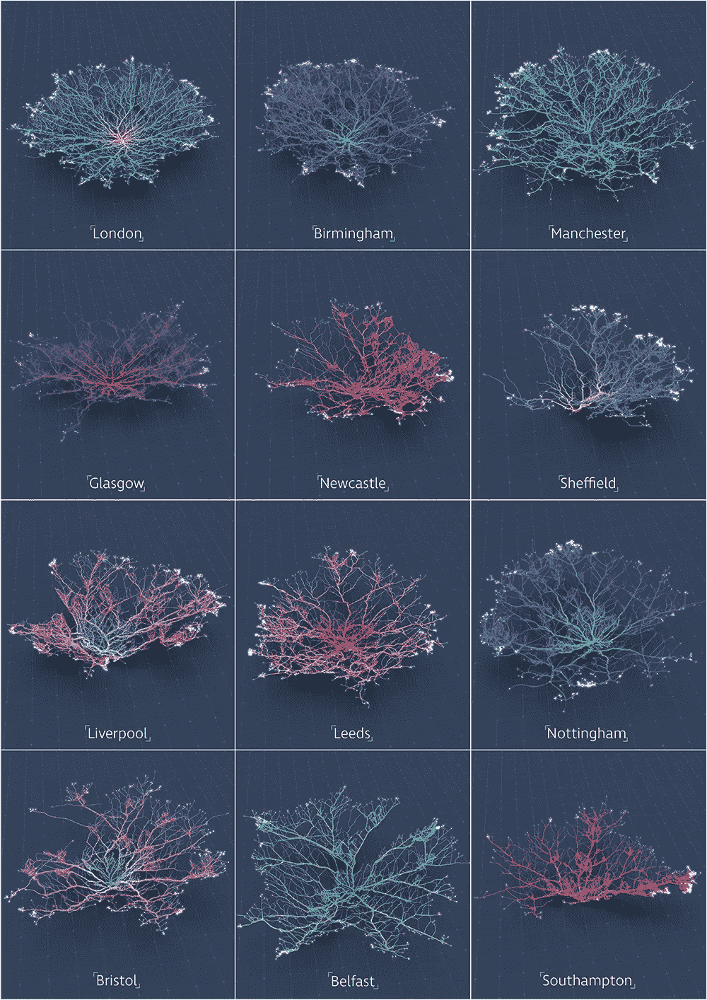

高分辨率静态图像以清晰的模式显示了地层的复杂性，其中河流、海洋和山脉等物理特征影响着网络。我还制作了一个 4k 的动画版本，在上面的 Vimeo 链接中可以看到，动画在视频结束时逐渐变慢。

## 欧洲版:

此后不久，我着手制作一个地理上更大的版本，分析一些主要的欧洲城市。

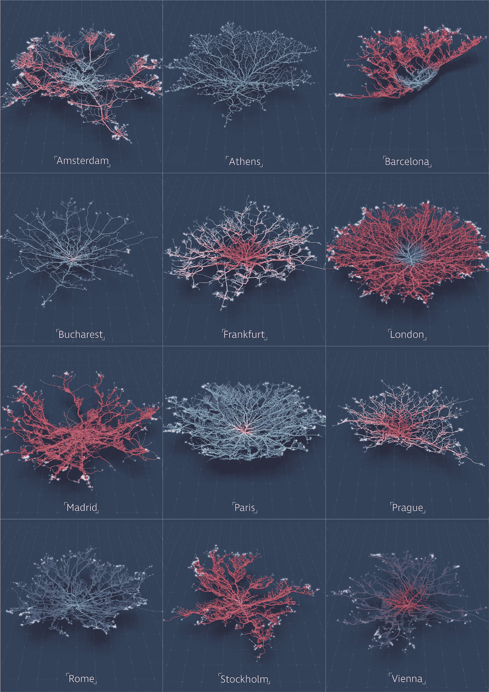

这种风格从最初的蓝色网格基础略微演变成一种浅色调色板，环境遮挡和阴影更加明显。“珊瑚城市”的概念传到了德国地图学杂志“Kartographische Nachrichten”的好人们手中([http://www . Kartographische-Nachrichten . de/Kartographische-Nachrichten/aktuelles-heft . html](http://www.kartographische-nachrichten.de/kartographische-nachrichten/aktuelles-heft.html))，他们渴望在最新杂志的封面上刊登欧洲版本。浅色的调色板看起来很可爱…

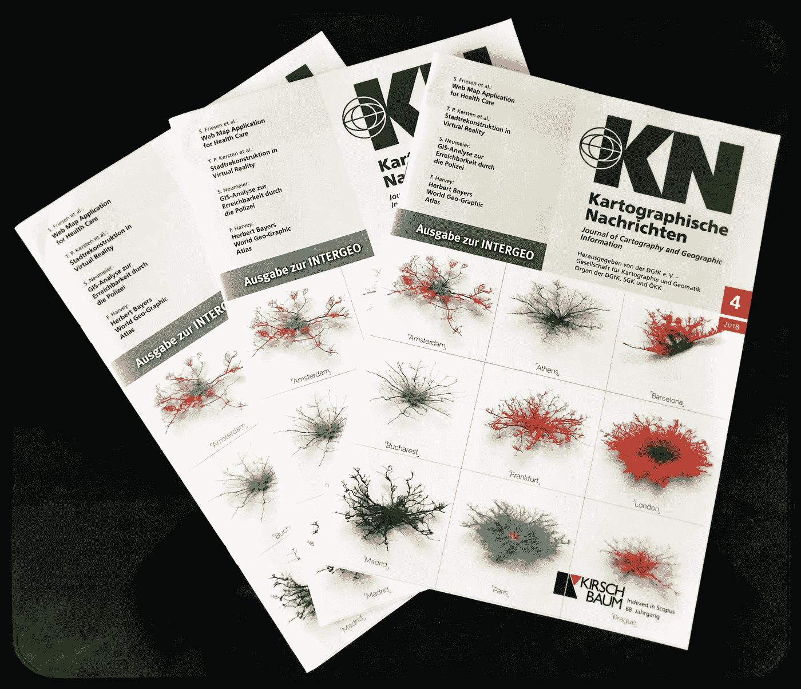

## 经济学人智库:宜居指数

上个月，EIU 发布了 2018 年宜居指数，对所有主要城市的宜居指数进行了排名(【http://www.eiu.com/topic/liveability】T2)。我们认为这将是一个伟大的想法，制作一个“珊瑚城”版本的十大名单，当然还有一个动画版本。

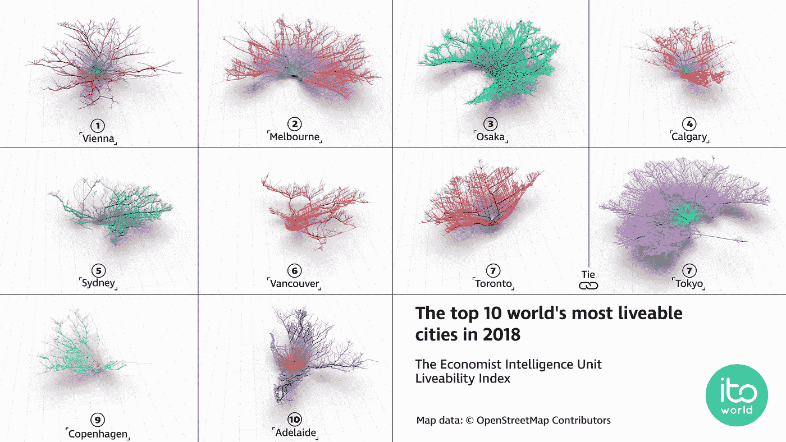

# **它们是怎么做的？**

让我们解释一下它们是如何计算的，以及它们显示了什么，为了做到这一点，让我们更仔细地看看我最喜欢的珊瑚之一——东京。

Tokyo City — 30 minute catchment

我从东京市及其周边地区的基本 OpenStreetMap 网络开始。使用各种方法，我可以计算从中心到指定行驶时间的集水区。在伊藤世界(www.itoworld.com)，我们有一个内部路由系统允许我们这样做，但是，有一堆其他的方法和软件可以让你计算驾驶时间(ESRI，PgRouting，GraphHopper，Here API 等)。值得注意的是，在大多数情况下，网络集水区是以零流量计算的，因此结果非常乐观。然而，我们已经尝试从 Here API 导入基于拥塞的等时线，并将其转换为珊瑚，这相当成功(见下文)

Comparing congestion catchments in the worst/best cities using data from Here API.

汇水区分析将给出一个粗略的区域，然后我需要把它变成珊瑚，为此，线性连接上的每个顶点都给出一个距离市中心的距离值。我可以使用这个距离度量作为链接的高度值，创建一个 3d 网络，随着与中心的距离增加而增加。

我也将一个“权重”值应用于链接，这与道路分类无关，但是它经常被链接。权重与连接到分支的链接数量成比例，因此较厚的网络有更多连接的主干网络，从而创建珊瑚状外观，这也表明路由网络的较繁忙部分。

然后，每个链接都经历了一个矩形几何体的“扫描”,创建了一个物理存在，我们可以在渲染过程中应用环境遮挡。

颜色渐变纯粹是一种美学添加，只是从中心映射渐变。动画链接出现在距离的顺序导致迷人的珊瑚生长…

UK Cities — Coral Animation

## 定制版本

我的妻子通常对我的工作不感兴趣:)然而，她对珊瑚城的海报很感兴趣，以至于她委托我(报酬是无尽的茶和咖啡！)为房子生产一个。作为一个历史极客，主题是“历史上重要的珊瑚城市”我们仍在考虑框架选择，但下面是海报的截图。

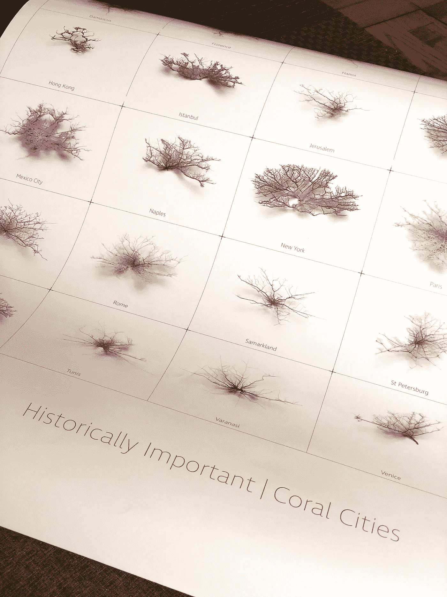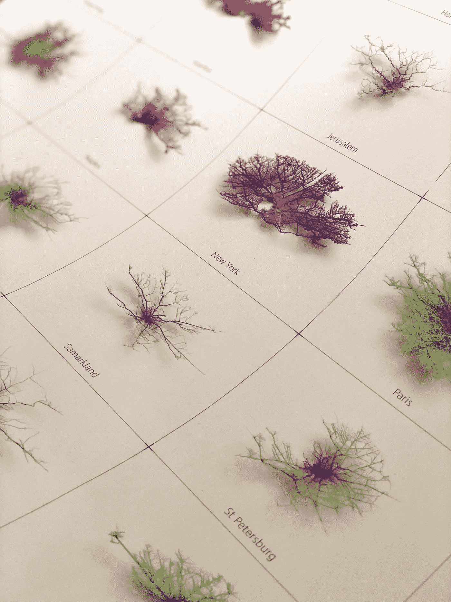

## **Cinema4d/Blender 渲染:**

在整个过程中，我对将我们在伊藤世界的可视化套件中的分析移植到其他 3d 软件包(如 Cinema4d)的可能性越来越感兴趣。这很棘手…我们的分析工具分析网络的每个链接，节点到节点的链接用每个节点的高度值分割。然后，该值被放入具有 z-min 和 z-max 属性的着色器中，该属性创建链接的高度。类似的方法也用于连接厚度。所以将它导入其他包并不简单，会产生大量的 CSV 文件。我确实为 Cinema4D 开发了一种方法，但是这个过程非常耗时，但是确实产生了一些可爱的渲染效果。

Cinema4d 有一个非常方便的“结构”标签，你可以通过 x，y，z 坐标导入线性路径。顺带一提，某天才创建了一个可以批量导入链接的脚本([https://www . C4 dcafe . com/ipb/forums/topic/91550-create-spline-from-CSV-file/？page=2](https://www.c4dcafe.com/ipb/forums/topic/91550-create-spline-from-csv-file/?page=2) )这意味着只要我的每个链接都是一个单独的 CSV 文件，我就可以使用该脚本在 Cinema4d 中重建样条几何图形。不利的一面是每个珊瑚都有成千上万的链接，所以大量的 csv

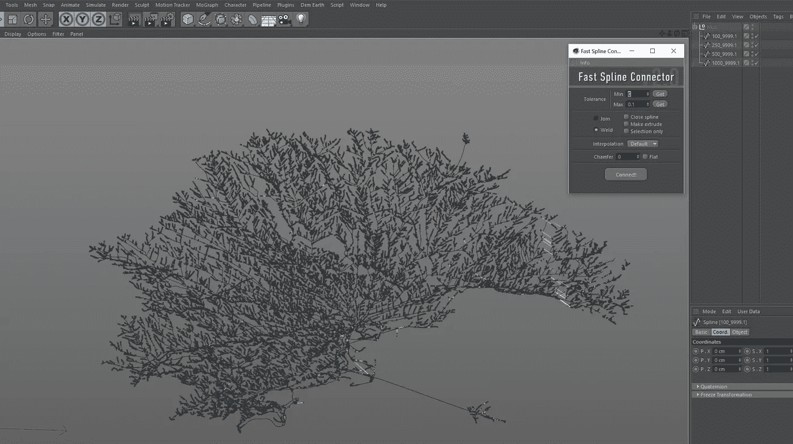

一旦我所有的链接被导入，我就面临一个新的问题。每个单独的链接都是一条单独的样条线，尽管它们与下一条样条线重叠，但实际上它们并不相连。当“扫描”样条线时，这就成了问题，你最终得到的不是漂亮的 3d 动脉，而是成百上千的小动脉连接在一起，这是 a)资源猪 b)看起来很丑。治愈？“快速花键连接器”，我的救命恩人([https://cgtools.com/fast-spline-connector/](https://cgtools.com/fast-spline-connector/))物有所值。使用该工具意味着，只要将阈值设置得较低，任何重叠的样条线都可以连接到更长的样条线。因此，这是一个相当漫长的过程，毫无疑问可以简化，但无论如何，我在最终导入的城市中获得了很多乐趣。

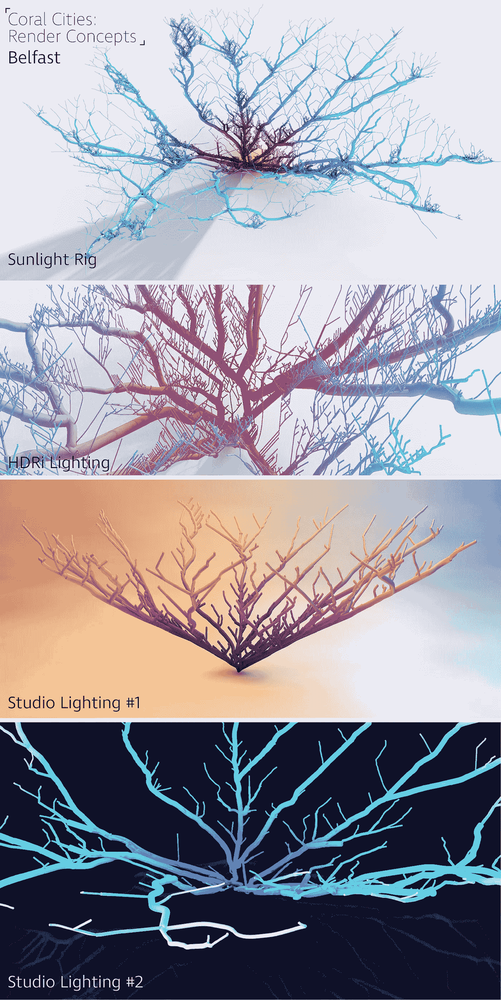

Early concepts for render lighting setups.

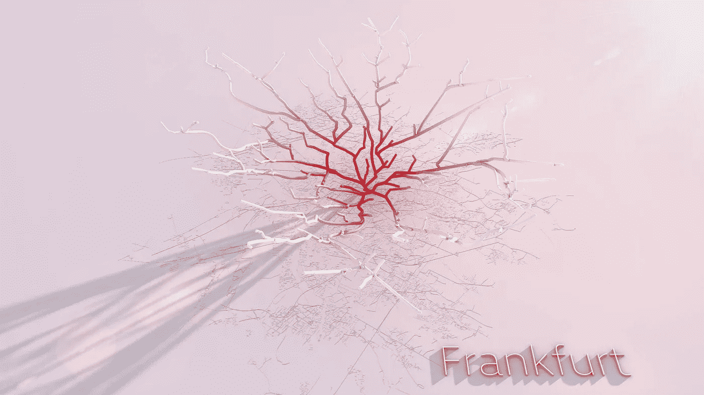

Frankfurt light test render with baseline OSM on the base.

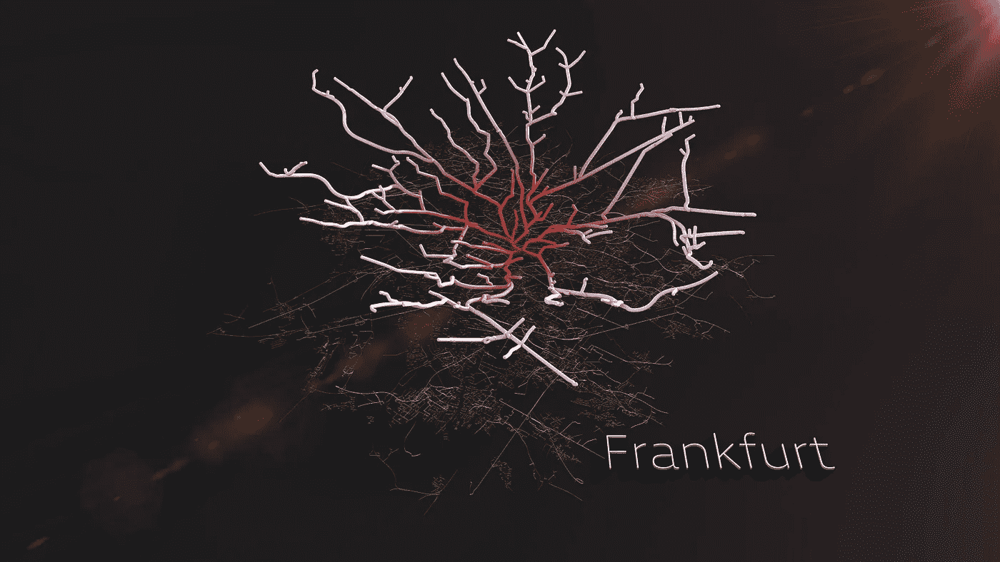

Frankfurt dark test render with baseline OSM on the base.

Cinema4d HDRi lighting render.

我还实验了一些相当有问题的渲染…

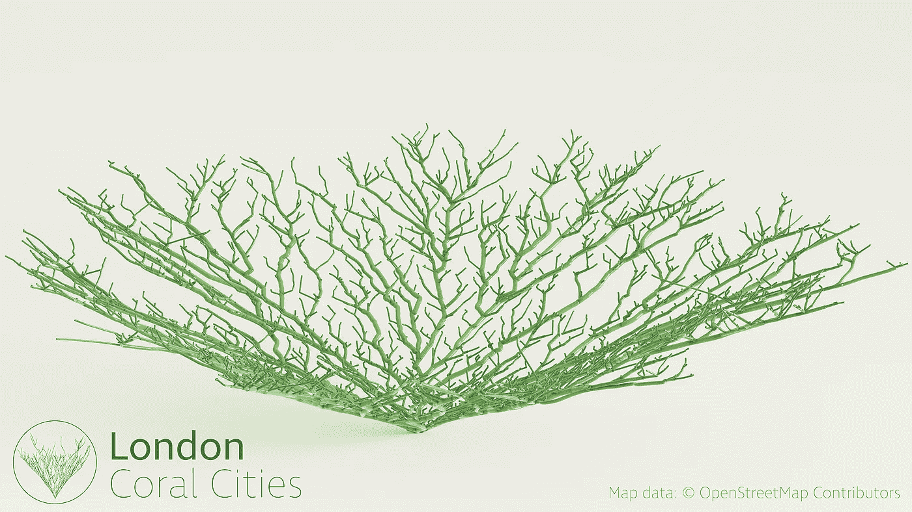

Jade Coral City?

Inverted Coral City.

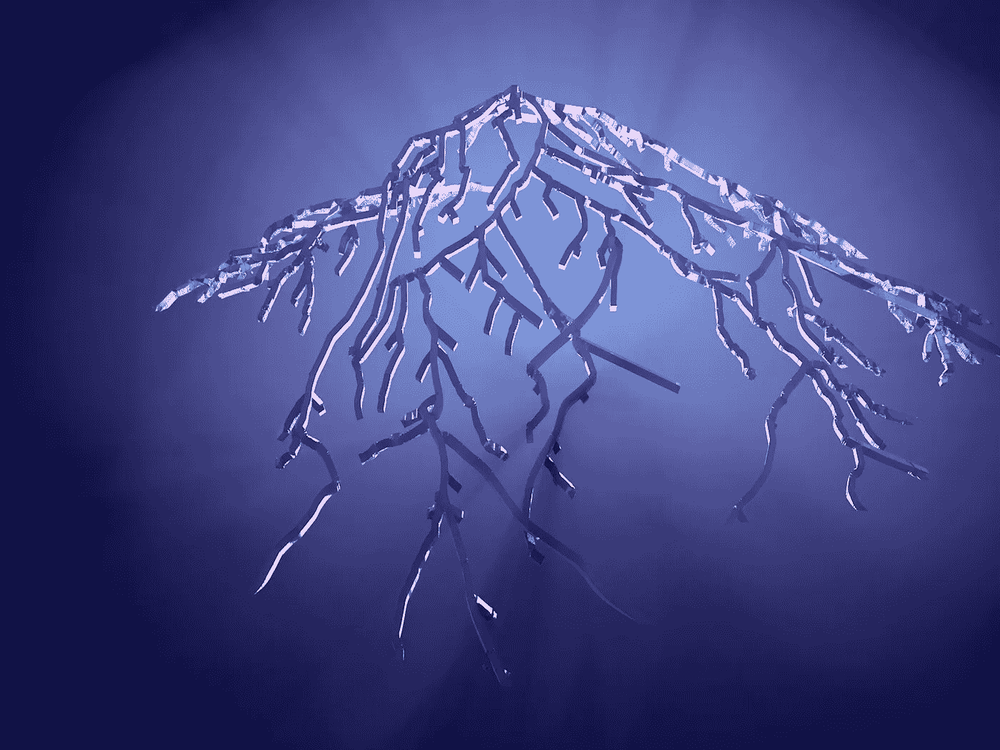

Some odd volumetric lighting tests…

Early idea of plinth renders.

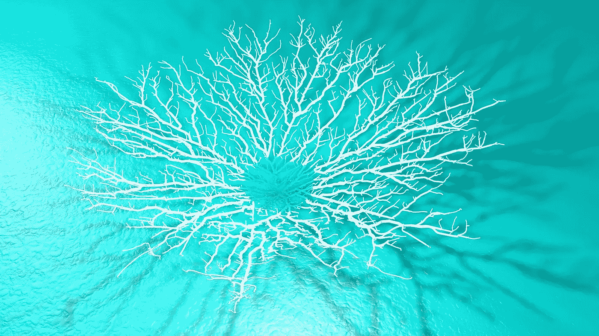

Early attempt at Corals in water.

# 接下来是什么？

我喜欢 Kantar 条目打印出来的样子，我热衷于探索一些创作定制作品的选项，已经为朋友和家人创作了几个版本，但是我不确定这在更大范围内如何工作。我们内部也在讨论 3d 打印一些更令人印象深刻的城市。谁知道呢，到了圣诞节，你可能会在约翰·刘易斯的货架上看到“珊瑚城的小玩意”