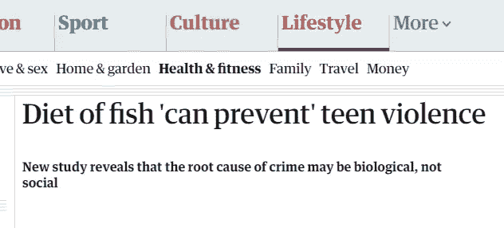
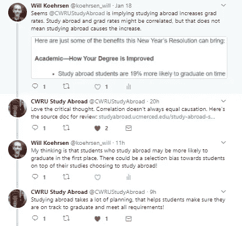

# 相关性与因果性:一个例子

> 原文：<https://towardsdatascience.com/correlation-vs-causation-a-real-world-example-9e939c85581e?source=collection_archive---------0----------------------->

**怀疑地看待现实世界的统计数据**

令人惊讶的是，在我们收到的大量电子邮件中，有一些深刻的见解等待着我们去发现。当我漫不经心地浏览我的收件箱时，我浏览了一封来自学校留学办公室的邮件，里面有以下关于海外留学好处的信息:

立即引起我注意的是 90 年代的那些数字——显然，出国留学让你对研究生院和雇主具有不可抗拒的吸引力。我惊讶于在另一个国家学习所带来的学术和职业利益是如此之大。我的第二个想法是:太糟糕了，我没有选择利用这些好处，我很快存档了电子邮件，在我开始后悔任何进一步的人生决定之前。然而，关于这些信息的一些东西一直困扰着我。在这个假新闻占主导地位的时代，我一直试图花更多的时间有意识地思考各种说法和统计数据，虽然这不在同一社会退化水平上，但我得出的结论似乎有些不对劲。几天后，在听一个对[数据持怀疑态度的播客](https://dataskeptic.com/podcast/)时，我突然想到:我曾假设出国留学*会让*学生有更好的成绩和职业前景，而所有的统计数据显示这两者是相关的。

我们大多数人经常犯这样的错误，无意中混淆了相关性和因果关系，这种倾向被媒体标题所强化，如音乐课提高学生的表现，或者呆在学校是长寿的秘诀。有时候，特别是在健康方面，这些倾向于不可思议的事情，比如《卫报》的头条声称吃鱼会减少暴力。

The work of the powerful tuna lobbying industry

这些文章中的共同问题是，他们采用两种相关的趋势，并将其作为一种现象引起另一种现象。真正的解释通常不那么令人兴奋。例如，上音乐课的学生可能在学校表现更好，但他们也更有可能在一个非常重视教育和取得学术成功所需资源的环境中长大。因此，不管有没有音乐课，这些学生都会有更高的学习成绩。上音乐课和在学校表演碰巧是同时出现的，因为它们都是相似背景下的产物，但一个不一定会导致另一个。同样，在校时间越长的人通常拥有更多的资源，这也意味着他们能够负担更好的医疗保健。大多数情况下，这些错误并不是出于有意欺骗([尽管这种情况确实发生过](https://www.mediamatters.org/blog/2011/12/12/today-in-dishonest-fox-news-charts/185162))，而是出于对因果关系概念的诚实误解。统计数据，尤其是留学邮件中的数据，显示的是一种[选择偏差](http://sphweb.bumc.bu.edu/otlt/MPH-Modules/EP/EP713_Bias/EP713_Bias2.html)。在每项研究中，被观察的个体并不来自社会的代表性部分，而是来自相似的群体，这导致了一个扭曲的结果。

想想统计数据显示，在国外学习的学生按时毕业的可能性要高出 19%。虽然出国留学可能确实在某种程度上激励了落后的学生按时毕业，但更可能的解释是，选择出国的学生首先是那些在学术上处于更好地位的学生。不管他们是否去了另一个国家，他们都会以高 GPA 按时毕业。去另一个国家学习一年需要做大量的工作和准备，而有足够信心这样做的学生是那些学业有成的人。在这个现实世界中，选择偏向于更好的学生。出国留学的学生样本并不能代表学生的整体情况，相反，它只包括准备最充分的学生，因此，这一群体拥有更好的学术和职业成果也就不足为奇了。

事后看来，出国留学的经历可能看起来很棒，但如果我们只选择最优秀的学生，让他们做任何事情，那么说这种现象导致更好的成绩将是误导。比方说，我们拥有一家瓶装水公司，我们希望收集一些积极的数据来帮助销售。我们雇几个学生站在荣誉班外面，只把我们的水给优等生。然后，我们进行了一项研究，最终表明喝我们品牌饮料的学生成绩更好。因为我们选择了一组特定的受试者来参与我们的研究，我们可以让它看起来像是我们的水*导致了*成绩的提高。

海外留学统计数据来自所谓的[观察研究。](https://en.wikipedia.org/wiki/Observational_study)观察性研究不是构建一个实验，而是观察现实世界中无法控制自变量的一些过程，在这个案例中，是选择出国留学的学生。观察性研究无法证明因果关系，只能证明不同因素之间的联系(比如成就和在另一个国家学习)。为了证明一个过程导致了另一个过程，需要进行随机对照试验，受试者代表整个人群。在这种情况下，进行随机对照试验需要从各种学习表现中随机选择一部分学生，送一些去国外学习，留一个对照组在家。然后我们可以分析结果，以确定两组之间是否有显著差异。如果有，那么我们可能会进行更多的研究，控制更多的变量，直到最终我们确信没有隐藏的影响，我们可以建立因果关系。

我向 CWRU 留学办公室指出了这些观察结果，随后是一次体面而富有成效的谈话。

Civility and Honest Discussion. On Twitter!

我发这个帖子，并不是想给办公室打电话。尽管这封邮件确实写道:“这只是这个新年决心能带来的一些好处，”但它并没有声称确切的因果关系。然而，当一个单一的话题被大量的事实包围时，我们的自然倾向是画出一个因果关系，这是营销人员和公司经常利用的一种倾向。我相信这个案例中的所有统计数据都是有效的，但我们仍然需要避免指定因果关系。没有随机对照试验，我们不能说一种活动引起了另一种活动，我们只能说两种趋势是相关的。

这是一个小例子，但它说明了一个极其关键的问题:我们所有人，甚至每天都在使用这些概念的研究生，都可能被统计数据所愚弄。人类[自然会看到不存在的模式](http://bigthink.com/endless-innovation/humans-are-the-worlds-best-pattern-recognition-machines-but-for-how-long)，我们喜欢讲述一个我们认为正在发生的事情的连贯故事(叙事谬误)。然而，这个世界通常没有明确的因果关系，我们[必须满足于相关性](https://www.forbes.com/sites/gilpress/2013/04/19/big-data-news-roundup-correlation-vs-causation/)。这种世界观可能会让头条新闻变得不那么令人兴奋(事实证明[巧克力并不是一种神奇的食物](https://www.vox.com/science-and-health/2017/10/18/15995478/chocolate-health-benefits-heart-disease)，但这意味着你不会因为可疑的证据而被骗去购买不符合你最佳利益的产品或采取不符合你最佳利益的行动。此外，我们可以与他人分享我们的经验，并创建一个持怀疑态度的社区，在这个社区中，我们为了自己的利益而不是公司的底线做出合理的决策。

一如既往，我欢迎建设性的批评和反馈。可以在推特上找到我，电话是 [@koehrsen_will](https://twitter.com/koehrsen_will) 。