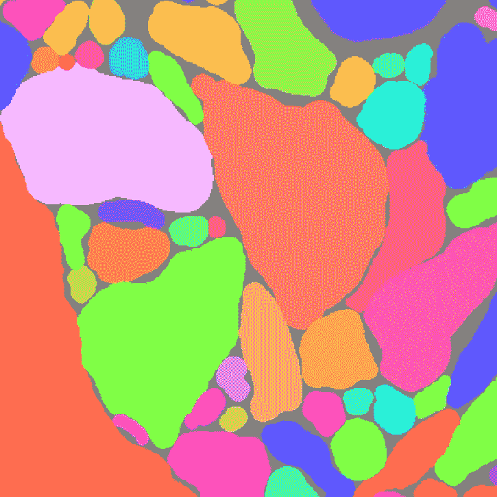
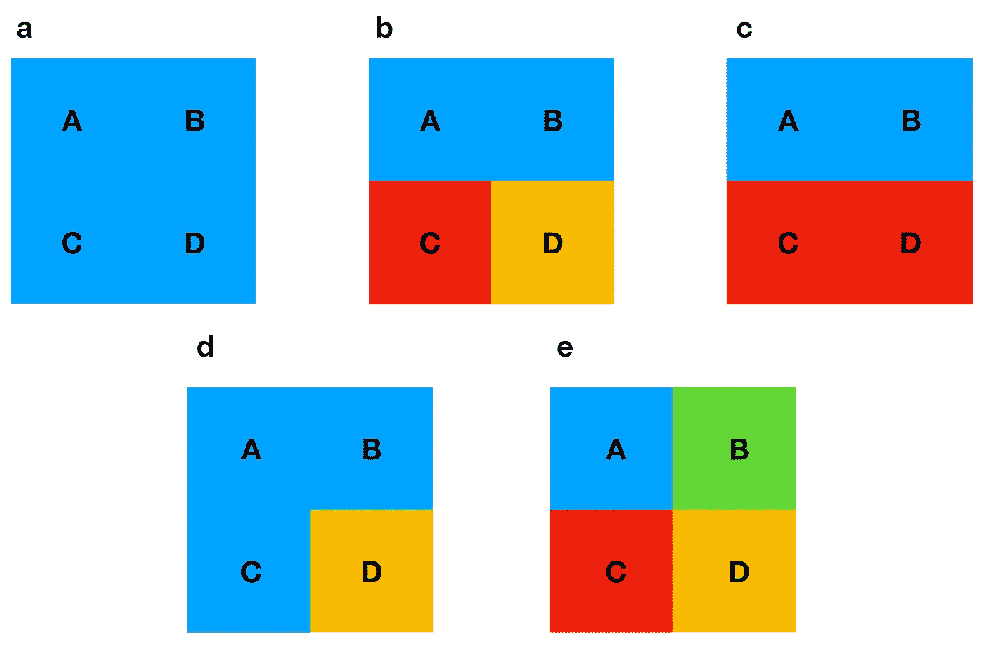
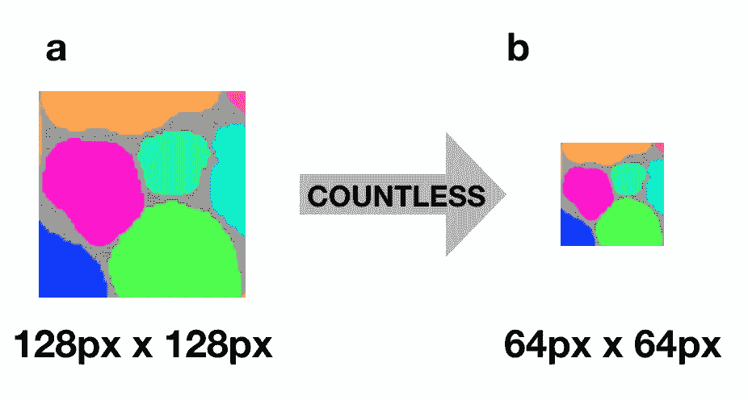
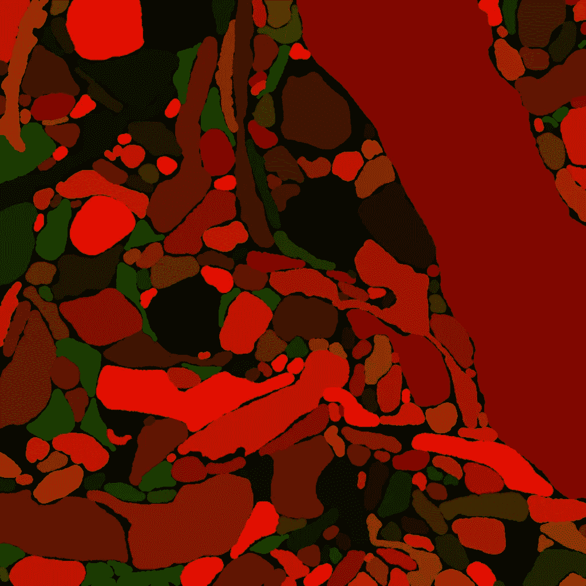
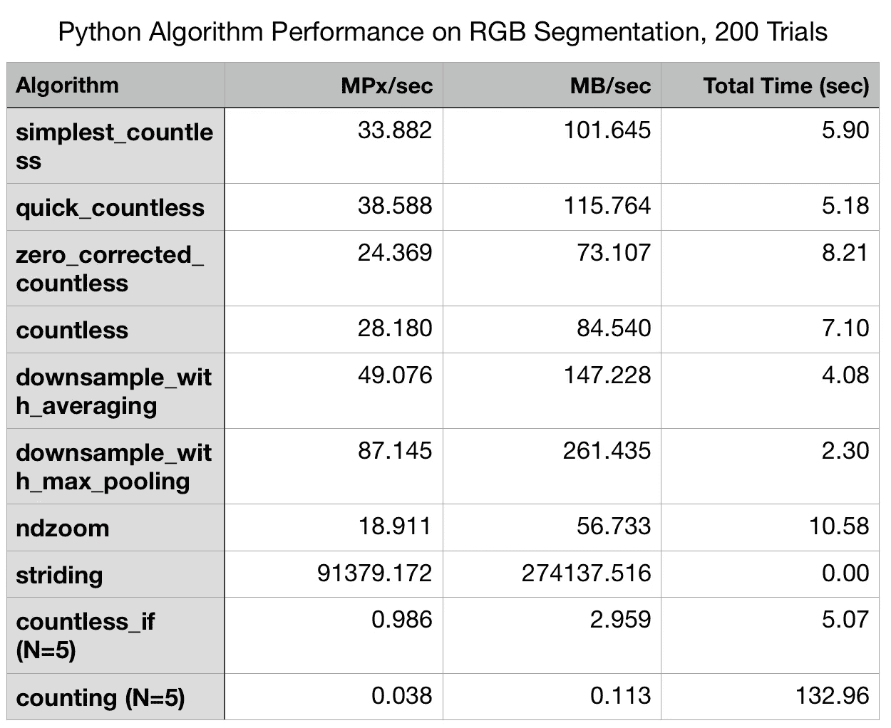
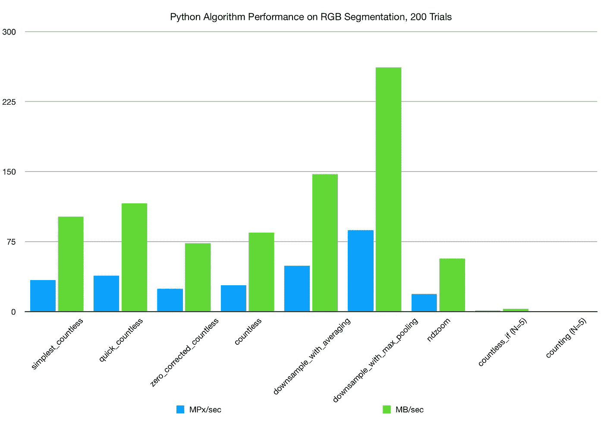
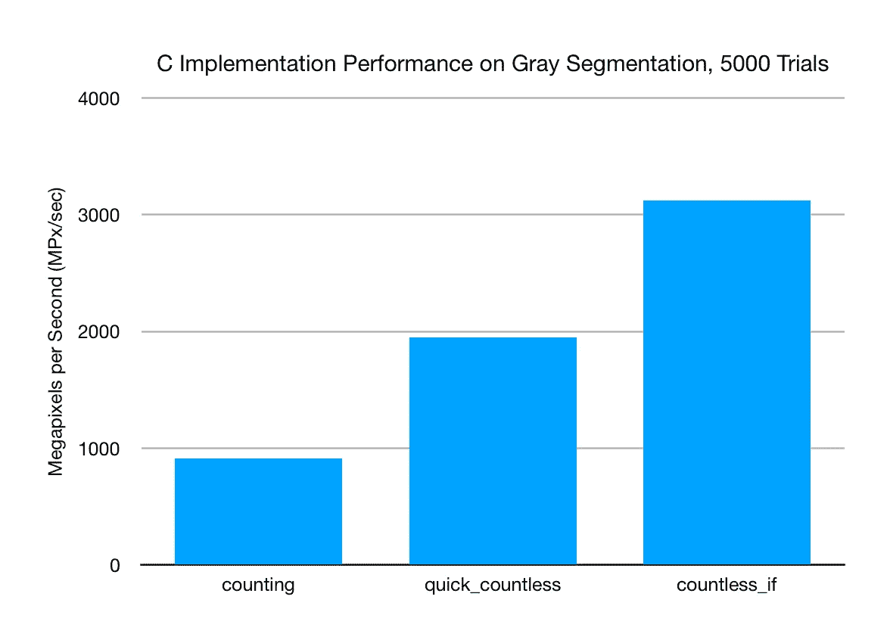
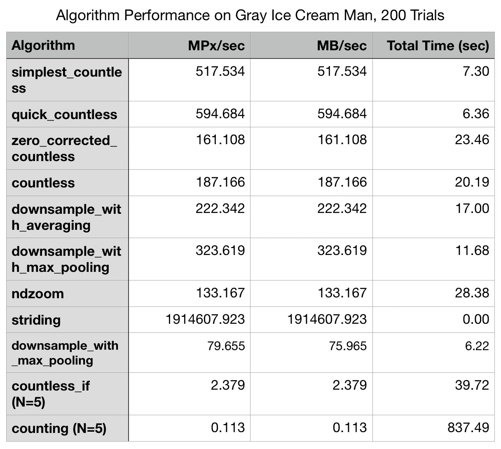
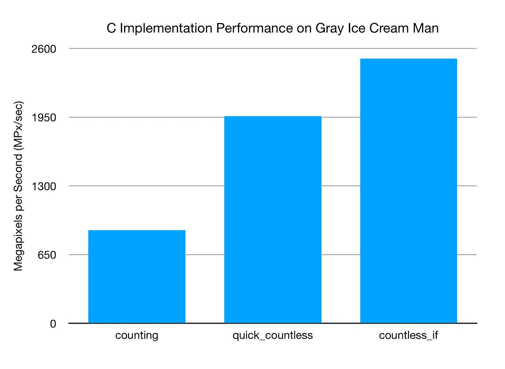

# 无数—使用 Python 和 Numpy 对标签图像进行高性能 2 倍缩减采样

> 原文：<https://towardsdatascience.com/countless-high-performance-2x-downsampling-of-labeled-images-using-python-and-numpy-e70ad3275589?source=collection_archive---------4----------------------->



Figure 1\. A partial of a slice of [SNEMI3D](http://brainiac2.mit.edu/SNEMI3D/home), a machine learning contest dataset for neuroscience.

管理 terravoxel 图像上的 convnet 输出通常涉及生成可在廉价硬件上更容易下载、显示和处理的摘要图像。对普通照片或显微镜图像进行下采样的常用方法是在图像上定义一个窗口，然后应用 averaging 或 lanczos3 (sinc)等过滤器将窗口内容汇总到一个较小的像素集中。这些混合方法不适用于分段标签。一组分割标签的下采样必须包含来自输入图像的实际像素值，因为标签是分类的，混合标签是无意义的。如果标记为 1 的像素指的是汽车，标记为 3 的像素指的是鸟，那么这两个像素的平均值(2 指的是人)就不是底层图像的忠实表示。

因此，下采样分类标签包括在图像上定义窗口并从该块中选择样本。一种常见的方法是通过在块中最频繁的像素中挑选来选择样本，也称为寻找模式。实现这一点最明显的方法是计算每个标签的频率，这在 C 等高性能语言中很容易实现。然而，Python 循环非常慢，这使得这种方法在不使用 C 扩展(Cython)的情况下无法实现，这使得项目维护起来更加麻烦，并且需要专业知识。在这里，我给出了一个方法 neutrally，它计算四个无符号整数的模，同时给出了一个 Numpy 实现，用于生成标签图像的 2x 缩减采样。

# 无数算法

要解决的最简单的 2D 下采样问题是 4 像素 2x2 图像。2x2 图像可以通过其最常见的单个像素来概括，以在每一侧实现 2 倍的缩减。现在坚持使用均匀大小的图像，一个较大的图像可以被分成 2×2 的块，如果这个过程在每个块上独立重复，这将导致整个图像整体缩小 2 倍。

2x2 图像由图 1 中列出的五个问题组成。在 1(a)、1(c)和 1(e)中，所有像素都在最频繁的类别中，因此是有效的解决方案。1(b)和 1(d)需要更复杂的方法。值得注意的是，在所有五种情况下，选择随机像素更有可能是大多数，这表明为什么大步走可以是一种可接受的，尽管不是完美的方法。形成该算法基础的关键见解是，在所有情况下，如果两个像素匹配，则它们占多数。



Figure 2\. The Five Cases. Capital letters A,B,C,D refer to the identity of a non-zero pixel. (a) All the same. (b) Two the same. (c) Two pairs the same. (d) Three the same. (e) All different.

在下文中，大写字母 A、B、C、D 指的是像素位置的非零值。我们定义了比较操作符 PICK(A，B ),它生成一个实像素值或零。

```
PICK(A,B) := A if A == B else 0                             EQN. 1
```

在 Python/numpy 这样的框架中，True 和 False 分别表示为 1 和 0，这可以用数字实现为:

```
PICK(A,B) := A * (A == B)                                   EQN. 2
```

接下来，让我们考虑 A、B 和 c 之间的各种相互作用。在下表中，符号 AB 表示 PICK(A，B ),小写字母表示特定值，因此两列中重复的字母“A”表示两个像素都是红色。

```
Pixel    PICK(X,Y)
A B C    AB BC AC
a a a => a  a  a
a b a => 0  0  a
a a b => a  0  0
b a a => 0  a  0
a b c => 0  0  0  <-- Only fully zeroed rowTABLE 1\. PICK(X,Y) (denoted XY) interactions between A, B, and C
```

表 1 显示 A、B 和 C 中仅有的多数像素或零点将作为拾取操作的结果出现。在 A、B 和 C 都不相同的情况下，所有选择都将返回零。这使得像素选择的问题服从于简单的逻辑。a、B 和 C 都不同，对应于图 1 中的情况 1(b)或 1(e ),在 1(b)的情况中 D 占大多数。如果情况是 1(b)，这意味着 D 是一个可接受的解决方案。如果情况是 1(e)，则不存在多数像素，D 也是可接受的解决方案。

因此，当 A、B 或 C 匹配时，选择匹配项，当它们都不匹配时，选择 d。这可以在计算机语言中用短路逻辑 OR (||)表示为:

```
MODE(A,B,C,D) := PICK(A,B) || PICK(B,C) || PICK(A,C) || D   EQN. 3
```

我们可以将逻辑或数字实现为:

```
LOGICAL_OR(X,Y) := X + (X == 0) * Y                          EQN. 4
```

EQN。3 和 EQN。4 将正确处理除零以外的所有无符号整数值。因此，在零是有效像素的情况下，我们可以在算法开始时给图像加一，然后在返回结果之前减一。

2x2 方法可以很容易地扩展到覆盖任何偶数尺寸的图像。只需用不重叠的 2x2 块覆盖图像，并求解每个块中的模式，即可生成缩减采样图像。然而，我们仍然必须处理奇数图像，其中边缘没有被 2x2 块完全覆盖。

幸运的是，有一个简单的解决方案。对于任何奇数图像，镜像边缘以生成偶数图像。有两种情况:角(1x1)和边(2x1 或 1x2)。镜像一个角将产生情况 1(a ),这将导致绘制相同的像素。镜像一条边将导致情况 1(a )(如果像素相同)或者情况 1(c ),这两种情况都将被无数个正确处理。

# 履行



Figure 3\. Results of applying COUNTLESS. (a) A source image of 128 x 128 pixels is reduced to (b) an image of 64 x 64 pixels.

Numpy 中无数的实现是简单明了的。首先，图像必须被分成 2×2 块的覆盖。这可以通过创建四个 2D 数组 a、b、c 和 d 来表示，每个数组在概念上表示图 1 中与其同名的像素，但在图像中的每个 2x2 块上并行执行。这是通过从左上角跨越(2，2)偏移(0，0)、(0，1)、(1，0)和(1，1)来实现的。接下来，我们开始用无数的。Numpy 不支持逻辑 OR，但它支持按位 OR。幸运的是，根据表 1，从 PICK(A，B)、PICK(A，C)和 PICK(B，C)得到的值要么是单个值，可能是重复值，要么为零。因此，在这种特殊情况下，按位“或”的行为与逻辑“或”相同，为我们节省了一些在 EQN 中需要的运算。4.清单 1 展示了实现:

Listing 1\. The simplest implementation of countless that doesn’t handle black pixels.

这种实现适用于大多数情况，但是它有一个重要的故障模式。如果匹配像素为零，我们将意外地选择 D，因为结果看起来与表 1 中的最后一行相同。不幸的是，当使用有限整数表示时，这个问题无法完全消除，但是我们可以非常接近。

策略是在执行无数次之前给图像加一，之后减一。这会将 0 变成 1，并使算法正确工作，但它会导致最大值整数溢出(uint 8 为 255，uint16 为 65，535，依此类推)。但是，在添加数据类型之前转换为下一个最大的数据类型可以消除溢出效应(例如，将 uint8 数组转换为 uint16)。在目前的硬件上，这种方法在 uint64 以下是可行的。uint8、uint16、uint32 完全消除了零点问题，但 uint64 没有。这意味着，如果您的标注包含大约为 1.84 x 10 ⁹.的 2⁶⁴-1，该算法将会失败对于许多用途，这应该是可以接受的。减去一后强制转换回原始数据类型。对于将最大 uint64 视为特殊标志的编码方案，只需充分改变偏移量即可。

Listing 2\. zero_corrected_countless.py: simplest_countless.py updated to handle black pixels correctly.

最后一件事，我们添加了一些操作来解决零标签问题，但是这会影响性能。我们可以通过注意到 *ab* 和 *ac* 都乘以 *a 来恢复其中的一部分。*

Listing 3\. zero_corrected_countless.py augmented with an algebraic simplification to slightly improve performance.

# 表演

为了确定这种算法的速度，我们开发了一个比较套件，并在双核 2.8 GHz、i7 Macbook Pro(大约 2014 年)、256 kB L2 高速缓存和 4MB 三级高速缓存上运行。虽然该算法是为分割标签开发的，但普通照片也包括在内，以展示当数据不均匀时该算法如何执行。最大汇集、平均和大步跑包括在速度比较中，尽管它们不适合这项任务。

我用 Python 3.6.2 配合 numpy-1.13.3 和 clang-802.0.42 做了以下实验。

经过测试的算法:

*   **大步走:**每隔一个像素拾取一次。
*   **统计:**统计每个标签出现的频率。
*   **最简单 _ 无数:**最简单 _ 无数. py
*   **快速 _ 无数:**最简单 _ 无数. py +代数化简
*   **零 _ 校正 _ 无数:**零 _ 校正 _ 无数. py
*   **无数:**无数. py
*   **无数 _if:** 用 if 语句代替花里胡哨的把戏

尽管这些算法不适合处理分割，但也对它们进行了测试，以便为其他图像处理算法提供比较点:

*   **down sample _ with _ averaging:**对 2x2 窗口中的像素进行平均。
*   **down sample _ with _ max _ pooling:**在 2x2 窗口中选取最高值像素。
*   **ndzoom:** 使用 scipy 函数 ndimage.interpolation.zoom 缩小到 2x2。

用于测试算法的代码可以在[这里](https://github.com/william-silversmith/countless)找到。

在这篇文章发表后 [Aleks Zlateski](https://github.com/zlateski) 贡献了一个骑士登陆(KNL)的矢量化版本 bitwise neutrally，据报道在随机 int32 数据上运行速度为 1 GPx/sec，4 GB/sec。可以在 [Github](https://github.com/william-silversmith/countless) 上找到。

# 试验 1–神经组织的分割



Figure 4\. Integer labels representing a segmentation of a neural tissue micrograph.

RGB 分割是由卷积神经网络分配的像素标签的 1024x1024 图像，有趣地看着神经组织。这是无数在设计时就考虑到的那种形象*。每个像素是一个 RGB 三元组，合起来表示一个无符号整数。比如，(R，G，B): (15，1，0)代表 271 (15 + 1 * 256)。*

在表 2 中，虽然它不符合我们选择最频繁像素的标准，但*大步走*显然是速度恶魔。它似乎只受到内存带宽的限制。单纯的*计数*运行速度仅为 38 kPx/秒，这意味着计算一张图像需要大约 27.6 秒。

无数算法的各种版本在从 986 kPx/秒到 38.59 MPx/秒的宽范围内运行，轻松击败了*计数*。*无数 _if* 实际上是使用 if 语句测试两个像素是否匹配的*计数*实现的变体。其他无数变体之间的主要性能差异取决于我们是否正确地处理零(在*无数*和*快速 _ 无数*之间有 37%的差异，在*最简单 _ 无数*和*零 _ 校正 _ 无数*之间有 39%的差异)以及乘法是否被简化掉(在*最简单 _ 无数*和*快速 _ 无数之间有 13.8%的加速，以及* 15.6% 【T34

将该算法最快的综合变体*与其他两种常见的下采样方法进行比较，结果表明它比平均法慢 1.7 倍，比最大池法慢 3.1 倍。如果我们要处理不包含零作为有效像素的图像，相对差异将分别慢 1.3 倍和 2.3 倍。*



Table 2\. Python algorithm performance on a three channel 1024x1024 segmentation image. N=200 except where noted.



Figure 5\. Python algorithm performance on three channel 1024 x 1024 segmentation. Striding omitted to better show the other algorithms.

# 试验 2 —灰色分割


Figure 6\. A grayscale version of the RGB segmentation from Trial 1.

三通道存储器布局对算法性能有什么影响？在灰度(即单通道)版本的试用 1 图像上运行相同的一组测试。这个试验比试验 1 更类似于测量现实世界任务的性能，尽管我们更经常在 uint16、uint32 和 uint64 阵列上操作而不是 uint8。

灰色图像的每像素字节数比 RGB 少三倍。如果这种关系是简单的线性关系，那么人们会认为 MB/秒的数字大致保持不变，而 MPx/秒会提高三倍，但事实并非如此。对于*最简单 _ 无数*来说，MB/秒在灰度上快了 17.4 倍左右。这可能是由于内存中 RGB 通道的非连续布局，而灰度得益于这种内存访问效率的提高。该试验的迭代次数增加到 1000 次，以允许试验运行与试验 1 大致相似的时间长度。由于*计数*和*无数 _if* 已经被认为是缓慢的，为了方便起见，它们在五次迭代中被测量，这仍然导致大量挂钟时间。

还测试了 counting、quick _ neutrally 和 neutrally _ if 的 C 实现。正如所料，在 MPx/sec 测量上，C 代码以大约 2.9 倍(对于*quick _ neutrable*)到 1025 倍(对于*neutrable _ if*)的速度击败了 Python。虽然看到*quick _ neutrally*从 C 实现中获得巨大的速度提升并不令人惊讶，但*neutrally _ if*中的巨大增益令人印象深刻，以 3.12 GPx/sec 成为赢家。


Table 3\. Python algorithm performance on a one channel 1024 x 1024 version of the image from Trial 1\. N=1000 except where noted.


Figure 7\. Python algorithm performance on a single uint8 channel 1024 x 1024 image. Striding is omitted from this figure because it’s so fast it makes the differences between the other algorithms hard to see.



Figure 8\. C implementation performance on counting, quick_countless, and countless_if. All three far exceed Python implementations and reach into the GPx/sec range. countless_if is by far the winner.

# 试验 3——灰色冰淇淋人(GICM)


Figure 9\. Photograph of a man eating ice cream. 5456 × 3632 pixels, uint8

灰色冰淇淋人(GICM)是一个相对较大的 DSLR 照片转换成灰度。存在显著的动态范围和模糊效果，使得图像在像素与像素之间变化显著。这意味着 CPU 管道中的分支预测将比试验 2 中更频繁地失败。图像的大尺寸使得每次测试更加稳定，同时也为 CPU 性能的均衡提供了更多的时间。

同样，在表 4 中，*大步走*显然是赢家。简单的*计数*运行速度仅为 44 kPx/秒，这意味着计算一张图像需要大约 171 秒。无数算法的各种版本在从 2.4 MPx/秒到 594.7 MPx/秒的广泛范围内运行，轻松击败了计数算法。

其他无数变体之间的主要性能差异取决于我们是否正确处理零(无数和*之间的 3.2 倍差异，以及*最简单 _ 无数*和*之间的 3.2 倍差异)。代数化简在*最简单 _ 无数*和*快速 _ 无数*之间占 14.9%，在*无数*和*零 _ 校正 _ 无数*之间占 16.2%。**

有趣的是，在这种情况下，与灰度分割相比，*quick _ neutrally*比*down sample _ with _ averaging*和*down sample _ with _ max _ pooling*表现得更好。

这里的 C 结果与试验 2 非常相似，但是有一些有趣的特点需要注意。*无数 _ 如果*跌了 617 MPx/秒(~20%)。这可能是由于在非同质映像上分支预测失败的增加。*快速 _ 无数*在定性而非定量测量的误差范围内保持稳定。*无数 _if* 要快得多，但 quick _ numbery 在不同图像上的性能更可预测，尽管*无数 _if* 在测试图像上的性能变化似乎始终高于*quick _ numbery*。



Table 4\. Python/numpy algorithm performance on Gray Ice Cream Man. N = 200 except where noted.


Figure 10\. Python Algorithm Performance on GICM. Striding is omitted from this figure because it’s so fast it makes the differences between the other algorithms hard to see.



Figure 11\. C Implementation of three algorithms. counting is still in last place, but countless_if is now far ahead of standard countless.

# 讨论

neutrally 的标准 Python/numpy 实现相对于计数方法的原始实现表现出了巨大的性能增益，并且在性能上与图像处理社区中大量使用的简单方法平均值和最大池相当。在 Seung Lab 的生产图像处理管道中，我们经常处理大小为 2048x2048 的 64 个图像块进行下采样。重要的是，处理时间与下载时间相当，以确保有效的管道，无数做这项工作。

在 C 实现中有数不清的好处。一个优化的计数实现能够在 GICM 上实现 880 MPx/sec，比最快的 Python 实现*quick _ neutrable*快大约 1.48 倍。然而，*quick _ numbered*最快的基于位运算符的 C 实现达到了 1.9 GPx/秒，而基于 if 语句的实现*numbered _ if*达到了 2.5 GPx/秒，这意味着单个内核每秒可以处理大约 9 个 2048x2048x64 块，而使用*计数*大约可以处理 3 个。作为参考，一个给定的数据集可以包含数万个或更多这样的块。

然而，似乎至少在 C 语言中，与按位运算符相关的巧妙之处可能并不那么有用。毕竟，简单的 if 语句打败了它们。然而，有一个技术领域，按位运算符会胜出。我们已经证明了在 Python/numpy 中无数的方法是有用的，然而，一般的方法在其他带有矢量化运算符的解释语言中似乎也能成功。尽管 Julia 是一种编译语言，但在 MATLAB、Octave、R 和 Julia 中，按位无数可能也是值得的。按位变量似乎特别适合 GPU 实现，其中 if 语句非常昂贵。虽然要实现这一点，环境必须相当特殊，但如果使用 Z 顺序曲线重新排列输入，似乎有可能通过向量化指令大大加快 C 实现逐位无数的速度。(这篇文章发表后，Aleks Zlateski 的 KNL 矢量化实现达到了 4gb/秒的速度，最大限度地提高了内存带宽。)

无数算法允许基于最频繁的值快速生成分割的 2x 下采样。可以想象，这种能力可能在各种机器学习管道中有用，甚至可能在算法中有用(尽管这种情况需要特殊，以支持模式而不是最大池)。无数是寻找四个数的模式的一般方法，甚至可能有其他与图像处理无关的应用。

无数确实有两个缺点。第一个是，虽然它可以递归使用，但只有第一次迭代才能保证是原始图像的模式。4x4 图像的模式可能不同于四个 2x2 图像的模式。第二个缺点是 Python 中的按位无数(虽然 C 中没有)比*计数*需要更多的内存。原始图像、 *a* 、 *b* 、 *c* 、 *d* 以及中间运算的结果，并且在算法运行时必须保留最终结果，这导致至少四倍的存储器增加，而计数只需要比原始数据多存储少量的整数。如果在生成 *a* 、 *b* 、 *c* 和 *d* 后可以丢弃原始数据，那么只需要增加三倍。需要注意的是*无数 _if* 同样只需要几个整数。

在它的首次应用中，使用 Python/numpy 递归生成了从脑组织的大型电子显微照片中得到的分割的 MIP 图。虽然只有第一个 MIP 级别保证是模式，但生成的 MIP 级别比大步流星混合得更好，后者往往会随着新 MIP 级别的加载而沿对角线穿过屏幕。

是无数的新？这种图像处理算法可能以前已经被发明过，并且基本的数学几乎肯定已经被用在像纯数学这样的其他环境中。但是，我还没有找到它的参考文献。

有几个潜在的卓有成效的方向来扩展无数的算法。第一个涉及随机图像的问题，第二个涉及将算法扩展到三维以处理体积组织图像。

关于随机图像，回过头来看案例 1(e ),我们将始终选择右下角，在随机或病理数据上，它可能会导致与天真大步走相同的对角线偏移效果。这种伪像是由 1(c)和 1(e)中出现的 d 的按位或引起的。也许可以通过增加一项(a！来把 1(c)和 1(e)分开。= b！= c！= d)然而，考虑到 1e，如何在图像中的所有 2x2 块上并行化 a、b、c 或 d 的随机选择并不明显。这种改变也可能是不希望的，因为它使输出不确定。

关于体积图像，由于我的实验室处理脑组织的 3D 图像，因此提出了这样一个问题，即这种方法是否可以扩展到 2x2x2 立方体(8 的模式)。分析这个问题的最简单的方法是考虑一个更简单的情况，即我们是否可以扩展这种方法，采取五个整数的模式而不计数。在这种情况下，如果至少有三个像素匹配，那么匹配的像素保证是正确的。然而，如果没有匹配，则取决于两个是否匹配，如果没有两个匹配，则任何像素都是候选。很明显，扩展这种方法需要进行大量的组合比较。虽然可以想象这比数五个数更有效，但回报会迅速减少。

在某种程度上，基于 if 语句的 neutrally 是一种识字前的算法，如果没有人学会如何计数，它就会被使用。很明显，试图在 C 语言中对大数模式的计数上胜出是很困难的。然而，在 Python 中，*quick _ neutral*比*count*on*GICM 有 5263 倍的优势，这意味着即使在 3D 情况下效率很低，仍有很大的改进空间。一个早期的演示表明，在 Python/numpy 中，3D neutrally 可能快至约 4 兆体素/秒，比 2D 计数快约 35 倍。还会有更多的实验。*

***编辑 2018 年 2 月 14 日:**在即将发表的一篇关于无数 3D 的文章中，我将使用 Python3/numpy 记录高达 24.9 MVx/sec 的速度。*

***编辑 2018 . 2 . 20:**无数的[3D 文章](https://medium.com/@willsilversmith/countless-3d-vectorized-2x-downsampling-of-labeled-volume-images-using-python-and-numpy-59d686c2f75)现已出。*

***编辑 2018 年 6 月 21 日:**如果你想在稀疏数据上使用无数的 2D 而不把上部下采样变黑，试试[点画无数的 2D](https://medium.com/@willsilversmith/countless-2d-inflated-2x-downsampling-of-labeled-images-holding-zero-values-as-background-4d13a7675f2d) 。*

# *感谢*

*几个人提供了有益的建议和援助，在开发无数。Chris Jordan 提供了 C 实现*计数*和*无数*的种子。[阿列克斯·兹拉特斯基博士](https://github.com/zlateski)在这篇文章发表后贡献了一个骑士道 SIMD 版本。ndzoom 基准测试由 [Davit Buniatyan](https://github.com/davidbuniat) 提供。George Nagy 博士建议测试*无数 _if* 并在同质和非同质图像上测试性能差异。谷歌的 Jeremy Maitin-Shepard 最初开发的 Python 代码用于与 neuroglancer 一起使用的*大步走*和*下采样平均*。特别感谢 [Seung Lab](http://seunglab.org/) 提供神经分段标签。*

# *密码*

*用于测试该管道的代码可以在 [github](https://github.com/william-silversmith/countless) 上找到。欢迎其他语言的贡献和反馈，并将记入贷方。*

***2019 年 3 月 11 日:**现已作为 [tinybrain](https://github.com/seung-lab/tinybrain/) [PyPI 包](https://pypi.org/project/tinybrain/)的一部分提供。*

# *更新和勘误表*

***2019 . 12 . 10:**之所以跨步这么快，是因为测试的操作只是更新 numpy 数组的内部跨步数；它实际上并没有复制数组。应该重新进行这些实验来反映这一点。*

***2018 年 7 月 9 日:**找到了消除变量 *bc* 的方法，重用 *ab_ac* 进行小加速(~2%？).请查看 github 获取此更新。*

***2018 年 2 月 14 日:**更新了图表和文本，具有现在使用 Python3.6.2 的 Python 代码的更新基准。表 2、3、& 4 和图 5、7、& 10 已被替换。基准现在包括由[戴维·布尼亚延](https://github.com/davidbuniat)贡献的 scipy 函数 ndimage.interpolation.zoom 的代码。❤️*

***2018 年 2 月 1 日:**我在 Python 基准测试代码中发现了一个错误，该错误导致大多数算法的速度被低估了 4 倍。我将很快更新这篇文章，带来新的结果。我已经找到了一种方法，使无数的实现更快，更有效的内存。Python3 也比 Python2 快。最新见 [Github](https://github.com/william-silversmith/countless) 。*

***2017 年 8 月 21 日:**在这篇文章发表后 [Aleks Zlateski](https://github.com/zlateski) 贡献了一个骑士登陆(KNL)矢量化版本的 bitwise neutral，据报道，该版本在随机 int32 数据上以 1 GPx/sec，4 GB/sec 的速度运行。可以在 [Github](https://github.com/william-silversmith/countless) 上找到。*