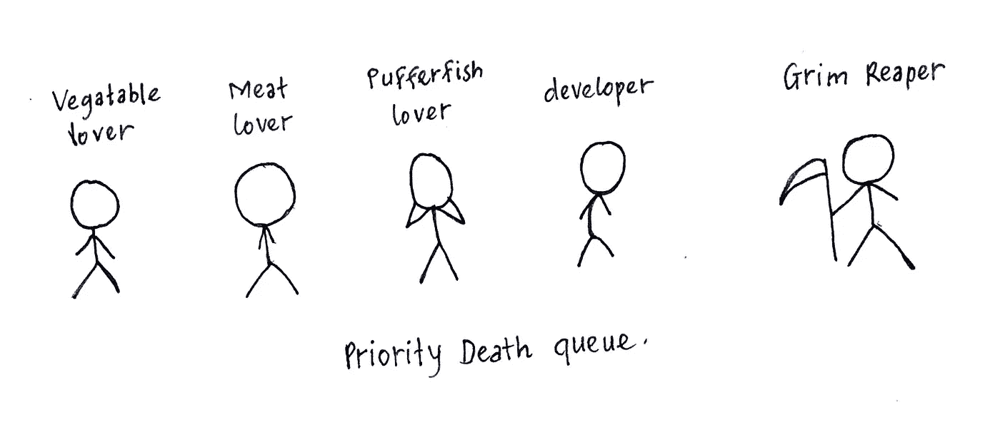
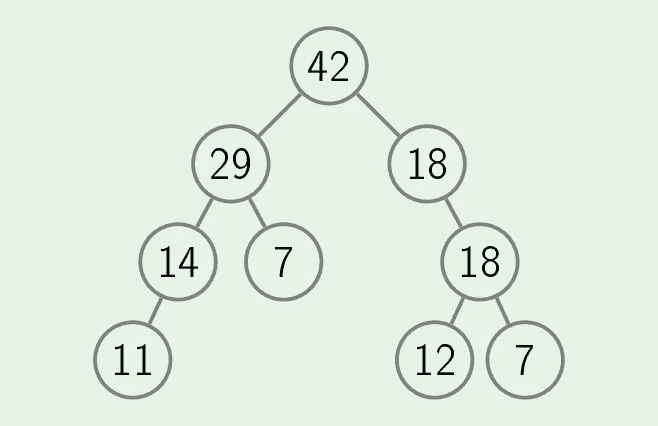
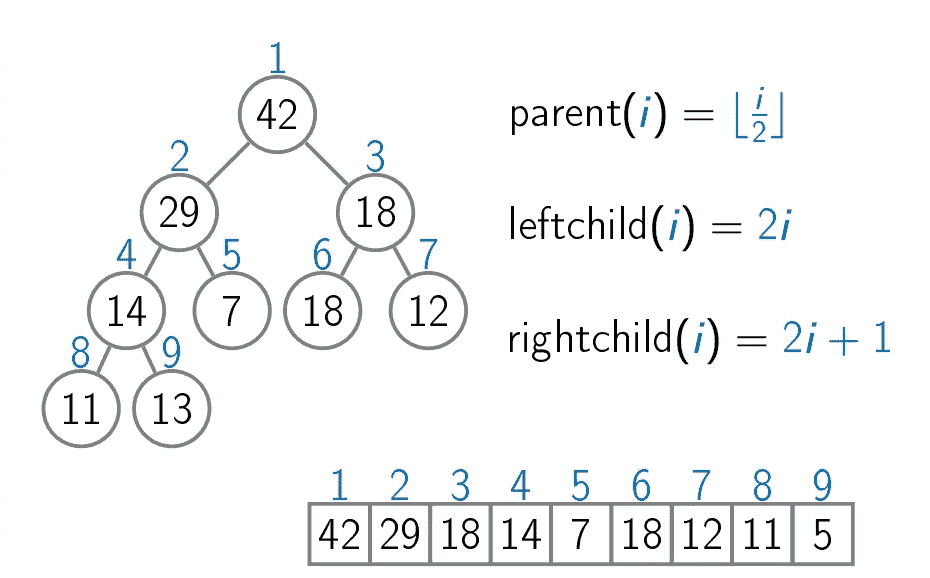
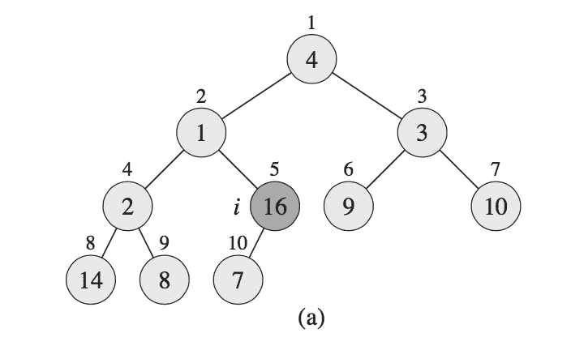
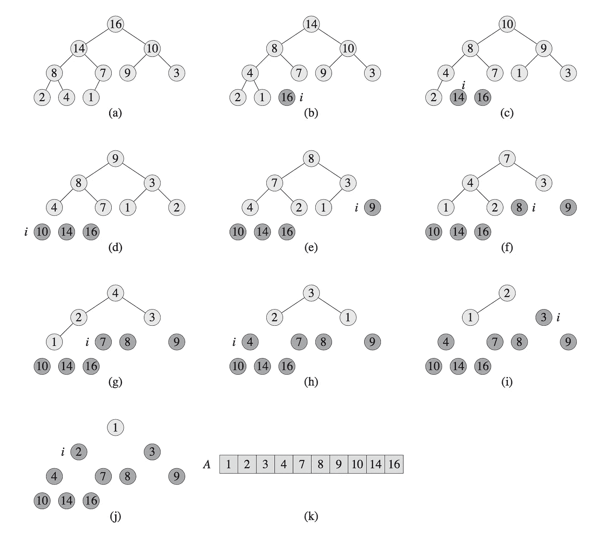
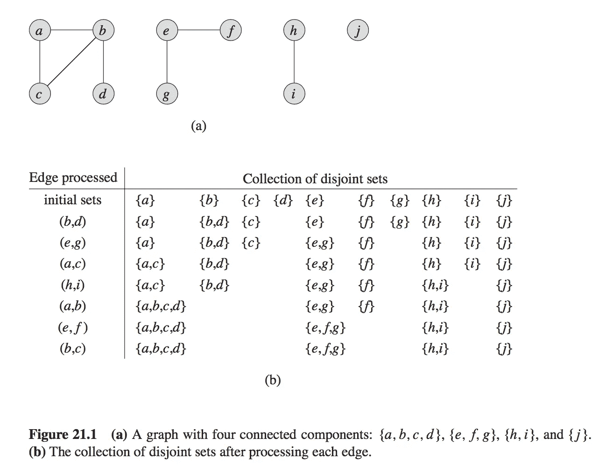
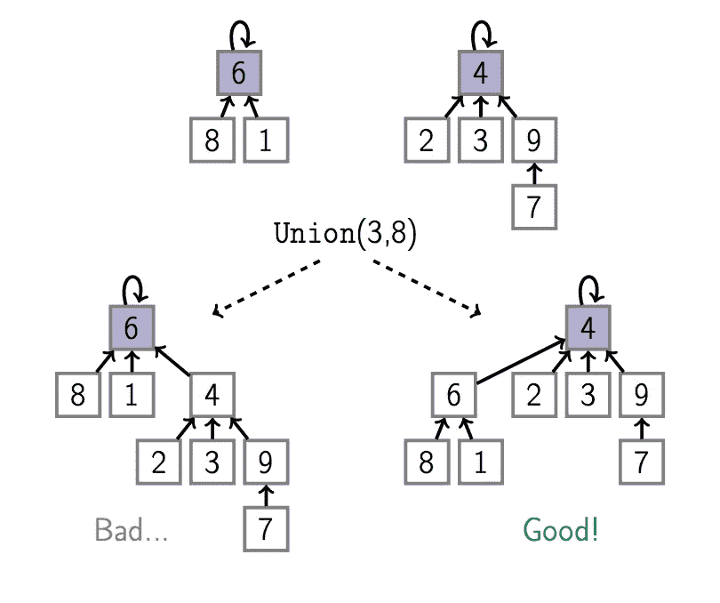
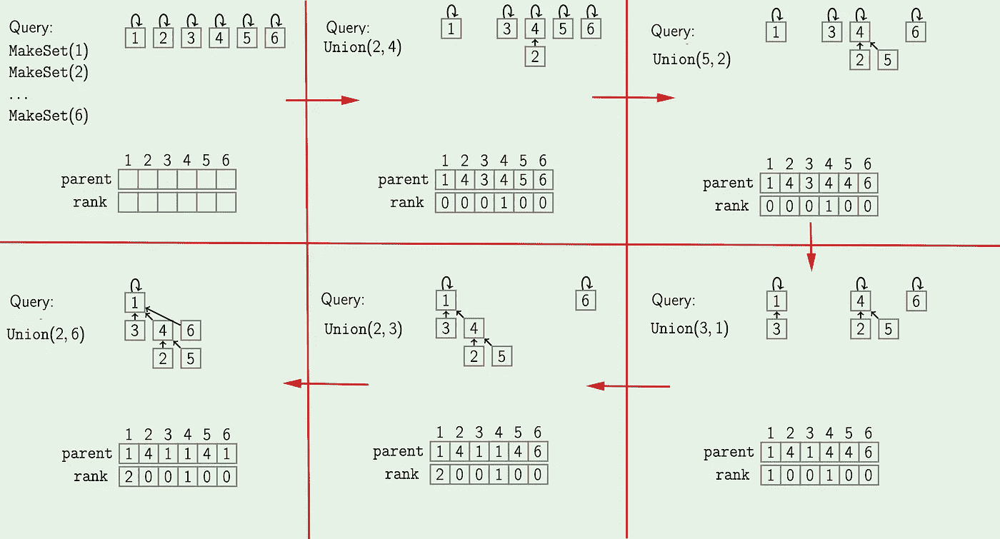
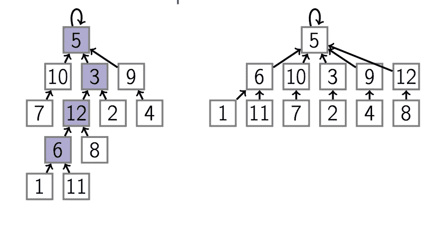

# 课程 2 —数据结构—第 2 部分:优先级队列和不相交集

> 原文：<https://towardsdatascience.com/course-2-data-structure-part-2-priority-queues-and-disjoint-set-ed11a0383011?source=collection_archive---------0----------------------->

如果我们想知道后台工作是如何工作的，找到一个数组中 k 个最小元素的最快方法，数据库中的合并表是如何在后台工作的，请继续阅读。因为在本文中，我们将讨论优先级队列和不相交集。两种数据结构都很漂亮的解决了这些问题。最终，我们会解决以上这些问题。快乐阅读！

# 优先级队列



优先级队列是这样一种队列，其中每个元素被分配一个优先级，并且元素按优先级顺序出现。优先级队列的典型用例是调度作业。每个工作都有一个优先级，我们按照优先级递减的顺序处理工作。同时正在处理当前作业，新作业可能会到达。

优先级队列有一些主要操作:

*   **Insert(p)** :添加一个优先级为 p 的新元素。
*   **ExtractMax()** :提取优先级最高的元素。
*   **ChangePriority(it，p)** :将 **it** 指向的元素的优先级改为 **p** 。

优先级队列用于许多算法中:

*   Dijkstra 算法:在图中寻找最短路径。
*   Prim 的算法:构造一个图的最小生成树。
*   霍夫曼算法:构造一个字符串的最佳无前缀编码。
*   堆排序:对给定的序列进行排序。

您可以使用未排序/已排序的数组或列表来实现优先级，但是每一种都有一个权衡:


但是通过使用二进制堆，我们可以用 O(logn)做 **Insert** ，用 O(logn)做 **ExtractMax** 。

# 二元堆

二进制堆有两种类型:二进制最小堆和二进制最大堆。在本文中，我们将讨论二进制最大堆。另一方面，二进制最小堆也有相同的实现方式。

二进制最大堆是一个二叉树(每个节点有零个、一个或两个孩子)，其中每个节点的值至少是其孩子的值。



如您所见，每个子节点的值都不大于父节点的值。根节点具有最大值。


Not a max-heap. Some children are bigger than parent.

Max-Heap 有一些基本操作:

*   **GetMax** :返回根值即可。成本 O(1)。


*   **插入**:我们将把一个新节点附加到任何一个叶子上。如果它违反了堆属性，我们将冒泡(称为 **SiftUp** )新节点，直到满足堆属性。o(树高)


如您所见，我们将新节点 32 连接到节点 7，并将其冒泡到节点 29。

*   **ExtractMax** :根节点 R 是 max-heap 的最大值。要弹出根节点，我们只要把根节点 R 换成任意一个叶节点 A，去掉节点 R 就可以了，可能会违背 heap 的属性。我们将做 **SiftDown** 操作。作为父节点 A，我们要 **SiftDown** 到子节点 B 和 C，我们会选择子节点 B 和 C 的最大值，交换到节点 A，我们 SiftDown 直到满足堆的属性。


我们首先交换根节点 42 和随机叶节点 12，并移除节点 42。现在违反了最大堆，我们需要将节点 12 向下筛选为子节点。在最后一步，节点 29 是根节点。

*   改变优先级:我们需要改变一个节点的优先级。根据新优先级的值，我们将使用 SiftDown 或 SiftUp 来限定堆属性。
*   **移除**:移除节点 a。我们分两步完成:

**步骤 1:** 使节点 A 值变得最大(无穷大)。我们将执行 **SiftUp** 操作，使节点 A 成为根节点。

**第二步:**我们执行上面描述的 **ExtractMax** 操作。

# 建筑堆

我们知道堆是如何工作的，我们需要找到建立一个堆的方法。为了构建一个堆并保持一个二叉堆树浅滩，我们必须在最后一层从左到右填充新的节点。叫做**完全二叉树**。形式上:

如果一棵二叉树的所有层次都被填满，除了可能是从左到右填满的最后一层，那么它就是完整的。所以一棵有 n 个节点的完全二叉树的高度最多是 O(logn)。


一个完整的二叉树有从左到右填充的元素，所以我们可以将树存储为一个数组，其中



因为我们以数组的形式存储，所以我们执行的每个操作都需要保持树的完整性。

## 最大堆的伪代码

```
# we store elements in array Hdef parent(i):
  return i/2def left_child(i):
  return 2idef right_child(i):
  return 2i + 1def sift_up(i):
  while i > 1 and H[parent(i)] < H[i]:
    swap H[parent(i)] and H[i]
    i <- parent(i)def sift_down(i):
  maxIndex <- i
  left <- left_child(i)
  if left <= size and H[left] > H[maxIndex]:
    maxIndex <- left
  right <- right_child(i)
  if right <= size and H[right] > H[maxIndex]:
    maxIndex <- right
  if i != maxIndex:
    swap H[i] and H[maxIndex]
    SiftDown(maxIndex)def insert(p):
  if size = maxSize:
    return ERROR
  size <- size + 1
  H[size] <- p
  SiftUp(size)def extract_max():
  result <- H[1]
  H[1] <- H[size]
  size <- size - 1
  SiftDown(1)
  return resultdef remove(i):
  H[i] = ∞
  sift_up(i)
  extract_max()def change_priority(i, p):
  oldp <- H[i]
  H[i] <- p
  if p > oldp:
    sift_up(i)
  else:
    sift_down(i)
```

# 堆排序

回到排序问题，我们观察到最大堆的根节点是最大值。如果我们做 **ExtractMax()** 并放入另一个数组，结果将是排序递减数组。这是选择排序的基础。它的价格为 O(nlogn)。

```
def heap_sort_selection_sort(A[1...n]):
  create an empty priority queue
  for i from 1 to n:
    Insert(A[i]) # Insert operation to build max-heap.
  for i from n downto 1:
    A[i] <- ExtractMax()
```

事实上，我们可以做更好的堆排序算法，不使用任何额外的数组，它是就地堆排序算法。给定一个数组

```
A = [ 4, 1, 3, 2, 16, 9, 10, 14 , 8, 7]
```

我们将数组 A 表示为一个堆:



现在我们需要修复所有节点以满足 max-heap 的属性。我们可以开始修复深度为 1 的所有子树中的节点(深度为 0 的是所有的叶子)。深度为 1 的节点从 n/2 到 1

```
def build_heap(A[1...n]):
  size <- n
  for i from n/2 downto 1:
    SiftDown(i)
```


我们从父节点 5，4，3，2，1([16，2，3，1，4])开始。每一步，我们做 **SiftDown** 操作。最后，我们可以有一个最大堆(f)。

要对最大堆进行排序，我们只需交换节点 A[1]和 A[size]，移除 A[size]和 SiftDown(1)。

```
def heap_sort(A[1...n]):
  repeat (n-1) times:
    swap A[1] and A[size]
    size <- size - 1
    SiftDown(1)
```



# 部分排序

给定数组 A[1…n]，并且 1 ≤ k ≤ n。输出 A 的排序版本的最后 k 个元素。

有了堆排序，我们很容易解决这个问题:

```
def partial_sorting(A[1...n], k):
  build_heap(A)
  for i from 1 to k:
    extract_max()
```

运行时间为:O(n+klogn)。对于较小的数 k = O(n/logn)，代价将为 O(n)。真令人印象深刻。

# 不相交集

不相交集有许多应用，其中之一是确定无向图的连通分量。



不相交集合数据结构维护不相交动态集合的 S1、S2、…、Sk 的集合。我们把每个集合表示成一棵有根的树。


我们可以通过使用一个数组来存储这些集合(有根的树),该数组的值 A[i]是节点 I 的父节点，或者如果节点 I 是根节点，则它是节点 I 的父节点。

不相交集有一些主要操作:

*   MakeSet(i) :创建一个只包含一个 I 集合:{i}。

```
def make_set(i):
  parent[i] <- i
```

*   **查找(i)** :在一个集合中查找 I，返回根索引

```
def find(i):
  while i != parent[i]:
    i <- parent[i]
  return i
```

*   **联合(S2 S1)**:合并两个有根的树。这是不交集最重要的运算。

我们有两个有根的树，我们想联合这些树。通常，我们有两种方法可以做到这一点:



好的那个是身高较矮的那个。我们如何知道为并集选择根节点？

为了回答这个问题，我们只需要使用一个等级作为高度来选择最终的根。换句话说，我们只是把矮的挂在高的根部。为了避免每次执行 union 操作时都要重新计算 rank(height ),我们需要将每个子树的高度存储在数组 **rank[1…n]** 中，其中 rank[i]是根为 I 的子树的高度。

我们改变了不相交集合运算的实现:

```
def make_set(i):
  parent[i] <- i
  rank[i] <- 0def find(i):
  while i != parent[i]:
    i <- parent[i]
  return idef union(i, j):
  i_id <- find(i)
  j_id <- find(j)
  if i_id == j_id:
    return
  if rank[i_id] > rank[j_id]:
    parent[j_id] <- i_id
  else:
    parent[i_id] <- j_id
    if rank[i_id] == rank[j_id]:
      rank[j_id] <- rank[j_id] + 1
```

让我们把构建不相交集合的过程形象化，做并集(2，4)，并集(5，2)，并集(3，1)，并集(2，3)，并集(2，6)。



每一步，我们需要选择较低等级的树，并将其附加到较高等级的树。当我们有两个相同等级的树时，我们只增加结果的等级。

## 通路压缩

在造树的时候，我们可以马上意识到我们的树会变得越来越高。让我们看看如何找到元素 6，我们确实遍历了所有父节点以得到根节点 5。


请注意，所有节点 6、12、3 都有相同的根节点 5，因此，如果我们能够将它们的所有父节点转换为直接父节点 5，就太好了，就像这样:



Path Compression

你可以看到，我们可以压缩高度，我们可以更快地找到元素。你会惊奇地发现，这种启发式的实现如此简单:

```
def find(i):
  if i != parent[i]:
    parent[i] <- find(parent[i])
  return parent[i]
```

# 问题 1:将数组转换成堆

在这个问题中，你将把一个整数数组转换成一个堆。这是称为 HeapSort 的排序算法的关键步骤。它保证了最坏情况下𝑂(𝑛日志𝑛的运行时间，而不是快速排序的𝑂(𝑛日志𝑛).的平均运行时间快速排序通常在实践中使用，因为通常它更快，但是堆排序用于外部排序，当你需要排序不在你的计算机内存中的大文件时。

**问题描述**

**任务。**heap sort 算法的第一步是从想要排序的数组中创建一个堆。顺便说一句，你知道基于堆的算法被广泛用于外部排序吗？当你需要对不在计算机内存中的大文件进行排序时。

您的任务是实现这第一步，并将给定的整数数组转换成堆。为此，您需要对阵列应用一定数量的交换。Swap 是将数组𝑎中的元素𝑎𝑖和𝑎𝑗与一些𝑖和𝑗.进行交换的操作你需要将数组转换成一个只使用𝑂(𝑛交换的堆，正如在课堂上所描述的。请注意，在这个问题中，您需要使用最小堆而不是最大堆。

**输入格式。**输入的第一行包含单个整数𝑛.下一行包含𝑛空格分隔的整数𝑎𝑖.

**输出格式。**输出的第一行应该包含单整数𝑚——交换的总数。𝑚必须满足条件 0 ≤ 𝑚 ≤ 4𝑛.接下来的𝑚行应该包含用于将数组𝑎转换为堆的交换操作。每次交换都由一对整数𝑖,𝑗来描述，这是要交换的元素的从 0 开始的索引。在按指定顺序应用所有交换后，数组必须变成一个堆，也就是说，对于 0≤𝑖≤𝑛1 的每个𝑖，必须满足以下条件:

```
1\. If 2𝑖+1 ≤ 𝑛−1,then 𝑎𝑖 < 𝑎(2𝑖+1).
2\. If 2𝑖+2 ≤ 𝑛−1,then 𝑎𝑖 < 𝑎(2𝑖+2).
```

请注意，输入数组的所有元素都是不同的。请注意，任何长度不超过 4𝑛的交换序列，在此之后，您的初始数组成为正确的堆，都将被评定为正确。

**样品 1。**

**输入:**

```
5
5 4 3 2 1
```

**输出:**

```
3
1 4
0 1
1 3
```

**说明:**

```
After swapping elements 4 in position 1 and 1 in position 4 the array becomes 5 1 3 2 4.After swapping elements 5 in position 0 and 1 in position 1 the array becomes 1 5 3 2 4.After swapping elements 5 in position 1 and 2 in position 3 the array becomes 1 2 3 5 4, which is already a heap, because 𝑎0 =1 < 2 = 𝑎1, 𝑎0 =1 < 3=𝑎2, 𝑎1=2 < 5=𝑎3, 𝑎1=2 < 4=𝑎4.
```

更改讲座中的 **BuildHeap** 算法，以考虑**最小堆**而不是最大堆，并考虑基于 0 的索引。

## 解决方案:

在构建堆时，我们将从第 n/2 个节点向下到第 1 个节点进行 SiftDown 操作，以修复堆来满足最小堆属性。每次交换节点时，我们都需要跟踪它。

# 问题 2:并行处理

在这个问题中，您将模拟一个并行处理一系列作业的程序。像 Linux、MacOS 或 Windows 这样的操作系统都有特殊的程序，叫做调度程序，它对你计算机上的程序做同样的事情。

**问题描述**

**任务。**您有一个并行化的程序，它使用𝑛独立线程来处理给定的𝑚作业列表。线程按照输入中给出的顺序接受任务。如果有空闲线程，它会立即从列表中获取下一个任务。如果一个线程已经开始处理一个作业，它不会中断或停止，直到它完成处理该作业。如果几个线程试图同时从列表中获取作业，索引较小的线程会获取作业。对于每一个任务，你确切地知道任何一个线程处理这个任务需要多长时间，这个时间对于所有的线程都是一样的。您需要为每个作业确定哪个线程将处理它，以及它何时开始处理。

**输入格式。**输入的第一行包含整数𝑛和𝑚.

第二行包含𝑚整数𝑡𝑖——任何线程处理𝑖-th 作业所用的时间(秒)。时间的顺序与它们在线程获取作业的列表中的顺序相同。

线程从 0 开始进行索引。

**输出格式。**准确输出𝑚线。𝑖-th 行(使用基于 0 的索引)应该包含两个用空格分隔的整数——将处理𝑖-th 作业的线程的基于 0 的索引和它将开始处理该作业的时间(以秒为单位)。

**样品 1。**

**输入:**

```
2 5 1 2 3 4 5
```

**输出:**

```
0 01 00 11 20 4
```

**说明:**

```
1\. The two threads try to simultaneously take jobs from the list, so thread with index 0 actually takes the first job and starts working on it at the moment 0.2\. The thread with index 1 takes the second job and starts working on it also at the moment 0.3\. After 1 second, thread 0 is done with the first job and takes the third job from the list, and starts processing it immediately at time 1.4\. One second later, thread 1 is done with the second job and takes the fourth job from the list, and starts processing it immediately at time 2.5\. Finally, after 2 more seconds, thread 0 is done with the third job and takes the fifth job from the list, and starts processing it immediately at time 4.
```

想想当其中一个线程空闲时的事件顺序(在开始时和完成某个任务后)。如何应用优先级队列来模拟按要求的顺序处理这些事件？记得考虑几个线程同时空闲的情况。

在这个问题中要小心 integer over ow:在 C++中使用 long long 类型，在 Java 中使用 long 类型，只要正则类型 int 能够覆盖 ow，就要考虑问题语句中的限制。

## **解决方案:**

这个想法是我们需要一个优先队列来留住工人。我们通过状态和指数比较两个工人。要选择下一个工人，我们只需选择根最小堆树。为了让它工作，我们需要改变根树和修复树的优先级。

## 问题 3:合并表格

在这个问题中，您的目标是模拟数据库中表的一系列合并操作。

**问题描述**

**任务。在某个数据库中存储有𝑛表。这些桌子从 1 到𝑛.编号所有表共享同一组列。每个表包含几行实际数据或指向另一个表的符号链接。最初，所有表都包含数据，𝑖-th 表包含𝑟𝑖行。您需要执行以下操作的𝑚:**

1.考虑𝑑𝑒𝑠𝑡𝑖𝑛𝑎𝑡𝑖𝑜𝑛(𝑖).号桌遍历符号链接的路径以获取数据。也就是说，虽然𝑑𝑒𝑠𝑡𝑖𝑛𝑎𝑡𝑖𝑜𝑛(𝑖)包含了象征性的联系而不是真实的数据 do𝑑𝑒𝑠𝑡𝑖𝑛𝑎𝑡𝑖𝑜𝑛(𝑖)←symlink(𝑑𝑒𝑠𝑡𝑖𝑛𝑎𝑡𝑖𝑜𝑛(𝑖))

2.考虑表格编号𝑠𝑜𝑢𝑟𝑐𝑒(𝑖)并从它开始以与𝑑𝑒𝑠𝑡𝑖𝑛𝑎𝑡𝑖𝑜𝑛(𝑖).相同的方式遍历符号链接的路径

3.现在，𝑑𝑒𝑠𝑡𝑖𝑛𝑎𝑡𝑖𝑜𝑛𝑖和𝑠𝑜𝑢𝑟𝑐𝑒(𝑖)是有真实数据的两个表的数字。如果𝑑𝑒𝑠𝑡𝑖𝑛𝑎𝑡𝑖𝑜𝑛(𝑖)！= 𝑠𝑜𝑢𝑟𝑐𝑒(𝑖)，将𝑠𝑜𝑢𝑟𝑐𝑒(𝑖表中的所有行复制到𝑑𝑒𝑠𝑡𝑖𝑛𝑎𝑡𝑖𝑜𝑛(𝑖表中，然后清空𝑠𝑜𝑢𝑟𝑐𝑒(𝑖表，并在其中放置一个指向𝑑𝑒𝑠𝑡𝑖𝑛𝑎𝑡𝑖𝑜𝑛(𝑖的符号链接，而不是真正的数据。

4.打印所有𝑛表中的最大大小(回想一下，大小是表中的行数)。如果表格只包含一个符号链接，则其大小被认为是 0。

**请参见示例和解释以获得进一步的说明。**

**输入格式。输入的第一行包含两个整数𝑛和𝑚——分别是数据库中表的数量和要执行的合并查询的数量。**

输入的第二行包含𝑛整数𝑟𝑖——𝑖-th 表中的行数。

然后按照描述合并查询的𝑚线。每个都包含两个整数𝑑𝑒𝑠𝑡𝑖𝑛𝑎𝑡𝑖𝑜𝑛(𝑖和𝑠𝑜𝑢𝑟𝑐𝑒(𝑖)——要合并的表的编号。

**输出格式。**对于每个查询，打印一行包含单个整数的内容——相应操作后所有表的最大大小(根据行数)。

**样品 1。**

**输入:**

```
5 5 
1 1 1 1 1
3 5
2 4
1 4
5 4
5 3
```

**输出:**

```
2
2
3
5
5
```

**说明:**

在这个示例中，所有的表最初都只有一行数据。考虑合并操作:

1.表 5 中的所有数据都被复制到表 3 中。表 5 现在只包含一个到表 3 的符号链接，而表 3 有 2 行。2 成为新的最大尺寸。

2.2 和 4 的合并方式与 3 和 5 相同。

3.我们正在尝试合并 1 和 4，但是 4 有一个指向 2 的符号链接，所以我们实际上是将 2 号表中的所有数据复制到 1 号表中，清除 2 号表并在其中放一个指向 1 号表的符号链接。表 1 现在有 3 行数据，3 成为新的最大大小。

4.从 4 开始遍历符号链接的路径我们有 4→2→1，从 5 开始的路径是 5→3。所以我们实际上合并了表 3 和表 1。我们将 1 号表中的所有行复制到 3 号表中，现在 3 号表有 5 行数据，这是新的最大值。

5.现在所有的表都直接或间接地指向表 3，所以所有其他的合并不会改变任何东西。

**样品 2。**

**输入:**

```
6 4
10 0 5 0 3 3 
6 6
6 5
5 6
4 3
```

**输出:**

```
10 
10 
10 
11
```

**解释:**

在这个例子中，表格具有不同的大小。让我们考虑一下操作:

1.将 6 号表与其自身合并不会改变任何东西，最大大小是 10(1 号表)。

2.在将表号 5 合并到表号 6 之后，表号 5 被清除并且大小为 0，而表号 6 的大小为 6。不过，最大尺寸是 10。

3.通过将 4 号表合并到 5 号表，我们实际上将 4 号表合并到 6 号表(现在 5 号表只包含一个到 6 号表的符号链接)，所以 4 号表被清除，大小为 0，而 6 号表的大小为 6。不过，最大尺寸是 10。

4.通过将 3 号表合并到 4 号表，我们实际上将 3 号表合并到 6 号表(4 号表现在只包含一个到 6 号表的符号链接)，所以 3 号表被清除，大小为 0，而 6 号表的大小为 11，这是新的最大大小。

思考如何使用带路径压缩的不相交集合并和按等级启发式的并来解决这个问题。特别是，您应该将执行 union/find 操作的数据结构从表的合并中分离出来。如果要求您将第一个表合并到第二个表中，但是第二个表的等级小于第一个表的等级，则在不相交集合联合数据结构中进行合并时，您可以忽略所请求的顺序，而是在不相交集合联合中将对应于第二个表的节点连接到对应于第一个表的节点。但是，您将需要存储实际的第二个表的编号，您被请求将第一个表合并到相应不相交集的父节点中，并且您将需要在不相交集联合的节点中附加一个 eld 来存储它。

## 解决方案:

我们使用 ***父*** 数组来存储不相交集合。

我们用 ***行*** 数组来存储根 I 的最大值

我们需要用耙集和路径压缩启发式建立不相交集。

## 阅读材料:

参见[CLRS] —优先级队列中的第 6.4 章

参见此[最小堆可视化](http://www.cs.usfca.edu/~galles/visualization/Heap.html)。

参见[DPVo8] —不相交集的第 5.1.4 节

另请参见本[教程](https://www.topcoder.com/community/data-science/data-science-tutorials/disjoint-set-data-structures/)中关于不相交集合数据结构的内容。

另请参见这个不相交集合的[可视化](http://www.cs.usfca.edu/~galles/visualization/DisjointSets.html)，有和没有路径压缩和按等级试探法联合。

## **参考文献:**

Sanjoy Dasgupta、Christos Papadimitriou 和 Umesh Vazirani。算法(第一版)。麦格劳-希尔高等教育。2008.

托马斯·h·科尔曼，查尔斯·e·莱瑟森，罗纳德·L·李维斯特，克利福德·斯坦。算法导论(第三版)。麻省理工学院出版社和麦格劳-希尔。2009.