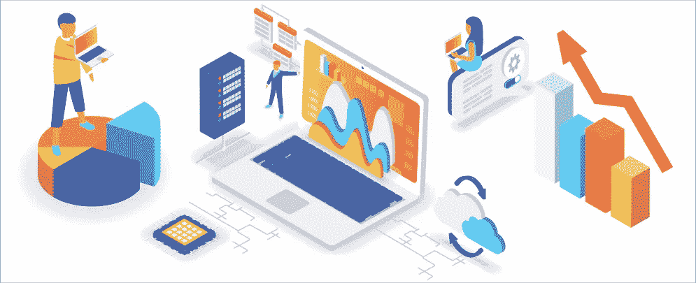

# 打造数据体验

> 原文：<https://towardsdatascience.com/crafting-data-experiences-37bbf7d19fc3?source=collection_archive---------22----------------------->

以用户为中心的框架已经成为许多不同讨论的关键，包括但不限于软件设计、新兴商业模式、新的工作方式、新的白领工作，甚至我们如何组织我们的社会。尽管这种不断增长的以用户为中心的狂热的优点和需求不可否认是重要的，但它似乎确实把一切都放在了同一个盒子里。有时，我们必须打破已知，才能想象出真正独特的东西……尤其是在数据体验方面。

所以，问题来了:总有那么多事要做！总有一千种不同的事情可以轻松解决，具有巨大的价值并加速上市…因此，数据解决方案通常要么是组装仪表板的传统方法，要么是一种艰巨的努力…通过严格关注显而易见的需求/用户，我们总是努力攀登最高的山峰，而不是挑战极限以征服月球。

现在，当你在讨论中引入一些被错误地认为是“严格技术性”的东西，比如数据解决方案时，以用户为中心的框架通常会逐渐消失，变成标准的比萨饼、条形图和折线图，用花哨的颜色或图案显示用户习惯的确切信息。突发新闻:这既不应该被认为是以用户为中心的，也不是数据解决方案。

# 数据体验

在定义什么是数据体验之前，明确什么不是很重要。自动化不是数据体验！！虽然有人可能会说，收集或创建、处理和分析数据的纯粹事实是自动化的核心，但这里我们不包括使用复杂数据分析来取代人类的解决方案，从你的冰箱在牛奶用完时向市场下订单到无接触工业供应链管理。

在这种情况下，数据体验是那些利用数据的力量为用户提供对给定上下文的可操作理解的体验。通常被称为智能放大或增强智能，它们利用技术作为扩展一个人收集和处理信息的能力的手段，但最终它取决于一个人做出决定的责任(并最终改造系统以提高其准确性)。这意味着，为了恰当地制作增强智能解决方案，用户必须是该过程的关键部分，因为他的专业知识和经验是产品中利用的关键组件。否则就像设计一个手机壳，却不知道手机的大小和形状，也不知道摄像头、传感器、插头和按钮的位置。

通过利用以用户为中心的思维模式的核心，并接受共享人机知识体的可能性，就有可能设计出独一无二的数据体验。

# 从一个明确的目标开始

所以这就是棘手的地方，如果你的目标太宽泛，你的解决方案要么太复杂，要么不可行。另一方面，如果你设定了一个小目标，你要么限制了你的可能性，要么可能忽略了问题的真正根源。有鉴于此，一个明确的目标不是你的最终使命“世界和平”，而是你可以实现的目标“优化 X 地区的货物分配”。

# 创造环境意识

当谈到数据解决方案时，有些技术方面和解决方案的人的方面一样重要。请记住这一点:数据体验利用数据来增强采取行动的能力。有鉴于此，为了确保正确理解上下文，你应该能够回答几个问题:

*   谁是我的用户，他们的需求是什么？
*   他们目前是如何实现目标的？
*   影响他的不同方面有哪些，影响到什么程度？
*   你的用户对这种信息有多熟悉，他有多信任它？
*   我的用户需要多少信息/细节才能有信心采取行动？
*   哪些数据是可用的或可以创建的？

我也喜欢在这个列表中加上“技术上可能的”。但是需要强调的是，这不应该是对技术方面的深入调查。对不同类型的数据解决方案(包括描述性、诊断性、规定性、预测性和人工智能，有监督和无监督的)的关键方面以及总体数据策略方面的总体理解应该会让您有所了解。

# 在可能性上有分歧

在这种解决方案中，构思更多的是提出假设，而不是其他任何事情。如果你的目标是让你的电影获得最多的观众，这一刻应该是关于“天气影响人们对喜剧的开放程度”，而不是关于“在公交车站创造活动”。这是反映可能性或添加尚未关联的新信息的时刻。我记得有一次我们对 IT 部门提供的一些服务进行了调查。我们从单独的调查开始，然后决定一起分析他们的结果。我们发现的最有趣的事情之一是，wifi 的质量会影响员工对其电脑的满意度。现在，停下来想一想，现在大多数应用程序都在云上运行，而且您的大多数文件都存储在云驱动程序中……如果 wifi 速度很慢，这将影响应用程序的加载时间，或者您访问文件的时间，这可能会导致错误的看法，认为问题出在计算机本身。有鉴于此，wifi 升级可能是比电脑更新更好的投资。探索数据的可能性是关于探索不可预见的关系和看待假设已知事物的新方法。

# 就一个解决方案达成一致

选择你的开始假设，并开始测试它！！数据解决方案是关于集合重要的事物和加速采取行动的能力。这意味着，当你开始处理真实数据时，你很可能会推翻许多假设，或者你可能会放弃显而易见的陈述，为相关的发现留出空间。

请记住:你对自己的分析结果越有把握，就越没有必要，也越有可能忽略了一些重要的东西。很像这样:你应该专注于理解一个地方的地理位置和太阳升起的时间之间的关系，而不是太阳是否每天都会升起。

另外，带有可视化的原型制作极其重要！这既是在设想要测试哪些时，也是在用真实数据进行测试时。当对数据进行原型设计时，我喜欢开始理解它的整体属性(它的格式、它的含义以及它变化的频率),并在选择一两个用数据和用户进行测试之前画一些图表。

# 调整，增强，重复！

唯一不变的是一切都在变…这意味着你永远不会放弃数据体验！你应该不断测试看待同一事物的新方法，最重要的是，尝试新的事物来聚合和丰富你的工作。
最后但同样重要的是:数据体验不仅仅由可视化组成，它通常还需要开发额外的功能和动作。有鉴于此，确保在您的假设被测试之前，不要花费太多精力在与分析结果密切相关的特性上，否则您可能会在一些要丢弃的东西上浪费时间。