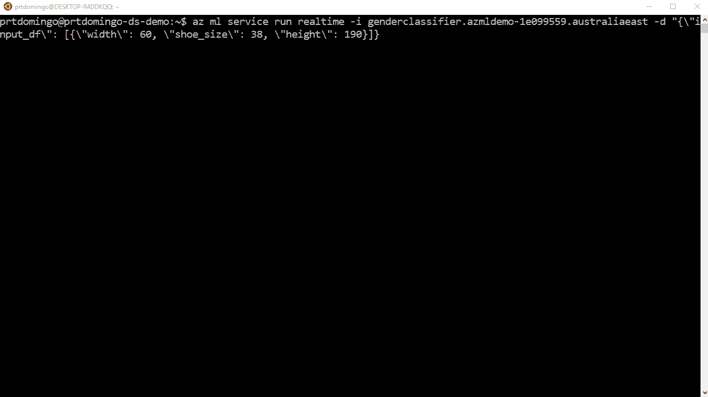
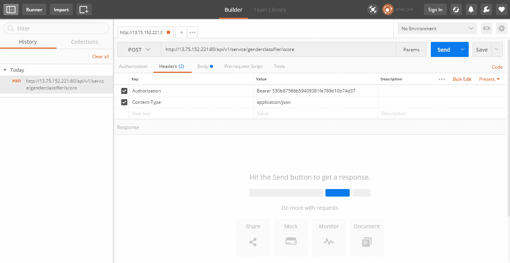

# 用 Python 和 Azure DSVM 创建 Azure 机器学习 Web 服务

> 原文：<https://towardsdatascience.com/create-an-azure-machine-learning-web-service-with-python-and-azure-dsvm-f7a16a925c4b?source=collection_archive---------2----------------------->

上周，当我在阅读关于[微软 CNTK](https://www.microsoft.com/en-us/cognitive-toolkit/) 的文档，并从他们的 [GitHub 库](https://github.com/Microsoft/CNTK)中检查代码样本时，我碰到了另一个 GitHub 库，它是关于 [Azure 机器学习操作化](https://github.com/Azure/Machine-Learning-Operationalization)。

> Azure Machine Learning operational ization 是 Azure CLI 的一个组件，它支持您通过 Vienna 使用 CNTK、SPARK 和 Python 机器学习平台创建的模型的可操作性。

我最近一直在玩 Python 和机器学习，所以我想我应该试试这个，并使用用 Python 构建的机器学习模型创建一个 AzureML Web 服务。

> 重要提示:撰写本文时，Azure 机器学习操作化仍处于预览阶段。未来可能会发生一些突破性的变化。

# 入门指南

要开始 Azure 机器学习操作化，您需要以下内容:

1.  Azure 账户(如果你没有，你可以在这里获得免费试用
2.  azure Data Science Virtual Machine(DSVM)——虽然这并不是必须的，但我认为这是最快最简单的入门方式。你可以点击查看文档[来创建一个。](https://docs.microsoft.com/en-us/azure/machine-learning/machine-learning-data-science-provision-vm)

# 更新(实际上是重新安装)Azure CLI 包

一旦你创建了 Azure DSVM，我们要做的第一件事就是通过卸载和安装来更新我们的`azure-cli`、`azure-cli-ml`和`azure-ml-api-sdk`包。

```
$ pip uninstall azure-cli azure-cli-ml azure-ml-api-sdk
$ pip install azure-cli azure-cli-ml azure-ml-api-sdk
```

以前，我尝试用`pip install`中的`--upgrade`选项更新软件包，但我一直在升级软件包时出错。因此，卸载并安装它可以解决问题，因为稍后，我们将使用这些包来生成一个模式，并将我们训练好的模型部署到我们的 web 服务中。

# 构建性别分类器模型

接下来，我们将使用`scikit-learn`机器学习库创建一个模型，该模型将根据给定的身体指标(*身高、宽度和鞋码*)来预测这个人是男是女。创建一个名为`train.py`的文件，您可以复制下面的代码:

运行代码，它会在你的项目文件夹中创建一个`model.pkl`。

# 创建 score.py

要将我们的模型部署为 web 服务，我们需要创建一个用于生成模式 JSON 文件的`score.py`。

运行`score.py`，您应该会看到`service_schema.json`已经创建。现在，我们的项目文件夹应该包含以下文件:

```
PROJECT_FOLDER
- train.py
- score.py
- model.pkl
- service_schema.json
```

# 使用 Azure CLI 创建和部署 Web 服务

现在我们已经设置好了一切，我们现在将通过执行以下操作来创建我们的 web 服务并部署模型:

## 在 Azure CLI 中验证您的帐户

为了能够使用`azure cli`创建我们的*环境*和*模型管理帐户*，我们首先需要使用以下命令进行认证:

```
$ az login
```

这将显示一条信息，提示您需要打开网络浏览器，进入[https://aka.ms/devicelogin](https://aka.ms/devicelogin)并输入终端中提供的代码。

## 创造环境

一旦您能够使用`azure cli`验证您的帐户，键入以下命令来创建我们的环境:

```
$  az ml env setup -c -n YOUR_CLUSTER_NAME -l YOUR_LOCATION
```

这是我在本教程中使用的:

```
$ az ml env setup -c -n azmldemo -l australiaeast
```

记住现在支持的位置是`westcentralus`、`eastus2`和`australiaeast`也很重要。

## 创建模型管理帐户

我们的环境至少需要 10-20 分钟才能完成配置，因此在等待的同时，我们现在可以创建我们的模型管理帐户，这是一个**一次性设置**的事情。

```
$ az ml account modelmanagement create -l YOUR_LOCATION -n YOUR_MODEL_MANAGEMENT_ACCOUNT_NAME -g YOUR_RESOURCE_GROUP
```

这是我在本教程中使用的:

```
$ az ml account modelmanagement create -l australiaeast -n azmldemoacc -g azmldemorg
```

如果您想知道，`azmldemorg`资源组是在我们之前创建环境时自动创建的，它基本上是在我们的集群名称`azmldemo`上添加了一个 **rg** 。

## 设置模型管理帐户和环境

一旦成功创建了模型管理帐户和您的环境，我们现在将使用以下命令设置模型管理帐户和环境:

```
$ az ml account modelmanagement set -n YOUR_MODEL_MANAGEMENT_ACCOUNT_NAME -g YOUR_RESOURCE_GROUP$ az ml env set -n YOUR_CLUSTER_NAME -g YOUR_RESOURCE_GROUP
```

这是我在本教程中使用的:

```
$ az ml account modelmanagement set -n azmldemoacc -g azmldemorg
$ az ml env set -n azmldemo -g azmldemorg
```

同样重要的是要记住，您的环境*供应状态*应该显示*成功*，以便您能够成功设置它。您可以使用以下命令检查资源调配状态:

```
$ az ml env show -g YOUR_RESOURCE_GROUP -n YOUR_CLUSTER_NAME
```

## 创建 Web 服务

一旦您能够成功设置您的模型管理帐户和环境，我们现在将通过以下方式创建 web 服务:

1.  转到我们已经创建了性别分类器模型和 JSON 模式的项目文件夹
2.  键入以下命令创建 web 服务:

```
$ az ml service create realtime -f score.py --m model.pkl -s service_schema.json -n genderclassifier -r pythonor you can also use --help or -h to know the other arguments available$ az ml service create realtime -h
```

# 测试 Web 服务

一旦成功地创建了 web 服务，您就可以使用下面的命令来获取可以用来测试 web 服务的所有重要细节(*像示例 CLI 命令、Swagger URL、授权载体密钥等等*):

```
$ az ml service usage realtime -i YOUR_SERVICE_ID
```

您可以使用以下命令获得您的*服务 Id* :

```
$ az ml service list realtime
```

## 运行示例 CLI 命令

```
$ az ml service run realtime -i YOUR_SERVICE_ID -d "{\"input_df\": [{\"width\": 60, \"shoe_size\": 38, \"height\": 190}]}"
```

当您在终端中运行时，应该是这样的:



## 通过邮递员测试

这里有一个关于如何通过`Scoring URL`测试 web 服务的例子



我们已经完成了，那么你对 Azure 机器学习的可操作性有什么看法？同样，您可以在这里查看他们的 GitHub 库[中的其他示例。](https://github.com/Azure/Machine-Learning-Operationalization)