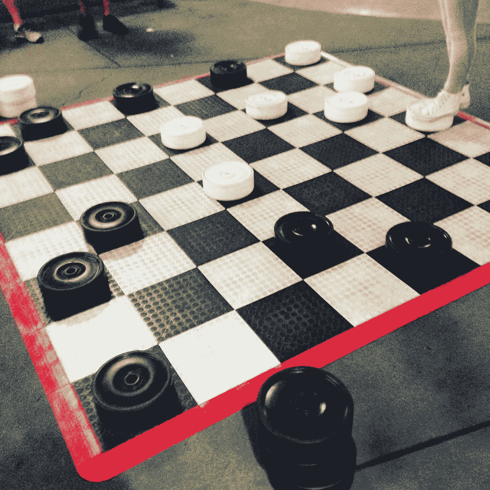
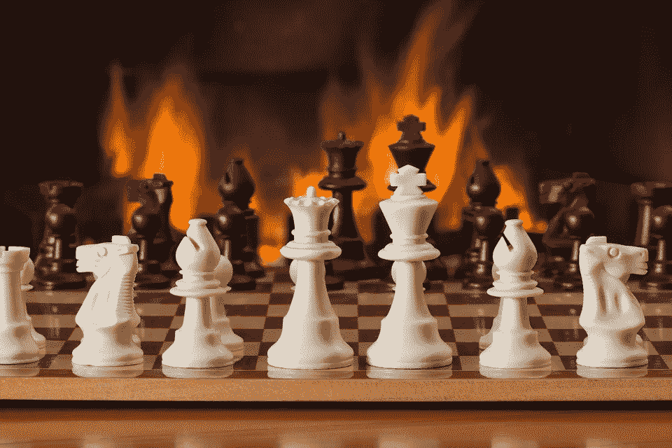
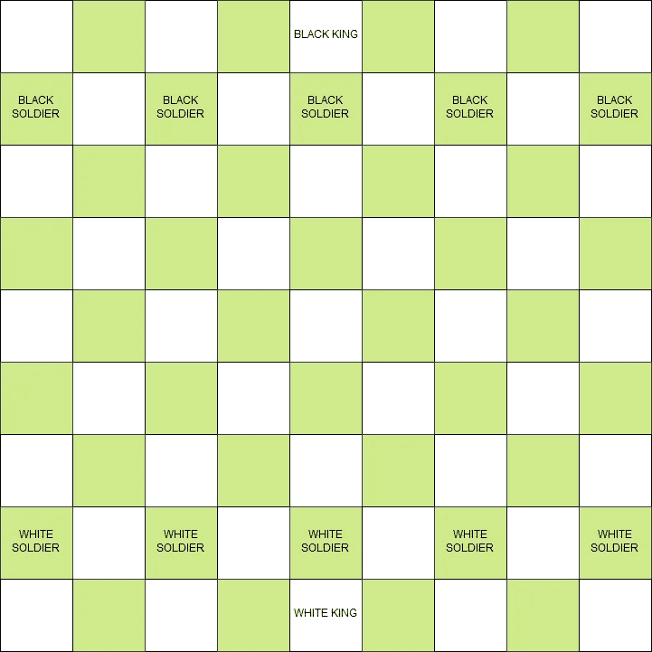
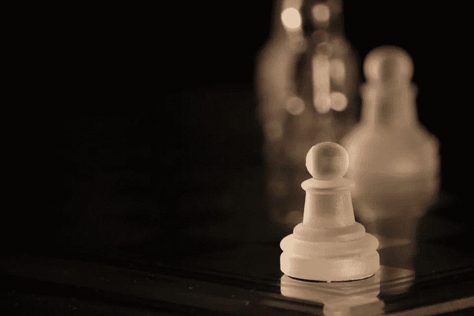
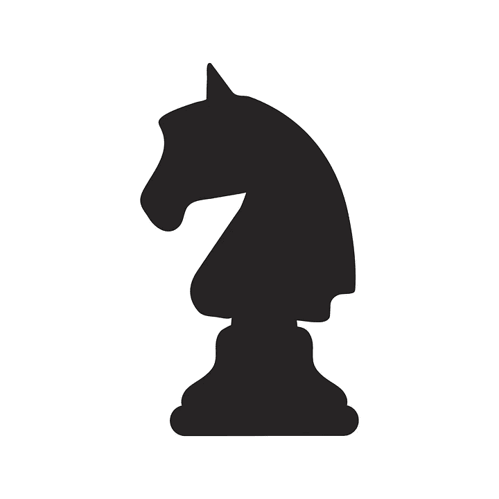
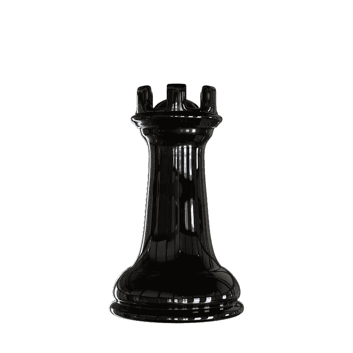
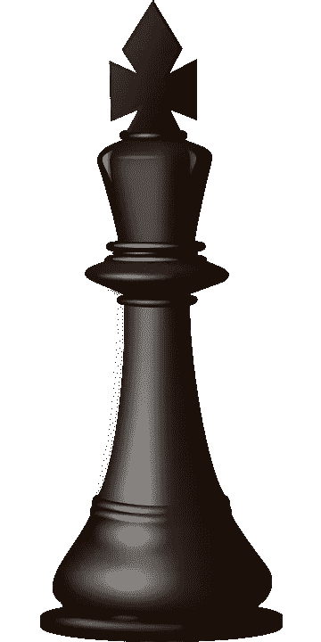
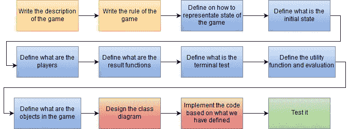
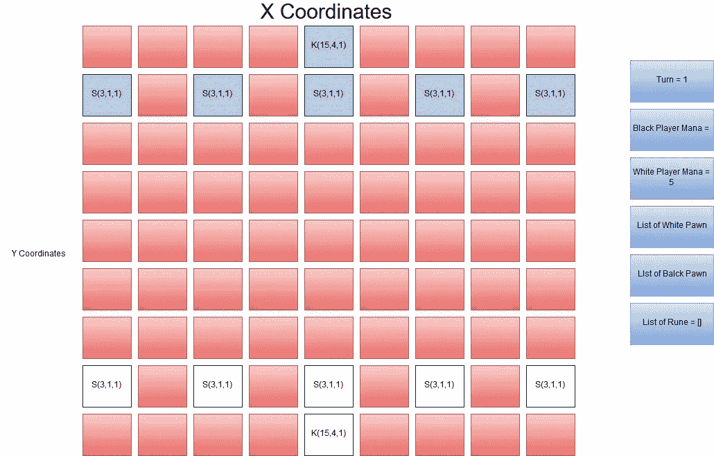

# 从头开始为你自己的棋盘游戏创建人工智能——准备——第 1 部分

> 原文：<https://towardsdatascience.com/create-your-own-board-game-with-powerful-ai-from-scratch-part-1-5dcb028002b8?source=collection_archive---------3----------------------->

## 基于我的一个小项目，我想出了一个棋盘游戏，EvoPawness(临时名称)



Photo by [Trent Jackson](https://unsplash.com/@tjakz98?utm_source=medium&utm_medium=referral) on [Unsplash](https://unsplash.com?utm_source=medium&utm_medium=referral)

大家好！这是我在 medium 发表的第二篇关于人工智能(AI)的文章。我想和大家分享我在空闲时间做的小项目的进展。这是我想出的一个棋盘游戏。**evopheness(暂名)**灵感来源于一款象棋游戏。这是一个简单的游戏。然而，我在这一系列文章中的目的并不是告诉 step 如何有效地开发、设计游戏。而是将重点放在如何为 AI 算法的输入创造一个环境。我不会用 Unity 或者虚幻引擎之类的游戏引擎。但是，我希望我的代码可以帮助你用强大的人工智能设计你的棋盘游戏，不管你是否使用游戏引擎。


I do it in my free time. Source : [https://pixabay.com/en/coffee-magazine-newspaper-read-791439/](https://pixabay.com/en/coffee-magazine-newspaper-read-791439/)

**注**:这部分还没有用到深度学习，但是会涉及到如何创建用于*对抗性搜索的 AI 环境的基础 AI。这部分将集中在设计游戏的类上。如果你只想看到人工智能的运行，跳过这一部分。*

很抱歉，我还不能涵盖深度学习部分。我怕会让我的文章很长，读起来没意思。我想一步步分享我的知识。所以我会写在后面的部分。

这篇文章的目标读者是对人工智能和设计游戏感兴趣的人。如果你不是其中之一，当然你仍然可以看到这篇文章(谁告诉你你不能😆).我希望通过发表这篇文章来提高我的写作技巧，并且内容对你有益😄。

# **简介**

谁不喜欢游戏呢？这是一种人们用来解闷的活动。游戏很有趣，可以训练我们的大脑思考如何解决问题，尤其是棋盘游戏。棋盘游戏是一种在棋盘上移动棋子的策略游戏。有几种棋盘游戏，如跳棋、国际象棋和大富翁，需要两个或更多的玩家来玩。击败对手需要好的策略。制定一个击败对手的好策略需要时间。



Source : [https://pixabay.com/en/chess-board-game-fireside-strategy-2489553/](https://pixabay.com/en/chess-board-game-fireside-strategy-2489553/)

现在，棋盘游戏是在电脑上玩的。它通常有一个人工智能代理，让玩家练习游戏。人工智能有一个策略来寻找最好的移动。当然，人工智能越聪明，我们就越喜欢打败人工智能。所以，我们在游戏中制造一个强大的人工智能来学习好的策略怎么样？它将使人工智能足够强大，让人类享受游戏或让他/她沮丧😆。如果你根据自己的游戏想法创造的人工智能被人们所喜欢，那感觉真好。

这篇文章将集中在我如何创造我自己的原创桌游创意**evopheness(临时名称)**。我还没有检查我的游戏是否已经存在。我认为没有。代码将专注于设计游戏的基本类，准备成为人工智能算法的输入。因为喜欢 Python，所以我会用 Python 语言来写。当然你可以用你喜欢的游戏引擎来写。如果你想实现它，你应该了解如何创建本文中描述的游戏的流程。环境是基于彼得·诺维格的人工智能书。

走吧，让我们创造游戏！

# 概述

本文将按以下顺序撰写:

1.  技术
2.  游戏的描述和规则
3.  术语定义
4.  我们的管道或步骤
5.  定义我们的游戏
6.  履行
7.  结论
8.  编后记

# 技术

在本文的项目中，我们将使用这些:

1.  Python 3.6.5
2.  PyCharm IDE 或首选文本编辑器，如 Atom 或 Sublime(可选)。

目前不需要其他库。稍后，在即将发布的文章中，我们将使用 TensorFlow(也可能是 PyTorch)来开发 AI agent。

# 游戏描述和规则

EvoPawness(暂名)是我想出来的一款桌游。这是一个由两个玩家玩的回合制游戏。这块木板有 9 x 9 块瓷砖。每个玩家有 6 个不同颜色(黑色和白色)的棋子。每个玩家有 5 个士兵棋子和 1 个国王。这个游戏的目标是**摧毁对手的国王或所有敌人的棋子。**

每个棋子都有生命值、ATK 和步数。HP 表明他们的功能或生存能力。ATK 是一个减少敌人设定数量的 ATK 点的属性。步点表示棋子基于其独特移动可以移动多少步。还有一个棋子状态，它表明棋子是否已经被激活。如果它没有被激活，它就不能移动、攻击或进化。



Image 1 : Illustration of the EvoPawness board game

士兵卒可以进化成更高等级的卒。士兵卒可以进化成骑士、车和主教。骑士和主教可以进化成女王。他们会有不同的能力。以下是每个棋子的能力:

## **士兵**



Soldier Pawn. Source : [https://pixabay.com/en/chess-pawn-white-chess-board-parts-56257/](https://pixabay.com/en/chess-pawn-white-chess-board-parts-56257/)

**移动**:士兵只能向前移动。步数取决于步点。可以绕过对手的兵。

**惠普，ATK，步骤**:默认 3，1，1

**攻击目标和范围:**和动作一样，只能依靠步点向前攻击。棋子不会从原来的位置移动。

进化:可以进化成骑士、车和主教

**注**:如果棋子被激活，可以移动、进化和攻击

## **骑士**



Knight Pawn. Source : [https://pixabay.com/en/graphic-sign-symbol-logo-icon-3608411/](https://pixabay.com/en/graphic-sign-symbol-logo-icon-3608411/)

**动作**:各个方向呈 L 形(像象棋版)。步数固定为 1(忽略步点数)。可以绕过对手的兵

**生命值，ATK，第**步:进化为骑士前的点数属性(如果是生命值，将是当前生命值而不是最大生命值)加上这些点数(0，4，0)

**攻击目标和范围:**同样喜欢运动。棋子不会从原来的位置移动。

**进化**:不能进化

## 车



Rook Pawn, Source : [https://pixabay.com/en/chess-figure-rook-black-checkerboard-3413419/](https://pixabay.com/en/chess-figure-rook-black-checkerboard-3413419/)

**移动**:可以前、后、左、右移动(像下棋一样)。步数基于步点数。可以绕过对手的兵

**生命值，ATK，第**步:进化为骑士前的点数属性(如果是生命值，将是当前生命值，而不是最大生命值)加上这些点数(2，2，0)

**攻击目标和范围:**同喜欢运动。棋子不会从原来的位置移动。

**进化**:进化成女王

## 主教


Bishop Pawn, Source : [https://cdn.pixabay.com/photo/2012/04/18/00/52/chess-36348_1280.png](https://cdn.pixabay.com/photo/2012/04/18/00/52/chess-36348_1280.png)

**移动**:对角线向各个方向移动(像下棋一样)。步数基于步点数。可以绕过对手的兵

**生命值，ATK，第**步:进化为骑士前的点数属性(如果是生命值，将是当前生命值，而不是最大生命值)加上这些点数(2，1，1)

**攻击目标和范围:**同喜欢运动。棋子不会从原来的位置移动。

**进化**:进化成女王

## **女王**


Queen Pawn, Source : [https://pixabay.com/en/chess-chess-peace-game-3d-680492/](https://pixabay.com/en/chess-chess-peace-game-3d-680492/)

**移动**:对角线向各个方向移动，可以前、后、左、右移动(像下棋一样)。步数基于步点数。可以绕过对手的兵

**生命值，ATK，第**步:进化为骑士之前的点数属性(如果是生命值，则为当前生命值，而不是最大生命值)加上这些点数(2，2，0)

**攻击范围:**同喜欢运动。棋子不会从原来的位置移动。

**进化**:无法移动

## 国王



King, Source : [https://pixabay.com/en/chess-king-figure-game-black-159693/](https://pixabay.com/en/chess-king-figure-game-black-159693/)

**移动**:不能移动

**惠普，ATK，步长**:默认值(15，4，1)

**攻击范围和目标:**像女王一样用一个范围攻击。棋子不会从原来的位置移动。

— — — — — — — — — — — — — — — — — — — — — — — — — — — — — —

每个玩家都有一种特殊的力量，需要“法力”来实现。“法力”每回合产生一次(最多 10 次)。在第一轮，他们将有 5 个马纳。它将在每回合一次生成。这里有特殊的力量:

*   激活一个士兵卒:需要 3 个马纳
*   进化兵卒:需要 5 个玛纳斯
*   进化一辆车和一个主教:需要 10 个马纳

最后，有两个“符文”随机产生。它会在每个玩家的区域附近随机产生。如果符文被棋子接近。卒可以在他们的一个属性上获得加值(随机)。奖金是:

*   气血增加 2
*   增加 1 级
*   增加 ATK 2

符文可以在棋子的位置上产生。如果它在棋子所在的位置繁殖，它将立即获得奖励。这条规则会让游戏变得不确定。如果我们使用的算法需要游戏是确定性游戏，我们会改变这个规则。

每个玩家每回合只能选择一个动作。他们必须选择移动棋子或激活特殊异能。如果没有可以采取的行动。玩家必须跳过这个回合。


Source: [https://pixabay.com/en/whistle-black-blow-referee-game-33271/](https://pixabay.com/en/whistle-black-blow-referee-game-33271/)

黑人玩家总是第一个移动。所以在第一个回合，轮到黑人玩家，然后轮到白人玩家。他们将交替轮流。

这些规则可以根据我们在下一部分使用的**人工智能算法**而改变。我以后会告诉你我们是否需要改变某个特定的部分。我还没有测试游戏的平衡。所以，不要指望游戏会保持平衡。可能有一种策略被压倒了(OP)。我们不会讨论游戏的平衡。但是如果你认为这个游戏真的不平衡，就告诉我。我会根据你的声明改变游戏规则。

这就是**赢创(临时名称)**的全部规则。如果您对这个名字有疑问，那么“**(临时名称)**”也是这个名字的一部分。我还没有决定游戏的名字，所以它将是临时的名字。

# 术语定义

## **初始状态**

指定游戏开始时是如何设置的。

## 行动。输入=(状态)

返回一个州的一系列合法举措

## 结果函数。输入=(状态，动作)

一个转换模型，它将定义给定状态的动作结果。

## **终末试验。输入=(状态)**

检查游戏的终端状态。如果游戏已经结束，则返回 true，否则返回 false

## 实用功能。输入=(状态，播放器)

定义玩家处于终端状态时游戏的最终数值。数值公式是由我们定义的。

## 评估功能。输入=(状态，播放器)

定义玩家在给定状态下对预期效用数值的估计。这个函数在游戏还没有结束的时候被调用。

# 我们的管道或步骤

我们的步骤如下:



Image 2 : our pipeline

我们已经陈述了游戏的描述和规则。我们仍然需要定义游戏的状态、初始状态、玩家、可能的动作、结果函数、最终测试、效用函数和评估函数。然后，我们需要定义游戏的元素或对象。然后我们设计类图并实现它。哦，我跳过了动作功能。我们将在初始状态之后定义它。

在本文中，我们将跳过效用函数和评估函数。我们将在下一篇文章中定义它们。

# 定义我们的游戏

在这一部分，我们将定义所有我们必须定义的游戏元素。如上所述，它是基于彼得·诺维格的书。让我们跟随它:

## 国家代表权

我们应该定义我们将如何表现游戏的状态。在此之前，我们应该决定在状态中应该保存哪些信息。在这个游戏中，有:

**格式**:游戏的对象(属性)

1.  转动计数器
2.  玩家(法力，颜色)
3.  棋子(生命值，攻击力，位置，活动状态，彩色玩家，步，死亡)
4.  王者(hp，atk，位置，彩民，步，死)
5.  符文(奖励，职位)

好了，我想就这些了。让我们想想如何代表他们。

我们将需要一个 **2D 名单或阵列**的棋子，以保持坐标的棋子和国王的位置信息的游戏。它可以使我们更容易检查棋子的位置。因此，我们将把我们的棋子和国王的位置写入一个 2D 列表或棋子和国王的数组。

我们还需要一个玩家、兵、符文和国王的**列表**来跟踪每个对象。仅仅为了检查每个对象的位置而循环我们的 2D 数组是令人疲惫的。

最后还有一个**转计数器**。这将帮助我们决定现在轮到哪一轮了。如果该指示物能被 2 整除，则轮到白牌手，否则轮到黑牌手。

可能有比这更好的表述。但我认为这将足以代表我们的游戏。

## 初始状态(状态)

这是我们基于如何表示状态的初始状态:



Image 2: Initial state with 2d board

其中的棋子列表与我们的 2D 阵**棋盘**中的棋子相同。所有棋子的状态都是不活动的(状态布尔值为假)

## 玩家(功能(状态)->玩家 _ 索引)

有两个玩家，白人玩家和黑人玩家。玩家的回合决定于:
如果回合是偶数，则是白牌玩家回合。但如果回合是奇数，则轮到黑色玩家。

## 动作(功能(状态)->动作列表)

每个参与者都可以完成以下操作:

**玩家**

如果玩家有 5 个马纳，**他/她可以将一个士兵卒进化成更高级的卒(女王和骑士除外)。**

如果一个玩家有 3 个马拿，他/她可以启动一个兵卒。

如果一个玩家有 10 个马拿，他/她可以将车或象兵进化成女王。

**卒**

如果可能的话，**棋子可以根据棋子的种类移动到指定的方向。**

如果敌人的兵在攻击范围内，**兵可以攻击敌人的兵。**

**君王**

如果敌人的兵在攻击范围内，**盟友的王可以攻击敌人的兵。**


Image 3: rough scratch action flow

**通过**

如果没有可用的动作，**通过该回合。**

所有可能的动作将被**追加**到一个将由函数返回的列表中。

## 结果函数(函数(状态，动作)->新状态)

这是我们行动的结果

有三位演员我们必须去看:

*   **玩家**

玩家可以用马纳斯的费用来进化棋子。它会将棋子变成更高级的棋子。它将添加属性

玩家可以用马纳斯的费用启动兵。**它会将棋子状态更改为活动。**

*   **卒**

兵可以根据类型移动。**它将改变棋子在棋盘阵列中的位置。如果棋子命中一个符文，会随机增加其属性(只有一个)。**

兵可以通过**根据攻击者的 ATK 点减少生命值来攻击对手的兵。**

*   **君王**

棋子可以通过**根据攻击者的 ATK 点数减少生命值来攻击对手的棋子**

*   **过关**

**通过转弯**。


Image 4 : Result Function

完成上述动作之一后，回合增加一。如果该回合能被 5 整除，它将产生 2 个随机符文。

## 终端测试`(Function (state) -> boolean true or false)`

它检查游戏是否结束。

我们会检查每个国王的死亡属性。如果为真，那么函数将返回`**true**`。如果没有，我们将检查每个玩家的棋子。

如果玩家没有活着的棋子，该函数将返回`**true**`，否则返回`**false**`。

## 效用和评价函数(函数(状态，播放器)->整数)

我们不会在这里公式化我们的评价或效用函数。在当前的文章中不需要。

# 履行

在我们编码之前，我们需要设计我们的类，使我们的代码变得更加结构化。我们需要设计这种关系。我们将在模型视图控制器(MVC)设计模式中完成。


Image 5: Class Diagram.

所有类型的棋子将继承棋子抽象类。国家将有符文，球员，和卒类。这些是我们的模型。我们定义的元素在游戏控制器中。

就是这样，状态意志包含符文，玩家，兵。游戏控制器将成为视图和状态之间的桥梁。控制器将生成我们上面定义的所有元素。状态是我们的模型，将由 GameController 类处理。

源代码将被上传到我的 GitHub 库。我们不会在这里讨论所有的代码。我们将讨论如何基于我们定义的元素进行编码。

## 国家代表权

以下是我如何对州进行编码的示例:

它具有我们上面定义的所有属性。

## 初态

这是如何定义初始状态的例子

## 演员

下面是决定谁该轮到谁的代码。

```
class State:
  def get_player_turn(self):
    return self.turn % 2class GameController:
 def player(self, state):
    return state.get_player_turn()
```

## 行动

下面是决定可能的操作的代码。我将向您展示如何生成可能的操作的示例。

它会返回玩家可能的动作。还有棋子可能行动的代码。但是，我不会在这里展示它，因为它很长。可能的动作将通过 **dict** 格式返回，其中包含棋子的信息和玩家的信息。它将包含有关该操作的所有信息。

这里有一个使用可能动作的例子。这是玩家可能的动作之一(记住，玩家有两个可能的动作，提升和激活) :

```
'p1a4’: {‘action’: ‘activate’,
 ‘pawn_atk’: 1,
 ‘pawn_hp’: 3,
 ‘pawn_index’: 4,
 ‘pawn_step’: 1,
 ‘pawn_x’: 8,
 ‘pawn_y’: 1,
 ‘player_index’: 1}}
```

其中“p1a4”是唯一键，用于标识唯一动作。

控制器将调用该函数。

```
class GameController:
def get_possible_action(self,state):
        all_possible_action = self.combine_action(self.state.get_possible_action() + self.state._get_possible_action_pawn() + self.state._get_possible_action_king())
        if len(all_possible_action.keys()) == 0:
            return [{'action': {'skip' : {'action': 'skip'}}}]
        return all_possible_action
```

## 结果函数

这是结果函数的例子

它将接收动作输入和当前状态。例如，我们想要激活索引为 1 的棋子，该函数将接收以下输入:

```
{‘action’: ‘activate’,
 ‘pawn_atk’: 1,
 ‘pawn_hp’: 3,
 ‘pawn_index’: 4,
 ‘pawn_step’: 1,
 ‘pawn_x’: 8,
 ‘pawn_y’: 1,
 ‘player_index’: 1}
```

它将激活一个棋子并返回新状态。小心，我们必须确保首先复制我们的状态，以避免对象引用(使用 deepcopy 库)。

该函数将响应控制器调用的方法。

## 终端功能

下面是如何检查游戏是否已经结束的例子

该功能将检查卒和王的死亡状态。它没有告诉我们谁是赢家。它只会检查游戏的终端状态。

## 测试游戏

我还没有创建 GUI 版本。目前，我们只能在终端或命令提示符下玩。在候机厅玩不舒服。下面是我玩游戏的截图:


Sorry for my bad writing >_<

状态、可能的动作将是我们视图的输入。

我们视图的代码将被放在 GitHub 存储库中。

# 结论

我们从零开始创造了一个新游戏。我们已经定义了一些元素，可以作为人工智能算法的输入。我们定义了状态、初始状态、玩家函数、结果函数和终端函数的表示，并用 Python 编程语言编写。

我还没有测试过代码是否能完美运行。所以，如果有人发现了 bug，可以在这里留言。

# 编后记

感谢您阅读我关于人工智能的第二篇文章。我需要一些建设性的反馈，让我在写作和人工智能方面做得更好。请手下留情😆！

我只是想把我的知识分享给读者。分享知识很好，因为它可以帮助有需要的人。我正在学习这个领域，想分享我所学到的东西。如果有人告诉我这篇文章有什么问题，那就太好了。

GitHub 库将于明天在**创建。我需要先记录这个函数。**

**编辑**:这是 GitHub [链接](https://github.com/haryoa/evo-pawness)

我希望 GUI 能在下一篇文章中完成。在候机厅玩真的很难受。如果有人想为创建 GUI 做出贡献，我会非常感激😃。

原谅我低效的代码，我已经尽量让代码可读，高内聚，低耦合。因此，欢迎任何反馈来修复我的代码混乱。

> 如果你想从我这里得到另一篇这样的文章，请拍下这篇文章👏 👏这会鼓舞我写下一篇文章的精神。我保证会做出更好的关于 AI 的文章。

在下一篇文章中，我将分享一个关于对抗性搜索的传统算法。在此之后，我们将进入创建具有深度神经网络的代理。

下一篇文章再见！


Source : [https://cdn.pixabay.com/photo/2017/07/10/16/07/thank-you-2490552_1280.png](https://cdn.pixabay.com/photo/2017/07/10/16/07/thank-you-2490552_1280.png)

# 系列文章

第 1 部分:从头开始为你自己的棋盘游戏创建人工智能——准备——第 1 部分

第二部分:[从零开始为你自己的棋盘游戏创造人工智能——Minimax——第二部分](https://medium.com/@haryoaw/create-ai-for-your-own-board-game-from-scratch-minimax-part-2-517e1c1e3362)

第三部分:[为你自己的棋盘游戏从头开始创造人工智能——alpha zero——第三部分](/create-ai-for-your-own-board-game-from-scratch-alpha-zero-part-3-f22761372245)

# 来源

[](https://www.merriam-webster.com/dictionary/board%20game) [## 棋盘游戏的定义

### 一种在棋盘上移动棋子的策略游戏(如跳棋、国际象棋或西洋双陆棋)；一种游戏(如国际象棋)…

www.merriam-webster.com](https://www.merriam-webster.com/dictionary/board%20game)  [## UML 类图教程

### 为每个想学习类图的人编写的全面的 UML 类图教程。阅读此 UML…

www.visual-paradigm.com](https://www.visual-paradigm.com/guide/uml-unified-modeling-language/uml-class-diagram-tutorial/) 

拉塞尔，斯图尔特 j，和彼得诺维格。人工智能:一种现代方法。普伦蒂斯霍尔出版社，2010 年。