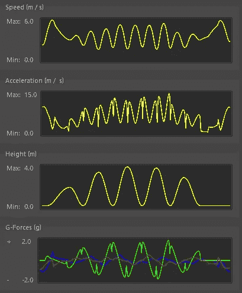
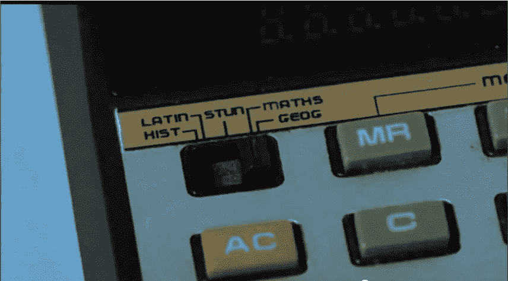
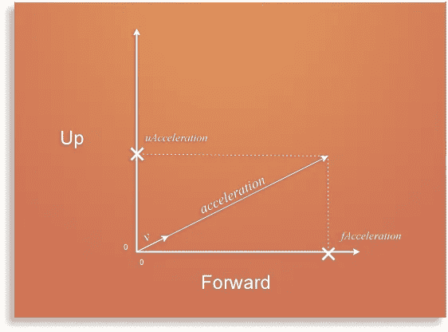
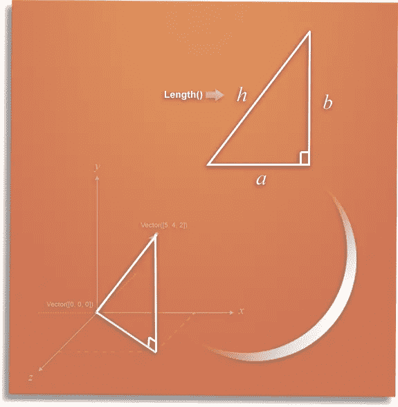
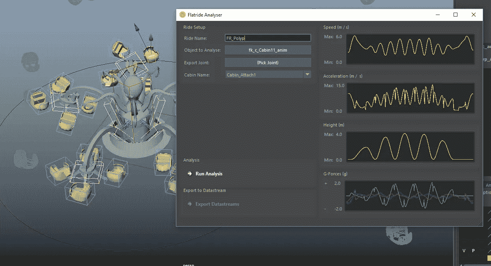

# 为 Planet Coaster 中的平顺性动画创建重力分析工具

> 原文：<https://towardsdatascience.com/creating-a-g-force-analysis-tool-for-flat-ride-animations-in-planet-coaster-f7e6fecc2002?source=collection_archive---------10----------------------->

“平板游乐设施”一词描述了主题公园中除过山车之外的所有游乐设施，包括摩天轮和其他大型液压怪兽等大型景点，这些怪兽会让人们在周围摇摆以取乐。重要的是，我们在制作《星球飞车》的时候把这些游乐设施做对了，不仅仅是造型细节，还有动作。


在开发的早期阶段，我们试验了各种物理驱动的系统，试图重现准确的平顺性运动，但最终结果往往是不可预测的，并且没有公正地对待我们用作参考的现实生活中的景点。我们很早就决定，最好的方法是手工制作平车(不是过山车)动画，尽可能让它们接近原始参考视频。这使我们能够复制每一个细微的细节，同时保持对所有循环动画的绝对控制，最终形成一个平稳的游乐设备运动序列。

A guest reacting to lateral G-force at speed

游乐设施开始进入游戏，很快我们就能看到游客坐在座位上的游乐设施。为了让这些游客栩栩如生，他们需要对游乐设施可能带他们经历的所有运动做出逼真的反应，为此，我们需要一种从他们的经历中提取详细遥测信息的方法。



This is what we’re going to work towards

我希望能够捕捉游客在游乐设施上感受到的垂直、横向和水平重力，以及其他有用的统计数据，如高度和速度。我需要的所有信息都出现在动画中，所以我开始编写一个工具，可以分析 Maya 场景并挖掘我们需要的信息来驱动一套反应性的来宾动画(向左倾斜、向右倾斜、加速、停止等)。这种工具还可以标记出不适合主题公园骑行的高重力热点。

This early development video gives you a glimpse of the tool we’ll be talking about today

一开始，我只是在游乐设施上选择一个可以代表游客的位置，并为其设置一个定位器。这将作为我的“客人”位置，我可以从中提取我需要的所有数据。



*Set your calculators to ‘maths’*

**获得基础知识**

所以，我有一个定位器，在这个场景的动画中，它代表一个游客被带到一个游乐设施上。最简单的形式是，这个工具需要在动画的每一帧上捕捉游客定位器的变换矩阵，然后我们就可以从那里计算出剩下的部分。

```
**for** i, time **in** enumerate(timeSliderRange):
    pm.currentTime(time)
    matrix = TransformationMatrix(obj.worldMatrix.get())
    position = xform(obj, q=True, rp=True, ws=True)
    positions.append(Vector(position))
    matrices.append(matrix)
```

我将定位器的转换矩阵存储在一个单独的列表中，与它的旋转-枢轴位置相对应，以使只需要位置值的代码更容易编写。我会在这里放一些代码片段，但是它真正的上下文在文章末尾的主代码块中有详细的描述。

**载体**

在接下来的一点，你会看到我使用了 [PyMel 的‘Vector’类](http://download.autodesk.com/global/docs/maya2012/zh_cn/PyMel/generated/classes/pymel.core.datatypes/pymel.core.datatypes.Vector.html)相当多，所以我想我应该给出它们是什么以及我为什么使用它们的粗略概述。


Not that Vector

简而言之，它们是代表空间位置的三个值(在 3D 中)，例如 *x，y，z* 。

为了形象化，假设向量([0，0，0])表示场景中心的位置，但是向量(0，1，0)表示在 Y 轴上距离场景中心一个单位的位置。第二个向量与第一个向量的关系描绘了一条直线上升的轨迹。

在下面的例子中，我举例说明了一个值为 5、4 和 2 的向量，它转化为一条与读者成一定角度的直线。


所以使用多个向量，你可以计算出一个物体的位置和方向。对这个问题很有用。

**物理时间**

是时候重温普通中等教育证书物理了。我可以假设:

*   重力=加速度/重力。
*   为了得到加速度，我们需要算出速度/时间
*   为了得到速度，我们需要计算距离/时间

我们有了计算距离/时间所需的所有位置，所以我从计算动画过程中游客的速度开始。

**计算客人的速度**


δt(δ时间)正好是 1.0 除以场景的帧速率，因此重新排列该公式的一个更简单的方法是。

> **δ**表示“在 *x* 中的变化”，所以**δ*t*代表**从时间轴的一帧到下一帧的变化。


行进的距离将是我们的定位器在当前帧上的位置减去其在前一帧上的位置。

```
oldPos = positions[0]
**for** i, position **in** enumerate(positions):
    **if** i == 0: **continue** velocity = (position - oldPos) * frameRate
    velocities.append(velocity)
    oldPos = position
```

我们只是遍历位置列表(排除第一个位置，因为它没有之前的帧可以比较),计算偏移量并将其乘以帧速率，然后将速度存储在列表中。

**计算游客的加速度**


让我们再一次重新排列这个公式来简化它，其中δ*v*(速度的变化)是前一帧的速度与当前帧的速度之差。


```
velocities[0] = velocities[1]

# Acceleration
accelerations = [dt.Vector(0, 0, 0)]
oldVelocity = velocities[0]
**for** i, velocity **in** enumerate(velocities):
    **if** i == 0: **continue** acceleration = (velocity - oldVelocity) * frameRate
    accelerations.append(acceleration)
    oldVelocity = velocity
```

为了让这些数据有用，我需要更多关于游客加速方向的信息。要算出来，我需要客人的总体加速度的上、前、右矢量的“[点积](https://en.wikipedia.org/wiki/Dot_product)”。

```
fAcc = []
uAcc = []
rAcc = []

**for** i, acceleration **in** enumerate(accelerations):
    matrix = matrices[i]
    forwards = dt.Vector(matrix[0][0:3])
    up = dt.Vector(matrix[1][0:3])
    right = dt.Vector(matrix[2][0:3])
    fAcc.append(forwards.dot(acceleration))
    uAcc.append(up.dot(acceleration))
    rAcc.append(right.dot(acceleration))
```

**什么是点积？**

在这一阶段之前，我们计算了游客在*世界空间*中的加速度，这意味着我们知道他们在任何方向上都加速了一定的量。下一步是通过将其分解为相对于游客在每个方向上的加速度来解释这一加速度。

我做的第一件事是从访客定位器的转换矩阵中获取前向向量，并将其转换为向量数据类型。PyMel 的内置 vector 类型已经有了计算点积的方法。

```
forwards = dt.Vector(matrix[0][0:3])
```

在下一步中，我们使用这种方法沿着它的前向轴投射游客的加速度。产生的点积是客体在该轴上加速的量。

```
forwards.dot(acceleration)
```



Calculating the Forward and Up acceleration

关于的图解释了我在 2D 的情况下做了什么，其中游客的向量被描述为 *v* 和*加速度*被投影并绘制在向前的轴上。*加速*是点积，它向前加速的量，而*加速*是它向上加速的量。

好吧，回到获取重力的话题。

**计算我们的客人受到的重力**

最后一步是计算施加在游客身上的重力。我这样做是通过将定位器的加速度除以重力(9.81)。


**使用矢量‘length()’方法计算速度和加速度**

我在主代码块的末尾放了一些我还没有提到的东西，所以我将快速描述一下它的内容。

PyMel 的 Vector 类中还包含了一个非常方便的“length()”方法，用于计算向量的长度。如前所述，我们将速度和加速度值存储为向量，这允许我们对它们执行各种预建的数学函数。



如果我们以之前的向量为例，将其表示为直角三角形，我们可以将其转置到 2D 平面上，并将边表示为 *a、b* 和 *h* (斜边)。从这里我们可以应用毕达哥拉斯定理，将这个向量的长度表示为:


通过找到一个向量的长度(或大小),我们可以将一个物体的速度和加速度解释为一个*单浮点数*而不是三个值。

**代码时间**

我制定并测试了所有这些不同的方法，所以我决定将所有这些组合成一个简单的 Python 类，名为“SceneAnalysis ”,它将有一个“analyse()”方法，用于在一个定义的对象上运行所有这些循环，并将结果存储在其自身中。

然后，我可以将这个类传递到一个 UI 中，让它在以后构建图形或导出元数据。

**结论**

The Flatride Analyser doing its thing

工具起作用了。一旦我收集了所有的数据，我花了一些时间在 PySide 上构建了一个 UI，它可以将所有的值显示为曲线。

最终，我们没有使用这个工具来生成动画系统解释的数据。我们决定，数学足够简单，可以在运行时计算，处理开销很小，并且仍然驱动反应式动画系统。这样做还允许我们将同样的数学方法应用于杯垫(可以是任何形状、速度或大小，因此无法预先计算)，还允许我们迭代动画，而不需要维护单独的元数据文件。我们确实保留了用手写数据覆盖这个系统的能力，以纠正动画看起来不太正确的特殊情况，这在一些最复杂的游戏中派上了用场。



All the forces are displayed in this UI, with the Horizontal, Vertical and Forward G-Forces represented by Red, Green and Blue (x, y, z)

那么，制造这种工具值得吗？当然可以。鉴于我们的初始解决方案是手工创作这些数据，原型制作系统证明了它足够简单，可以自动完成，并为我们的动画师节省数小时的时间。

该工具也是一个优秀的明智检查器，允许我们分析我们的工作，标记任何客人的重力会飙升到致命程度的时刻，并给我们一个机会来相应地调整我们的骑行动画。

总的来说，这是一个非常有趣的制作工具(如果你和我一样喜欢图形)，也是一个仔细观察我们手工制作的动画背后的物理原理的好方法。

*一如既往，特别感谢詹姆斯·奇尔科特和蜜琪拉·斯特雷特菲尔德的数学专长*