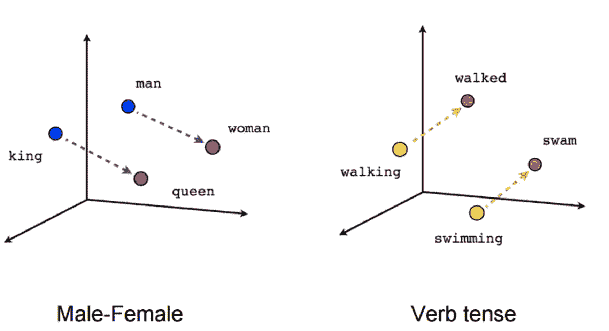
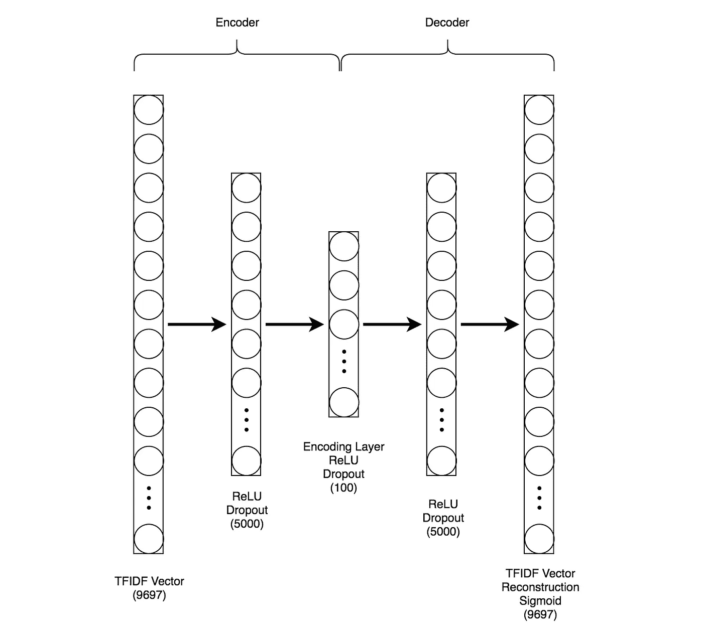
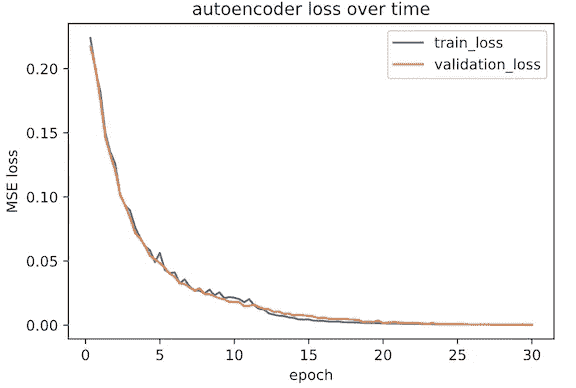
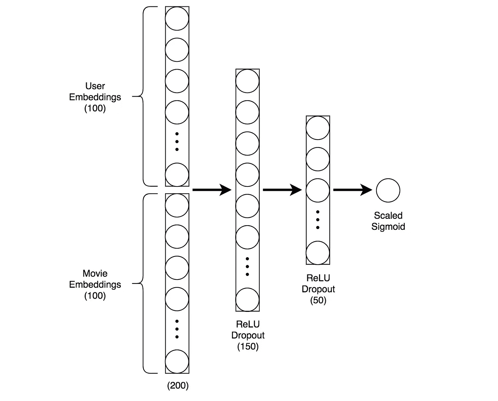

# 使用深度学习创建混合内容协作电影推荐器

> 原文：<https://towardsdatascience.com/creating-a-hybrid-content-collaborative-movie-recommender-using-deep-learning-cc8b431618af?source=collection_archive---------2----------------------->


编剧:亚当·莱恩贝里和 T2 克莱尔·朗格

# 介绍

在这篇文章中，我们将描述我们如何使用深度学习模型来创建一个利用内容和协作数据的混合推荐系统。这种方法首先分别处理内容和协作数据，然后将两者结合起来产生一个两全其美的系统。

使用 [MovieLens 20M 数据集](https://grouplens.org/datasets/movielens/20m/)，我们开发了一个项目到项目(电影到电影)推荐系统，它可以推荐与给定输入电影相似的电影。为了创建混合模型，我们将从标签数据中学习基于内容的电影嵌入的自动编码器和从收视率数据中学习基于协作的电影嵌入的深度实体嵌入神经网络的结果进行了集成。

我们提供了内容和协作推荐系统的简要总结，并讨论了混合模型的好处。我们将跟踪不同系统在我们最喜欢的电影之一中的表现:[指环王:指环王联盟](https://www.imdb.com/title/tt0120737/?ref_=nv_sr_1)。

使用 [PyTorch 0.4.1](https://pytorch.org/docs/0.4.1/) 在 [Paperspace](https://www.paperspace.com/) GPU 机器上执行深度学习工作。这个项目的代码可以在[这个 GitHub 库](https://github.com/acetherace/my-movie-recommender)中找到。

# 协作与内容推荐系统

协作推荐器依赖于用户在与项目交互时生成的数据。这方面的例子包括:

1.  用户对电影的评分范围为 1-5
2.  用户在在线零售网站上购买甚至查看商品
3.  用户对在线音乐流媒体服务上的歌曲表示“赞成”或“反对”
4.  在约会网站上向左或向右滑动

在电影推荐器的上下文中，协作过滤器基于评级简档发现相似用户如何对电影进行评级的趋势。可以使用各种技术来分解或处理评级数据，以最终找到用户和电影在共享潜在空间中的嵌入。电影嵌入描述了它们在潜在空间中的位置，然后可以用于进行电影到电影的推荐。

协作数据的一个好处是它总是“自我生成”——用户在与项目交互时自然地为您创建数据。这可能是一个有价值的数据源，尤其是在高质量项目特征不可用或难以获得的情况下。协作过滤器的另一个好处是，它帮助用户发现他们的历史档案所定义的子空间之外的新项目。

然而，协作过滤器也有一些缺点，例如众所周知的冷启动问题。协作过滤器也很难准确地推荐新颖或合适的项目，因为这些项目通常没有足够的用户-项目交互数据。

内容推荐器依靠项目特征来进行推荐。这方面的例子包括:

1.  电影上用户生成的标签
2.  项目颜色
3.  项目的文本描述或用户评论

内容过滤器往往对流行性偏差和冷启动问题更具鲁棒性。他们可以根据小众口味轻松推荐新的或新奇的商品。然而，在项目到项目推荐器中，内容过滤器只能推荐与原始项目具有相似特征的项目。这限制了推荐的范围，也可能导致出现评分较低的项目。

在电影到电影推荐器的环境中，一个协作过滤器回答了这个问题:“什么电影有相似的用户评级简档？”，一个内容过滤器回答这个问题:“什么电影有相似的特征？”。通过创建一个混合推荐器，我们试图创建一个系统来推荐其他用户以类似方式评价的电影，同时仍然基于该电影的特征进行主题推荐。

# 什么是嵌入？

嵌入是机器学习的几个领域中的一个热门话题，例如自然语言处理、[具有分类特征的预测模型](https://arxiv.org/abs/1604.06737)和推荐系统。计算嵌入有许多方法，但最终目标是将“事物”映射到一个具有复杂和有意义维度的潜在空间。在电影推荐中，你可以想象潜在的维度来衡量诸如“科幻”和“浪漫”等类型以及诸如“对话驱动与动作包装”等其他概念。用户和电影通过它们与每个维度的关联程度被映射到这个空间。

在著名的 [word2vec 例子](https://www.tensorflow.org/tutorials/representation/word2vec)中，习得的单词嵌入能够完成“男人对女人就像国王对 ___”的类比如下图所示，单词已经被映射到一个共享的潜在空间中，单词的意思以几何形式呈现。



Visualize Word Vectors ([https://www.tensorflow.org/images/linear-relationships.png](https://www.tensorflow.org/images/linear-relationships.png))

在机器学习和深度学习的情况下，人们可以选择使用一键编码(OHE)或学习嵌入来执行特定的任务。数据的 OHE 表示法有一个潜在的不良特性，即每一项都与所有其他项正交(因此在数量上完全不同)。当以单词为例时，这可能是数据的弱表示，因为类似单词如“alien”和“外星人”的相似性/可交换性由于正交性而完全丧失。因此，使用单词嵌入可以扩展某些模型的功能。

# 余弦相似性

我们使用余弦相似度来量化电影之间的相似性。余弦相似度的范围从-1 到 1，计算方法是两个向量之间的点积除以它们的大小。


Equation for calculating cosine similarity between two vectors

简而言之，指向相同方向的电影嵌入向量将获得高余弦相似性分数。这个想法是，通过潜在的概念空间的方向抓住了电影的本质。一个简单的例子来帮助形象化这一点:如果“科幻”和“浪漫”是潜在空间中的维度，那么科幻与浪漫比例相似的电影将指向相同的方向，从而获得高余弦相似性分数。


2D Visualization of vectors arranged in different ways and the resulting cosine similarities

这段代码从电影嵌入中构造余弦相似矩阵，并输出给定输入电影的前 n 个最相似的电影。

# 从内容数据中寻找电影嵌入

MovieLens 数据中包括一组大约 50 万个用户生成的电影标签。根据 MovieLens 的自述文件:“每个标签通常是一个单词或短语。特定标签的含义、价值和用途由每个用户决定。”

这些数据按电影分组，标签连接在一起，产生一个文档集。在这个语料库中，文档是特定电影的所有标签的组合。下面是“指环王:指环王联盟”标签文档的摘录。正如你所看到的，像“冒险”、“幻想”和“根据一本书”这样的词/短语频繁出现。这些数据还包括演员和作者的名字。

```
adventure characters epic fantasy world fighting photography Action adventure atmospheric based on a book based on book beautifully filmed ensemble cast fantasy fantasy world high fantasy imdb top 250 magic music nature nothing at all Oscar (Best Cinematography) Oscar (Best Effects - Visual Effects) scenic stylized Tolkien wizards adventure atmospheric ensemble cast fantasy fantasy world magic stylized wizards Watched adapted from:book author:J. R. R. Tolkein based on book epic fantasy middle earth faithful to book fantasy good versus evil high fantasy joseph campbell's study of mythology influenced magic atmospheric boring high fantasy Action adventure atmospheric based on a book beautifully filmed fantasy high fantasy magic music mythology romance stylized time travel Viggo Mortensen wizards Peter Jackson Peter Jackson music must see Tolkien high fantasy Myth Tolkien wizards Ian McKellen bast background universe
```

接下来，我们将标记文档转换为词频——逆文档频率(TF-IDF)表示。TF-IDF 将非结构化文本数据标记为数字特征，这些数字特征更容易被机器学习算法处理。粗略地说，文档中每个术语的出现频率取决于包含该术语的文档数量。结果，区分电影的词(例如，“外星人”、“幻想”)将比用于描述所有电影的词(例如，“电影”、“演员”)具有更高的权重。

sci-kit learn 中的 TF-IDF 矢量器允许您选择要考虑的 ngrams 范围。对于这个项目，我们发现 unigrams 是足够的，同时仍然保持我们的一些功能是可管理的。

在 TF-IDF 空间中，每个维度都代表了某个词对一部电影有多重要。这种表示不太理想，因为单个概念(例如，外星人/外星人)的编码是碎片化的，并且分散在多个维度上。我们希望将 TF-IDF 数据压缩到一个低维空间中，在这里概念被整合到共享维度中。在压缩的空间中，希望每个维度将代表复杂和健壮的概念。

为了执行压缩，我们选择使用自动编码器。自动编码器是输出与输入相同的神经网络。在我们的架构中(如下图所示)，高维的 TF-IDF 输入被逐渐压缩成 100 维的中央隐层。网络的前半部分是“编码器”。网络的另一半，即“解码器”，试图重建原始输入。通过设置均方误差损失函数并执行反向传播，网络(尤其是编码器)学习一个函数，该函数将数据映射到较低维度的空间中，从而保留大部分信息。



Autoencoder Architecture

让我们从定义编码器和解码器网络开始。它们是单独定义的，以便在网络训练完成后易于对数据进行编码。

接下来，让我们定义一个 PyTorch 数据集类。注意在`__getitem__`方法中`x`和`y`是等价的——这是自动编码器的基本概念。

有了这些构建块，让我们定义一个包装器类，它实例化一切，处理训练循环，并执行数据编码。

从这里开始，训练自动编码器和编码/压缩数据就很简单了:

下面是训练和验证损失随时间变化的曲线图。如您所见，该模型没有过度拟合或拟合不足，最终损耗收敛到一个非常低的值(大约 1e-4)。



使用自动编码器学习的基于内容的电影嵌入，按照余弦相似性的定义，与“指环王:指环王”最相似的前 20 部电影如下所示。

# 从协作数据中发现电影嵌入

完全连接的神经网络用于寻找电影和用户嵌入。在该架构中，大小为`(n_users, n_factors)`的用户嵌入矩阵和大小为`(n_movies, n_factors)`的电影嵌入矩阵被随机初始化，随后通过梯度下降学习。每个训练数据点都是一个用户索引、电影索引和一个评级(等级为 1-5)。用户和电影索引用于查找嵌入向量(嵌入矩阵的行)。这些向量然后被连接并作为输入传递给神经网络。



Embedding Net Architecture

这类似于杰瑞米·霍华德在 fast.ai MOOC 中教授的技术[，我们也使用了 fastai 库。让我们读入数据，创建一个验证集，并构造一个 fastai ColumnarModelData 对象，它本质上是 PyTorch 的 Dataset 和 DataLoader 类的一个方便的包装器。](http://course.fast.ai/lessons/lesson5.html)

接下来，我们来定义一下神经网络。由于网络的输出被限制在 1–5 范围内，因此在输出层使用了一个缩放的 sigmoid 激活函数。通过 sigmoid 传递线性激活给了模型更多的灵活性，从而使其更容易训练。例如，如果模型试图输出一个 5，而不是强迫它从线性计算中输出一个非常接近 5 的值，使用 sigmoid 允许它输出任何高值(因为输入~6 或更大值都被 sigmoid 函数映射到~1.0)。另一种方法是在没有达到 sigmoid 时停止，让模型学习直接从线性输出中输出正确的评级。

fastai 库使得拟合模型变得非常简单。这里使用的`fit`函数负责训练循环，并提供一个漂亮的动画状态栏，显示每个迷你批次的剩余时间和损失值。

由于训练数据的规模很大(2000 万)，该模型需要一段时间来训练。在整个训练的不同阶段，我们调整了辍学水平，以应对过度或不足。学习率也可以使用 fastai 库中的学习率查找工具中的信息进行定期调整:

在学习率查找程序中，学习率最初被设置为非常小的值(1e-5)，并且在一个时期的过程中被迭代地增加，直到高的上限值(10)。在每个阶段，损失都被记录下来，这样就可以绘制出如下图。解释这个图是一个启发式的过程，在 [fastai 课程](http://course.fast.ai/)中有更详细的解释，但要点是:选择一个学习率，在这个学习率上，损失仍在快速减少，尚未稳定下来。在这种情况下，选择 1e-2 将是合理的选择。


对于这种规模的数据集(以及相关的长训练时间)，您可能需要保持和依赖已训练模型的能力，以便可以在以后继续训练。完成后，您还需要将学习到的嵌入保存到磁盘，以便进行后期处理。下面的代码将处理这些项目。

一旦网络得到了令人满意的训练，你将拥有健壮的电影和用户嵌入，随时可以用于各种实际任务。使用由该神经网络学习的基于协作的电影嵌入，由余弦相似性定义的与“指环王:指环王”最相似的前 20 部电影如下所示。

# 将这一切结合在一起

如上所述,《指环王》的合作推荐似乎主要是受欢迎和高度评价的大片，具有强烈的动作和冒险主题。内容推荐似乎受受欢迎程度的影响较小，可能包括一些奇幻类的隐藏宝石。

为了集成来自内容和协作模型的结果，我们简单地对余弦相似性进行平均。通过集合协作和基于内容的结果，我们能够提出有希望从两种方法的优势中吸取的建议。以下是《指环王》的合集推荐。

# 结论

在这篇文章中，我们开发了一个电影到电影的混合内容协作推荐系统。我们讨论并举例说明了基于内容和协作的方法的优缺点。我们还展示了如何使用深度学习而不是传统的矩阵分解方法来开发推荐系统。

在我们的观察中，协作过滤器擅长跨越不同类型的差距，并持续推荐高评级的电影。内容过滤器善于识别非常相似的风格(例如，以中世纪为背景的魔法王国)和较少观看的、潜在隐藏的宝石电影。混合方法的目的是结合两种系统的优势。

我们还找到了一些我们想看的电影！如果你想看你选择的特定电影的推荐，请随时在 Twitter、LinkedIn 或电子邮件上联系。


[Adam Lineberry](https://www.linkedin.com/in/adam-lineberry/)


[Claire Longo](https://www.linkedin.com/in/claire-longo/)

Adam 是丹佛的一名数据科学家，对深度学习、大数据、一级方程式赛车和滑雪感兴趣。

Claire 是丹佛的一名数据科学家，在时尚行业工作。她的研究兴趣是推荐系统。