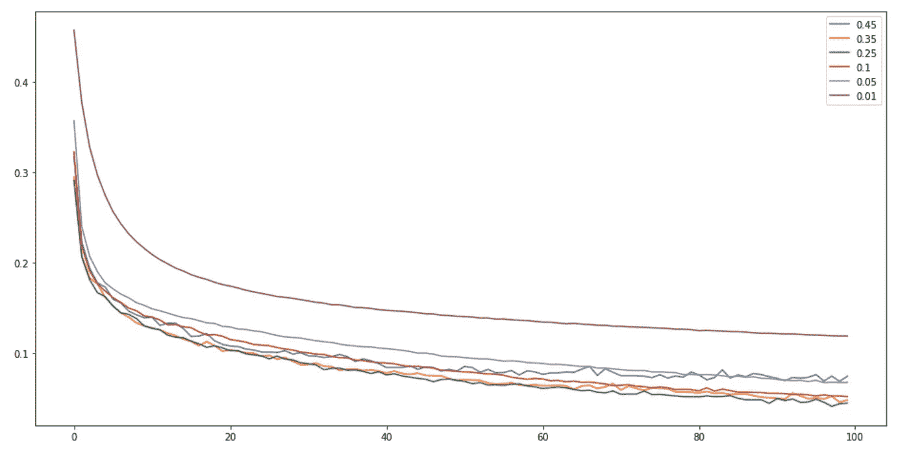

# 在 Python 中使用 Tinn(C 语言中的微型神经网络)

> 原文：<https://towardsdatascience.com/creating-a-python-interface-to-a-c-library-a-tutorial-using-tinn-nn-d935707dd225?source=collection_archive---------11----------------------->

## 使用 Python 和 ctypes 调用 Tinn(一个 200 行 c 语言的微型神经网络)的指南


Image by Author

在 [SensiML](https://sensiml.com) 我们专注于构建机器学习工具，使开发人员能够轻松创建训练有素的模型并将其部署到嵌入式物联网设备上。在这篇文章中，我将向您展示如何将 Tinn(一个用标准 C 编写的微型神经网络)转换成一个共享库，然后从 Python 中调用它，就像它是一个原生 Python 函数一样。我们在 [SensiML](https://sensiml.com) 使用这种方法来试验和构建面向嵌入式设备的 C 库，同时仍然在本地使用我们的 Python 数据科学工具包。

## **第一步。去下载 Tinn**

如果你要完成这个教程，你需要 Tinn。可以[从 GitHub](https://github.com/glouw/tinn.git) 下载 Tinn。

如果您安装了 git，

```
git clone [https://github.com/glouw/tinn.git](https://github.com/glouw/tinn.git)
```

或者，访问该网站并通过单击克隆或下载它，然后选择下载 zip 文件来下载它。

**第二步。将 Tinn 编译成共享库**

为了调用 Tinn 函数，我们必须创建一个共享库。我已经创建了一个 makefile 来将 Tinn 库编译成一个共享库，你可以在这里找到它。用提供的文件替换 Tinn 文件夹中的 make 文件，将 cd 放入终端中的 Tinn 文件夹，然后运行 make。

```
cd tinnmake>>cc -std=c99 -fPIC -fno-builtin -Werror -I../include -I.   -c -o >>Tinn.o Tinn.c
>>making lib
>>ar rcs /Users/chrisknorowski/Software/tinn/libtinn.so Tinn.o
>>cc -shared -Wl,-o libtinn.so *.o
```

(注意:这是为 Linux/OSX 写的，如果你在 windows 上使用 ubuntu bash shell 来编译)

如果一切正常，目录中应该已经创建了一个名为 libtinn.so 的共享库文件。我们将在下一步中链接到这个共享库，以便直接调用这些函数。

## **第三步**。使用 cTypes 创建 Python 接口

让我们首先看看 Tinn.h 文件，看看我们需要从 python 调用哪些函数。

我们将创建的第一个 python 接口是 Tinn 结构。我们可以使用 ctypes 做到这一点。结构类。该结构有两个属性需要填写， **__slots__** 和 **_fields_** 。__slots__ 让我们将属性分配给 struct_tinn 类。_fields_ 让我们描述每个变量使用哪种类型。

下面你可以看到 python Tinn struct 类，我称之为 **struct_tinn** 。使用 ctypes，我们可以指定 struct_tinn 中的所有变量类型，在本例中，是整数和指向浮点数组的指针。

既然我们已经创建了 Tinn 结构的 python 表示，我们需要导入并创建我们想要调用的 c 函数的 python 表示。对于本教程，它们是

有了这三个函数，我们将能够使用 Tinn 库进行初始化、训练和预测。接下来，我们使用 ctyles。CDLL 来导入我们在本教程的步骤 2 中创建的共享库。

对于我们想要调用的每个函数，我们必须将函数的输入和输出类型指定为 python ctypes。我们通过设置 cf_lib 函数的 **argtypes** 和 **restype** 属性来实现这一点。

## **第四步。使用 Python 训练 Tinn NN 识别数字**

至此，我们已经创建了能够从 python 调用 Tinn 所需的所有 python 包装器对象。为了使用神经网络，我们仍然需要为 python 编写初始化、训练和预测方法。

让我们从用一组参数初始化 Tinn 对象的函数开始。我们将调用这个 **init_tinn** 并在我们的 nn 中传递我们想要的输入数、输出数和隐藏层数。

在这里你可以看到，在将所有的输入传递给 xtbuild 函数之前，我们将它们转换为 ctypes。现在可以通过调用我们的 python 函数来初始化 Tinn 对象。

```
Tinn = init_tinn(64,10,128)
```

因为它是一个 python 对象，所以我们可以动态地索引所有的 Tinn 属性。

```
Tinn.weights[0]
>> 0.15275835990905762
Tinn.biases[0]
>> -0.30305397510528564
```

接下来，让我们构建训练和预测函数。我们的 train 函数将接受 Tinn 对象、X 数字的数组、y 目标以及训练步长α。

预测函数将接受已定型的 Tinn 对象和要识别的输入向量，从 nn 返回具有最高可信度的预测值。

最后，让我们在标准的数据科学工作流中使用 python Tinn 函数来识别手写数字。我们将从 sklearn 导入数字数据，然后创建一个 80/20 分割的标准训练测试数据集。为了好玩，我们还循环学习率，看看什么样的学习率最适合这个数据集。最后，做一些预测来检验模型的准确性。

```
alpha: 0.1
             precision    recall  f1-score   support

          0       1.00      0.94      0.97        17
          1       0.80      0.73      0.76        11
          2       0.88      0.88      0.88        17
          3       0.71      0.71      0.71        17
          4       0.84      0.84      0.84        25
          5       1.00      0.95      0.98        22
          6       0.95      1.00      0.97        19
          7       0.94      0.84      0.89        19
          8       0.55      0.75      0.63         8
          9       0.81      0.84      0.82        25

avg / total       0.87      0.86      0.86       180
```



*Image by author*

# **总结**

这篇博文到此结束。我们已经讨论了如何创建一个共享的 c 库，如何使用 ctypes 在 python 中实例化 c 结构和 c 函数。然后，我们使用 python shell 中的调用来初始化和训练 Tinn NN 模型。我希望你喜欢这个教程，如果你有任何问题，请随时给我留言或评论。如果您有兴趣为物联网设备构建智能传感器算法，并希望在传感器本地运行推理，[请联系我们](https://sensiml.com/#contact)或访问我们的[网站](https://sensiml.com)了解更多信息。