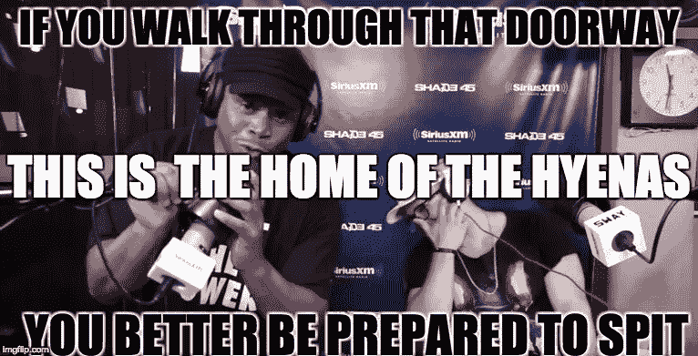
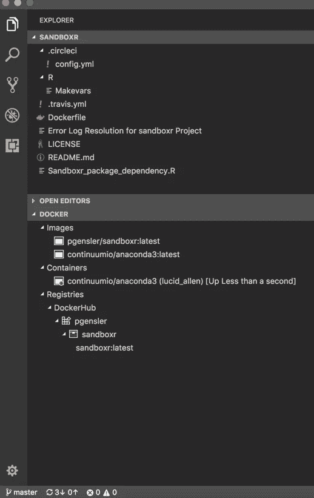
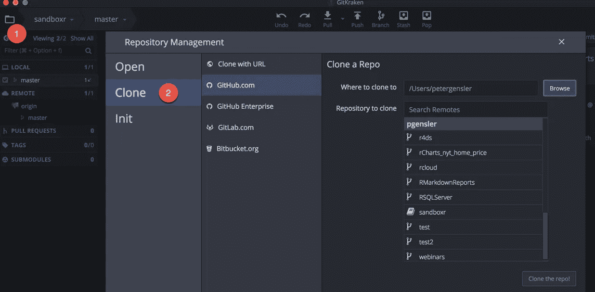

# 用 Docker 为 R 创建沙盒环境

> 原文：<https://towardsdatascience.com/creating-sandbox-environments-for-r-with-docker-def54e3491a3?source=collection_archive---------2----------------------->

在过去的一年里，我一直在学习 R，其中一件让我印象深刻的事情就是建立一个环境，并启动和运行 R 有多么困难。我最近看到了一篇关于如何使用 H2O 和机器学习的博客帖子( [link](http://www.business-science.io/presentations/2017/10/26/datatalk_hr_employee_attrition.html) ),这在我看来很棒。唯一的问题是，如果我要分享我的工作，很有可能有人会花很长时间来尝试配置一个恰到好处的环境，以便所有的星星都可以正确地重现我的结果。

[](http://www.business-science.io/presentations/2017/10/26/datatalk_hr_employee_attrition.html) [## 今晚关于人力资源分析的实时数据谈话:使用机器学习预测员工流动率

### 美国东部时间今晚 7 点，我们将进行一场关于使用机器学习预测员工流动率的#DataTalk 直播。员工…

www .商业科学. io](http://www.business-science.io/presentations/2017/10/26/datatalk_hr_employee_attrition.html) 

现在，任何了解我的人都知道，我已经设法破坏了我的 Macbook 无数次，我宁愿不改变我的系统注册表中的一些随机 json 文件，而只是运行可能证明有用的包。输入 Docker。

# **码头工人:鬣狗之家**



Sway’s Five Fingers of Death challenge

为什么要称 docker 为“鬣狗之家”？这难道不应该让我们知道我们的应用程序应该“正常工作”吗？


What we think our container will look like


What actually ends up happenning

你看，建造一个容器需要某种类型的个体。那个人需要有一定程度的坚韧，在他们的灵魂中有一种燃烧的感觉，当他们看到建造日志的恐怖时，他们不只是打个盹，然后喝醉。


Build Log Horrors

不。他们就像一只鬣狗，不仅仅把他们的构建日志看作错误，而是一个挑战，试图理解正在发生的事情，并且对他们的容器有一个愿景。你看，有两种人:选择建造的人和不建造的人。不同的是，从事建筑的人有一个愿景，一个目标，坚持不懈地追求这个目标，直到目标实现。以肯德里克或安迪·米尼奥这样的说唱歌手为例。对于码头工人是否比流浪汉更好，或者周二午餐吃什么，他们不会分心:*他们只是有一个目标，并像一只欲望未得到满足的鬣狗一样追逐它。*请注意，这一过程绝非易事。等待容器构建，找出构建中的错误，并不是一个奢侈的过程。如果你还没有准备好，这是可以理解的。不要再看这个了，去散散步，做个三明治，给需要的人。如果你想做一个容器，拿起三明治，狼吞虎咽:**让我们开始工作**。

Andy Mineo’s Five Fingers of Death

在你进一步阅读之前，请观看下面的视频，直到 2:40:

从[Opensource.com](https://opensource.com/resources/what-docker)，Docker 定义如下:

> Docker 是一个工具，旨在通过使用容器来简化应用程序的创建、部署和运行。容器允许开发人员将应用程序与它需要的所有部分打包在一起，比如库和其他依赖项，然后作为一个包发送出去。通过这样做，由于有了容器，开发人员可以放心，应用程序将在任何其他 Linux 机器上运行，而不管该机器的任何定制设置可能与用于编写和测试代码的机器不同。

简单地说，Docker 是一种给你的计算机一套指令来制作一道菜(比如说比萨饼)的方法。也许我的朋友杰夫发现了我的比萨饼，想在他的机器上测试一下。简单。下拉映像，使用 docker 文件构建容器，并在本地运行容器。有多简单？

现在，在我们开始之前，有几个主题是值得讨论的，这样你就不会陷入和我刚开始时一样的陷阱:*依赖管理，以及托管平台。*

**依赖管理**

想想你的“披萨”(或容器)里想要什么。当我开始使用我的容器时，我不知道术语“依赖地狱”是什么意思。我强烈建议您在构建容器之前考虑一下您到底想用它做什么。对我来说，我只是想要一个有特定包的沙盒环境，比如 tidyquant。我还想确保当我安装我的包时，任何必要的包也安装了:

```
 install.packages("tidyquant") 
```

默认情况下，下面的代码行将安装“Depends”、“Imports”和“Linking to”中的所有包。虽然这很好，但 tidyquant 有一个被证明是麻烦的小依赖项:XLConnect，它需要 rJava。这可能有点令人头痛，因为 rJava 需要 Java 才能工作，而这很难用 Docker 来配置。

**平台:Docker Hub vs Gitlabs**

如果您决定使用 Github 来托管(或存储)您的 docker 文件，很可能您会希望使用 CI(持续集成)服务来查看对您的 docker 文件所做的更改是否成功。持续集成是必要的，因为这些服务可以帮助您监控推送到 GitHub 的更改，以及构建是否成功。Docker Hub 在默认情况下提供了这种能力，但是很难找出到底是哪里出了问题。如果您决定使用 GitHub 来存储您的代码，我强烈建议您使用 Travis CI 来监控对您的容器所做的更改，以及是否有任何问题发生。

另一个让我印象深刻的关于持续集成的服务是 Gitlabs，它提供了托管、构建和监控 Docker 容器的一站式服务。GitLabs 有时可能有点难以配置，但如果您感兴趣，可以查看以下容器，看看它是否能满足您的需求:

[https://gitlab.cncf.ci/fluent/fluentd-docker-image](https://gitlab.cncf.ci/fluent/fluentd-docker-image)

无论你决定使用哪种服务，我认为有一个版本控制系统是非常必要的，这样你就可以回去，看看什么变化起作用，什么变化不起作用。提交新的变更绝对是一件痛苦的事情，但是我认为能够看到你的构建状态从 15 次糟糕的尝试到第一个绿色徽章是非常值得的。

# 一些后勤物品

在我们开始这个项目之前，有几个后勤项目需要解决:首先，从这里下载 docker:【https://www.docker.com/community-edition

接下来，下载以下工具:

Visual Studio 代码-【https://code.visualstudio.com/download 

https://www.gitkraken.com/download

Visual Studio 代码是非常好的文本编辑器，内置了对 Docker 管理的支持，这是一个与文件系统交互的终端，允许您在文本编辑器中与 Git 或 GitHub 等版本控制进行交互。当您从 Visual Studio 代码中打开存储库时，您会注意到下面有一个名为 Docker 的选项卡。这使您可以直观地看到本地下载的图像，以及任何正在运行的容器和 Docker Hub 上的任何图像，这非常方便:



Visual Studio Code Docker Management

GitKraken 是一个用于从远程位置管理存储库的工具(如 GitHub 或 BitBucket)。GitKraken 特别有助于保持您的存储库的本地副本与 GitHub 上所做的更改同步，但不会下载到您的本地机器上。

最后，在 GitHub 上创建你的库，你可以随心所欲地命名它。

1.现在进入 GitKraken，点击屏幕左上角的文件夹图标。

2 这将提示您从远程位置克隆存储库。有关更多详细信息，请参见下图:



Cloning the repo in GitKraken

我们走吧！您的存储库现在应该被克隆到您的本地机器上，因此您现在可以访问它，并且可以将文件推/拉到存储库中。

# 第 1 部分:创建 Dokerfile

为了构建您的 order 文件，需要一些核心组件来使 order 文件完整，这些组件是:

*   从基础图像开始
*   在基本映像上安装所需的任何核心库
*   您希望安装在容器上的包
*   清理所有临时文件，使图像尽可能小

有一点需要注意的是，当你创建 docker 文件时，你希望你的图像有尽可能少的“层”。让我们看一个样本 docker 文件

```
FROM rocker/tidyverse:latest 
LABEL maintainer="Peter Gensler <peterjgensler@gmail.com>"RUN R -e "install.packages('flexdashboard')"
RUN R -e "install.packages('tidytext')"
RUN R -e "install.packages('dplyr')"
RUN R -e "install.packages('tidytext')"
```

为什么这样不好？根据 Docker 的说法，每个 RUN 命令都被视为图像上的一层，你放入图像的层越多，图像就越大，这使得它有点难以处理。为了尽量减少这种情况，最好限制 docker 文件中的命令数量。我把我的任务分成了创建目录、复制文件夹、安装 CRAN 包和安装 GitHub 包，这些仍然是相当多的层，但使代码更可读，以查看我试图用这段代码执行什么操作。

让我们通过使用我创建的 Dockerfile 作为示例来说明上述概念，从而对其进行分解:

```
FROM rocker/tidyverse:latest 
LABEL maintainer="Peter Gensler <peterjgensler@gmail.com>" # Make ~/.R 
RUN mkdir -p $HOME/.R# $HOME doesn't exist in the COPY shell, so be explicit 
COPY R/Makevars /root/.R/MakevarsRUN apt-get update -qq \
    && apt-get -y --no-install-recommends install \
    liblzma-dev \
    libbz2-dev \
    clang  \
    ccache \
    default-jdk \
    default-jre \
    && R CMD javareconf \
    && install2.r --error \
        ggstance ggrepel ggthemes \
        ###My packages are below this line
        tidytext janitor corrr officer devtools pacman \
        tidyquant timetk tibbletime sweep broom prophet \
        forecast prophet lime sparklyr h2o rsparkling unbalanced \
        formattable httr rvest xml2 jsonlite \
        textclean naniar writexl \
    && Rscript -e 'devtools::install_github(c("hadley/multidplyr","jeremystan/tidyjson","ropenscilabs/skimr"))' \
    && rm -rf /tmp/downloaded_packages/ /tmp/*.rds \
 && rm -rf /var/lib/apt/lists/*
```

为了构建一个容器，容器需要一个起始映像来开始，这个映像可以在 Docker Hub 上找到，Docker Hub 位于[这里是](https://hub.docker.com/explore/)。这里需要注意的一点是，虽然 Docker Hub 有 Ubuntu 或 Python 的官方图片，但 r 没有官方图片。幸运的是，Rocker 项目的人决定给我们一些非常有用的图片，作为一个好的起点:【https://www.rocker-project.org/images/】T2

接下来，我们需要创建一个。r 文件夹，通过下面一行:

```
RUN mkdir -p $HOME/.R
```

一旦完成，我们需要将 Makevars 文件从 GitHub 上的 R/Makevars 复制到容器的主目录中。Makevars 文件只是用来将参数传递给编译器(本例中是 C++ ),这样构建我们的容器的输出就不会有 rstan 包(prophet 包需要它)的一堆混乱的警告

```
COPY R/Makevars /root/.R/Makevars
```

一旦我们将正确的文件放入它们各自的位置，就该开始安装使用我们的 R 包所需的任何必要的库了。这里要注意的是，rocker/tidyverse 映像是建立在 Debian 的最新稳定版本(目前是 stretch)上的。要找到你可能需要的软件包，只需使用下面的链接在 Debian stretch 上搜索软件包(这并不总是最容易搜索的)

[](https://www.debian.org/distrib/packages#search_packages) [## Debian -软件包

### 根据 Debian 自由软件的规定，Debian 官方发行版中包含的所有软件包都是免费的…

www.debian.org](https://www.debian.org/distrib/packages#search_packages) 

如果您希望了解更多关于以下内容的信息，我强烈建议您在这里查看 apt-get 的文档:

```
RUN apt-get update -qq \
    && apt-get -y --no-install-recommends install \
```

 [## apt-get(8) - Linux 手册页

### apt-get 是处理包的命令行工具，可以被认为是用户对其他工具的“后端”…

linux.die.net](https://linux.die.net/man/8/apt-get) 

我们在第二行所做的只是声明不要为一个给定的包安装任何推荐的包。

需要注意的一点是，在 docker 文件中，我们使用命令:

```
&& install2.r --error \
```

这是从包 [littler](https://github.com/eddelbuettel/littler/blob/master/inst/examples/install2.r) 中取出的，它允许我们通过命令行安装 R 包。上面的错误标志仅仅意味着如果下面几行中的任何一个包出错，编译就会出错。请注意，上面安装以下包的脚本是一个连续的行，它允许在容器内安装包时创建尽可能少的层。

接下来，我们使用 Rscript，这是从 GitHub 命令行安装软件包的一种不同方式。

最后，我们使用下面的命令清理所有临时文件，以减小容器大小:

```
&& rm -rf /tmp/downloaded_packages/ /tmp/*.rds \
 && rm -rf /var/lib/apt/lists/*
```

既然我们的 docker 文件已经编写好了，那么是时候在本地测试我们的容器以验证它是否构建成功了

# 第 2 部分:本地运行容器

一旦我们创建了 Dockerfile，下一个测试就是看看我们是否可以在本地构建容器。虽然这一步听起来很简单，但仅仅构建容器只是征服 docker 之旅的一半。

为此，只需导航到包含您的文件的文件夹。在这个例子中，我只是进入名为 sandboxr 的文件夹。

```
cd ~/sandboxr
```

接下来，在您的终端中运行命令，这将构建映像。这需要一些时间，所以要有耐心。末尾的句点表明 dockerfile 位于我们所在的文件夹中，因此我们不需要显式指定路径:

```
docker build -t my_image .
```

完成后，您应该会在最后看到一条消息，表明映像已经成功构建。如果您的映像没有构建，请检查日志，看看是什么失败了，是不是需要一个 Debian 包，或者从源代码构建包有一些问题。

既然我们的 Dockerfile 已经编写好了，是时候使用一些 CI 服务来监控我们的构建了，这样当进行更改时，我们就可以看到这些更改是否破坏了构建。

# 第 3 部分:持续集成

持续集成的启动和运行可能会很麻烦，因此本文旨在提供一个关于如何为您的容器启动和运行框架的简要概述。大多数 CI 服务使用 YAML 文件，它只是一个配置文件，告诉服务如何构建您的容器，以及测试它的指令。我们将使用 Travis 进行 CI，但您也可以选择使用 Docker Hub 的 CI 服务来查看您的包是否已构建。如果您选择在 GitLabs 而不是 GitHub 上托管您的文件，您可以使用 GitLabs DIND 进行 CI，这需要您的 Docker 文件以及您项目的其他文件夹存储在 GitLab 中，然后使用 Docker 运行一个容器，该容器然后在中运行您的容器以测试它。我用 GitLabs 设置了我的项目，所以你可以看到。yml 文件不同于 Travis:

[](https://gitlab.com/petergensler/sandboxr/blob/master/.gitlab-ci.yml) [## 签到

### GitLab.com

gitlab.com](https://gitlab.com/petergensler/sandboxr/blob/master/.gitlab-ci.yml) 

我也鼓励你去看看 Jon Zelner 关于与 Docker 一起建立 GitLabs 的博客，了解一下其他人是如何建立 git labs 的。yml 文件外观:

 [## 再现性始于家庭

### 当谈到公共健康和社会科学时，再现性越来越成为话题的一部分…

www.jonzelner.net](http://www.jonzelner.net/statistics/make/docker/reproducibility/2016/05/31/reproducibility-pt-1/) 

首先，将一个. travis.yml 文件添加到 Github 存储库中，如下所示:

```
sudo: required
services:
  - dockerbefore_install:
  - docker build -t pgensler/sandboxr .
script:
  - docker run -d -p 127.0.0.1:80:8787 pgensler/sandboxr /bin/sh
```

我们在这里做什么？让我们来分析一下。首先，我们需要一个 sudo 命令，就好像这是在 Linux 机器上构建的一样，需要 sudo 来使这些命令正常工作。Travis 要求您在. travis.yml 文件中指定三个项目，如他们的[初学者核心概念](https://docs.travis-ci.com/user/for-beginners/)中所概述的:

*   服务
*   安装前 _ 安装
*   脚本

接下来，我们指定这个构建所需的服务。在这种情况下，我们只需要 docker 来测试我们的容器。我们想在 Travis 上构建容器，所以我们简单地使用命令 docker build 和 <github_username>/ <repo_name>。的。in 只是说在当前文件夹中查找 Dockerfile 来构建图像。</repo_name></github_username>

一旦构建了映像，我们就想看看是否可以运行容器作为一个简单的测试来验证容器是否工作。请注意，需要一个脚本来测试图像。如果没有指定脚本，那么 Docker 将尝试使用 Ruby 来测试容器，这可能会导致如下错误:

```
Error: No rakefile found
```

# 第 4 部分:与 Docker Hub 集成

如果你已经做到了这一步，恭喜你。您已经成功构建了一个 docker 文件，在本地对其进行了测试，集成了 CI 服务，并且您认为您的映像可以按预期工作。现在是时候整合 Docker Hub 和 GitHub 了，这样两者就可以互相交流了。现在，你可能会问自己“好吧，兄弟，但是谁在乎呢？”如果我的映像构建成功，我妈妈不会收到电子邮件通知？

你想“走过 Docker Hub 的门口”的原因很简单:这样别人就可以享受并受益于你的形象。通过查看 DockerHub 上他们的构建日志和 Dockerfile，我从其他映像那里学到了更多，从而了解如何定制我自己的构建来为我的容器获得灵感。举个例子，我发现有人在 Docker Hub 上成功构建了一个包，并有了[输出。多棒啊。](https://hub.docker.com/r/jvera/tidyviz/builds/bptvpeiktmeeyxfrmgrgfxv/)

登录 Docker Hub 并启用以下功能:


这将把你的 GitHub 库和 Docker 连接起来。这将允许其他人不仅可以查看您的 docker 文件，还可以查看您的容器的源存储库。我认为这是必要的，原因有二:它能让别人看到你的作品，得到灵感，并为你的最终产品感到骄傲。您刚刚创建了一个杰作容器，为什么不想与他人共享呢？

# 最终测试

要测试您的映像，只需尝试通过以下方式从 docker hub 获取映像:

```
- docker pull pgensler/sandboxr
```

现在，通过以下命令运行映像:

```
docker run -d -p 8787:8787 -v ~/Desktop:/home/rstudio pgensler/sandboxr
```

上面的命令获取您的映像，将其从 Docker Hub 中取出，作为一个容器在端口 8787 上运行，并将您的桌面映射到文件夹/home/rstudio，这样您就可以从容器内部访问机器上的文件。

最后，将您的浏览器指向 localhost:8787，就可以了！现在，您已经有了一个与 RStudio 的工作会话，并且您的包都已配置好，可以开始工作了！

**收拾东西**

完成映像后，记得清理映像，方法是通过以下方式将其从机器中删除:

```
Docker rmi $(docker images -aq)
```

## 最后的想法

将 Docker 与 R 集成在一起几乎是显而易见的——如果您希望能够与其他同事共享您觉得有用的包，那么您需要使用 Docker。为什么？因为它允许您以可重现的方式重新创建分析环境，所以其他人可以比试图找出 rstan 不能正确安装的原因更快地启动并运行。不仅如此，Docker 还鼓励你通过 Docker Hub 分享你的杰作，这是免费的，非常容易使用。Docker 可能非常辛苦，但考虑到你所创造的东西，它也非常值得——你会使用它吗？