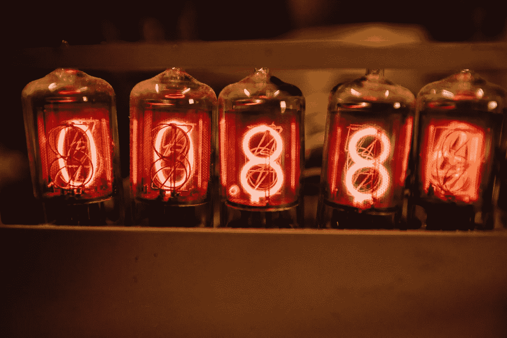

# 人工智能的标准

> 原文：<https://towardsdatascience.com/criteria-for-artificial-general-intelligence-cc268c4258be?source=collection_archive---------17----------------------->

一般智能必须能够做什么？

[Carlos Irineu da Costa](https://unsplash.com/photos/r8dmu2mchQw) by [@carlosirineu](https://unsplash.com/@carlosirineu) on Upsplash

人类的智力仍然远远超过机器。人类可以形成类比，识别下落的篮球和茶杯的相似轨迹。人类只看过一次不寻常的、凹凸不平的紫色玩具*，就能立即从其他玩具中识别出那个物体——这被称为“一次性学习”。当发生的事情与我们经历的事情相同或相似时，我们会立即认出这是在之前发生的*。我们的记忆并不完美，但我们确实对大量信息有着奇妙的记忆。而且，我们可以*在我们的记忆中搜索*任何*符合一组条件*的东西，比如“任何绿色且有刺的物体”都会检索到“仙人掌”。我们甚至可以在我们想象中的事物中进行搜索，就像许多人曾经问的那样“什么能让人飞起来？”**

*对人工智能的研究集中在模仿人脑的各种方法上。这适用于智力的某些方面，然而我们未能复制出我们自身所有能力所必需的类脑行为的正确部分。在这里，我回到了智能的基本问题，并建立了一套任何成功的机器智能都必须满足的约束。我在这个分析中没有包括情感或目标创造——这些领域仍然很难概念化，它们创造了人工一般智能可能需要满足的额外要求。我在这里关注类比、回忆和受约束的想象以及认知的力量。*

*为了了解智能系统中这些功能的实际情况，我们需要放大智能的核心问题:创建地图。*

***映射输入***

*从根本上说，机器智能将每个可能的输入与一些输出关联起来——一个分类、一个预测或一个动作。每个输入都有一个输出，而一个输出可能有多个输入。这是从输入到输出的映射。*

*这些输入被安排在一个巨大的空间——“输入空间”。相似的输入是彼此靠近的，你可以改变输入的每一种*方式*都是它自己的空间维度。例如，28 像素宽、28 像素高的图像有 784 个像素。假设每个像素可以沿着灰度级变化。那么图像有 784 种不同的变化方式；输入空间中 784 个不同的*尺寸*！如果两个点在 784 维输入空间中彼此相邻，那么它们的像素必须几乎相同。*

*智能的目标是*分割*这个输入空间。考虑如果我们有一个平坦的输入空间，比如棋盘。棋盘上的每个点对应不同的输入，相似的输入彼此相邻。想象沿着棋盘铺设墙壁，将表面分割成多个“区域”。那是一个分割输入空间的*。**

**每个区域被分配给不同的输出。这种划分和分配定义了我们从输入到输出的*映射*。您可以查看棋盘上的任何一点，查看*位于哪个领域*内，并检查*与该领域*相关联的输出。分区创建区域，每个区域将所有输入发送到一个输出。**

****识别****

**当我们看到一个我们曾经去过的房间，或者在电话中听到一个熟悉的声音时，我们会立即意识到“我以前经历过这种或非常类似的事情”。这种识别已经发生的事情的能力，不同于我们想象的事情，或者没有发生的事情，必须作为它自己的结构放入机器智能中——除了上面提到的将输入划分为输出区域。**

**每当一个新的输入输出对出现时，机器智能必须记住那个实例。当划分变得精确时，会发生这种情况，弯曲或移动边界墙以将该新事件包括在正确输出的范围内。(在现有的神经网络中，这将等同于训练网络，直到它*准确地记住已经给它的所有数据*。通常，在网络到达这一点之前，训练就停止了。我相信相反的情况——训练应该继续，直到所有已知的事件都被准确地划分出来为止，尽管神经网络在这一点上变得很脆弱。)**

**现在，想象一下，如果每次一滴雨滴落在输入的棋盘上，它的飞溅创造了它自己的冻结墙，它自己的微小分区。那些雨滴领地包围了所有已经*实际上*经历过的事物，而棋盘上那些冰冻墙壁之外的每一个点都*还没有*经历过。就像走进一个不熟悉的房间。认可！这些雨滴墙是输入空间的一种新的*独立*分区，与将输入分配给输出区域的分区协同工作。一组墙映射输入→输出，另一组墙映射输入→已知或未知事件。**

**从另一个角度来看这个分区，你可以想象每一滴雨滴都创造了自己的小而陡峭的山丘。随着接收到更多的输入，更多的雨滴落下，更多的山丘形成。在那些山顶上是输入，在那里*结果现在是已知的*；那些山顶是 T2 已经经历过的地方。这些山丘周围区域的高度代表了**对机器智能如何正确分配输出区域的信心。*在*附近的一个已知点，我们可以确信与该点相关的输出与山顶的输出*相似*。这是一个近似值，但它允许一个强大的概括…****

**如果我们有一个函数来描述这些山丘的坡度，我们可以说“在任何有*峰*的地方，智能在之前已经*看到了那个输入，并且它完全**确信**它记住了*正确的输出*”同时，“任何低高度的地方都是不确定的；无论预测什么样的产出，都有可能是错误的。”这是一个有用的信心衡量标准，其中*同时包含* ***认可*** 。而且，如果你想让智慧去想象一些新的东西，你可以看看那些自信的山谷，知道它们以前没有被体验过。如果你想让机器智能表现得像科学家一样，不断测试假设，那么它应该寻找属于最深信心谷的输入产生的输出。***

***比喻***

*我们可以通过明确记录每一次事件来获得这种精确的情报。每次输入发生时，它都会被记录下来，同时记录的还有正确关联的输出。然而，对于像自动驾驶这样的复杂问题，不可能记录下每一次经历。数据实在太多了！需要某种形式的*压缩*。*

*神经网络当然实现了这种期望的压缩。每个神经元之间的突触权重形成了一个巨大的*参数空间*，它相当容易地创建了复杂的分区。“输入→输出”划分和“输入→已知事件”划分都可以在神经网络中压缩。虽然，有许多方法可以设计神经网络，但很明显，当前的架构不足以满足我们的目的:现有的神经网络*无法从第一次尝试*中学习，需要数百个类似的实例来学习任何东西，即使这样，它们的预测也是不完美的。*

*此外，神经网络未能发现另一种形式的压缩:类比。当两个事物的行为相似时，你只需要记住其中一个的行为。另一个行为相同。例如，几乎所有物体都会在重力作用下下落，所以“抛物线下落”是许多事物共有的行为，提供了大量的信息压缩。相反，如果你不得不为你遇到的每一个新的物体学习重力的属性，那会怎么样呢？*

*类比还有一个强大的特点:**寓意**。如果两个事物在大多数方面表现相似，你可以假设它们在另一个方面相似。根据这一假设，任何提高预测一种行为准确性的经验也会*提高另一种行为的假设准确性*。这是现有机器智能严重缺乏的东西，**常识的关键**。那么，我们如何形成类比，它们的性质是什么？*

*回头看看我们的输入空间，棋盘，当棋盘的一个样本与其他样本具有相同的分割模式时，就会发生类似的情况。这两个样本可能会相对于彼此*翻转*或*翻转*，然而，只要它们的壁的形状匹配，我们就可以通过对两个使用*一个分区来降低我们的分区操作的复杂性。**

*旋转和翻转代表了变量的重新分配。你可以想象一个原子类似于我们的太阳系，电子绕着原子核转。(卢瑟福过时的模型)在那个类比中，太阳→原子核、行星→电子。物体发生了变化，从太阳系到原子，但是*轨道行为*保持不变。打个比方，当你将一个分区定位到另一个分区时，它们的分区必须匹配。*

***回忆和想象***

*回忆不同于辨认。当你看到你以前见过的东西时，你就会认出来；它就发生在那一瞬间，来自你的感官体验。回忆更复杂，我们不擅长回忆。为了回忆一个事件或一条符合某些要求的信息，我们必须过滤输入空间，寻找匹配。当试图回忆已经发生的事情时，我们理想的算法智能必须过滤掉输入的每一点，除了每座山的顶峰。首先，从输入到输出的功能必须颠倒，这样输出才能回到输入。对允许的输出施加约束(“它必须是绿色和尖尖的”)，并且测试可能满足这些约束的各种输入(“仙人掌？”).*

*智能可能会过滤掉*接近*的最大置信度，从而扩大搜索范围，将*似是而非的*输入包括在内，而不是过滤掉不是山峰的输入。想象一下，如果你走进厨房，看看冰箱，会发生什么。如果你现在去那里，你的感官不会产生你头脑所预测的*,然而它是熟悉的，你可以生动地想象它。**

*过滤掉除置信度最低的*波谷*之外的所有输入，会产生最大不确定性的情况。科学实验旨在测试这些不确定的区域。而且，如果机器智能要想象*某种新的*，那某种东西一定来自这些山谷。从对输出的一组约束开始，留下一系列合适的输出来测试，并向后工作到可能的输入。然后过滤输入，除了那些最低的谷，想象不确定的事件。这个过程是一般智力的关键。*

***只是一片***

*这些特征——识别、假设检验、想象、回忆、类比和暗示——只是我们在一般智力中所希望的一些特性。神经网络体系结构可能会超越简单的 DenseNets 和 LSTMs，走向能够提供所有这些特征的结构。在另一篇文章中，我希望概述一种可能性…*