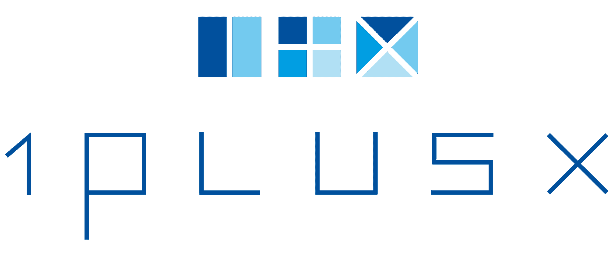
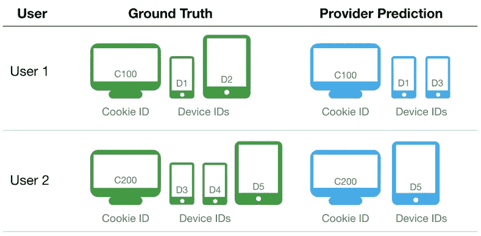
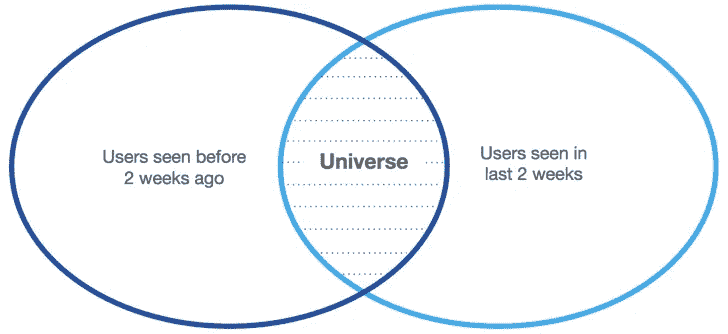
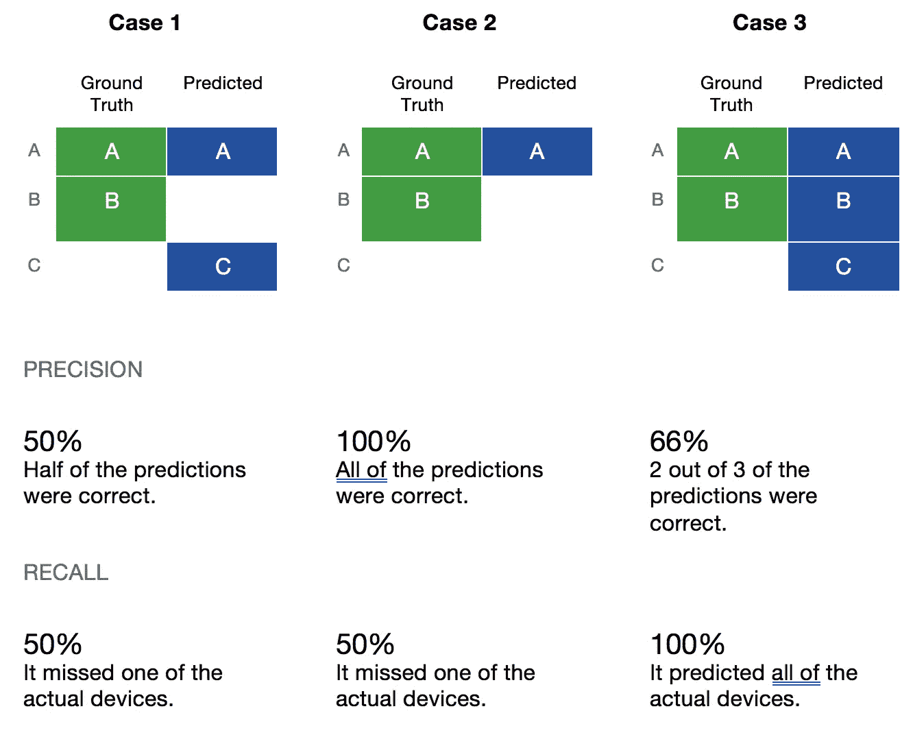
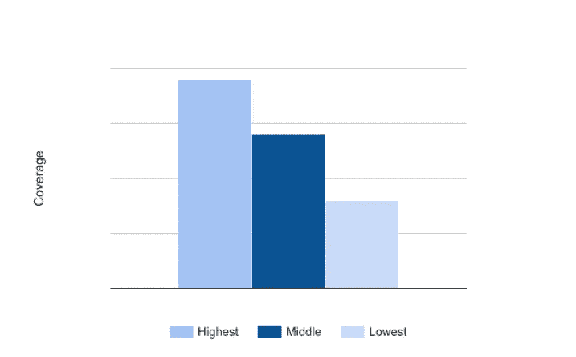
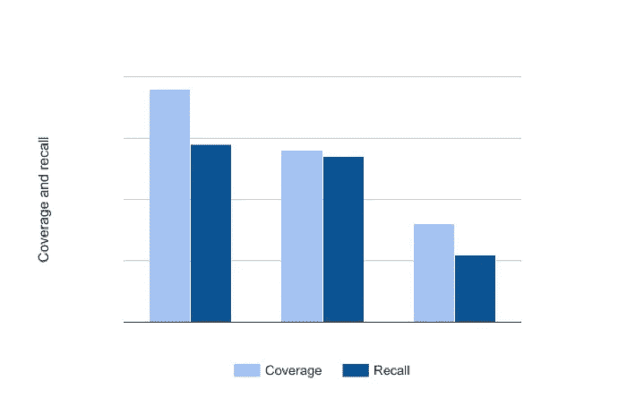
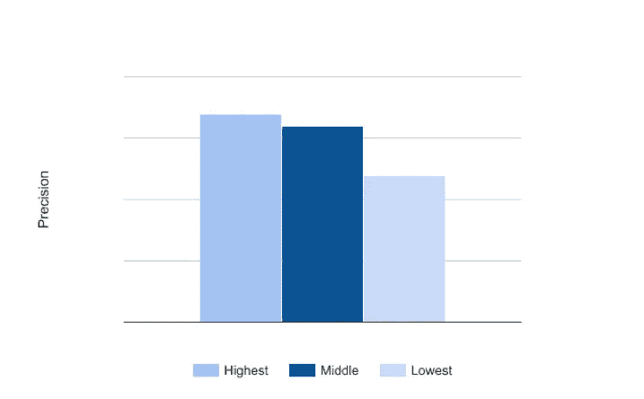
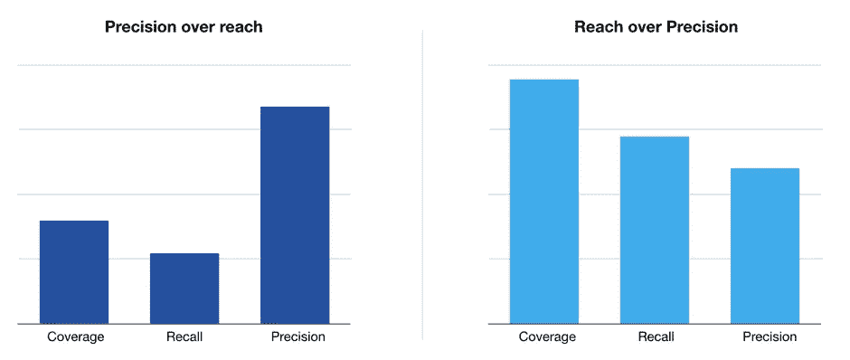

# 1plusX 数据管理平台的跨设备数据提供商评估

> 原文：<https://towardsdatascience.com/cross-device-data-provider-evaluation-for-1plusx-data-management-platform-39c380981a5e?source=collection_archive---------5----------------------->

为了向用户提供相关的个性化内容，能够跨设备识别用户变得越来越重要。目前，公司使用 cookies 来识别网络上的单个用户。然而，移动应用程序不使用 cookies，而是依赖于设备标识符，这些标识符是为了在应用程序中做广告而创建的。由于这些标识符只能通过应用程序访问，因此要全面了解用户在网络和移动设备上的活动，必须能够将用户的 cookies 与其设备 id 进行匹配。这就是所谓的跨设备匹配。

在本白皮书中，我们描述了我们如何评估三个主要的跨设备概率匹配提供商。作为一个数据管理平台(DMP)，我们的目标是能够为数字机构、媒体、电信和电子商务公司提供在其广告活动中包括甚至专门针对移动应用用户的能力。因为这些提供商使用概率模型，所以了解这些模型的质量并确保我们的客户可以依赖最佳的跨设备匹配对我们来说至关重要。

# 评估设置

为了进行评估，我们首先与三家提供商建立了用户群的持续同步，以便他们仅为我们的用户提供跨设备数据。然后我们同意每周交付他们的数据，让我们不仅可以评估他们预测的质量，还可以评估长期的稳定性。我们设计了一个评估框架，能够快速处理每周的新数据并衡量质量。

每个星期，每个提供商发送一个文件，其中包含用户列表、他们的 cookie IDs 和他们预测的相应设备 id。设备 id 包括 iOS 和 Android 平台上的设备，并涵盖了移动和平板电脑外形。

我们还从一家领先的面板数据提供商那里获得了相同格式的基础数据。该提供商精心设计在线面板并收集已知正确的数据，这些数据可用于评估预测数据的准确性。

*图一。来自 ground truth 和跨设备提供商的数据表示*

# 曲奇世界

为了执行这个评估，我们希望确保从实际和最近的用户那里获得足够多的 cookie IDs。我们与我们的一个客户进行了安排，他们对这个话题有共同的兴趣，可以使用他们广泛的网站组合。作为交换，他们收到了这次评估的全部结果。

为了确保对供应商进行客观的比较，避免我们的客户或其他方面的任何潜在偏见，我们仅在 1plusX 空间中运营。当用户访问我们客户的一个网站时，我们为该用户创建了一个标识符，并将其存储在 1plusX cookie 中。然后，我们与跨设备提供者共享这些 cookie IDs，以便他们可以只发送相关用户的设备 id。

我们在几个月的时间里收集了大量的饼干；然而，我们并没有使用全套。我们忽略了删除 cookiess 和不活动 cookie 的用户。为了做到这一点，每周我们将我们的 cookie 范围限制在过去 2 周和前一时期看到的 cookie 的交集。这样，评估仅基于重复出现的 cookies。

*图二。评估所基于的 cookie 领域的定义*

我们评估的宇宙由 2 M 个 cookies 组成。由于我们客户的投资组合都是瑞士的网站，这次评估仅限于瑞士市场。

事实数据和我们的宇宙之间的交集最终比预期的要小，所以我们引入了一个额外的共识验证方法。在共识方法中，如果 3 个提供商中至少有 2 个预测给定用户的设备相同，我们将设备 ID 匹配定义为正确。这有利于扩大评估中 cookies 的数量，但也有可能引入偏见。例如，如果一个供应商是正确的，而其他供应商是错误的，但在协议中，正确的供应商将受到惩罚，而其他供应商将得到奖励。为了确保我们的评估是客观的，我们同时使用了 cookie universe 和共识验证方法，并在多个评估点上比较了它们各自的结果。在所有情况下，地面实况方法的结果证实了共识方法，因此，我们相信共识方法不会引入重大偏差。

为了保持本白皮书的简短，我们将只展示一个评估点的结果。

# 韵律学

我们在评估中跟踪了多个指标，但在本文中，我们将重点关注三个指标:

*   新闻报道
*   平均召回率
*   平均精度

提供者的覆盖率被定义为我们从他们的图表中得到预测的 cookies 的百分比。这是我们的客户感兴趣的，因为它显示了他们将收到设备 id 匹配的用户的比例，因此评估了活动的潜在跨设备覆盖范围。

精确度和召回率更难把握。精确度被定义为正确的预测设备的百分比，而召回被定义为正确预测的真实设备的比例。它们对我们都很重要，因为召回率代表了预测的全部设备的份额，而精确度代表了每个预测的质量。

# 精确/召回示例

基本事实将用户列为拥有两个设备:A 和 B，显示在基本事实列中。下面是三组不同的预测以及它们相应的精度和召回率。

*图 3。三个实例的查准率和查全率。*

典型地，在精确度和召回率之间有一个折衷。做出的预测越多，就越难有高精度；但是，越容易有高召回率。这在广告行业是经常见到的。在品牌推广活动中，公司希望接触尽可能多的用户，因此优化召回。另一方面，在绩效活动中，广告商希望锁定与产品最相关的用户，而不是关注精确度。

请注意，最好使用基本事实来计算精确度和召回率。在下一节中，我们将讨论在使用共识方法和基础事实方法的组合时，在我们有基础事实和覆盖结果的子集上计算的精度和召回结果。

# 结果

为了公平对待所有被评估的提供商，我们对结果进行了匿名处理，并且不在结果/图表中提供完整的数字。

# 设备预测的平均数量

通过查看每个提供商发送的数据，我们立即观察到了不同的方法，仅仅是通过查看他们模型的输出。举例说明这一点的一个简单的方法是提供商预测每个 cookie 平均有多少设备。

*图四。每个 cookie 的平均预测数*

一家提供商做出的设备预测明显少于另外两家，而且似乎在精度上做了更多的优化。

# 新闻报道

看看每个提供商覆盖了我们多少用户群是很有见地的，我们很惊讶地看到这样的覆盖差异。

*图五。关于 cookie 世界的报道*

一家提供商明显领先，为接近 1/2 的用户提供设备。这些数字自然应该与质量指标一起考虑；然而，尽管如此，我们还是希望所有的提供商都有类似的覆盖率。

# 回忆

尽管覆盖率领先，但我们注意到，与竞争对手相比，这家供应商的召回率仅略高。

*图六。每个供应商的覆盖范围和召回*

# 精确

覆盖率高但回忆稍好的提供商似乎暗示他们以牺牲质量为代价发送了更多的预测。这一点在查看精度时得到了证实。

*图 7。精度*

覆盖率最高的提供商现在落后，精度低于 30%，而覆盖率最低的提供商展示了自己的实力。

# 结论

跨设备挑战没有明确的解决方案。由于第一方数据有限，我们需要依靠概率模型来确定可接受的范围，这意味着要处理预测。根据用例的不同，需要决定是优化精度还是召回率。回顾这一分析，每个提供商在这一二元性上提供了不同的选择。一个提供精度而不是范围，另一个提供范围而不是精度，第三个提供者提供了一个更平衡的方法。

*图 8。两个提供商的精确到达权衡概述*

这种权衡影响了广告市场的所有参与者。有时候，广告客户更喜欢广泛的覆盖面，而不是低点击率。其他时候，将针对一小部分人来限制活动的成本。

一个潜在的解决方案是与所有三家供应商签约，并在其中一家的实力与预期结果相符时使用它。然而，这是成本过高。我们决定满足于提供最佳折衷方案的供应商。该提供商为三分之一的用户提供了设备，这些用户平均预测了 60%的设备。

重要的是要记住，这项研究是在瑞士市场上实现的。其他市场的结果可能会有所不同，也会随着时间的推移而变化。我们期待着观察这一演变，并在有机会时评估不同的市场。