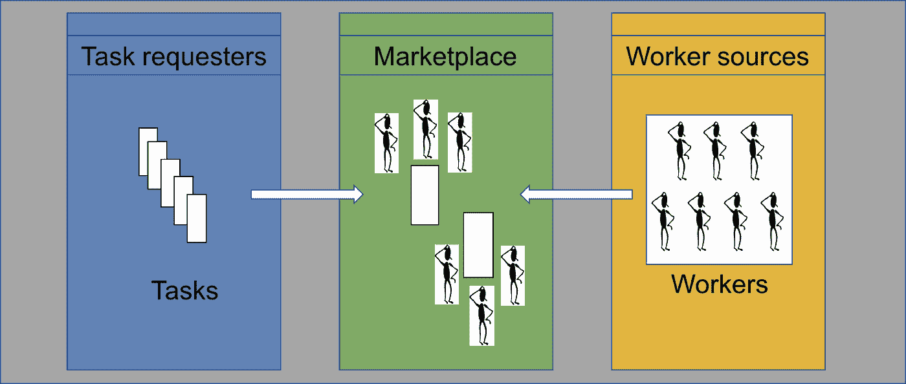
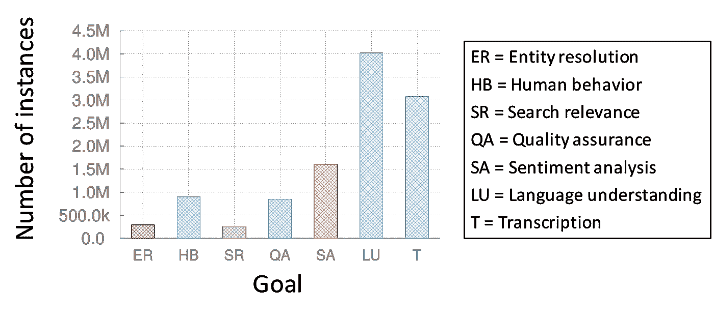
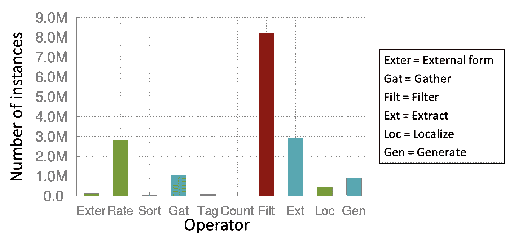
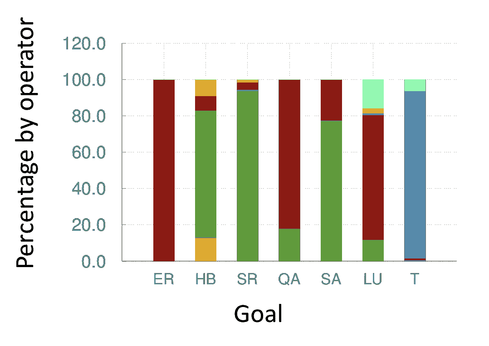
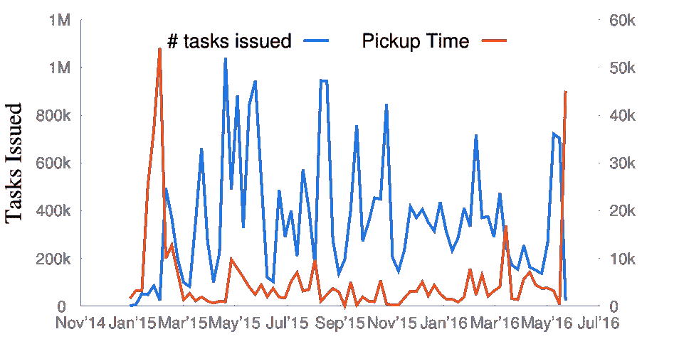
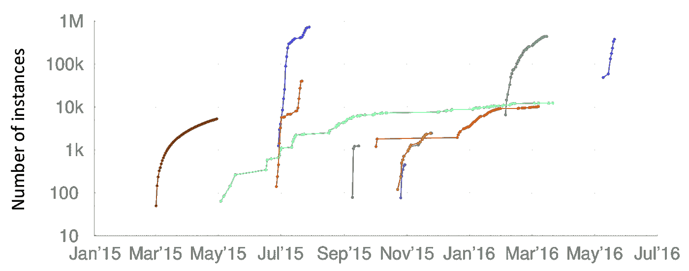
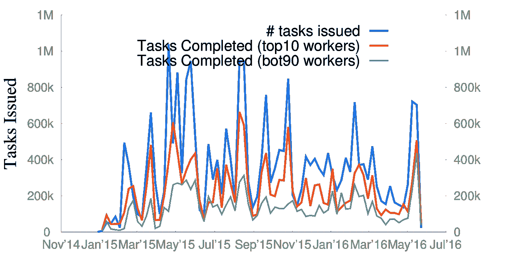

# 实践中的众包:我们的发现

> 原文：<https://towardsdatascience.com/crowdsourcing-in-practice-our-findings-42a6aca36060?source=collection_archive---------13----------------------->

## **分析来自众包市场的大型数据集**

*这篇简短的博客文章提供了我们在 VLDB 17 年发表的题为“理解工人，开发有效任务，增强市场活力:一个大型众包市场的研究”* *(* [*期刊版*](http://dl.acm.org/citation.cfm?id=3067431) *，* [*ArXiv 版*](https://arxiv.org/abs/1701.06207) *)的论文的一个窥见。由 Akash Das Sarma 撰写的博客文章，由我轻微编辑。合著者:阿尤什·贾恩，詹妮弗·维多姆。*

尽管人工智能令人兴奋，对大量人工标记的训练数据的需求无处不在，但过去几年对众包行业来说是一个相对动荡的时期。最近出现了一连串的[合并](https://www.upwork.com/blog/2013/12/mergerfaq/)、[更名](https://venturebeat.com/2014/10/08/leadgenius-grabs-6m-because-hiring-an-actual-sales-team-is-so-last-season/)、[放缓](http://www.behind-the-enemy-lines.com/2016/02)、以及[转向私人群体](http://dl.acm.org/citation.cfm?id=2900400)。因此，我们的目标是尝试后退一步，研究当前市场的状态，了解这些市场是如何运行的，请求者如何充分利用这些市场，以及工人如何参与这些市场。

Figure 1\. Key participants in crowdsourcing

我们对一个数据集进行了实验分析，该数据集包括 2012 年至 2016 年间由 70，000 多名工人执行的超过 2，700 万个微任务，这些任务被发布到一个大型众包市场。利用这些数据，我们揭示了三个关键方面:(1)任务设计——理解什么是有效的、设计良好的任务；(2)市场动态——理解任务和工人之间的交互、相应的市场负载以及市场上流行的任务类型；(3)员工行为——了解员工的注意力持续时间、寿命和一般行为。

> 我们相信这项工作是建立大众工作综合基准的第一步，也是为下一代众包市场奠定指导性见解的第一步。

# **数据集概述**

首先是一些术语:我们将*任务实例*定义为基本的工作单元，通常出现在一个网页上(带有一个或多个问题)；一个*项*是任务中每个问题操作的一段数据；而*批处理*是由请求者并行发布的一组任务实例，不同之处仅在于项目。

我们研究的数据集包含 2700 万个任务实例，分布在 12000 个批次中。对于每个批处理，我们都有该批处理中一个样例任务实例的高级任务描述和 HTML 源代码。对于任务实例，我们知道许多重要的信息，包括开始时间、结束时间和工作者响应。对于每个完成任务实例的工作者，我们有以下信息:位置、工作者的来源和信任分数。

## 丰富数据集

为了扩充这些数据，我们添加了三种额外的任务属性数据:

*   手动标签——我们根据它们的(a)任务*目标*,例如实体解析、情感分析，(b)人- *操作者*类型，例如评级、排序、标签，以及(c)任务界面中的*数据*类型，例如文本、图像、社交媒体，来手动注释每个批次。
*   设计参数——我们从 HTML 源代码中提取特征，以及反映任务设计决策的任务的其他原始属性。例如，我们检查任务是否包含说明、示例、文本框和图像。
*   性能指标——我们计算了不同的指标来表征任务的延迟、成本和混乱，以帮助我们对任务设计的“有效性”进行定量分析。

# 精选市场洞察

让我们先来看看市场的高层次、整体运作。这是报纸上的一个小样本。

## 我们在市场上看到了什么类型的任务？

我们在图 2a 中按目标绘制了任务分解图；图 2b 中按运营商的细分；以及在图 2c 中由操作者对每个目标的分解。

Figure 2a: Goals

Figure 2b: Operators

Figure 2c: Goals broken down by Operators

查看图 2a，我们发现*语言理解*和*转录*是迄今为止最受欢迎的目标，分别包含超过 400 万和 300 万个任务实例，其次最接近的任务目标*情感分析*仅跨越约 150 万个实例。我们还注意到，语言理解和转录任务相对具有挑战性，并且通常涉及复杂的操作人员作为构建模块(见图 2c)——这些很难自动化，因此市场管理员可能值得考虑培训和维护技术工人来完成此类任务。

查看图 2b，我们发现经典操作符、*过滤*和*评级*被频繁使用，仅过滤就被用于超过 800 万个任务实例(是任何其他操作符的两倍多)，并且被用于实现几乎每个目标(如图 2c 所示)。鉴于众包算法社区已经对这两个操作符进行了大量研究，并且它们可以进行算法优化，因此将已知的任务分配和响应聚合算法打包到它们的平台中对于市场来说是非常有价值的。

## 市场负载和由此产生的延迟有何不同？

Figure 3\. Observations about the flux in marketplace load and corresponding latency

我们在图 3 中绘制了发布的任务和提货时间。总的来说，我们看到市场在任何给定的一周内任务实例的到达都有很大的变化，从中值任务负载的 0.0004 倍到 30 倍不等— —这意味着市场需要能够处理突然大量涌入的任务，并为停机做好准备。

同时，市场上的高负载通常伴随着较高的活动水平和较低的延迟，反之亦然。因此，市场能够吸引工人来为高需求期服务，这表明工人的需求经常没有充足的任务供应来满足。

## 少数请求者主导市场吗？

Figure 4\. Heavy hitters

为了研究这一点，我们将任务实例分组为集群，其中集群被定义为一组具有相同任务描述和跨不同时间点发布的 ui 的批处理。我们在图 4 中绘制了顶部集群的发布率。看起来很大一部分任务和批处理来自几个集群；对这些集群进行微调可以带来丰厚的红利。这些“重量级”任务类型会迅速增加到稳定的活动流，然后完全关闭，之后该任务类型将不再发出。

# 任务设计建议

接下来，我们查看一些任务设计选择，并定量分析这些特性对测量任务“有效性”的三个质量度量的影响:延迟、成本(如果我们假设按小时计酬，可以通过任务时间来近似计算)和任务混淆(不同工作人员相互不同意的程度)。

Table 1: Impact of Images

图像(表 1):我们发现没有图像的任务的延迟是有图像的任务的 3 倍，任务时间增加了 40%。

Table 2: Impact of Examples

示例(表 2):我们发现有示例的任务比没有示例的任务有将近 4 倍的延迟，并且有大约 30%的不一致。

据我们所知，在之前的工作中，没有量化的证据表明例子和图片有帮助，尽管有大量的轶事证据支持同样的观点——*所以现在你有了*！

与此同时，尽管在任务界面中包含图像和例子有明显的好处，但我们惊讶地发现大多数任务并没有这样做。

在我们的论文中，除了这些结果，我们还:

*   检查其他设计特征对三个感兴趣的指标的影响；
*   深入到具体的任务类型，检查相同的相关性，从而消除一些隐藏的变量；
*   执行回归分析，根据给定的设计特征值预测任务的结果度量值；和
*   找出在一个关键特征上不同的相似任务的具体例子。

# 工人特征

我们进行了几个独立的实验，以了解工人来源以及单个工人的特征。

## 人群工作者的 80-10 行为

Figure 5: Task completed by top 10% and bottom 90% of workers

我们将前 10%和后 90%的员工完成的工作按完成的任务分布绘制在图 5 中。我们发现只有 10%的劳动力完成了市场上 80%的任务。鉴于他们的经验，从活跃的员工那里收集定期反馈并与他们建立持久的关系可能是值得的。

## 工人来源及其影响

Figure 6: Quality of worker sources

这个特殊的市场聚集了来自 100 多个不同来源的员工，包括其他流行的众包市场，如亚马逊机械土耳其公司(Amazon Mechanical Turk)。有趣的是，我们注意到 AMT 员工在这个市场上花费的时间比其他主要来源的员工要少得多。Amazon Mechanical Turk(图 6 中的 *amt* )的员工在任何任务上平均花费的时间是平均任务时间的 5 倍。与其他主要来源的员工相比，他们的信任得分也较低(详见本文)。

在本文中，我们还深入研究了按地理位置、员工来源、任务数量、员工准确性以及长期行为(如活动天数和小时数以及活动寿命)划分的员工分布。

# **整体外卖**

我们在实践中获得对群体工作的更好理解的工作对于设计群体驱动的算法和系统的学者和从业者有广泛的影响。

例如，理解各种类型的数据处理需求的相对重要性，可以有助于刺激未开发领域的研究；了解任务是如何拾取的，可以帮助学术界开发更好的延迟和吞吐量模型；了解员工的观点和参与度有助于设计更好的员工准确性和员工参与度模型；了解任务设计的影响可以帮助学者和实践者采用“最佳实践”来进一步优化成本、准确性和延迟。

## 承认

*我们感谢国家科学基金会资助这项研究；我们感谢众包市场的人们为我们指出了这个丰富而迷人的数据集。*