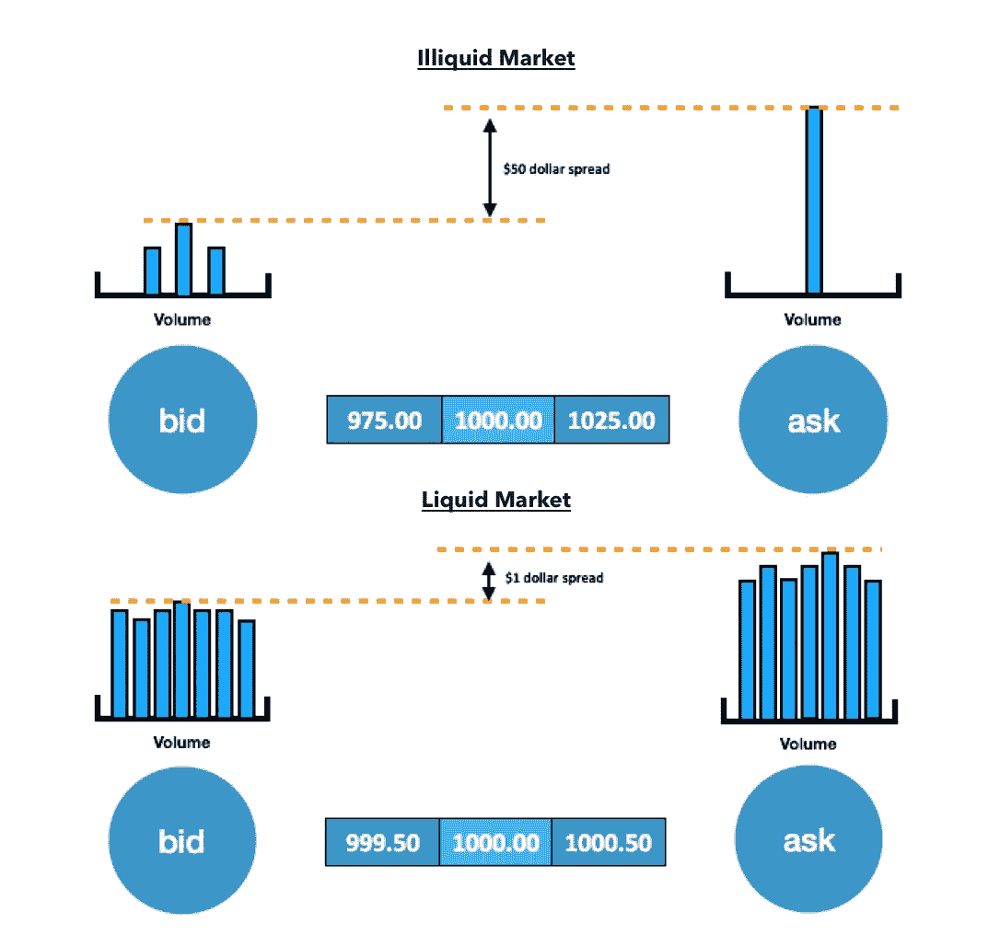
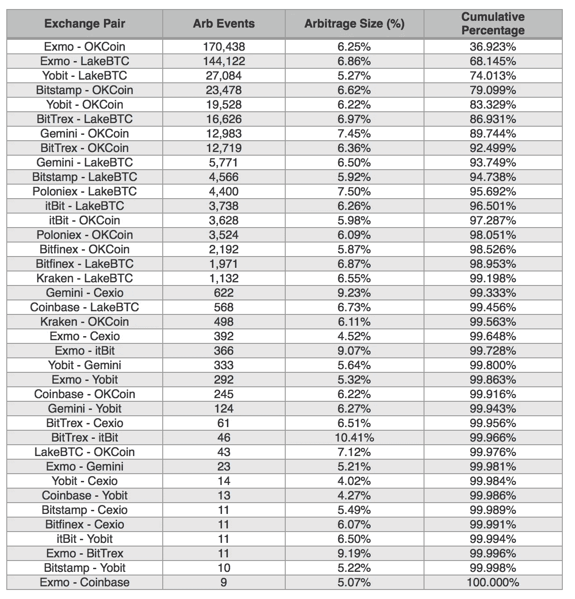
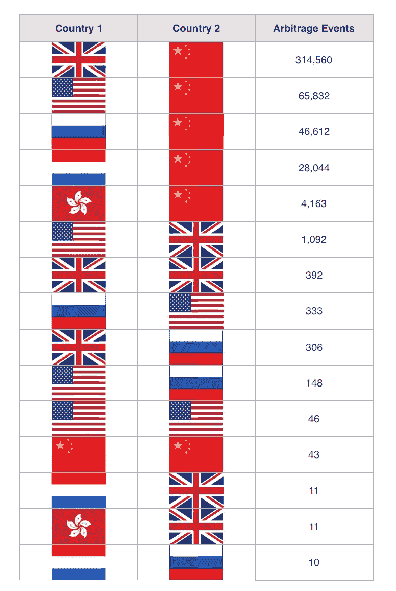

# 数据科学和加密货币套利:如何从中获利

> 原文：<https://towardsdatascience.com/cryptocurrency-arbitrage-how-to-profit-from-it-e2d7bf805fde?source=collection_archive---------5----------------------->

From the “[Last Days of Lehman Brothers](http://bit.ly/LehmanBrothersVideo)”

最近，我听到很多人在谈论“套利”,以及他们是如何做的，或者计划做的，或者他们是如何通过使用 YouTube 上的指令编程的“机器人”来套利加密货币，从而获得惊人的利润。

我甚至见过为上述活动筹集资金的 ico，没有提到套利的关键方面，团队缺乏正确的领域专业知识。

我也从硅谷、香港和纽约的程序员那里听说过这一点。对套利、高收益交易和金融工程略知一二后，我决定写我的第一篇中型文章，以说明什么是套利、它的不同风格，以及我所看到的加密货币的一些机会。我在这方面的知识既有学术方面的(MBA，金融；工程师、程序员)和实用性:我曾在纽约和伦敦为德意志银行(Deutsche Bank)构建自营套利 CDO 交易，最大的一笔交易总规模约为 30 亿美元；我在雷曼兄弟中也扮演了类似的角色(请看这段视频，T2 华尔街日报采访我时提到了 2008 年雷曼兄弟的破产)。

长话短说？是的，至少在 2017 年末之前，加密货币**【确定性套利】**存在大量机会；**“统计套利”**仍有机会，其中有几个有趣的是**“监管套利”。**作为一名涉足加密资产领域的量化分析师和数据科学家，最让我兴奋的是我称之为**“哈希套利”，**它触及了上述所有内容的某些方面，但它本身是独一无二的。

正如我提到的，在加密领域，仍然有一些机会；但是，知情的人不谈；不要发表论文，或“开源”他们的代码，或在 Kaggle 内核竞赛中披露部分代码。在分享知识方面，华尔街和硅谷截然相反。

《韦氏词典》对套利的定义如下:

> 几乎同时在不同市场购买和出售证券或外汇，以便从价格差异中获利

我不会在这里谈论我上面提到的所谓的“哈希套利”，关于监管套利，我只会引用 investopedia 的定义，这很好:

> 监管套利是一种企业利用监管体系中的漏洞来规避不利监管的做法。套利机会可以通过各种策略来实现，包括重组交易、金融工程和地理重新定位。监管套利很难完全防止，但可以通过堵塞最明显的漏洞从而增加规避监管的相关成本来限制其流行。

在我解释和区分确定性套利和统计套利，以及大多数加密货币交易者正在谈论的套利类型之前，我需要首先谈谈“做市”。

当参与者想要购买或出售金融产品时，他们需要前往买方和卖方会面的交易所。

他们可以交易的价格取决于当时产品的供求关系，这被转化为买入的买入价和卖出的要价。如果交易方有限，那么就不可能购买或出售产品，产品现在被认为是非流动性的。这个过程如下图所示:

为了保证流动性，交易所需要专业人士的参与，不断向市场提供买卖价差。

换句话说，这些专业人士做市，因此出现了“做市商”这个术语。

做市商对产品的价格应该上涨还是下跌没有意见，他们从买价和卖价之间的差价或价差中赚钱。

当做市商在价差的任何一边交易时，他们在市场中持有头寸，这转化为他们的风险。做市商将试图找到抵消这种风险的方法，比如用不同的产品对冲头寸。

因此，做市商不仅要了解他们做市的产品，还要了解与其他类似金融产品的关系。

随着时间的推移，竞争和技术极大地改变了做市商的工作，以便在多个交易所持续提供有竞争力的报价，并且多种产品需要运行交易算法的计算机以及电子交易所连接。

摩根大通(JPMorgan)、摩根士丹利(Morgan Stanley)和高盛(Goldman Sachs)等投资银行巨头主导了这种类型的金融活动，但据我所知，它们在加密货币市场上几乎没有出现，部分原因是监管约束。然而，有证据表明，高盛和摩根大通至少代表私人客户参与了一些交易，并可能很快将大量资源投入市场。

做市商需要不断投资于技术和人员，以保持竞争力并为高效的金融市场做出贡献。这些技术进步和竞争使得做市商的工作变得更加复杂。

做市商通过收紧买卖价差来降低买卖证券的交易成本，从而提供真正的好处。

现在，有了对流动性和技术影响的基本理解，我们可以区分两种主要的套利类型:a)确定性套利，和 b)统计套利。

**a)确定性套利**发生在投资者*同时买入和卖出一项资产，试图从类似或相同证券的现有差价中获利的时候。套利技术使投资者能够自我调节市场，并帮助消除价格差异，以确保证券继续以公平的市场价值交易。*

*鉴于在交易遗留证券时技术的进步，从市场的错误定价中获利变得极其困难。如上所述，许多成熟的金融机构是这一领域的市场领导者，它们大量投资于 IT 基础设施和计算机化交易系统，以监控类似金融工具的波动。任何低效的定价设置通常都会被迅速采取行动，机会往往会在几秒钟内消失。正如我之前提到的，我曾经是一个定量分析师团队的成员，为我的雇主组织这些交易，并使用专有资本。你可以想象，当大型机构投资者投入大量资金和尖端技术时，临时交易者没有机会。*

*从 20 世纪初铁路股票交易火爆的日子开始；技术为拥有它的人提供了优势。它让一些将资本和技术结合起来的梦想家从加州和纽约证券交易所之间的巨大差价中获利。那些在当时拥有私人电话和电报等“尖端”技术的人，可以在波动时期找到加州和纽约某些铁路股票的价格，并让他们的经纪人执行无风险交易。*

*加密市场中的这种套利与传统证券中的套利没有什么不同。直到 2017 年底，这个资产类别中几乎没有机构存在，如果你知道 Python，一些基本的数据分析，也许还有一些金融的基本知识；你本可以赚些钱；可能你们中的一些人正在阅读这篇文章，可能把它称为“确定性套利”。*

*当然，有过为前雇主开发 arb 机会的经验，不久前我试图从加密市场的 arb 机会中获利；因为我已经从 2015 年开始挖掘并接触 BTC 和瑞士联邦理工学院。但对于 arb，我开发了自己的技术栈，并与美联储的一名前分析师合作，他也是一名博士定量分析师，对 C++、Python 及其科学栈有相当好的了解。我还从印度招募了一个了不起的 Python 和 C++程序员，他在几个项目上帮助了我。因此，三个在几个领域拥有专业知识的程序员在帕洛阿尔托认真地开始了这个项目，当时我们正在为一家公司开发人工智能，这家公司需要具有不同行业的时间序列分析知识的定量分析师。*

*为了让我们的现金发挥作用，我们首先需要量化市场及其风险。我们通过收集每笔加密货币交易的实时数据做到了这一点:100 多种不同货币对的逐笔价格和交易量信息；以及与它们的基础区块链和交易这些硬币的交易所相关的数百个其他因素，并将一切存储在 NoSQL 数据库中。*

**

*Early arb tracker — it did work*

*左边的图表显示了我们早期(2017 年 1 月)编写的 arb 跟踪器和执行代码的 GUI。*

*我将“Arb 事件”定义为时间的函数，并用我们收集的一些数据编制了一个表格。我们的分析显示，去年在频率和价值上最大的套利机会发生在 BTC-美元/USDT 和 BTC-瑞士法郎对。*

*例如，下表显示了从 2107 年 7 月 22 日到 2017 年 8 月 23 日不同交易所的 BTC-美元/USDT 的分笔成交点数据和分钟平均值。*

**

*Cryptocurrencies arb opportunities in different exchanges — 7/22 to 8/23 2017*

*在此期间，我们的分析显示，套利机会打开的平均时间约为 11 分钟，平均套利利润约为 6%。交易所 Exmo、OKCoin 和 LakeBTC 占了我在本文中选择显示的期间内所有 arb 机会的 2/3 以上。*

**

*但是怀着好奇的心，我们想找出 ***为什么这些机会存在*** 。下表显示，在超过 90%的交易中，中国交易所作为套利方之一参与其中。*

**

*Origination of arbitrage trading opportunities in the cryptocurrency markets*

*是什么创造了这些套利机会？随着时间的推移，他们是继续还是放慢了速度？*

*2017 年 9 月 4 日，中国宣布在该国禁止 ico，在接下来的几天里引发了市场修正。后来，禁令扩大到中国的交易所和一些采矿企业，一些运营商被给予 30 天的时间停止运营。*

*这些行动导致了几乎所有加密货币的修正；但与此同时，这也为我们追踪的加密货币市场创造了同样显著的盈利机会。*

*中国政府的这一决定是因为中国矿商在中国农村开展业务，利用了高额的补贴能源成本。在过去几年中，中国能源消耗的大幅增长与工业生产无关，而是脱钩的；这“迫使”中国政府至少在调查这个问题时采取行动。正如你们许多人所知，像比特大陆这样的公司(在采矿机械专用集成电路市场占主导地位)开始探索向亚洲其他一些地区以及北美和欧洲转移。套利机会之所以存在，是因为中国矿商(那里存在大量加密货币开采)“被迫”在中国当地交易所以折扣价出售其产品，这使得中国交易所的运营商能够从中国境外交易所的价格差异中获利。*

*那么，让我们继续解释“统计套利”。*

*b) **统计套利**是一种高度量化和计算化的交易方法。它涉及数据挖掘和统计方法，以及自动交易系统。在这里，我们有对冲基金商店，如 [Quantbot Technologies](http://www.quantbot.com/) ，或 1500 亿美元的对冲基金 [Bridgewater Associates](https://www.bridgewater.com/) ，或 [2 适马](https://en.wikipedia.org/wiki/Two_Sigma)，它们是这类活动的市场领导者，通过大量投资于技术，从华尔街聘请最好的量化分析师，并重新培训硅谷程序员和计算机科学家(在大多数情况下，他们对时间序列分析或金融领域专业知识的了解有限或为零)像量化分析师一样思考。然而，这些商店并不涉及加密货币，至少意义不大。*

*从历史上看，统计套利是从配对交易策略演变而来的，在这种策略中，股票根据基本面或基于市场的相似性被配对。当一对股票中的一只表现优于另一只时，表现较差的股票被买入做多，预期它将向表现更好的股票攀升，另一只股票被卖空。从数学上讲，策略是找到一对[协整](https://en.wikipedia.org/wiki/Cointegration)高的资产。*

*在统计套利中，投资组合的构建包括评分阶段，在这个阶段，市场中的每种资产都被分配一个反映其可取性的数字分数或等级；有点像谷歌的网页排名，但对于金融资产。评分非常直观，因为高分表示“做多”，低分表示“做空”。

有一个风险降低阶段，将资产按照精心匹配的比例组合成一个投资组合，以消除风险。但是很明显，once 必须意识到这些风险，这也是偶然的密码交易员无法通过测试的地方。*

*量化商店和对冲基金的这种评分方式很吸引人，而且高度专有。显然，评分公式的细节各不相同，而且高度保密。我有自己的，一直应用到加密货币交易，甚至挖矿；并且它也适用于其他资产，但是在不同的时间范围内。*

*广义而言， ***统计套利是指任何利用统计和计量经济学技术，为执行*** 提供信号的策略。可以预料，统计套利已经成为对冲基金和投资银行的主要力量，许多自营业务在不同程度上围绕着统计套利交易。*

*所以，回到加密货币交易商，他们声称已经将一些套利机会货币化；在我看来，他们还没有实现严格意义上的套利利润。*

*套利的定义指出“当一个投资者*同时*买入和卖出一项资产时，就发生了套利”。目前，在不同的区块链核查交易，速度不是“几乎同时”。最好的情况是，有 10-15 分钟的风险窗口，如果根据中值波动性进行调整，加密市场的风险要比股票市场大得多。*

*虽然我遇到的一些加密交易者在某些情况下实现了一些利润，但也有一些风险，主要是在他们在交易所“X”获得加密货币“A”的时间窗内持有货币，将其转移到交易所“Y”，并在那里出售。除了**市场风险**敞口，他们还承担了不同交易所的**信用风险**，以及许多**操作风险**。由于没有意识到这些风险，也不知道如何量化它们，这就造成了已经实现套利利润的“幻觉”。事实上，那些声称已经实现利润的人是幸运的，流动性风险没有对他们不利。在牛市中，每个人看起来都很聪明。*

*为了增加从 crytpo 市场的 arb 机会中获利的几率，我会说你必须瞄准我在这里提到的 3 种套利类型中的至少 2 种，即确定性套利、统计套利和监管套利。*

*通过自定义代码，我们目前分析加密货币交易所订单簿交易账户，这提供了对市场的许多见解；加上很多其他因素。我们的代码能够:*

1.  *指出低风险的入口和出口点，*
2.  *检测价格和数量数据中的异常值，*
3.  *检测波动率变化的高概率，*
4.  *在给定的时间框架内建立最佳的资产组合。*

*所有这些都旨在在风险调整的基础上超越基准。*

*那么，人工智能管理的加密投资组合与 BTC 买入并持有相比，或者与被动的指数策略如 Bitwise 的加密货币指数基金相比，表现如何呢？。下面的图表(你可以在这里找到 Tableau 版本)显示了每种策略下投资 10，000 美元的收益。*

**

*Bitwise top 10, vs BTC buy and hold, vs an A.I. managed portfolio*

*2017 年 1 月 1 日在 BTC 投资的一万美元到 2018 年 4 月 5 日增长到大约 69000 美元。同样的$10K 在 Bitwise 的 10 大指数中增长到约 97K 使用 stat arb 方法在人工智能管理的投资组合中增长到大约 17 万美元。所有的指数都考虑了滑点和交易成本。*

*我见过金融科技领域有良好(理论上)理论模型的风投基金初创公司，但我怀疑(就我所见)这些模型会在 2008 年雷曼兄弟(Lehman)倒闭或 LTCM 危机前后的情景中崩溃。这些创业公司开发的许多底层机器学习模型很少(或根本不)考虑紧张的宏观经济场景和隐藏的运营风险。我想一些新投资的对冲基金，带着新的资本，冒险进入加密领域，也没有考虑到这些风险。*

*因此，为了以正确的方式从加密货币套利中获利，在你投入任何资本之前，先量化你能想到的所有风险；做大量的样本外测试。此外，领域专业知识大有帮助，所以如果你没有接触过专业交易；尝试与和你有共同兴趣，但在现实世界中有一些金融工程经验的人合作。*

*你可以在这里关注我或者问下面的问题。*

*干杯*

****注来自《走向数据科学》的编辑:*** *虽然我们允许独立作者根据我们的* [*规则和指导方针*](/questions-96667b06af5) *发表文章，但我们不认可每个作者的贡献。你不应该在没有寻求专业建议的情况下依赖一个作者的作品。详见我们的* [*读者术语*](/readers-terms-b5d780a700a4) *。**