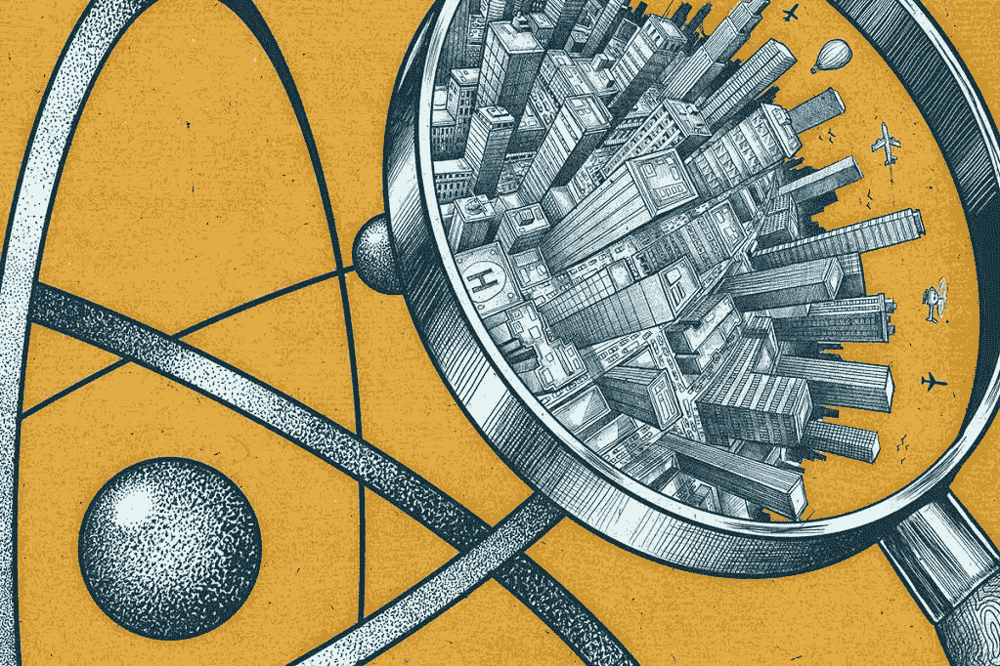
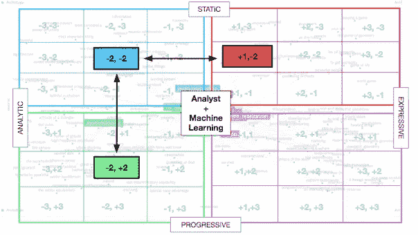
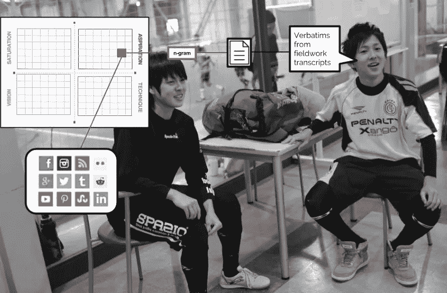
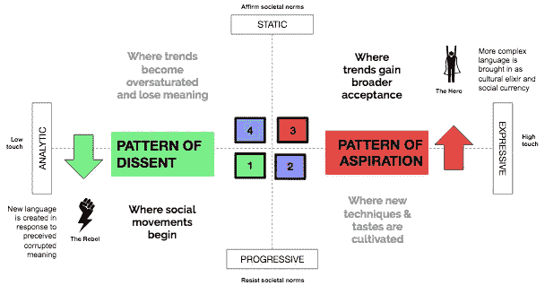
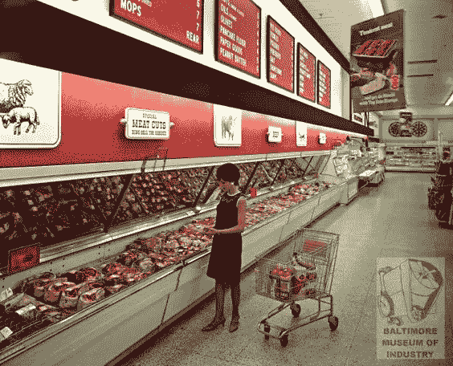
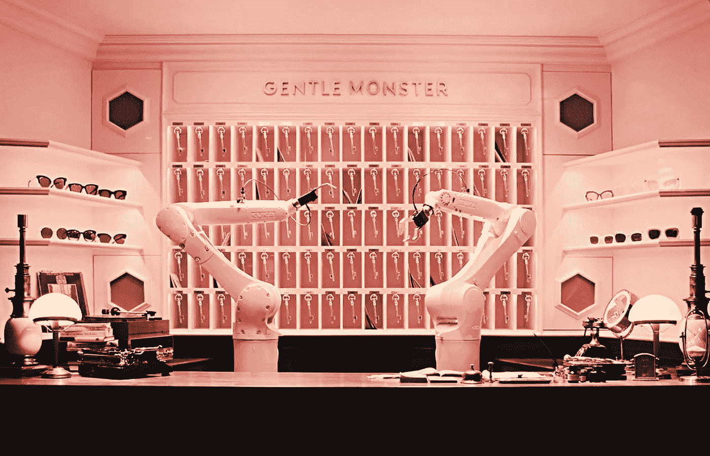
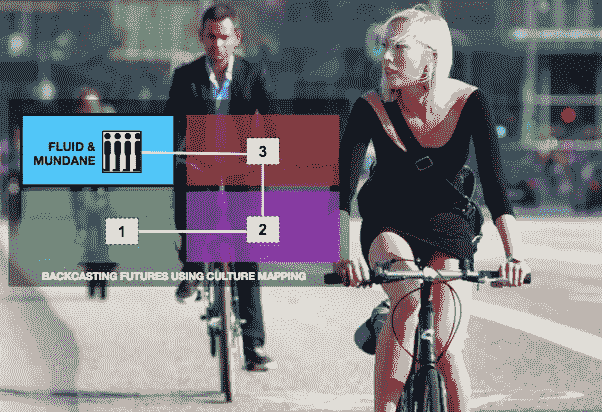

# 模糊时代的文化映射

> 原文：<https://towardsdatascience.com/culture-mapping-in-the-age-of-ambiguity-4836f681c033?source=collection_archive---------4----------------------->

由[蒂姆股票](http://timstock@scenariodna.com/) & [玛丽·莱娜·图波特](http://marielena@scenariodna.com/)

我们生活在一个模糊的时代。技术进步和全球经济增加了社会复杂性，迫使我们对世界事物变化的理解发生了变化。在复杂而模糊的环境中，长期的成功依赖于两大支柱:创造力和社会。新的思维方式对于理解动态的全球格局至关重要。然而，世界经济论坛的 [W. Lee Howell 指出](https://www.weforum.org/agenda/2014/09/innovation-new-global-context/)科技进步加上当今复杂的社会问题对理解创新以及创新如何为所有人创造价值提出了挑战。

人们被大数据淹没，无法提取他们需要的信息；问题是如何组织数据以获取有意义的信息，而不是与大量的统计数据打交道。因此，他们倾向于回归传统技术——这些技术不是为当今复杂或模糊的世界设计的。我们错过了数据中的故事。我们看不到未来的发展。

# 什么是文化？

文化是一个动态的、相互关联的系统。文化洞察力的深刻机会在于特定意识形态、特定地点和特定时间点的人们正在采用和适应的模式。

**Meanings emerge only in relationship between data points.**

可视化有助于说明从文化中演化出来的复杂的社会关系。在这个模棱两可的世界中，新的思维方式变得至关重要，这要求摆脱对任何一个数据点或文化特征的关注，并开发有助于显示点之间关系的数据和可视化策略。意义只出现在点与点之间的关系中。

例如，只关注我们作为一个社会如何重视汽车作为一种交通方式，而不考虑汽车与我们自己的人际进化和性自由概念的关系是不够的。毫无疑问，汽车运送人们不仅仅是从一个地方到另一个地方。他们允许人们维护自己。汽车让人们超越国界。它们拓展了人们生活的空间。传统的研究可能会错误地认为答案是更多的汽车。但是背景故事与汽车无关，更不用说更多的汽车了。是关于眼界的拓展。问题是能做些什么来扩展视野？随着这些关系的确定，直觉可以被重建，定量方法的拐杖可以被最小化。

# 文化是一个可测量的系统

在这个模棱两可的世界里，成为文化流行病学家是必不可少的。研究必须采取更加细致和归纳的方法来收集洞察力。我们必须对数据有耐心，并更多地关注具有重大影响的较小信号。每件事都必须与所有其他因素联系起来权衡。这就是为什么像这样的领导人提出了这个发人深省的想法,“在人工智能方面领先的国家将成为世界的统治者。这是一个有效的观察。

**Our research must anticipate adaptation and immune responses.**

因此，尽早识别文化信号变得至关重要。将人类表达视为社会系统的一部分，可以预测适应性和免疫反应。通过制定考虑黑天鹅的行动方案，可以获得巨大的价值。我们解读意外的能力只能来自对文化如何运作的系统观点。这里的关键词是“视图”一旦导致市场过饱和的过程暴露出来，它的路径就变得明显要避免。相反，那些曾经细微的意识形态转变可以在发生之前被积极地看待，并自信地投资于长期的经济和社会影响。

> "我们所知道的所有进化都是从模糊到明确的过程."—查尔斯·桑德斯·皮尔士(美国哲学家、实用主义之父)

我们必须明白，这些文化系统是可测量的，这使得科学能够回到研究文化动态和意义创造是如何构成的。随着下一代技术和机器学习的发展，我们的方法可以更好地利用这一现实。

# 将科学转化为技术

根据作家约翰·兰卡斯特最近在《纽约客》上发表的文章[文明如何开始](https://www.newyorker.com/magazine/2017/09/18/the-case-against-civilization)，“然而，在人类历史的大部分时间里，技术与科学毫无关系。我们许多最重要的发明都是纯粹的工具，背后没有科学方法。”做饭前先有火。肥皂比青霉素等预防了更多的死亡。

这几乎就是当今世界数据和技术的现状。有很多技术，很多数据，但是缺少方法。

Culture Mapping Matrix

出于这个原因，经过十年的严格测试和调整，我们用实用专利锁定了我们的人类学方法。我们的方法一如既往——甚至在大数据时代之前——帮助我们组织和理解不断涌入的文化数据和趋势。它通过利用语言作为最强大的人类数据形式来工作，提供了一个丰富的视角来了解事物是如何真正与衡量表达的符号矩阵相违背的。输入语言数据，或“文化能指”，创建一个有助于识别和构建认知空间的地图。这些空间是语言聚集的地方，也是新习惯和新行为出现的地方。一个群体对世界的感知可以用语言分类法来表示，这些分类法在矩阵结构中显而易见。

A Cartesian grid quantifies points on the matrix and relationships between points

这些语言符号在每个象限中充当文化符号，形成一个模式化的、可测量的逻辑。原型和代码从能指群中浮现，将基本的人类叙事置于语境中。出现的逻辑和随之而来的算法量化了原型可能如何独特地响应。例如，放在四个象限的上下文中的“有机”一词，在与其他变化的能指相关时，意义发生了变化，从而产生了反应。出现的故事是亲属关系的基础。它们阐明了新出现的趋势，有助于理解社会适应。这有助于利用文化变革的模式和动力。

# 文化图谱有着广泛的应用

这并不是说在数字数据存在之前，就有信息可以映射。但是，有时，这一点被遗忘了。研究往往始于并止于可以通过数字手段获得的东西。毫不奇怪，它的成本效益在它的直接使用。然而，数字制图可以扩展到野外工作，反之亦然。目标是将看似不同的数据放在同一个测量平面上。

使用这种结构，可以实现和增强语料库的更广泛的互相关。还可以开发招聘的认知框架，并且可以构建进一步查询的语言逻辑。这些预测框架可以随着时间的推移进行测试和发展。

The hidden meanings in fieldwork emerges in cross-correlation of data sets

这种方法在充满挑战的研究市场中表现出明显的价值。例如，当在日本进行民族志实地调查时，传统的方法有所欠缺，而更现代的即兴采访方法受到怀疑。直接提问是不正确的，因为受试者会小心翼翼地透露他们的真实感受，以免被冒犯。这种现象并非日本独有——事实上，它在全球范围内因学科而异。访谈和调查天生无法捕捉意义和意图。

然而，结合多层数据分析和人种学可以解开研究中的一些难题。允许冗长与网上出现的更大范围的社会符号联系起来。这种混合方法有助于研究人员了解如何招募受试者，并有助于开发持续的小组和寻找现实生活中的灵感。筛选过程的意识形态演变给出了社会背景下个人的更大图景。这种对招聘细分的认知方法可以使互动不那么直接，而对主题和活动中的自然互动更加开放。

# 利用新兴技术

研究人员的沙箱被创建，这对于集成机器学习和补充 API 是有用的。图像识别 API 可以帮助我们对更大的视觉信息数据集进行分类。放入我们的框架中，图像集群作为一个集体讲述它们自己的故事。图像中有视觉细节，可以分类，然后搜索。单词和图像可以在它们的独特配对中进行评估，这些结构可以用于运行更大的搜索查询来收集近邻相关性。我们还可以分析图像与特定关键字的独特配对，这些关键字与我们矩阵中的独特认知空间相关联。该结构为所有这些新兴的识别引擎提供了可能性，包括可以对手势和声音进行分类的识别引擎。关键是数据的结构如何使这些识别引擎在理解文化变化方面更加实用。

# 哄骗出诗歌和故事

将数据中的诗意哄出来将真正的分析与计算分开——19 世纪英国数学家阿达·洛芙莱斯强调了分析引擎通过编程解决任何复杂问题的能力，这不同于计算机器。

> “数学科学展示了什么是。它是事物之间看不见的关系的语言。但是要使用和应用这种语言，我们必须抓住看不见的、无意识的东西。”
> 
> ——阿达·洛芙莱斯(英国数学家和作家)

The Patterns of Dissent and Aspiration

归根结底，数据是关于人的。研究结果必须更好地反映这一事实，尤其是如果人们被期望根据研究结果采取行动并实施策略的话。调查结果必须真实，并引起共鸣，才能引起关注。利用荣格原型是将发现带入生活的一种方式。它们作为文化能指的基础，揭示了人物实际上是信仰和意识形态系统中的点——从作为文化异议点的反叛者到将语言正常化为一种社会货币形式的英雄和情人。

原型代表了一个进化的过程。研究人员可以在任何给定的时间，在不断变化的社会力量背景下进行测量。衰退引发了一种免疫反应文化，在重建文化规范的过程中，这种文化高度重视反叛者和圣人。许多在 2009 年触发的早期信号现在被表达为社会规范和适应方式。经济衰退后瑜伽在美国文化中的演变就是一个很好的例子。从自我实现到作为社会徽章的瑜伽裤，与意义的起源无关。

# 基于文化开发新的 KPI

在讨论希望从数据中得到什么时，经常会用到 KPI(关键绩效指标)这个词。不同企业对这些指标的定义非常松散。社会背景下的适应性行为是唯一重要的指标，这种指标需要从意识发展到信仰体系。期望该指标用一个点来表示是不正确的。对这种绩效概念的需求可以从过去十年公司的兴衰中得到证明，像零售业这样的类别同时处于危机和重生之中。大品牌正在收购文化正宗的初创公司，以抵消其核心产品组合中销售额的下降。衡量未来成功的唯一标准是这些公司如何看待文化变革的复杂性，以及如何制定正确的参与行动措施。随着城市的发展，郊区的新机会开始以新的方式出现。随着手工食品被过度营销，在[食品生产的科学方法](http://www.salon.com/2017/09/03/the-impossible-burger-would-not-be-possible-without-genetic-engineering_partner-2/)开始被回收和整合。

# 作为文化体系的食物

想想 20 世纪 60 年代超市是如何设计的。在消费主义蓬勃发展的几十年里，食物反映了对技术和进步的意识形态肯定。这种常见的食品购物观念已经发生了巨大的变化——最显著的变化发生在我们最近的生活中。它的变化不是由营销者或城市规划者促成的，而是由推动变化的文化网络系统促成的。在全食食品出现之前，食物框架的含义经历了几十年的演变。这一含义与二战后食品生产中社会规范的政治反应直接相关。从罗代尔健康和保健书籍到艾丽丝·沃特斯到常伟，这些网络定义了我们如何生活、如何庆祝，进而定义了我们如何烹饪，并最终定义了我们如何成长。

研究倾向于将消费的这些方面孤立起来，这样就错过了某些关键趋势的兴衰。如果你想看到食物的未来，那就去找有创造力的厨师吧。他们是农场和每个人餐桌之间的桥梁。但是他们不仅仅在厨房里，他们还在游说和孵化。将种植和培育食物的新符号语言构建成可以理解和分享的技术的过程至关重要。对于那些想要建立面向未来的品牌组合的公司来说，整合的文化参与是一种更强有力的经济地位。

# 预测奢侈品泡沫

可视化这些文化系统有助于更好地描绘文化稀释和泡沫。把奢侈品的文化体系当作另一个例子。奢侈是在深奥和允许之间不断寻找平衡。在互联网发展的这些年里，它受到了意义元素被轻易重新分配的困扰。当每个人都知道它，并且能够以某种方式访问它时，最初的意义就消失了。它在奢侈品的支柱之间创造了一种意识形态的张力，这些支柱是目的、真理、自由和等级。绘制地图揭示了这些支柱的动态，并准确展示了在何处、何时以及如何进行克制。

过度促销会扼杀一个品牌。随着美国和欧洲市场在衰退后下滑，许多传统品牌都犯了这个错误。地图的一个很好的应用是了解一个品牌如何在多种实体和虚拟零售环境中表达自己而不降低意义。研究人员和品牌经理可以为品牌编排一个分层的元叙事，以区分零售环境，从而平衡艺术与易用性。一个不能做得太重而不伤害整体。像 [Gentle Monster](http://www.gentlemonster.com/showroom/) 这样的品牌通过允许其实体零售店更多地发挥景观和知识获取的功能，很好地执行了这一现实。为什么？因为该品牌了解人们在网上购买产品的便利性。温柔怪兽是一个设计师品牌，在[“创新高端实验”的理念下不断发展](http://www.the-fashion-hub.com/single-post/2016/09/20/Why-Gentle-Monster-is-a-vision-to-the-future)这给了品牌喘息和创新的空间。

# 回溯更好的未来

[回溯](https://www.wikiwand.com/en/Backcasting)是一种设计研究方法，在这种方法中，确定一个理想的未来，然后反向工作，以调整政策和计划，将指定的未来与现在联系起来。在文化映射的情况下，行为原型建立了未来的愿景，以及随着时间的推移可以在上下文中连接的方式。例如，在 2007 年，自行车介于兰斯·阿姆斯特朗所代表的阳刚之气和童年周末骑自行车的琐碎之间。这个类别被定义为休闲。未来将把自行车作为交通工具不可分割的一部分。但是支持这一观点的传统数据还不存在。这项研究需要挖掘文化运动。2002 年加拿大[的裸体自行车骑行](http://wiki.worldnakedbikeride.org/index.php?title=History)是最近第一次自行车被用于抗议——始于艺术家促进和平/艺术家反对战争(法新社/AAW)。从那时起，像[临界质量](http://www.sirc.org/articles/critical_mass.shtml)这样的支持自行车的抗议运动作为一种收回街道的方式出现，随后是激进的城市规划[行动主义](https://nextcity.org/daily/entry/statewide-bike-plans-new-updating-none)，导致围绕自行车交通考虑重建的适合步行的城市。这些事件预示了自行车和城市的发展方向。未来是流动而平凡的。

方向变化的迹象总是存在于文化中；我们只需要知道去哪里找证据。文化图谱为我们指明了正确的方向，为我们提供了处于进化前沿的优势，既给人以先见之明，又为新的社会方向做好了充分的准备。

在社会日益复杂和模糊的时代，任何地方的任何社会现象都可以用这些工具来观察，文化图谱有助于简化和提供清晰度。如果我们把我们的研究方法与文化的实际运作同步，我们就能培养出一种新的文化素养。