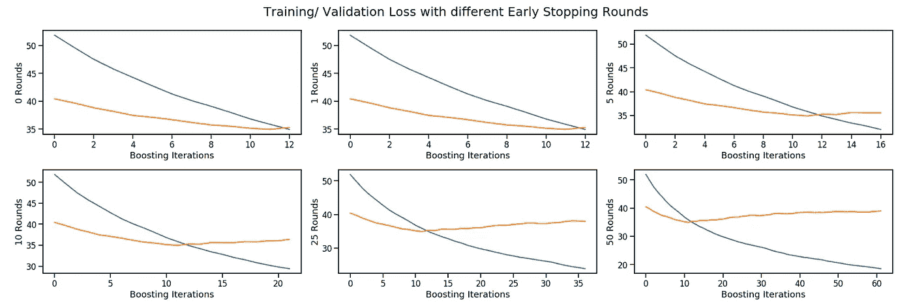
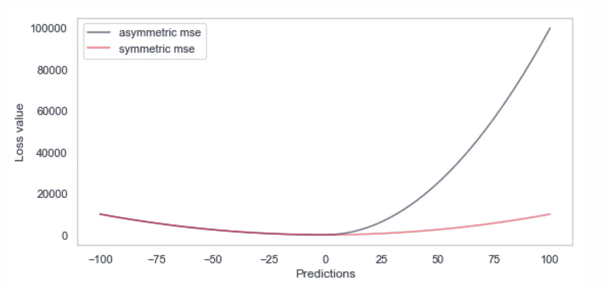
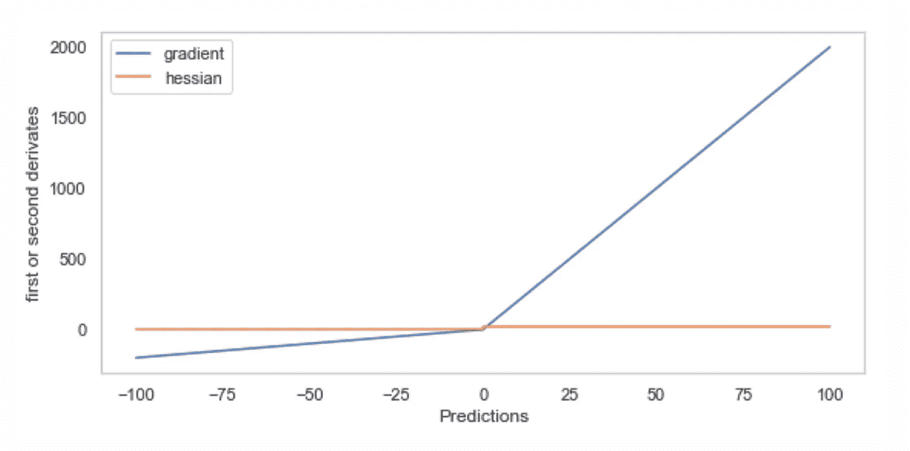
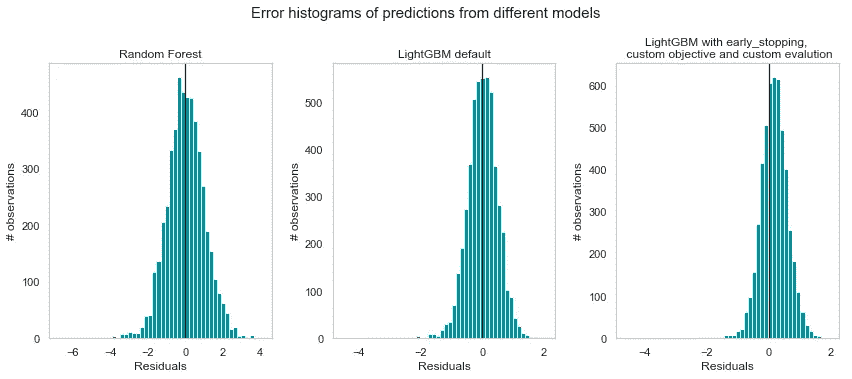

# 用于梯度提升的定制损失函数

> 原文：<https://towardsdatascience.com/custom-loss-functions-for-gradient-boosting-f79c1b40466d?source=collection_archive---------2----------------------->

## *优化重要的事情*

**作者:格罗弗王子**[Sourav Dey](https://towardsdatascience.com/@souravdey)

# 介绍

梯度升压在工业上应用广泛，赢得过很多 Kaggle [比赛](https://github.com/Microsoft/LightGBM/blob/master/examples/README.md#machine-learning-challenge-winning-solutions)。互联网上已经有许多关于梯度增强的很好的解释(我们甚至在参考资料中分享了一些精选的链接)，但我们注意到缺少关于自定义损失函数的信息:为什么、何时和如何。本文试图总结自定义损失函数在许多现实问题中的重要性，以及如何用 LightGBM 梯度增强包实现它们。

训练机器学习算法，使训练数据上的损失函数最小化。有许多常用的损失函数，这些函数在常见的 ML 库中很容易找到。如果你想了解更多，请阅读 Prince 在攻读数据科学硕士学位时写的这篇文章。在现实世界中，这些“现成的”损失函数通常不能很好地适应我们试图解决的业务问题。输入自定义损失函数。

# 自定义损失函数

一个客户损失函数很方便的例子是机场准时性的不对称风险。问题是决定什么时候离开家，这样你就能在正确的时间到达机场。我们不想走得太早，在门口等几个小时。同时，我们不想错过我们的航班。两边的损失是很不一样的:如果我们早到大门，真的没那么糟糕；如果我们到得太晚，错过了航班，那真是糟透了。如果我们使用机器学习来决定何时离开房子，我们可能希望在我们的模型中直接处理这种风险不对称，方法是使用一个定制的损失函数，该函数对晚期错误的惩罚远远超过早期错误。

另一个常见的例子发生在分类问题上。例如，对于疾病检测，我们可能认为假阴性比假阳性更糟糕，因为给健康人用药通常比不治疗病人的危害小。在这种情况下，我们可能希望优化 F-beta 分数，其中 beta 取决于我们希望给予假阳性的权重大小。这有时被称为尼曼-皮尔逊准则。

在流形，我们最近遇到了一个需要自定义损失函数的问题。我们的一个客户，[Cortex Building Intelligence](https://cortexintel.com/)，提供了一个应用程序，帮助工程师更精确地操作建筑物的供暖、通风和空调(HVAC)系统。大多数商业建筑都有“租赁义务”，在工作日的工作时间内，将建筑物的室内温度调节在“舒适”的温度范围内，例如*，*，在上午 9 点到下午 6 点之间，温度在 70 到 74 度之间。同时，暖通空调是一栋建筑最大的运营成本。暖通空调高效运行的关键是在不需要的时候关闭系统，比如晚上，然后在清晨再次打开，以履行“租赁义务”。为此，Manifold 帮助 Cortex 建立了一个预测模型，以推荐建筑中开启 HVAC 系统的准确时间。然而，不正确预测的惩罚是不对称的。如果我们预测的开始时间早于实际要求的开始时间，那么建筑物将过早地达到舒适的温度，并且会浪费一些能量。但是，如果预测的时间晚于实际要求的开始时间，那么建筑物将过晚达到舒适的温度，租户将不会高兴——没有人愿意在冻结/沸腾的建筑物中工作、购物或学习。所以迟到比早到要糟糕得多，因为我们不希望租客(付$$$租金的)不高兴。我们通过创建一个定制的非对称 Huber 损失函数，将这种业务知识编码到我们的模型中，当残差为正对负时，该函数具有更高的误差。关于这个问题的更多细节可以在[这个帖子](https://www.manifold.ai/blog/data-science-at-cortex)中找到。

Ignore what recovery time error means.

**要点:**找到一个与你的商业目标紧密匹配的损失函数。通常，这些损失函数在流行的机器学习库中没有默认的实现。没关系:定义你自己的损失函数并不难，用它来碾压你的问题。

# 定制培训损失和验证损失

在继续之前，让我们先明确一下我们的定义。许多术语在 ML 文献中用来指代不同的事物。我们将选择一组我们认为最清楚的定义:

*   **训练损失。**这是针对训练数据优化的函数。例如，在神经网络二元分类器中，这通常是二元交叉熵。对于随机森林分类器，这是基尼杂质。训练损失通常也被称为“目标函数”。
*   **验证失败。**这是我们用来评估训练模型在未知数据上的表现的函数。这往往不等同于培训损失。例如，在分类器的情况下，这通常是接收器工作特性(ROC)曲线下的区域，尽管这从未被直接优化，因为它是不可微的。这通常被称为“绩效或评估指标”。

在许多情况下，定制这些损失在建立更好的模型中可能是非常有效的。这对于梯度增强来说特别简单，如下所示。

## 培训损失

训练损失在训练过程中得到优化。对于某些算法来说很难定制，比如随机森林(见[这里](https://github.com/scikit-learn/scikit-learn/issues/3071))，但对于其他算法来说相对容易，比如梯度推进和神经网络。因为梯度下降的一些变体通常是优化方法，所以训练损失通常需要是具有凸梯度(一阶导数)和 hessian(二阶导数)的函数。它最好也是连续的、有限的和非零的。最后一点很重要，因为函数为零的部分会冻结梯度下降。

在梯度推进的情况下，训练损失是使用梯度下降优化的函数，*例如*，梯度推进模型的“梯度”部分。具体来说，训练损失的梯度用于改变每个连续树的目标变量。(如果你对更多细节感兴趣，请看[这篇](https://medium.com/mlreview/gradient-boosting-from-scratch-1e317ae4587d)帖子。)注意，即使训练损失定义了“梯度”，每棵树仍然使用不依赖于该定制损失函数的贪婪分割算法来生长。

定义一个自定义的训练损失通常需要我们做一些微积分的工作来寻找梯度和 hessian。正如我们接下来将看到的，通常首先更改验证损失更容易，因为它不需要太多的开销。

## 验证损失

验证损失用于调整超参数。它通常更容易定制，因为它不像培训损失那样有很多功能需求。验证损失可以是非凸的、不可微的和不连续的。因此，从定制开始通常更容易。

比如在 LightGBM 中，一个重要的超参数就是助推轮数。验证损失可用于找到最佳助推轮数。LightGBM 中的这种验证损失称为`eval_metric`。我们可以使用库中可用的验证损失[之一，或者定义我们自己的自定义函数。既然它如此简单，如果它对您的业务问题很重要，您就应该进行定制。

具体来说，我们通常使用 early_stopping_rounds 变量，而不是直接优化 num boosting rounds。对于给定数量的早期停止轮次，当验证损失开始增加时，它停止提升。实际上，它通过监控样本外验证集的验证损失来防止过度拟合。如下图所示，将停止轮次设置得较高会导致模型运行更多的推进轮次。](https://github.com/Microsoft/LightGBM/blob/master/docs/Parameters.rst/#metric-parameters)

*Blue: Training loss. Orange: Validation loss. Both training and validation are using the same custom loss function*

k-fold cross validation. Each test fold scored with validation loss

请记住，验证策略也非常重要。上面的训练/验证分割是许多可能的验证策略之一。可能不适合你的问题。其他包括 k-fold 交叉验证和[嵌套交叉验证](/time-series-nested-cross-validation-76adba623eb9)，我们在 HVAC 开始时间建模问题中使用了它们。

如果适合业务问题，我们希望为我们的训练和验证损失使用自定义函数。在某些情况下，由于自定义损失的函数形式，可能无法将其用作培训损失。在这种情况下，只更新验证损失并使用像 MSE 这样的默认训练损失可能是有意义的。您仍将受益，因为 hyper 参数将使用所需的自定义损耗进行调整。

# **在 LightGBM 中实现自定义损失函数**

让我们看看这在实践中是什么样子，并在模拟数据上做一些实验。首先，让我们假设高估比低估要糟糕得多。此外，让我们假设平方损失是我们在任一方向上的误差的良好模型。为了对此进行编码，我们定义了一个自定义的 MSE 函数，它对正残差的惩罚是负残差的 10 倍。下图显示了我们的自定义损失函数与标准 MSE 损失函数的对比。

根据定义，不对称 MSE 很好，因为它很容易计算梯度和 hessian，如下图所示。注意，hessian 在两个不同的值上是恒定的，左边是 2，右边是 20，尽管在下面的图上很难看到。

LightGBM 提供了一种实现定制训练和验证损失的简单方法。其他梯度增强包，包括 XGBoost 和 Catboost，也提供此选项。 [**这里的**](https://github.com/manifoldai/mf-eng-public/blob/master/notebooks/custom_loss_lightgbm.ipynb) 是一个 Jupyter 笔记本，展示了如何实现一个定制的训练和验证损失函数。详细信息记录在笔记本中，但在较高层次上，实现略有不同:

*   **训练损失:**在 LightGBM 中定制训练损失需要定义一个函数，该函数接受两个数组，目标和它们的预测。反过来，该函数应该返回每个观测值的梯度和 hessian 的两个数组。如上所述，我们需要使用微积分来导出 gradient 和 hessian，然后用 Python 实现。
*   **验证损失:**在 LightGBM 中定制验证损失需要定义一个函数，该函数接受相同的两个数组，但返回三个值:一个带有要打印的度量名称的字符串、损失本身以及一个关于值越高越好的布尔值。

# 在 LightGBM 中实现自定义丢失的代码

Defining custom validation and training loss functions

Incorporating training and validation loss in LightGBM (both Python and scikit-learn API examples)

# 自定义损失函数的实验

Jupyter [notebook](https://github.com/manifoldai/mf-eng-public/blob/master/notebooks/custom_loss_lightgbm.ipynb) 还对默认随机森林、默认 LightGBM 与 MSE 以及 LightGBM 与定制训练和验证损失函数进行了深入的比较。我们使用 Friedman 1 合成数据集，其中包含 8000 个训练观测值、2000 个验证观测值和 5000 个测试观测值。验证集用于找到优化验证损失的最佳超参数集。下面报告的分数是根据测试观察值评估的，以评估我们的模型的可推广性。我们做了一系列实验，总结如下表所示。 ***注意，我们关心的最重要的分数是不对称 MSE，因为它具体定义了我们的不对称惩罚问题。***

Our experiments and results

让我们来看一些详细的比较。

**随机森林→ LightGBM** 使用默认设置，LightGBM 在该数据集上的表现优于随机森林。随着更多的树和更好的超参数组合，随机森林也可能给出好的结果，但这不是这里的重点。

**LightGBM →带定制训练损失的 LightGBM with】这说明我们可以让我们的模型优化我们所关心的东西。默认的 LightGBM 正在优化 MSE，因此它给出了更低的 MSE 损失(0.24 对 0.33)。具有自定义训练损失的 LightGBM 正在优化不对称 MSE，因此它对不对称 MSE 的性能更好(1.31 对 0.81)。**

**LightGBM →使用 MSE 调整早期停止回合的 LightGBM with】两种 LightGBM 模型都在优化 MSE。我们看到默认 MSE 分数有了很大的改进，只是使用了早期停止回合的小调整(MSE: 0.24 vs 0.14)。因此，我们应该让模型使用早期停止超参数来决定最佳增压轮数，而不是将增压轮数限制为默认值(*即*，100)。超参数优化至关重要！**

**使用 MSE 调整早期停止回合数的 light GBM→使用自定义 MSE 调整早期停止回合数的 light GBM** 这两个模型的得分非常接近，没有实质性差异。这是因为验证损失仅用于决定何时停止升压。在这两种情况下，梯度都在优化默认 MSE。每个后续的树为两个模型产生相同的输出。唯一的区别是，具有自定义验证损失的模型在 742 次提升迭代时停止，而另一个模型运行更多次。

**使用定制 MSE 调整提前停止的 LightGBM→针对定制损失训练的 light GBM 和使用 MSE 调整提前停止的 light GBM** 仅定制训练损失而不改变验证损失会损害模型性能。只有定制训练损失的模型比其他情况增加了更多回合(1848)。如果我们仔细观察，这个模型具有非常低的训练损失(0.013)，并且在训练集上高度过拟合。每次梯度提升迭代使用训练误差作为目标变量来生成新的树，但是提升仅在验证数据的损失开始增加时停止。当模型开始过度拟合时，验证损失通常开始增加，这是停止构建更多树的信号。在这种情况下，由于验证和训练损失彼此不一致，模型似乎没有“得到消息”,这导致过度拟合。这种配置只是出于完整性考虑，在实践中不应该使用。

**具有带 MSE 的调整的早期停止回合的 LightGBM→根据定制训练损失训练的 light GBM 和具有定制验证损失的调整的早期停止回合**最终模型使用定制训练和验证损失。它以相对较少的提升迭代次数给出了最佳的不对称 MSE 分数。损失与我们所关心的一致！

让我们更仔细地看看残差直方图，了解更多细节。

*Histogram of residuals on predictions from different models.*

请注意，与随机森林模型相比，使用 LightGBM(即使使用默认的超参数)可以提高预测性能。具有自定义验证损失的最终模型似乎在直方图右侧*做出更多预测，即*实际值大于预测值。由于不对称的定制损失函数，这是预料之中的。使用残差的核密度图可以更好地可视化残差的这种右侧偏移。

*Comparison of predictions from LightGBM models with symmetric and asymmetric evaluation*

# 结论

所有的模型都有误差，但是许多商业问题并没有平等地对待低估和高估。有时，我们有意希望我们的模型将我们的误差偏向某个方向，这取决于哪个误差代价更大。因此，我们不应该用普通 ML 库中“现成的”对称损失函数来限制自己。

LightGBM 提供了一个简单的接口来整合定制的训练和验证损失函数。在适当的时候，我们应该利用这个功能来做出更好的预测。同时，你不应该立即使用自定义损失函数。最好采用[精益迭代方法](http://www.manifold.ai/lean-ai)，首先从简单的基线模型开始，比如随机森林。在下一次迭代中，您可以移动更复杂的模型，如 LightGBM，并进行超参数优化。只有当这些基线稳定后，才有意义去定制验证和训练损失。

希望有用！快乐定制！

# 更多推荐阅读

如果你不清楚一般的渐变提升是如何工作的，我推荐阅读[特伦斯·帕尔](http://parrt.cs.usfca.edu/)的[如何解释渐变提升](http://explained.ai/gradient-boosting/index.html)，以及普林斯的[从零开始的渐变提升](https://medium.com/mlreview/gradient-boosting-from-scratch-1e317ae4587d)。关于如何在不同的 GBM 框架中调优超参数，有大量的文章。如果您想使用这些软件包中的一个，您可以花一些时间来了解要搜索哪个范围的超参数。这一期的 LightGBM GitHub 给出了一个大概的取值范围。 [Aarshay Jain](https://www.analyticsvidhya.com/blog/author/aarshay/) 写了一篇很好的[博客](https://www.analyticsvidhya.com/blog/2016/03/complete-guide-parameter-tuning-xgboost-with-codes-python/)关于调优 XGBoost 和 sklearn 渐变提升。我认为可以写一篇关于调优 LightGBM 的博文。

要获得哪个渐变增强包适合您的情况的一些直觉，请阅读 Alvira Swalin 的[CatBoost vs . Light GBM vs. XGBoost](/catboost-vs-light-gbm-vs-xgboost-5f93620723db)，以及 Pranjan Khandelwal 的[哪个算法摘得桂冠:Light GBM vs . XGBoost？](https://www.analyticsvidhya.com/blog/2017/06/which-algorithm-takes-the-crown-light-gbm-vs-xgboost/)。

# 关于流形

[Manifold](http://www.manifold.ai/) 是一家全方位服务的人工智能咨询公司，提供全面的人工智能工程服务，包括机器学习、数据科学、数据工程、devops、云和 edge。我们拥有设计、构建、部署和管理复杂数据应用程序的成熟能力。Manifold 深受全球 500 强和高增长公司的首席技术官、首席信息官和总经理的信任。我们的工作横跨消费电子、工业、无线、在线商务、数字健康等行业。Manifold 经验丰富的工程师在谷歌、高通、麻省理工学院和成功的风险投资创业公司等机构拥有创新记录。我们的顾问委员会包括斯坦福大学和哈佛大学深度学习领域的领先研究人员，我们有一个广泛的专家网络，我们可以利用工业和工程子专业。

想研究这样的东西吗？向 sdey@manifold.com 伸出援手！我们正在雇佣数据科学家。