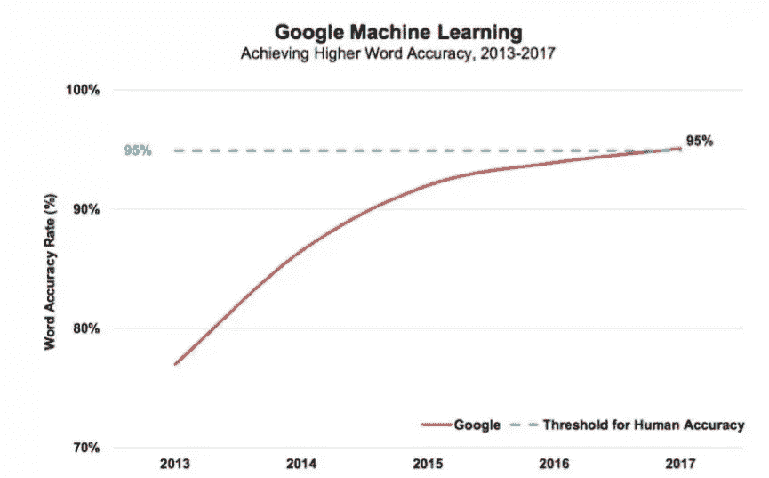

# 环境计算世界中的客户服务

> 原文：<https://towardsdatascience.com/customer-service-in-a-world-of-ambient-computing-8e90c5ccbe5?source=collection_archive---------8----------------------->

很快将有一个额外的应用内客户服务渠道。

到目前为止，我们有一堆服务渠道，其中大多数都要求用户离开应用程序

*   拿起电话打电话
*   浏览自助服务
*   打开一个额外的聊天窗口
*   利用社交媒体渠道
*   继续使用 messenger 应用程序
*   坐进你的车去商店怎么样？
*   …

然后，客户可能会在这些渠道之间来回移动，很可能会失去对事件状态的跟踪，并且跨渠道客户服务仍然会引起摩擦。

毫无疑问，提供应用内支持是快速解决问题的最佳选择。它可以从应用程序中提供遥测信息，识别用户，从而提供大量相关背景信息，使服务代理能够更轻松地帮助客户，避免不必要的延迟。谷歌的研究也发现了消费者对“现在”的重视。

# 并非所有设备都是智能手机

但是，如果客户不能拿起电话进行打字对话，该怎么办呢？客户可能正在玩虚拟现实游戏，或者正在驾驶汽车，或者处于无法自由行动的任何情况下。

也许客户只是不想接电话？

如果这款应用除了一盏指示‘我有空’的小灯之外，根本不提供用户界面，那该怎么办？这将例如是在周围环境中感测到人的存在并相应地采取行动的情况。

像这样的环境将主要通过亚马逊的 Alexa、谷歌 Home、苹果的 HomePod 或微软即将推出的 Home Hub 等设备进行语音和手势控制。类似这样的系统最多将键盘作为访问服务和支持的辅助手段。

但是没有必要看得那么远。想象一个游戏场景。无论是 Xbox，还是 Playstation，或者任何其他主要的控制器都没有提供键盘。在这些或 VR 或 AR 游戏的情况下，用户会握着控制器，没有足够的余地去拿键盘。

那么，他们为什么要提供一个键盘来实现对话式(或其他)应用内支持呢？没有理由。

相反，用户将通过[基于手势、视图和语音的界面](http://customerthink.com/why-ai-machine-learning-and-bots-better-experiences/)与服务系统和代理交互。

# 下一个应用内支持渠道是语音

语音识别技术正在迅速成熟，并开始在理解至少英语语言方面达到人类水平的准确性。

人类的理解水平大约是百分之五的单词错误率(WER)，这意味着人类平均每一百个单词中有五个是由于错误识别、漏掉一个单词或错误插入一个单词而造成的。

机器达到人类的语言理解水平；来源 2017 互联网趋势报告

机器达到人类的语言理解水平；来源 2017 互联网趋势报告

虽然亚马逊没有给出 Alexa 能力的任何数字，但微软[宣布](https://mspoweruser.com/microsoft-research-breaks-human-speech-recognition-barrier/)在 2016 年 10 月达到了 5.9%的单词错误率(WER)； [IBM 在 2017 年 3 月以 5.5%的 WER 击败了他们](https://mspoweruser.com/ibm-beats-microsoft-speech-recognition-accuracy/)。谷歌在 2017 年 5 月宣布，其 WER 达到了 4.9%。

在这样的水平上使用语音识别技术，结合自然语言处理(NLP)和自然语言生成(NLG)，应用内服务对话可以获得两者，非常个性化，非常身临其境。

而且非常有效。说话是人类最容易的交流方式。说话和对话是紧密相连的。

最后但同样重要的是，这也是一种非常有效的提供客户服务的方式，因为人类交流信息的能力在说话时是最高的。

# 把人带回客户服务

现在，客户服务 2.0，客户服务的自动化，似乎正在从通过自助服务的呼叫偏转，然后机器人转向客户服务 3.0。

在自然语言处理和意图检测技术日益成熟的帮助下，这种迭代将把机器人从第二排移到第一排。它们将成为主要的客户支持界面。客户将通过聊天界面向机器人寻求帮助，而不是在 FAQ 上使用搜索框。然后，机器人本身将能够使用例如 FAQ 或数据库来回答问题，或者将问题升级到人类操作员。自助服务和辅助客户服务之间的区别将首先变得模糊，然后消失。机器处理较简单的问题，人处理较困难的问题。

随着自然语言处理、文本到语音、语音到文本技术和意图检测的进一步完善，打字将再次让位于语音，然后引入客户服务 4.0。

客户服务将完全转变为对话，无论是同步还是异步都不再重要。

客户服务是由机器人还是由人来提供也不再重要，但看起来会像人一样。这可能会对呼叫中心及其运营本身产生影响，我们将在另一篇文章中讨论。

底线是:客服会再次人性化。