# 【CVPR 2017 /论文摘要】用于密集图像标注的门控反馈细化网络

> 原文：<https://towardsdatascience.com/cvpr-2017-paper-summary-gated-feedback-refinement-network-for-dense-image-labeling-8746a3e1889b?source=collection_archive---------6----------------------->

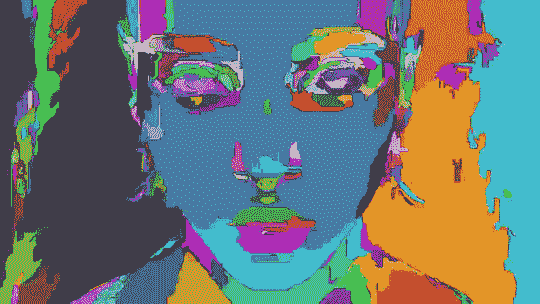

GIF from this [website](https://giphy.com/gifs/tech-computing-segmentation-GbNuEXVzgLrDW)

我一直想读的论文之一。

> **请注意，这篇帖子是给未来的自己看的，回顾这篇论文上的材料，而不是从头再看一遍。**

Paper from this [website](https://arxiv.org/pdf/1806.11266.pdf)

**摘要**

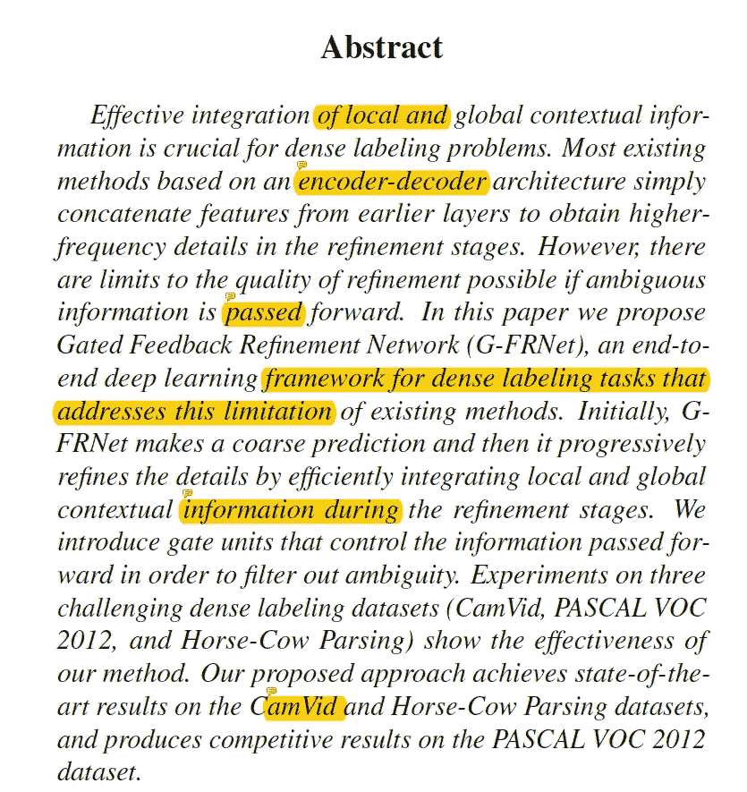

对于密集标记问题，重要的是考虑图像中的局部和全局信息。在本文中，作者提出了门控反馈细化网络，该网络最初进行粗略预测，然后在细化阶段通过有效地整合局部和全局上下文信息来逐步细化细节。

**简介**

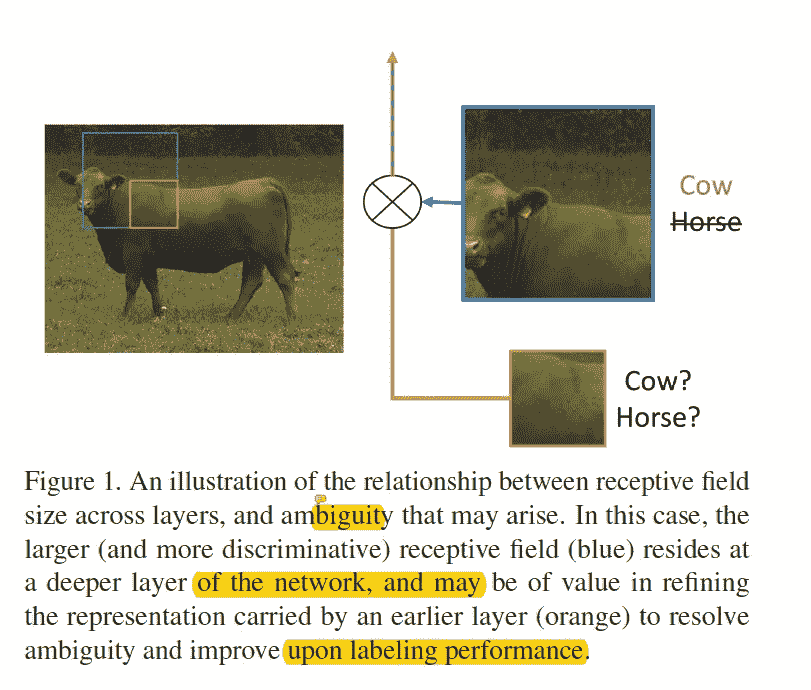

在要求像素级精度的图像密集标记中，保持空间分辨率非常重要，因为我们需要创建一个分割掩模。这些任务中的大多数都有一个解码器部分，它逐渐恢复类别的像素级规范。在编码阶段的最深处，神经元可能缺乏空间信息(由于下采样),然而，它通常具有最丰富的可能特征表示。并且在更早的层中，每个神经元将具有更大的空间局部性，但是可能区分度更低。(如上图。).因此，为了克服这个问题，本文的作者介绍了一种新的架构，其中编码器和解码器通过门控单元连接。(因此利用了来自早期层的空间信息以及较深层中丰富的特征表示。).该模型的一个优点是这种类型的方法可以应用于任何编码器-解码器类型的神经网络。

**背景**

在这里，作者简要描述了编码器-解码器类型网络的基础知识，并给出了一些具有类似结构的示例论文。接下来，作者讨论了编码器和解码器之间跳过的连接。一个有趣的事实是，对于密集标记任务，对诸如小平移或光照等有害因素不变的特征地图的高表示并不理想。因为一些重要的关系可能被抽象掉。

**门控反馈细化网络**

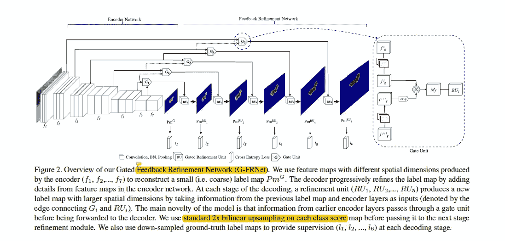

如上所示，该网络是 VGG 16 的修改版本，其中去掉了 softmax 层，并增加了两个额外的卷积层。最后，在编码器阶段结束时，特征映射具有 H*W*C 的维数，其中 C 是类的数量。(上采样是通过双线性上采样完成的)。并且使用解码器来恢复空间分辨率。作者工作的新颖性主要在于编码器和解码器之间的门控连接，而不是通过直接连接直接连接两者，他们使用门控机制来调制信息。

***门单元***

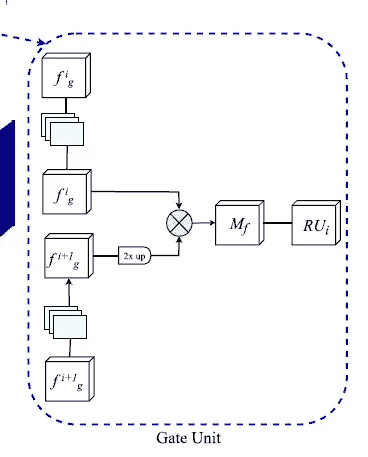

如上所述，选通单元接收两个特征图作为输入，并且由于每个特征图的维数彼此不同，所以它们应用一系列操作，随后是逐元素的点积。(操作顺序是与批量标准化和 ReLU 卷积)。最后，门控单元的输出被馈送到门控细化单元。

***门控细化单元***

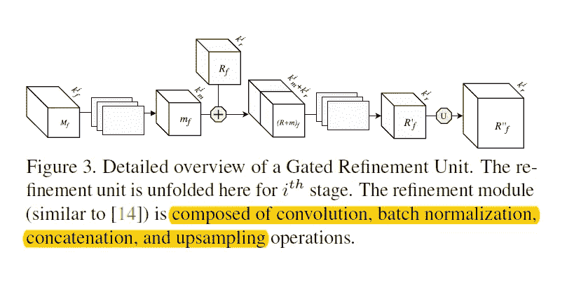

遵循类似的策略，给定的特征图首先通过批量归一化的卷积(在这之后，通道大小 C 与类的数量相同)。)接下来，特征图 mf 与阶段标签图 Rf 连接。最后，通过应用 3 × 3 卷积来生成细化的标签映射 R`f。(数学上我们可以总结如下。)

***阶段性监督***

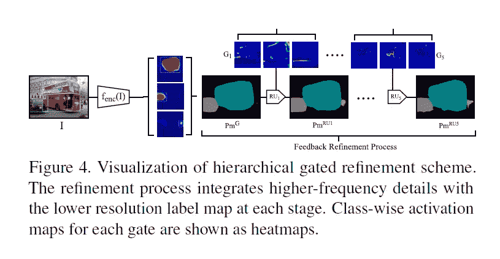

虽然我们最感兴趣的是最终阶段生成的掩码，但是隐藏标签可能会提供有用的信息，并且可以对模型进行早期监督。因此，使用具有交叉熵损失的调整大小的地面真相掩模，作者引入了多个损失函数。我们可以看到上面的逐级损失函数的效果。

**实验**

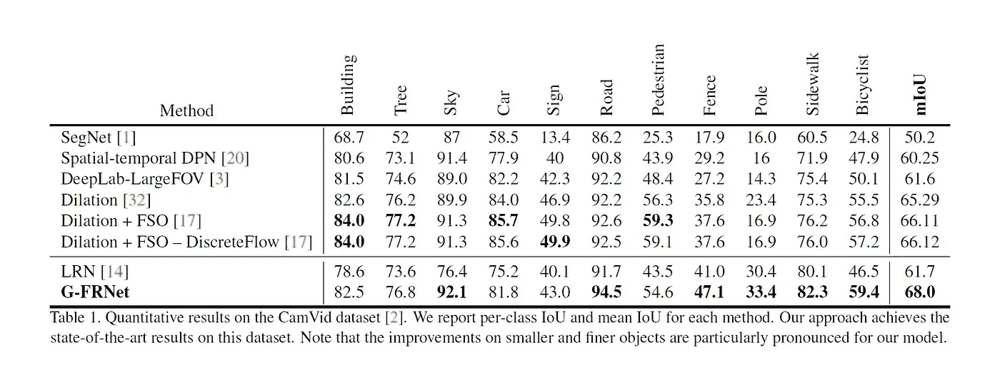

作者使用 Caffe 来实现网络，并在三个数据集上训练网络，剑桥驾驶标记视频(CamVid)，PASCAL VOC 2012 和马牛解析。

上面可以看到 Cam Vid 数据集的每类 IoU 和平均 IoU。我们可以立即注意到，G-FRNet 在平均 IoU 得分方面获得了最高分。下面是分割图的例子。

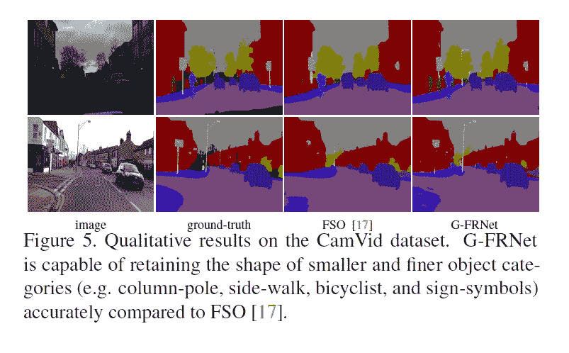

对于 PASCAL VOC 2012 数据集，在修改类似于 resnet 的网络并在最终预测的基础上应用条件随机场之后，作者能够实现最先进的性能。

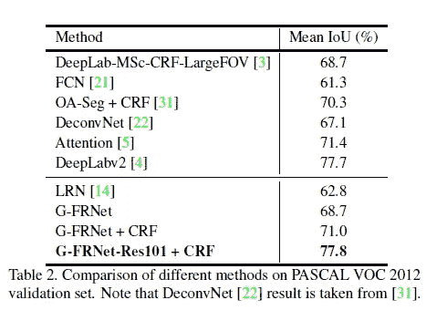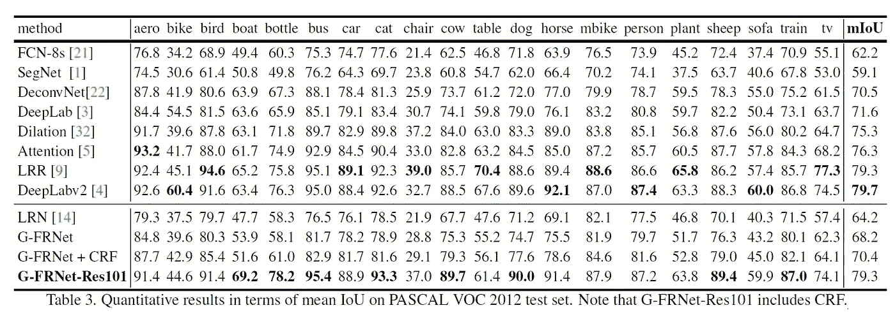

最后，即使对于 Horse-Cow 解析数据集，当与不同的现有技术网络相比时，该模型也能够实现最高的 IoU 分数。

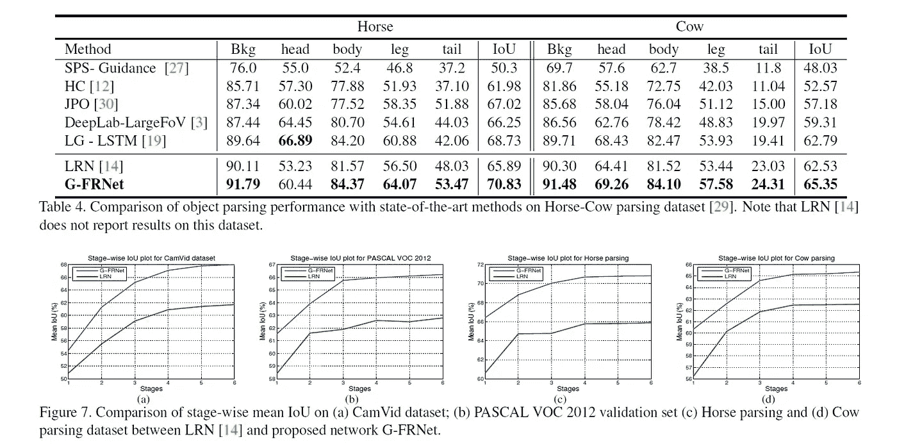

上面可视化的底部图表显示了消融分析的结果，其中作者通过省略一个或多个组件调查了网络的每个提议组件的贡献。他们发现包含门单元可以提高整个网络的整体性能。

**讨论**

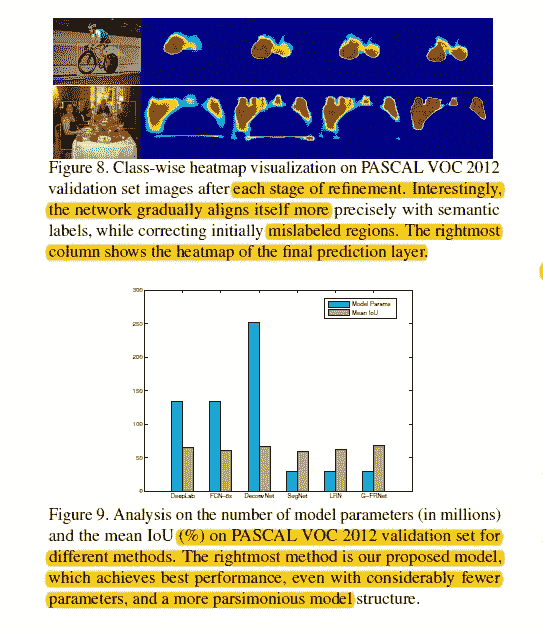

关于 G-FRNet 的两个令人印象深刻的事实是，随着网络的发展，对象的丢失部分被恢复，并且在分段掩码中错误标记的部分被纠正。此外，与其他先进网络相比，G-FRNet 的参数数量只有其 12%到 25 %,但性能却极具竞争力。

**结论**

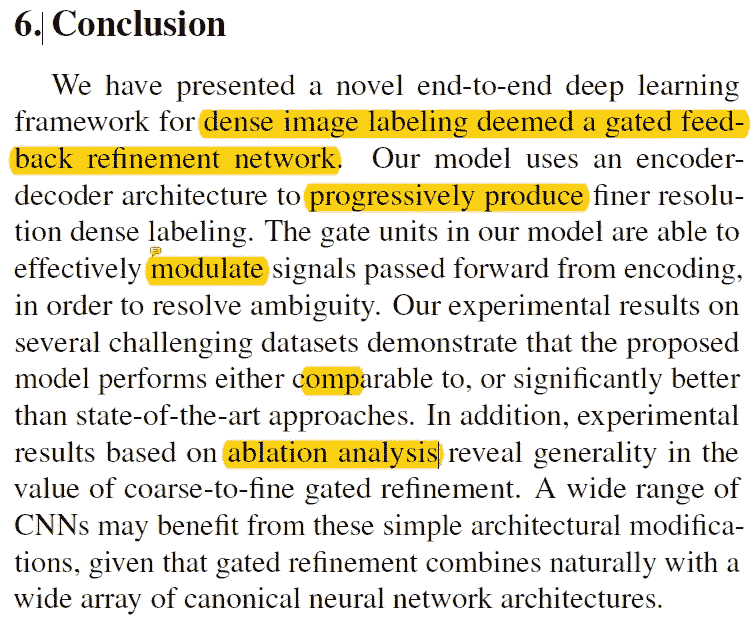

总之，本文的作者介绍了一个新的密集标记任务的框架。其中编码器-解码器型网络跳过了连接和逐级监督，以逐步产生更精细分辨率的密集标记。

**遗言**

这种类型的架构也可以应用于许多不同的 CNN。

**参考**

1.  伊斯兰，m .，罗昌，m .，那霸，s .，布鲁斯，n .，，王，Y. (2018)。用于由粗到细的稠密语义图像标注的门控反馈细化网络。Arxiv.org。检索于 2018 年 7 月 14 日，来自 https://arxiv.org/abs/1806.11266