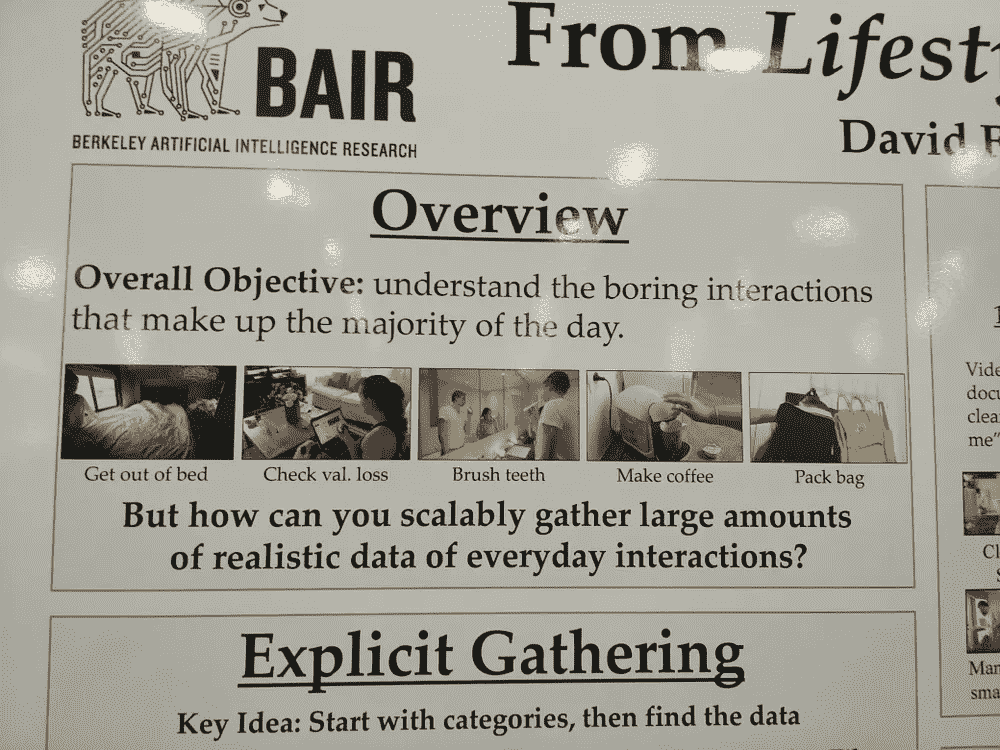
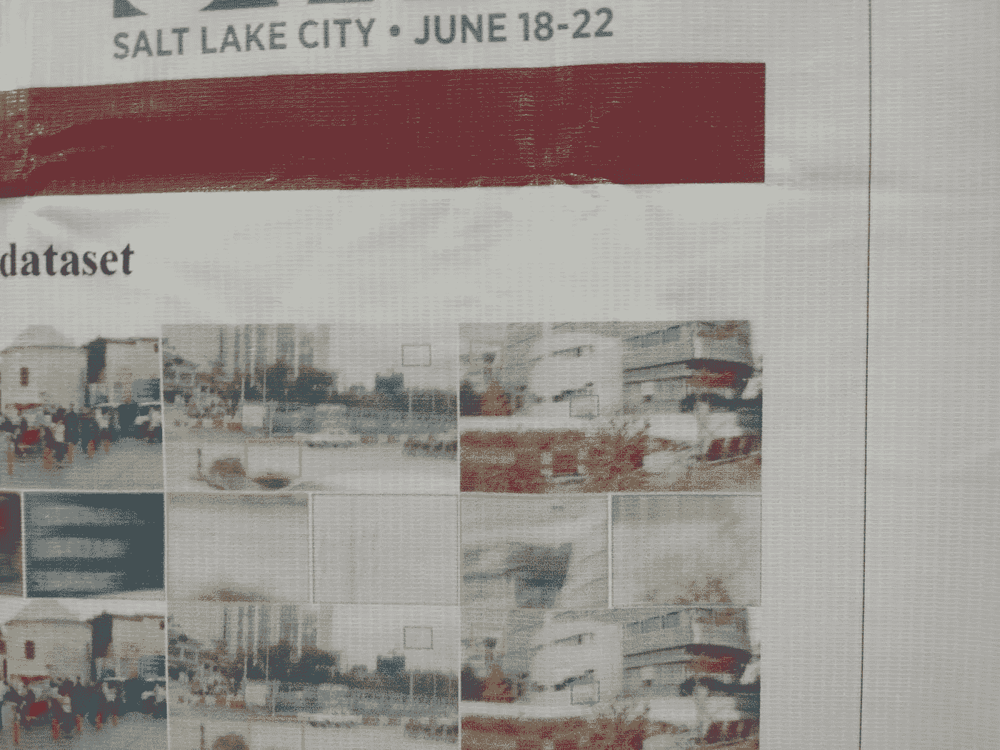
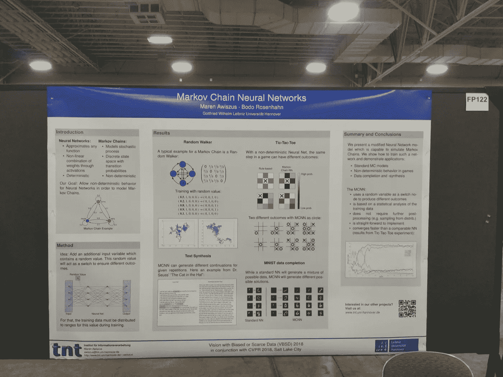
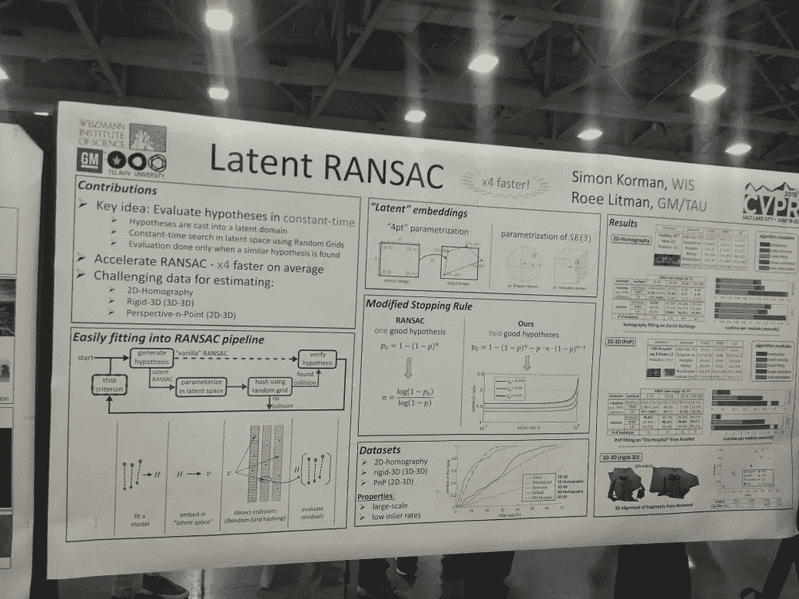
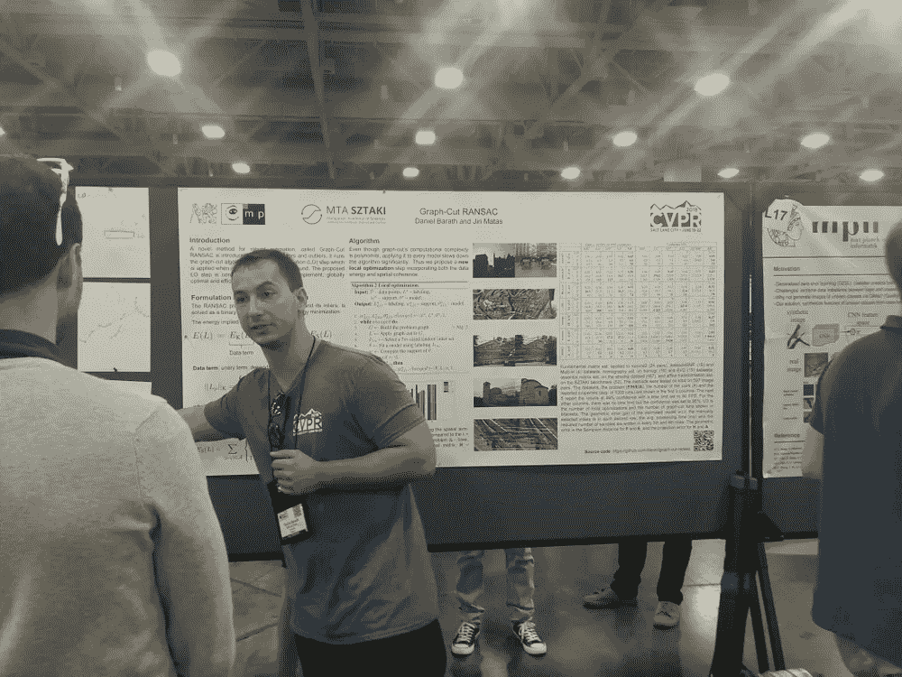
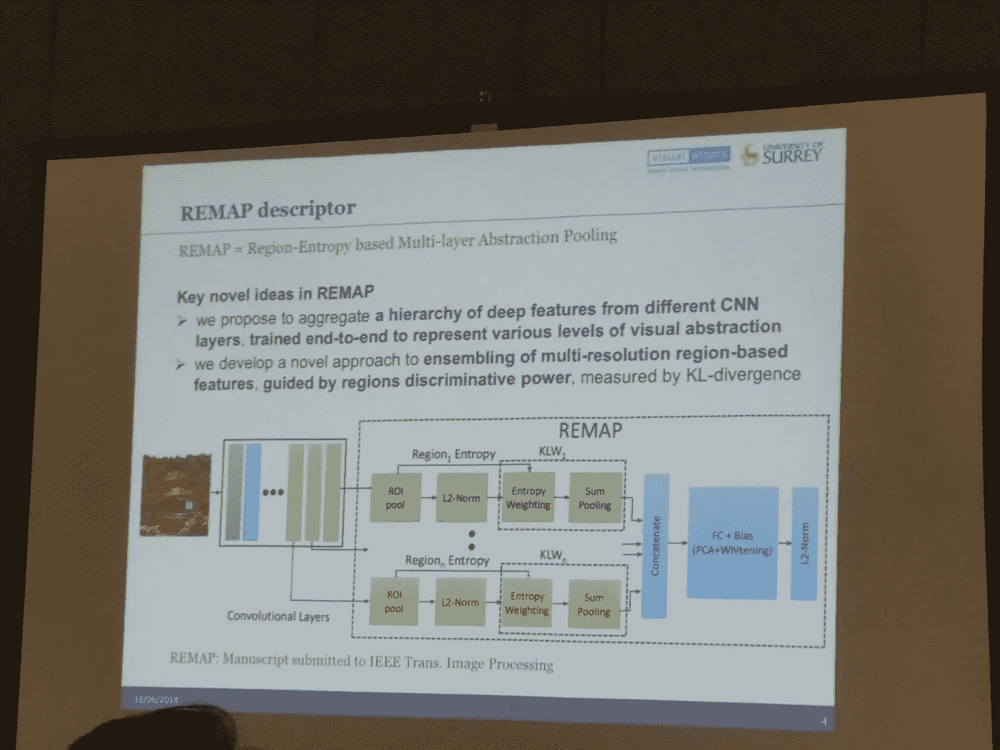
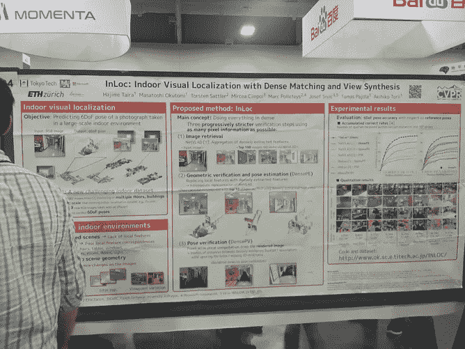
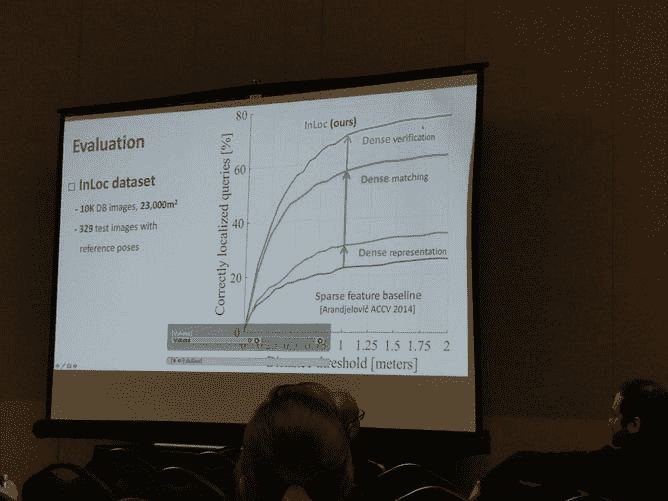
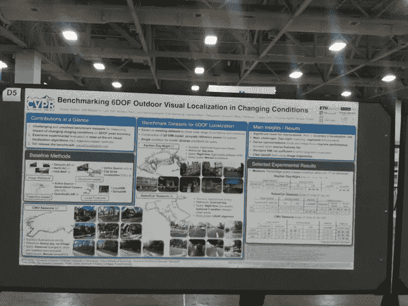

# CVPR 2018。印象和 15 篇有趣的论文

> 原文：<https://towardsdatascience.com/cvpr-2018-impressions-and-15-interesting-papers-37fcc1b5b449?source=collection_archive---------5----------------------->

从认识新朋友和与其他人一起去虚拟化的角度来看，这个 CVPR 很棒。关于新的很酷的结果——没那么多。我的意思是，很多好论文，但没有什么开创性的，至少在我感兴趣的领域。

Fun in posters :)

0)如果您展示与图形相关的海报，例如去模糊、超分辨率等，请不要将其印在布上。尤其是在粗糙织物上。
[深度图像去模糊的尺度递归网络](https://arxiv.org/abs/1802.01770)做得很好，但是由于布料纹理你什么都看不到:(

Poster material matters.

1) GANs、领域适配、自动驾驶和非常次要的架构小技巧无处不在。

2)东欧的代表性仍然很差，但在增长。匈牙利、乌克兰、罗马尼亚、波兰、土耳其。论文不多，但至少有一些，而且数量还在增加。太棒了。

3)工作坊“[做好 CVPR 市民](https://www.cc.gatech.edu/~parikh/citizenofcvpr/)”出奇的酷。尤其是 Vladlen Koltun 的“什么是好的研究”和 Devi Parikh 的“日历，而不是列表”。所有幻灯片和视频都可以通过上面的链接获得

4)我发现了各种风格的图形神经网络。迈克尔·布朗斯坦的好教程

5)车间论文“[马尔可夫链神经网络](https://arxiv.org/abs/1805.00784)”。简单的想法——添加额外的随机输入变量来控制期望的输出，然后您可以在测试时有条件地控制输出。

Markov chain neural networks poster

6)三个版本的可区分 SLAM:
— [MapNet:一个用于映射环境的以所有人为中心的空间内存](http://www.robots.ox.ac.uk/~joao/mapnet/)来自牛津
— NVIDIA MapNet " [用于摄像机定位的地图的几何感知学习](https://arxiv.org/abs/1712.03342)。
—salakhutdinov‏集团 deep slam:[基于注意力的 RNNs 全局姿态估计](https://arxiv.org/abs/1802.06857)

7) RANSAC 还在进步。两篇很酷的论文:[潜然萨克](https://arxiv.org/abs/1802.07045)和[图切然萨克](https://arxiv.org/abs/1706.00984)

Latent RANSAC and Graph-Cut RANSAC

8)关于[大规模地标识别](https://landmarkscvprw18.github.io/)的研讨会:关键提示信息:全局特征已经足够好了，但是池化和集成还有待改进。如果你需要本地特色——选择 DELF。以下是推特翻译:https://twitter.com/ducha_aiki/status/1008815959291777025

[https://twitter.com/ducha_aiki/status/1008818384664838145](https://twitter.com/ducha_aiki/status/1008818384664838145)

8)相比之下， [InLoc:密集匹配和视图合成的室内视觉定位](https://arxiv.org/abs/1803.10368)和 [Benchmarking 6DOF 变化条件下的室外视觉定位](https://arxiv.org/abs/1707.09092)论文说的不一样:局部特征很酷，但是你需要密集，而不是稀疏

InLoc and 6DOF bench papers

9)地方特色-相关论文线程—[https://twitter.com/ducha_aiki/status/1009192898061979648](https://twitter.com/ducha_aiki/status/1009192898061979648)

我喜欢的其他论文:

*   [感知失真权衡](https://arxiv.org/abs/1711.06077)。例如，如果信息丢失，您无法在重建中既获得良好的细节又接近真实情况，需要进行选择。下一个问题是如何得到给定优先级的算法，以及权衡的确切位置。
*   [一种用于深度网络](http://www4.comp.polyu.edu.hk/~cslzhang/paper/CVPR18_PID.pdf)
    随机优化的 PID 控制器方法，并行于 SGD 和 PID 控制器之间，能够重新使用已知的控制理论方法进行学习。
*   [对抗性度量学习](https://arxiv.org/abs/1802.03170):甘式化易为难——特征迁移。为数不多的不枯燥的 GAN 论文。
*   [通过提问来学习。网络通过自己学习提问来学习进行视觉问答。](https://arxiv.org/abs/1712.01238)
*   2 篇关于基于秩的损失的论文:两篇关于优化平均精度的论文:这里有一个平均精度的[闭式解及其可微公式](https://arxiv.org/abs/1804.05312)。
    [基于秩的损失函数的高效优化](https://arxiv.org/abs/1604.08269):作者没有使用封闭形式，而是通过利用类似快速搜索的算法提出了高效的评价。
*   [通过概率自省的几何稳定特征的自我监督学习](https://arxiv.org/abs/1804.01552)通过预测匹配性来学习特征。
*   [面向高效 ConvNet 的分析滤波器](http://openaccess.thecvf.com/content_cvpr_2018/html/Kobayashi_Analyzing_Filters_Toward_CVPR_2018_paper.html):第一层上的可操纵滤波器，用于全连接的第一级 DCT，用于前 FC 层的基于 BoW 的池。改进的 VGGNet 和 ResNet。
*   [学习从单个运动模糊图像中提取视频序列](http://openaccess.thecvf.com/content_cvpr_2018/html/Jin_Learning_to_Extract_CVPR_2018_paper.html)新的运动去模糊任务公式:提取产生模糊图像的帧序列比提取单个去模糊图像更好且更容易。
*   亚特兰大世界:如果在你的 2D 世界中有 4 种主导方向，使用 4D 坐标系，而不是最小 2。
    论文:[亚特兰大帧估计的全局最优内联集最大化](http://openaccess.thecvf.com/content_cvpr_2018/html/Joo_Globally_Optimal_Inlier_CVPR_2018_paper.html)

P.S .另一份来自 CVPR 2018 的有趣报道[https://olgalitech . WordPress . com/2018/06/30/cvpr-2018-recap-notes-and-trends/](https://olgalitech.wordpress.com/2018/06/30/cvpr-2018-recap-notes-and-trends/)