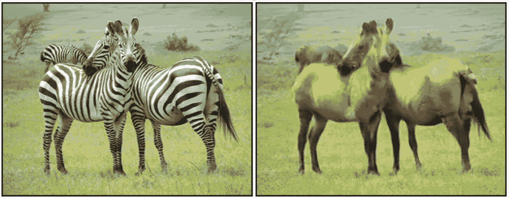
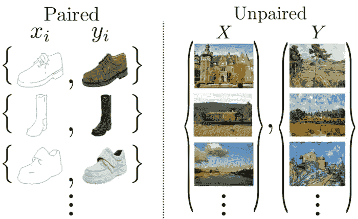
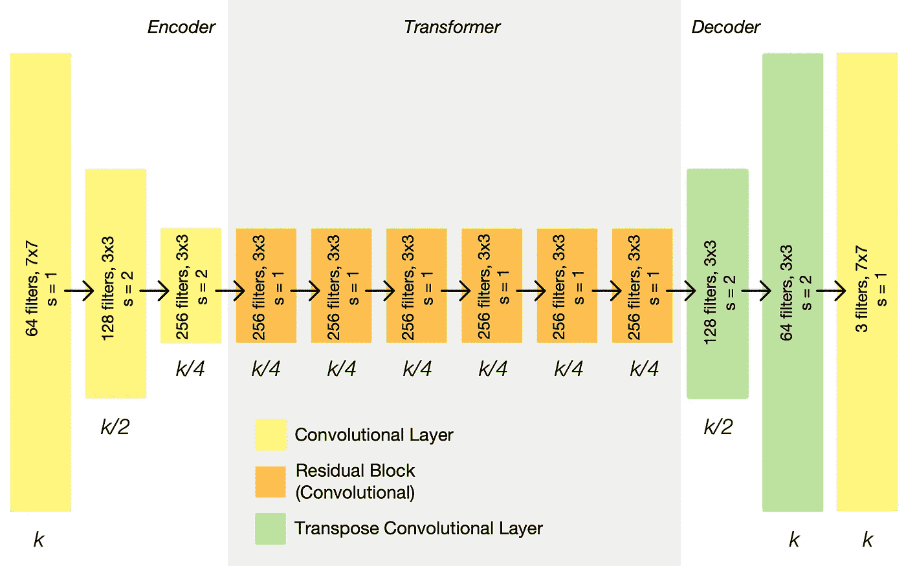
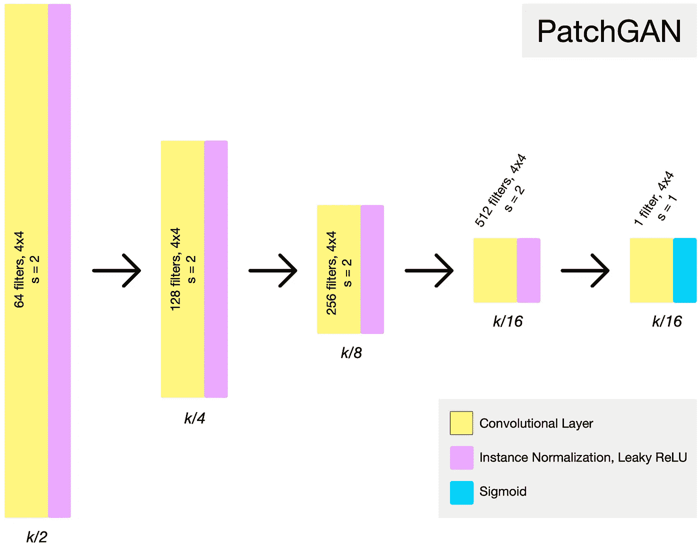
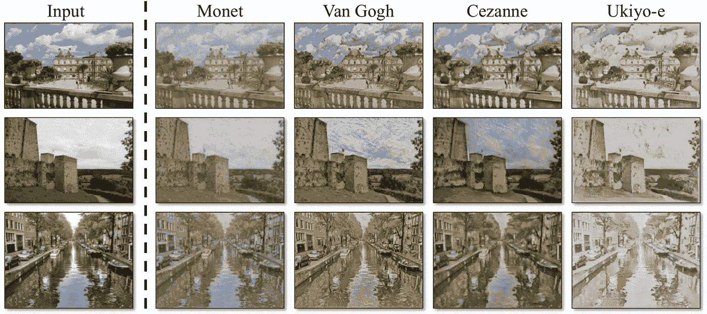

# CycleGAN:学习翻译图像(无配对训练数据)

> 原文：<https://towardsdatascience.com/cyclegan-learning-to-translate-images-without-paired-training-data-5b4e93862c8d?source=collection_archive---------4----------------------->

An image of zebras translated to horses, using a CycleGAN

*图像到图像转换*是将图像从一个领域(例如，斑马的图像)转换到另一个领域(例如，马的图像)的任务。理想情况下，图像的其他特征——与任何一个领域都不直接相关的任何东西，例如背景——应该保持可识别的相同。正如我们可以想象的，一个好的图像到图像的翻译系统可以有几乎无限的应用。改变艺术风格，从素描到照片，或者改变照片中风景的季节只是几个例子。

Examples of paired and unpaired data. *Image taken from the paper.

虽然对这项任务有大量的研究，但大多数都利用了*监督的*训练，在那里我们可以访问( *x* ， *y* )对来自我们想要学习在两个领域之间进行翻译的相应图像。CycleGAN 是在伯克利分校的 2017 年论文中介绍的，[使用循环一致的对抗网络进行不成对的图像到图像翻译](https://arxiv.org/abs/1703.10593)。这很有趣，因为*不*需要成对的训练数据——虽然仍然需要一组 *x* 和 *y* 图像，但它们不需要彼此直接对应。换句话说，如果你想在草图和照片之间进行转换，你仍然需要在一堆草图和一堆照片上进行训练，但是草图不需要是数据集中的精确照片中的*。*

由于配对数据在大多数领域中很难找到，甚至在某些领域中不可能找到，因此 CycleGAN 的无监督训练功能非常有用。

# 它是如何工作的？

## 两台发电机的故事

CycleGAN 是一个生成式对抗网络(GAN ),它使用*两个*生成器和*两个*鉴别器。(注意:如果您不熟悉 GANs，您可能想在继续之前[阅读一下关于它们的内容](https://medium.freecodecamp.org/an-intuitive-introduction-to-generative-adversarial-networks-gans-7a2264a81394))。

我们称其中一个生成器为 *G* ，让它将图像从 *X* 域转换到 *Y* 域。另一个生成器称为 *F* ，将图像从 *Y* 转换为 *X* 。

Both G and F are generators that take an image from one domain and translate it to another. G maps from X to Y, whereas F goes in the opposite direction, mapping Y to X.

每个发生器都有一个相应的鉴别器，用于区分合成图像和真实图像。

One discriminator provides adversarial training for G, and the other does the same for F.

## 目标函数

循环目标函数有两个组成部分，一个*对抗损失*和一个*循环一致性损失*。两者对于获得好的结果都是必不可少的。

如果你熟悉 GANs，这种对抗性的失败应该不会让人感到意外。这两个生成器都试图“愚弄”它们对应的鉴别器，使其无法区分它们生成的图像和真实版本。我们使用最小二乘损失(由毛等人发现比典型的对数似然损失更有效)来捕捉这一点。

然而，仅仅是对抗性的损失不足以产生好的图像，因为它使模型*受到约束*。它强制生成的输出是适当的域，但是*没有*强制输入和输出是可识别的相同。例如，一个生成器输出图像 *y* 是该领域一个很好的例子，但是看起来一点也不像 *x* ，按照对抗性损失的标准，它会做得很好，尽管没有给出我们真正想要的。

*周期一致性丢失*解决了这个问题。它依赖于这样的期望，如果你将一个图像转换到另一个域，然后再转换回来，通过连续地将它输入两个生成器，你应该得到与你输入的相似的东西。它强制执行*F*(*G*(*x*)≈*x*和*G*(*F*(*y*)≈*y*)。

我们可以通过将这些损失项放在一起，并用超参数λ对循环一致性损失进行加权，来创建完整的目标函数。我们建议设置λ = 10。

## 发电机架构

每个周期信号发生器有三个部分:一个*编码器*，一个*变压器*，和一个*解码器*。输入图像被直接输入编码器，这样可以缩小图像的大小，同时增加通道的数量。编码器由三个卷积层组成。产生的激活然后被传递到转换器，一系列的六个剩余块。然后由解码器再次扩展，解码器使用两个转置卷积来扩大表示大小，并使用一个输出层来产生最终的 RGB 图像。

具体可以看下图。请注意，每一层后面都有一个实例规范化层和一个 ReLU 层，但为了简单起见，这些都被省略了。

An architecture for a CycleGAN generator. As you can see above, the representation size shrinks in the encoder phase, stays constant in the transformer phase, and expands again in the decoder phase. The representation size that each layer outputs is listed below it, in terms of the input image size, k. On each layer is listed the number of filters, the size of those filters, and the stride. Each layer is followed by an instance normalization and ReLU activation.

由于生成器的架构是完全卷积的，一旦经过训练，它们就可以处理任意大的输入。

## 鉴别器架构

鉴别器是 PatchGANs，这是一种全卷积神经网络，它查看输入图像的“补丁”,并输出该补丁“真实”的概率。这不仅比试图查看整个输入图像的计算效率更高，而且也更有效——它允许鉴别器专注于更多的表面特征，如纹理，这通常是在图像转换任务中被改变的那种东西。

如果你读过其他图像到图像的翻译系统，你可能已经熟悉 PatchGAN。在 CycleGAN 发表论文时，Isola 等人已经在[使用条件对抗网络的图像到图像翻译](https://arxiv.org/pdf/1611.07004.pdf)中成功地将 PatchGAN 版本用于成对图像到图像的翻译。

An example architecture for a PatchGAN discriminator. PatchGAN is a fully convolutional network, that takes in an image, and produces a matrix of probabilities, each referring to the probability of the corresponding “patch” of the image being “real” (as opposed to generated). The representation size that each layer outputs is listed below it, in terms of the input image size, k. On each layer is listed the number of filters, the size of those filters, and the stride.

正如您在上面的架构示例中所看到的，PatchGAN 将表示大小减半，并将通道数量加倍，直到达到所需的输出大小。在这种情况下，让 PatchGAN 评估 70x70 大小的输入补丁是最有效的。

## 减少模型振荡

为了防止模型从一次迭代到另一次迭代发生剧烈变化，鉴别器被提供了生成图像的*历史*，而不仅仅是由最新版本的生成器生成的图像。为此，我们保留一个池来存储最近生成的 50 幅图像。这种减少模型振荡的技术是由 Shrivastava 等人在[通过对抗训练](https://arxiv.org/pdf/1612.07828.pdf)从模拟和无监督图像中学习开创的。

## 其他培训详情

这种训练方法对于图像到图像的翻译任务来说是相当典型的。Adam optimizer 是梯度下降的一种常见变体，用于使训练更加稳定和高效。在训练的前半部分，学习率被设置为 0.0002，然后在剩余的迭代中线性降低到零。批处理大小被设置为 1，这就是为什么我们在上面的架构图中提到*实例规范化*，而不是*批处理规范化*。

## 优势和局限性

总的来说，CycleGAN 产生的结果非常好——在许多任务中，图像质量接近成对图像到图像的翻译。这令人印象深刻，因为配对翻译任务是一种完全监督学习的形式，而这不是。当 CycleGAN 的论文问世时，它轻而易举地超越了当时可用的其他无监督图像翻译技术。在“真实对虚假”的实验中，人类在大约 25%的时间里无法区分合成图像和真实图像。

CycleGAN can be used for collection style transfer, where the entire works of an artist are used to train the model. *Image taken from paper.

如果您计划将 CycleGAN 用于实际应用，了解它的优势和局限性是很重要的。它适用于涉及颜色或纹理变化的任务，如白天到晚上的照片翻译，或照片到绘画的任务，如*收藏风格转移*(见上文)。然而，需要对图像进行大量几何改变的任务，例如猫对狗的翻译，通常会失败。

A very unimpressive attempt at a cat-to-dog image translation. Don’t try to use a CycleGAN for this. *Image taken from paper.

对训练数据的翻译通常比对测试数据的翻译好得多。

## 结论

感谢阅读！我希望这是一个有用的概述。如果你想看更多的实现细节，你可以参考一些[很棒的公共实现](https://github.com/junyanz/CycleGAN)。如果你对这篇文章有任何问题、修正或建议，请留下你的评论。