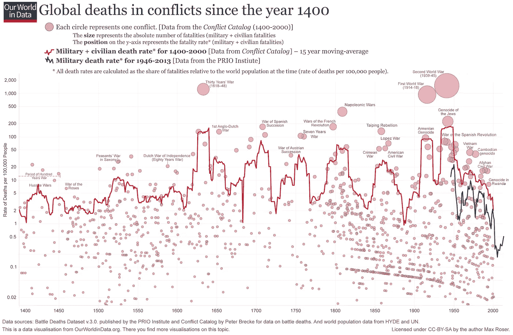
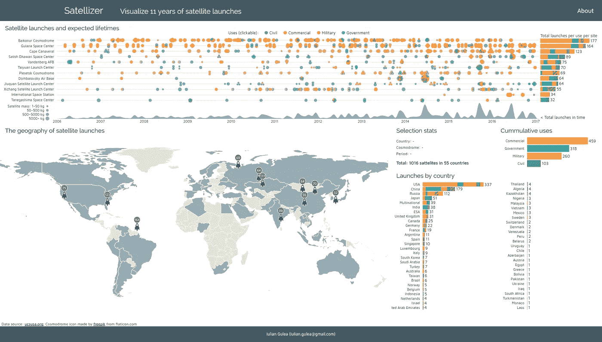

# 数据好奇 05.06.2017:上周的数据故事、数据集和可视化综述

> 原文：<https://towardsdatascience.com/data-curious-05-06-2017-a-roundup-of-data-stories-datasets-and-visualizations-from-last-week-3d7f4ac3e525?source=collection_archive---------4----------------------->

欢迎回到我上周在网上注意到的数据驱动事物的每周综述。这是第 8 周(上周的帖子是[这里](https://medium.com/towards-data-science/data-curious-29-05-2017-a-roundup-of-data-stories-datasets-and-visualisations-from-last-week-c5c73894a29c)，特别感谢[走向数据科学](https://medium.com/towards-data-science)发布帖子！).

每个星期，我都会剪辑、保存和收藏大量我在网上找到的关于用数据讲述故事的很酷的东西。以下是 5 月 29 日这一周吸引我眼球的内容。在典型的时事通讯中，我会包含一堆链接供你点击，保存起来以后再看(没关系，我们都这样做)。为了赶上下周的帖子，请在媒体上关注我的最新消息。我也是推特上的[。](https://twitter.com/bnj_cooley)

# 好的阅读、分析和教程

美国退出了巴黎气候协议，NYT 对此有很多话要说。这篇数据分析文章展示了美国是历史上最大的碳污染者，比整个欧盟加起来还多(包括英国)。

随着周四英国大选的临近，我有机会参加了由当地统计局主办的数据黑客日。他们由高质量的记者和统计学家组成的团队编制了一份独一无二的英国选民人口统计和权力数据集。故事在 6 月 6 日之前是被禁止的，但请留意来自他们账户的一些深度数据驱动的新闻。

Trinity Mirror 为英国大选重新推出了“寻找我的座位”互动，以便选民可以了解更多关于他们投票选区的信息。你可以在这里测试工具[并在这里](http://www.coventrytelegraph.net/news/coventry-news/find-seat-use-interactive-guide-13089231)阅读它是如何被创建的。

网站 Maps4News 采访了《金融时报》互动设计编辑史蒂文伯纳德，并发表了一篇关于《金融时报》编辑部生活的博客文章。由于英国《金融时报》在图形方面做了一些出色的工作，这将是一个很好的数据阅读材料，即人们希望了解图形团队如何在新闻编辑室与记者互动。

这是英国《金融时报》关于英国将如何需要重新谈判至少 759 项欠英国退出欧盟的条约的[精彩数据分析](https://www.ft.com/content/f1435a8e-372b-11e7-bce4-9023f8c0fd2e)。

布丁又成功了，这次性别平衡登上了 NYT 畅销书排行榜。

英国《金融时报》的约翰·伯恩-默多克发表了他在一次关于数据鸿沟的#数字论坛上的全部幻灯片。它有一些非常有趣的想法，关于统计数据如何将社会分为富人和穷人，以及我们作为数据人可以做些什么来弥合这一差距。

这里有一篇很好的文章，就如何使用 [Twitter 作为数据源给出了一些建议。](http://datadrivenjournalism.net/news_and_analysis/twitter_as_a_data_source_an_overview_of_tools_for_journalists)

那些喜欢使用 Python 和 pandas 讨论数据的人会发现这篇文章很有帮助:[使用 Python Pandas 和 data.world 的 5 种有用的数据讨论技巧](https://data.world/nrippner/python-data-wrangling-tutorial)。

一些值得一试的工具:

还有人试用过谷歌新闻实验室的新的[数据 Gif 生成器](https://datagifmaker.withgoogle.com/edit)吗？还不知道如何感觉它，但我想它可以派上用场的快速 viz-fix。

这里有一个可爱/古怪的工具用于[生成中世纪风格的地图](https://watabou.itch.io/medieval-fantasy-city-generator)。

说到地图，Alastair Otter 为记者们出版了一份很好的 10+地图工具综述。

全球调查性新闻网络发布了一个展示全球经济关系的可视化工具。

# 数据集和其他资源

上周，Buzzfeed 数据中心的团队分享了一个庞大的联邦工资记录数据集。这些是通过 FOI 的请求获得的，包括过去 40 年数百万员工的数据。这是一个大问题:冒险潜入。

Buzzfeed 还与 After School 合作，调查高中生对社交媒体上假新闻的认识。这里是[完整数据集](https://data.world/afterschool/teen-fake-news-poll-on-after-school)。

显然，谷歌有自己特殊的[数据搜索引擎](https://cse.google.com/cse/publicurl?cx=002720237717066476899:v2wv26idk7m)。看起来他们没有给它太多的关注，因为它的造型看起来像是在 2000 年代末最后一次更新。但是当只想返回与数据/数据集相关的主题的结果时，它仍然是一个方便的工具。

如果你关注 Twitter 上的任何数据，你可能已经看到了#改头换面星期一的标签。这个标签是由 Tableau 作为“社会数据实验”开始的。他们每周都会发布一个数据集，其中包含一篇文章的链接，以供参考/参考。尽管这一点都不新鲜，但它提醒了我，无论你是否使用 Tableau，这个页面对于寻找练习数据集来说都是一个多么好的资源。点击这里，浏览[所有过去的数据集。](http://www.makeovermonday.co.uk/data/)

我找到了一个网站，上面的地图显示了今年以来美国发生的所有抗议活动。每个抗议都有地点、参加人数和事件名称。你可以在这里下载数据和查看地图[。](https://countlove.org/)

挖掘政府游说支出已经成为我最喜欢的挖掘故事的方法之一。每个季度，国会都被要求披露所有发生的游说活动，包括游说了哪些机构，涵盖了哪些主题，以及游说者获得了多少收入。你可以在这里下载[众议院](http://disclosures.house.gov/ld/ldsearch.aspx)和[参议院](https://www.senate.gov/legislative/Public_Disclosure/LDA_reports.htm)的数据集。

波士顿大学公共卫生学院的研究人员汇编了一个数据集，其中包括 1991 年至 2016 年美国各州存在或不存在的 133 种不同类型的枪支法律。[下载/查看数据。](https://www.statefirearmlaws.org/table.html)

# 数据可视化

来自《我们的世界》的 Max Roser 在数据中创建了一个自 1400 年以来每年全球冲突死亡人数的综合图表。这张图表是密集而有影响力的，它有一个写上去的伴随着它[在这里](https://ourworldindata.org/war-and-peace/)。

[Our World in Data](https://ourworldindata.org/war-and-peace/)

我真的很喜欢这幅由 Nadieh Bremer 绘制的[“呼吸”世界植被图](http://www.datasketch.es/april/code/nadieh/)。没有多少数据可视化让我感到着迷，但这一个肯定做到了。

NYT 发表了一份对每个学生的大学经费的全面数据分析。这张各州资金减少的图表引起了我的注意。我喜欢他们用阿拉斯加作为传说，因为它真正充分利用了空间。

本周一，Tableau 举办了一场关于全球互联网使用情况的#改头换面活动:

这个自 2000 年以来每一个难民运动的大画面令人印象深刻。

一个关于 K-Pop 乐队的[场景？是的，请。遗憾的是，大部分文字都不是英文的，所以我不能通读，但是设计很棒。](https://public.tableau.com/en-us/s/gallery/kpop-artists)

本周，我让一位读者寄来了他过去的一个 viz 项目。来看看:[11 年卫星发射的仪表盘](http://satellizer.heroesofprogramming.com/)。他还写了一篇中型博客文章描述他是如何着手设计仪表板的。我喜欢看到那些认为这篇综述有帮助/有趣的人的工作，这让我思考:你们还对我隐瞒了什么？有一些你最近创建的数据或有趣的数据集吗？如果你[给我发个链接](https://twitter.com/bnj_cooley)，我会很高兴的。

Created by Iulian Gulea. [Full dashboard here.](http://satellizer.heroesofprogramming.com/)

这是一个关于全世界斋月禁食的信息丰富、设计良好的注释气泡图。与世界其他地方相比，赫尔辛基的斋戒时间特别长。

特朗普宣布美国将退出巴黎气候协议后，出版商蜂拥而至，提供有影响力的数据，即关于影响的数据。这是 FiveThirtyEight 的一个很棒的折线图 gif，显示了这个问题在美国已经变得多么党派化。

Vox 用这张图表指出，2016 年关于气候变化的广播新闻报道尤其糟糕。

特别是 NYT 在声明发布后，在推特上掀起了一场数据风暴，即图表和图形。2016 年是有记录以来最热的一年。

他们还绘制了特朗普给 4 个高风险城市留下的气候遗产。

这张 gif 图很好地快速传达了美国退出巴黎协定的利害关系。

上周就这样了。你看到我错过的东西了吗？或者你只是想给我一个数字点头/击掌？[给我发微博](https://twitter.com/bnj_cooley)或者在下面留言。我也很想看看你最近在忙些什么。下周会有更多的数据。