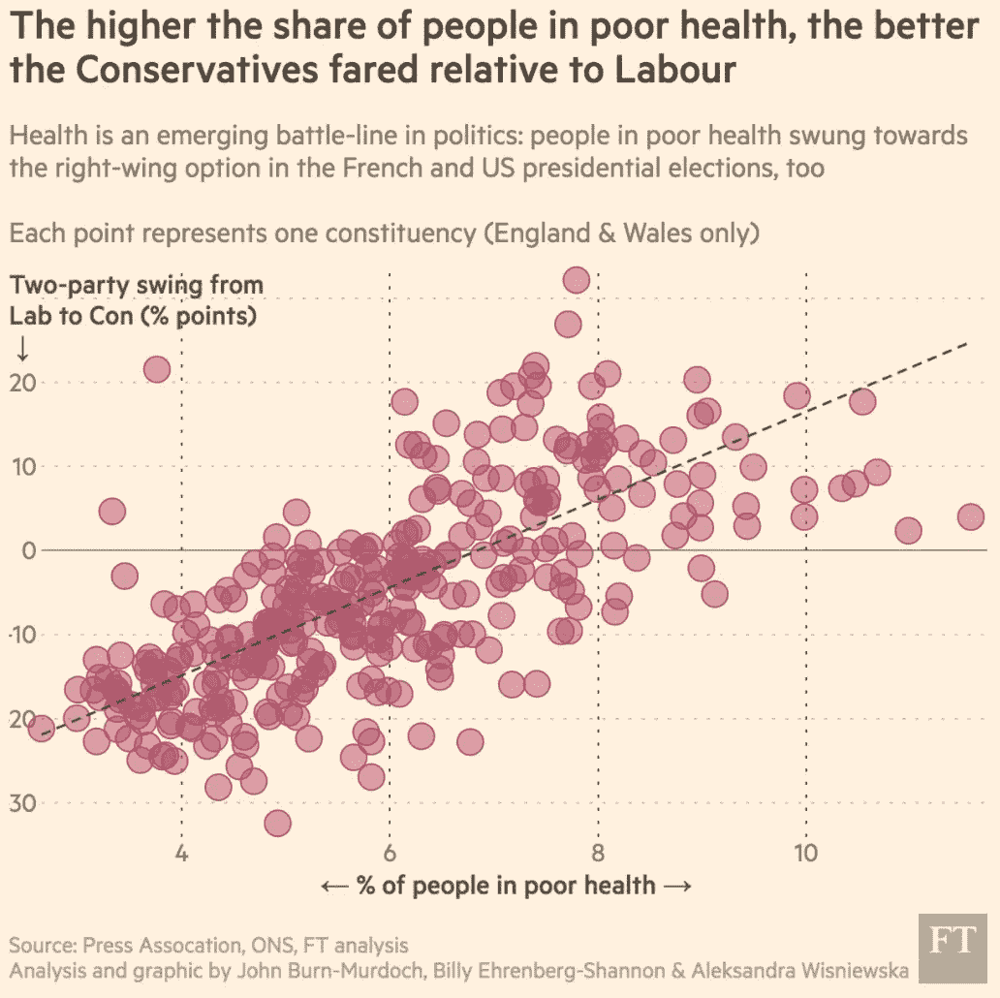

# 数据好奇 12.06.2017:上周的数据故事、数据集和可视化综述

> 原文：<https://towardsdatascience.com/data-curious-12-06-2017-a-roundup-of-data-stories-datasets-and-visualizations-from-last-week-327bc89b2e00?source=collection_archive---------5----------------------->

欢迎回到我上周在网上注意到的数据驱动事物的每周综述。这是第 9 周(上周的帖子是[这里](https://medium.com/towards-data-science/data-curious-05-06-2017-a-roundup-of-data-stories-datasets-and-visualizations-from-last-week-3d7f4ac3e525)，特别感谢[走向数据科学](https://medium.com/towards-data-science)发布帖子！).

每个星期，我都会剪辑、保存和收藏大量我在网上找到的关于用数据讲述故事的很酷的东西。以下是 6 月 5 日那一周吸引我眼球的内容。在典型的时事通讯中，我会包含一堆链接供你点击，保存起来以后再看(没关系，我们都这样做)。为了赶上下周的帖子，请在媒体上关注我的最新消息。我也是推特上的[。](https://twitter.com/bnj_cooley)

# 好的阅读、分析和教程

随着上周英国大选的临近，我的推特上充斥着大量政治分析和数据。当然，这不是坏事，但值得免责声明:本周有很多与英国选举相关的内容。但我向你保证，他们仍然很出色。

对于那些不熟悉英国政治格局的人来说，卫报的互动文章[特里萨·梅的赌博是如何失败的？](https://www.theguardian.com/politics/ng-interactive/2017/jun/09/theresa-may-election-gamble-fail-conservatives-majority-polls)是一个很好的分析工具。密集的数据和带注释的微观可视化使其易于消化，同时仍能传达选举中的利害关系。

另一个好结果综述:BBC 的 2017 年[选举:地图和图表中的结果](http://www.bbc.co.uk/news/election-2017-40176349)。

关于 NYT 那篇文章[英国如何投票](https://www.nytimes.com/interactive/2017/06/08/world/europe/british-general-election-results-analysis.html?_r=0)，我有很多很多好话要说，但我更希望你自己判断。

约翰·伯恩-默多克是大选期间在推特上关注的关键人物之一。他在选举后的几个小时内制作的大量图表和分析既惊人又有见地。你可以在[英国如何在 7 个图表中投票](https://www.ft.com/content/dac3a3b2-4ad7-11e7-919a-1e14ce4af89b)中阅读他对《金融时报》的完整分析。

话虽如此，他的一些散点图确实引发了关于因果关系/相关性融合的健康辩论。例如，这张图表显示，人的健康越差，他们就越有可能投票给保守党:

[From John Burn-Murdoch at the FT.](https://twitter.com/jburnmurdoch/status/873011056553201664/photo/1)

这是《纽约客》上关于华盛顿大学提供的一门名为“大数据时代呼唤废话”的新课程的有趣简介。除了作为大学课程的一个好名字之外，这篇文章还提醒我如何处理数据，它涉及的远不止是实际的数字:数据从何而来？谁获得了数据？为什么？这些问题可能和数字本身一样重要，有时甚至更重要。

这里有一些关于[如何使用 VLOOKUP](http://datadrivenjournalism.net/news_and_analysis/how_journalists_can_use_vlookup) 在 Excel 中面试数据的小技巧。

如果您在东欧地区，有一个值得一试的#opendata 和#ddj 机会:

如果你用数据来充实 UX，你可能会喜欢这个关于 UX 的[阴阳和数据](https://medium.com/@ericyi/yin-and-yang-ux-and-data-531306f5e5a4)的中帖。此外，[这篇文章](https://uxdesign.cc/ux-for-complex-data-design-ae2dc310a501)有一些有用的设计技巧，可以在处理复杂的大数据集时牢记 UX。

上周，全球调查性新闻网络的工作人员强调了数据记者应该掌握的一些关键技能。

如果您正在寻找在线注册的最佳数据即课程，您可能想看看这张令人印象深刻的互联网上每门数据可视化课程的综合图以帮助您在注册前做出决定。

这篇关于 [9 个更好的数据可视化技巧的文章](https://twitter.com/oliverlindberg/status/871735468987121664)从该领域的领导者那里得到了一些很好的建议。

更多的数据即学习资源值得关注:Shirley Wu(来自[《数据素描】](http://www.datasketch.es/))正在教授一门在线课程，有人报名参加了这门课程，并为了每个人的利益写了第一课。

工具更新消息:流行的易用图表程序 Datawrapper [现在支持散点图](https://blog.datawrapper.de/introducing-scatter-plot-66b8d8a99abc)。

2017 年数据新闻大会上有一些很好的收获，Marianna Bouchart 很好地将它们发布在 Medium 上:[如何衡量数据新闻的成功以及 2017 年数据新闻大会上专家的其他建议。](https://medium.com/data-journalism-awards/how-to-measure-success-in-data-journalism-and-other-tips-from-experts-at-the-data-journalism-95c381fb1e8e)

这条为记者提出的规则将被写进我的黄金规则手册《如何不被数字欺骗》(这是一个工作标题)。

Data.world 发布了一个新的 [SPARQL 教程](https://data.world/tutorial/sparqltutorial)，作为使用查询语言的介绍。作为额外的奖励，练习数据集是《权力的游戏》中的角色([在这里下载](https://data.world/tutorial/sparqltutorial))。

这是一项有趣的研究，根据媒体出版商的报道，研究了脸书喜欢和分享之间的关联。如果你想分析福克斯新闻频道脸书帖子中的关系，你也可以在这里下载你自己的数据[。](https://data.world/chasewillden/fox-news-facebook-shares-vs-likes/file/FoxNews-Shares-and-Likes.xlsx)

# 数据集和其他资源

我喜欢新闻编辑室开放他们的数据，Quartz 的团队刚刚发现了一个数据金矿:数据编辑 Chris Groskopf 宣布了 Quartz 可靠数据目录。这是一个很好的电子表格，可以作为书签来查找最近的可靠数据集。

彭博在 Github 上有一个数据集，记录了川普成为总统之前乘坐的所有航班。你可以通过阅读彭博的文章[来了解如何分析这些数据，或者你可以在这里](https://www.bloomberg.com/news/features/2017-06-01/this-is-where-trump-traveled-before-becoming-president)下载数据并亲自尝试一下。

美国劳工部必须公布已报告的严重工伤(住院、截肢、失明等)数据。听起来有点病态，但是如果你感兴趣，你可以[在这里下载电子表格](https://www.osha.gov/severeinjury/index.html)。

这里有一个由 Google Research 基于 Reddit 对话制作的有趣的数据集:[“粗糙话语”](https://github.com/google-research-datasets/coarse-discourse)，或者是一个对在线讨论进行理解和分类的数据集。

英国选举的官方结果数据将会很慢出来，但是你可以从[BBC 的](http://www.bbc.co.uk/news/election/2017/results)页面抓取一些政党结果来开始分析。

上周所有的选举地图也让我想起了这个便利的资源:[一个英国所有选区的大形状文件](http://www.statsmapsnpix.com/2017/04/getting-ready-for-ge2017-big-shapefile.html)。

# 数据可视化

有一些关于选举的东西对新闻编辑室的数据和图形单元施加了某种魔咒。似乎在每次重大选举之前、期间和之后，viz 的数据输出都会激增，英国将军当然也不例外。上周充满了令人难以置信的视觉效果。

我爱一个好的网络图分析，你呢？这张照片展示了英国现任议员的追随者关系。

我真的很喜欢这次[卫报关于英国大选结果](http://www.theguardian.com/politics/ng-interactive/2015/may/07/live-uk-election-results-in-full)的互动。点击“播放”按钮，你就可以看到选票滚滚而来，就像选举之夜一样，还可以看到关于哪些席位最不重要的注释。《卫报》开始关注一种非常好的视觉风格，他们也偏爱十六进制图表。

2017 年当选的女议员比以往任何时候都多。

Yelp 的数据科学编辑 Carl Bialik 非常明智地指出，当一张地图根据座位的影响而不是地理区域进行加权时，视觉效果会形成鲜明的对比。

英国《金融时报》制作了一些精美的动画 gif，展示选举之夜是如何展开的。

Stefano Ceccon 制作了一个有趣的动画 viz，展示了在过去的四次选举中，英国政治是如何变得越来越两极化的。

除了对地图有好处之外，选举也是桑基图的好机会。典型的例子:

现在到一些非选举即。

我发现这个全球军火交易的地图混搭真的很有趣。

这是一个[精心设计的交互式地图](https://interaktiv.morgenpost.de/parteien-hochburgen-deutschland/)，结合了一些有品位的注释和工具提示中图表的使用，以更深入地挖掘数据。不过警告:文本是德语的(如果你想阅读注释，谷歌翻译做得不错)。

这是另一张美丽的网络图。

来自政治的关于欧盟死亡原因的互动提出了一些关于恐怖的有趣问题。这一视觉效果令人震惊，但也引发了一些担忧:以这种方式比较不同领域的死亡原因(即癌症与恐怖主义)公平吗？

Vox 对媒体如何报道某些事件做了一些有趣的分析。我认为这张图表提出了一些有趣的问题:

作为一个在美国中西部生活了大半辈子的人，下面这张地图并没有让我感到惊讶。但对世界上的其他人来说，这是令人震惊的。

大多数熟悉数据可视化的人都知道，人类用设计来描述数字已经有很长时间了(想想[弗洛伦斯·南丁格尔的玫瑰图](https://www.google.co.uk/url?sa=i&rct=j&q=&esrc=s&source=images&cd=&cad=rja&uact=8&ved=0ahUKEwiR8LfclrjUAhUGuhQKHZfrAjEQjRwIBw&url=https%3A%2F%2Funderstandinguncertainty.org%2Fcoxcombs&psig=AFQjCNGXMscE1AK-7Ld-h9tAMy6iULN7OA&ust=1497352456634679))。但是你知道吗，一个数字动画数据 viz 早在 1965 年就被制作出来了。

上周就这样了。随着上周产生的大量数据驱动的故事、分析和可视化，我很肯定我可能错过了一些顶级的工作。你看到我应该包括的东西了吗？或者你只是想给我一个数字点头/击掌？[给我发微博](https://twitter.com/bnj_cooley)或者在下面留言。我也很想看看你最近在忙些什么。

如果你欣赏这份每周综述，就在上面画一颗心，或者与你的朋友分享。下周会有更多的数据。