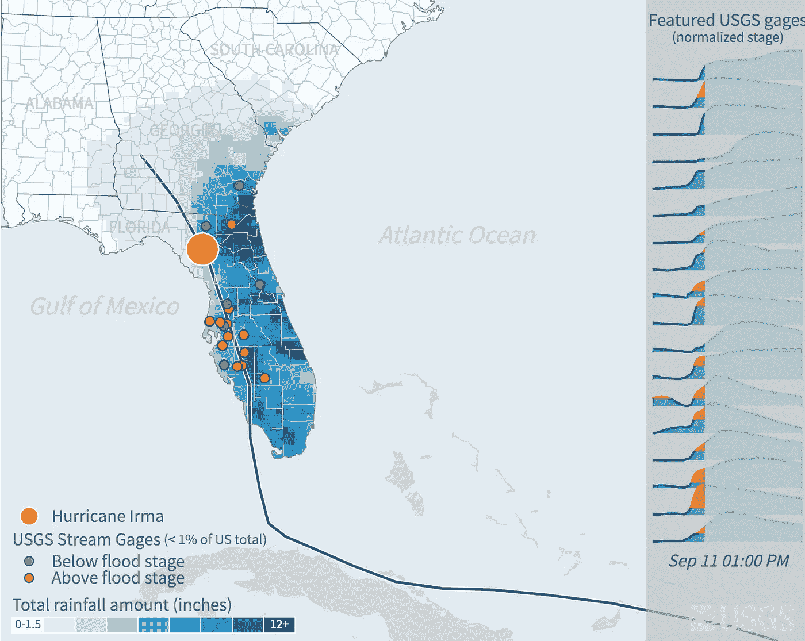

# 数据好奇 2017 年 9 月 20 日:上周的数据故事、数据集和可视化综述

> 原文：<https://towardsdatascience.com/data-curious-20-09-2017-a-roundup-of-data-stories-datasets-and-visualizations-from-last-week-5281deb27d13?source=collection_archive---------9----------------------->

欢迎来到我上周在网上注意到的数据驱动事物的每周综述。这是第 20 周(上周的帖子是[这里是](https://medium.com/towards-data-science/data-curious-13-09-2017-a-roundup-of-data-stories-datasets-and-visualizations-from-last-week-e952c18846a6))。

每个星期，我都会剪辑、保存和收藏大量我在网上找到的关于用数据讲述故事的很酷的东西。以下是 9 月 13 日那一周吸引我眼球的内容。在典型的时事通讯中，我会包含一堆链接供你点击，保存起来以后再看(没关系，我们都这样做)。请在媒体上关注我的最新消息。我也是推特上的[。](https://twitter.com/bnj_cooley)本周有点短暂而甜蜜，但让我们尽情享受吧。

# 好的阅读、分析和教程

读完这篇关于[数据科学的十大谬误](https://medium.com/towards-data-science/the-ten-fallacies-of-data-science-9b2af78a1862)的帖子，我笑了。不是因为他们很可笑(他们实际上是正确的)，而是因为我遇到了他们。所以。很多。时代周刊。我最喜欢的列表:我将下载的数据将是一致的(lol，耶对)。

偶尔被提醒一下基本知识是有好处的。这里有 7 个你应该永远避免的致命统计错误:

寻找一个使用 Python 和 Selenium 进行 web 抓取的简单入口？看看这篇关于如何抓取谷歌搜索结果的中型文章。

为你的书呆子朋友寻找圣诞礼物的想法？已排序。

这是一篇关于绿色和平组织如何利用 CARTO 通过数据可视化对抗石油巨头的精彩文章。你知道最大的一次泄漏持续了 17 个小时，并向卡拉马祖河倾倒了 100 万加仑原油吗？

Paul Bradshaw 写了一篇[的评论](https://onlinejournalismblog.com/2017/09/14/narrative-storytelling-data-journalism-alberto-cairo/)来回应 Alberto Cairo 上周有争议的推文，称“讲故事”应该被禁止出现在数据新闻中。虽然 Cairo 的不满主要是针对该术语的语义，但我同意 Bradshaw 的观点:尽管该术语已经变得不完美，但我们需要通过讲故事来洞察数据。仅仅因为这个术语被一些人曲解，并不意味着我们应该完全抛弃它。我们应该做得更好。

本周最令人印象深刻的综合互动故事是弗雷德里卡·弗拉加潘的作品[线后的故事](http://www.storiesbehindaline.com/)。美丽的数据，即惊人的动画和对细节的关注。这里有一个 gif 预览图作为引子:

[谷歌新闻实验室](https://medium.com/u/f226348241d4?source=post_page-----5281deb27d13--------------------------------)刚刚发布了一份关于 2017 年数据新闻状况的新报告。点击阅读博文[点击](https://www.blog.google/topics/journalism-news/data-journalism-2017/)下载 PDF 报告[。](https://newslab.withgoogle.com/assets/docs/data-journalism-in-2017.pdf)

这是一篇来自 Storybench 的非常有趣的文章，讲述了新闻图表如何可视化今年的飓风。

# 数据集和其他资源

阳光基金会分析了美国超过 21，000 个开放数据门户网站，根据数据查看和下载量对最感兴趣的领域进行评分。他们发现，警察和犯罪构成了最受欢迎的开放数据集，其次是交通和紧急电话。点击阅读其余结果[。](https://sunlightfoundation.com/2017/09/11/whos-at-the-popular-table-our-analysis-found-which-open-data-the-public-likes/)

CAFOs 是坏消息。对动物和人类来说。探索由人道联盟编辑的美国 CAFOs 数据集，发现有助于改善农场动物和农产品生活的见解。

你是 xkcd 漫画的粉丝吗？您知道您可以使用 JSON 接口自动获取它们吗？没错。你可以。

民主基金选民小组发表了一份 2016 年选民选择和态度的报告。您可以在页面查看[完整的调查数据。](https://www.voterstudygroup.org/publications/2016-elections/data)

# 数据可视化

美国地质勘探局发布了一份惊人的延时数据，即显示飓风“艾尔玛”路径和降雨量的动画。

[USGS](https://owi.usgs.gov/vizlab/hurricane-irma/)

哦。这张来自 NYT 专栏的图表显示了白人福音派基督徒对川普总统违法行为的宽容程度。

看看这篇匿名的西印度群岛之旅的视觉日志。这是 1815 年的。数据是旧的。真的老了。

很对你是[马腾·兰布莱茨](https://medium.com/u/688c83864d60?source=post_page-----5281deb27d13--------------------------------)，很对。我也喜欢金融时报的这张图表。仅仅因为你有地理数据并不意味着你应该绘制地图。让数据决定你的图表类型。

NYT 绘制了袭击墨西哥城的 7.1 级地震迄今造成的损失。

英国《金融时报》的大卫·布拉德在推特上对德国 AfD 的传播做了一些很好的网络图表。

我认为这是卫报数据团队关于英国债务的一次非常好的互动。输入你的邮政编码可以让你看到你所在地区的人均消费信贷是多少。这可能会让你感觉更好或更差，所以使用时要自担风险。

上周就这样了。你看到我应该包括的东西了吗？或者你只是想给我一个数字点头/击掌？[给我发微博](https://twitter.com/bnj_cooley)或者在下面留言。下周回到✌.

***如果你欣赏这个每周综述，给它几个*👏️️ *或者与你的朋友分享。我也很想看看你最近在做什么，所以*** [***保持联系***](https://benjamincooley.me/contact/) ***。***