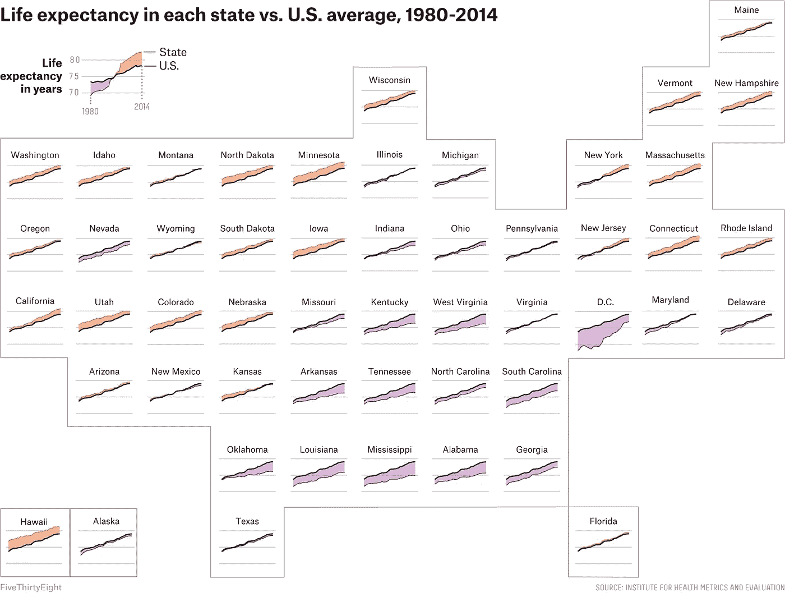

# 数据好奇 22.05.2017:上周的数据故事、数据集和可视化综述

> 原文：<https://towardsdatascience.com/data-curious-22-05-2017-a-roundup-of-data-stories-datasets-and-visualisations-from-last-week-e2624c01598a?source=collection_archive---------8----------------------->

欢迎回到我上周在网上注意到的数据驱动事物的每周综述。这是第 6 周(上周的帖子是[这里](https://medium.com/towards-data-science/data-curious-15-05-2017-a-roundup-of-data-stories-datasets-and-visualizations-from-last-week-a331e5f8e074)，特别感谢[走向数据科学](https://medium.com/towards-data-science)发布帖子！).

每个星期，我都会剪辑、保存和收藏大量我在网上找到的关于用数据讲述故事的很酷的东西。以下是 5 月 8 日那一周吸引我眼球的内容。在典型的时事通讯中，我会包含一堆链接供你点击，保存起来以后再看(没关系，我们都这样做)。为了赶上下周的帖子，请在媒体上关注我的最新消息。我也是推特上的[。](https://twitter.com/bnj_cooley)

# 好的阅读、分析和教程

上周，我在《每日文摘》中发现了这篇名为[“设计更好的数据表”](https://uxdesign.cc/design-better-data-tables-4ecc99d23356)的精彩文章。如果公司(尤其是政府)遵循其中的一些准则，数据记者和/或科学家的工作将会容易得多。正如作者所写的:“如果没有可视化和对数据采取行动的能力，数据是没有意义的。”本周必读。

在英国的数据新闻中，在全球开放数据排名中，英国将跌至第三位，落后于澳大利亚和台湾。全国房地产经纪人协会最近表示，英国空气质量数据可能很快成为房地产广告的强制性部分。最后，[Buzzfeed 的数据分析](https://www.buzzfeed.com/albertonardelli/8-charts-that-show-the-difference-between-the-uk-housing-mar?utm_term=.pvOxGbWVX#.ba2AwoWa5)显示了为什么大多数英国人不愿意进入房地产市场。图表本身就说明了一切，但我也认为，与一系列一遍又一遍的相同条形图相比，在可视化这些数据方面可以投入更多的创造力。

这是一个真正有趣的辩论开始。彭博的数据分析让我想起了来自一个假设的许多问题:[“亚马逊不考虑顾客的种族。应该吗？”](https://www.bloomberg.com/graphics/2016-amazon-same-day/)。但是我认为一个好的数据分析有时会带来更多的问题而不是答案。该作品中的地图是交互式的，允许用户通过亚马逊一日送达功能在主要城市的比赛之间进行筛选。剧透:一日送达的地区几乎全是白人。但是回到附加问题:亚马逊的目标是财富还是种族？还是两者都有？这篇文章有很多很好的出发点，但是做更多的分析会很有趣。

From [Bloomberg analysis piece.](https://www.bloomberg.com/graphics/2016-amazon-same-day/)

这里有一个来自 pomplamouse 乐队的[有趣的帖子，描述了他们在 28 天的巡演中赚了多少钱(也赔了多少钱)。这是对作为独立乐队巡回演出背后的数据的一个很好的窥视，也可能是对作为巡回音乐家背后的经济学的一些见解的开始。](http://www.digitalmusicnews.com/2014/11/25/band-just-finished-28-day-tour-made-much/)

我发现[这个关于数据科学家最佳资源的 Quora 帖子](https://www.quora.com/As-a-data-scientist-what-is-your-best-resource-of-everyday-learning)很有趣。这是工具和建议的混合，但大多数答案都包含了一些实际项目的建议，而不是理论练习。

Mike Bostock 刚刚发布了 d3.express，他称之为“集成发现环境”。我还没有能够深入到所有的文档中，但是因为它来自于数据可视化的教父之一，我确信它不会让人失望！

这是一份来自 fivethirtyeeight 的关于美国各县预期寿命的伟大数据分析。自 1980 年以来，美国大多数州都提高了整体预期寿命水平。但在县一级，很明显某些地区正在逆这一趋势而行。我也非常喜欢美国地图形状的折线图作为一种数据 vis 展示风格。

[FiveThirtyEight](https://fivethirtyeight.com/features/as-u-s-life-expectancies-climb-people-in-a-few-places-are-dying-younger/?ex_cid=538twitter)

开放数据研究所利兹发表了一篇博客文章，提倡使用基于六边形的地图来可视化选举数据。这是对该工具的一个很好的介绍，也非常及时(距离英国大选还有 16 天！).

很多人都在谈论这篇 NYT 的文章，这篇文章显示了有多少人在地图上找不到朝鲜。但更重要的是，调查发现在地理上能找到和找不到这个国家的人之间有一个关键的区别:36%能成功找到朝鲜的美国人“更有可能不同意美国不应对朝鲜采取任何行动的主张”。地理很重要(尽管，可以说，伴随普通地理知识而来的其他东西也很重要，所以我们现在不要讨论相关性/因果关系)。

今天的人们有多幸福？这份最近来自《我们的世界》的[幸福和生活满意度报告试图找到答案。完整的报告包括许多快速图表和地图，另外，如果你愿意，你可以自己下载所有的原始数据。](https://ourworldindata.org/happiness-and-life-satisfaction/)

你知道有一本专门研究数据可视化的新杂志吗？相当酷。

 [## market Cafe Mag(@ market Cafe Mag)| Twitter

### 来自 Market Cafe Mag (@marketcafemag)的最新推文。关于数据可视化的杂志。讲述…的故事

twitter.com](https://twitter.com/marketcafemag) 

# 数据集和其他资源

上周出现了一些非常有趣的数据来源。让我们按照出现的时间顺序开始。

与去年同期相比，欧盟对世界其他地区的出口增长了 13%，达到 2023 亿欧元。这意味着€在贸易商品方面有 309 亿英镑的顺差。[欧盟统计局的新闻稿](http://ec.europa.eu/eurostat/documents/2995521/8026095/6-16052017-BP-EN.pdf/6b6023f6-cd79-4208-b194-28d2ede91eca)包含了更多 PDF 格式的国际贸易历史数据。

你读过关于勒索软件的文章吗？起初，这似乎不是一个数据集，但有一个 [Twitter 机器人](https://twitter.com/actual_ransom)正在监视与#WannaCry 勒索软件攻击相关的比特币钱包，并在 Twitter 上发布交易。真的，它很难被挖掘和分析。一个好的开始可能是使用 Python 抓取帐户，或者尝试一个快速的 Google Sheets 附加工具，如 TAGS 或 Twitter Archiver。

Data.world 上有一个联合国教科文组织语言的数据集，按照濒危程度(或者仅仅是灭绝程度)排序。你知道在英国和前英国殖民地，有 906 种濒危语言在使用吗？

观鸟者会对这个自 1970 年以来英国鸟类物种的数据集感兴趣。

谷歌托管了一个来自 QuickDraw 的涂鸦数据集，可以从下面下载。

从另一个不那么轻松的角度来看，这个来自朝鲜的导弹测试数据库将有助于绘制一些有趣的地图。数据包括导弹发射地点、最高高度、行进距离、着陆地点、发射成功/失败等。

这是来自联合国世界粮食计划署的全球粮食价格的[数据集。它包含来自 70 个不同国家的 1000 个城镇的食品价格数据，并且每月更新一次。](https://data.humdata.org/dataset/wfp-food-prices)

气候鹰派，这是一个[数据集，报告了全球海平面的历史数据](https://scenarios.globalchange.gov/sea-level-rise)。您可以在本页下载数据，或者在地图上预览数据[这里](https://coast.noaa.gov/slr/)。

如果你对分析枪支暴力感兴趣，由《芝加哥太阳时报》披露的数据库中的这个[重磅炸弹显示，近 40 万人对他们卷入枪支暴力的可能性(或可能性)进行了评分，分值从 10 分到 500 分不等。](http://chicago.suntimes.com/politics/what-gets-people-on-watch-list-chicago-police-fought-to-keep-secret-watchdogs/)

还有其他人知道维基百科语料库数据库吗？它用一句话总结了超过 120，000 个副标题中包含“情节”的维基百科条目。这意味着电影、书籍、戏剧、电视节目——凡是你能想到的。该数据集需要一些语言处理和分析，但这里有一篇来自大卫·罗宾逊的很好的博客文章展示了如何探索它。

今年我没能参加#EIJC2017(欧洲调查性新闻会议和 Dataharvest)，但我设法从一周的会谈中在 Twitter 上积累了一些资源。这里有两个数据工具亮点:一个是来自 Maarten Lambrechts 的“日常新闻数据工具”演示，另一个是名为 Map Stack 的工具，用于设计更好看的地图。

你知道有一个工具可以搜索和下载维基百科的浏览量吗？在 Motherboard 的一名编辑发布了一张最近弹劾相关维基百科页面搜索量增加的截图后，我偶然发现了这个便利的工具。

# 数据可视化

没有上周那么多数据值得一提。显然，我把头埋在了数据的后端，但我想这并不是一件坏事。这里有几件事引起了我的注意。

我喜欢[这张来自《华盛顿邮报》的图片](https://www.washingtonpost.com/graphics/world/paris-climate-agreement-withdrawal/?utm_term=.7d884b3efd11)，它展示了美国将如何退出巴黎气候协定。作为第二大二氧化碳排放国，美国将加入叙利亚和尼加拉瓜的行列，成为欧盟以外不遵守气候协议规定的国家。

在 Twitter 上向 Elijah Meeks 喊出这个灯泡数据 vis moment:

这里有一个动画饼图 FTW。上周我写了一点关于饼状图如何得到一个坏的说唱，但我认为用一个动画饼状图显示随着时间的变化是一个非常聪明的选择。

我喜欢[这个欧洲啤酒仪表盘的画面](https://public.tableau.com/en-us/s/gallery/beer-europe)。在列的顶部使用一个抽头是一个聪明的设计选择，过滤功能让您可以轻松地浏览数据(您也可以通过单击底部的“下载”按钮下载原始数据！).

太阳能工作正在击败煤，伊西米。

好吧，这个 vis 数据一点也不令人印象深刻，但我还是从这个消息中得到了乐趣:

这是经典贫困泡沫图的一个很好的互动画面，但有一个转折:它不是用国家 GDP 来衡量全球贫困，而是比较美国县级互联网接入水平。

上周就这样了。你看到我错过的东西了吗？或者你只是想给我一个数字点头/击掌？给我发微博或者在下面留言。下周会有更多的数据。